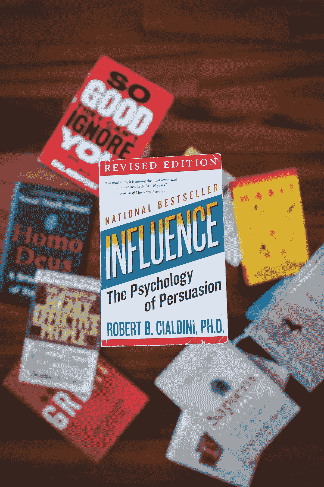

# 有点疼没关系

> 原文：<https://medium.datadriveninvestor.com/its-okay-if-it-hurts-a-little-5d653f272fa9?source=collection_archive---------12----------------------->

进化并不总是感觉良好，但结果是(二手灵感项目)

Photo by [Road Trip with Raj](https://unsplash.com/@roadtripwithraj?utm_source=unsplash&utm_medium=referral&utm_content=creditCopyText) on [Unsplash](https://unsplash.com/s/photos/pain?utm_source=unsplash&utm_medium=referral&utm_content=creditCopyText)

二手灵感项目从一句激励性的引语开始，在创造性道路蜿蜒的任何地方冒险。

> “每一次在个人进化的阶梯上提升到更高的一级，我们都必须经历一段不舒服的时期，即开始阶段。我从未发现过例外。”—丹·米尔曼

在过去的几个月里，我发现自己如此频繁地向同事和朋友提及这条建议，以至于我最终决定是时候把它写下来了。

我只想说:自我提升是一种自虐式的努力。为了成为一个更好的人，你常常必须让自己变得超级痛苦。实在是没有办法了。

我知道很多人非常想要一剂神奇的灵丹妙药，一些个人发展指导，他们可以吞下去治愈他们所有的缺陷，而不会有任何苦涩的回味。

坦率地说，他们觉得需要回避任何伤人的建议。但正是在个人痛苦的锯齿边缘，人们发现了他们渴望的成长和进步。

有时候你需要损失一点血来变得更强。有时候你不得不痛打自己一顿，在你的伤口和瘀伤上贴上创可贴，掸掉身上的灰尘，然后尝试一些不同的东西。

有时候，你必须接受尴尬，才能取得长期的进步。为了让一个积极的习惯产生影响，你可能需要承受一定程度的不适。这没关系。

克服你的障碍和缺点可能意味着发掘一些你埋藏多年的东西。这意味着探索个人戏剧的边界或重温尴尬的记忆，这样你就可以变得更好。

事实是你被允许成为一个更好的人。你应该得到更多的机会来推进你的事业，探索新事物，实现崇高的目标。你应该找到生活的目标和意义。但有时要达到这一点需要牺牲你的情感核心，把自己撕成碎片，然后重建。

Photo by [Bannon Morrissy](https://unsplash.com/@bannon15?utm_source=unsplash&utm_medium=referral&utm_content=creditCopyText) on [Unsplash](https://unsplash.com/s/photos/personal-growth?utm_source=unsplash&utm_medium=referral&utm_content=creditCopyText)

如果你走捷径，避开所有不愉快的事情，你能成功吗？我不知道。也许吧。然而，真正的问题是，你是否选择通过不去面对那些阻碍你前进的缺点和错误来推迟你的个人成长。

你能做的最冒险的事情就是维持现状。

当然，直面你的破坏性习惯并不有趣，但这是值得的。你需要做损害控制，分析伤口，弄清楚如何愈合，以及未来要做哪些不同的事情。你不能用你刚刚读到的极好的自救方法来逃避痛苦。你必须接受痛苦，让它成为你的指南针。

我把它比作当你试图恢复身材时所经历的疼痛。久坐一段时间后，最初的几次锻炼是残酷的。你的肌肉疼痛。你感到疲劳。但是你知道结果将是令人鼓舞的，这种转变是值得努力的，所以你要坚持下去。

考虑到这些令人不安的社会隔离、全球失衡和赛事取消的时代，你不能相信自己太弱而无法改变。相信你内心的力量会爆发。艰难的时光不会永远持续，但坚韧的人会通过进化找到忍受的方法。

现在不是大惊小怪的时候。这是把握机会的时候了。如果没有痛苦，这是你变成永远不会拥有的东西的时候了。

有点疼没关系。你会没事的。我保证。

阿德里安·s·波特是一名作家、工程师、顾问和演说家。他写诗歌、短篇小说和各种主题的文章，包括创造力和个人成长。他是诗集[和散文集](https://www.amazon.com/Everything-Wrong-Feels-Adrian-Potter/dp/109519061X/ref=sr_1_4?qid=1560264651&refinements=p_27%3AAdrian+S.+Potter&s=books&sr=1-4&text=Adrian+S.+Potter)[的作者。在](https://e2857002-6118-41be-9746-64261e36cacb.filesusr.com/ugd/21d2c2_03522f10c7c84340a05a8d03a97e1642.pdf)[http://adrianspotter.com/](http://adrianspotter.com/)在线拜访他。

# 附加文字

[你真了不起](https://medium.com/datadriveninvestor/you-are-amazing-274651127432?source=friends_link&sk=34312c5fa72f2109d6031c2a4b7c2e4c)

[我们不该做的十件事](https://medium.com/datadriveninvestor/ten-things-we-shouldnt-do-ee51b20d157e?source=friends_link&sk=f5e28718b8f1ac4d410fca372344d7ab)

[微小的变化会产生巨大的影响](https://medium.com/datadriveninvestor/small-changes-can-have-huge-impacts-64554cea557?source=friends_link&sk=c0ad04011672af4eb80afb07ef76c781)