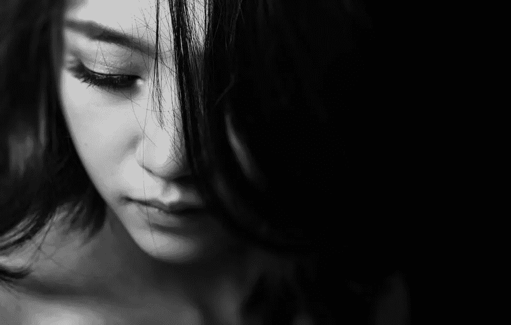

# 在 Happy 上按暂停键没问题

> 原文：<https://medium.datadriveninvestor.com/its-okay-to-press-the-pause-button-on-happy-f727f702562f?source=collection_archive---------10----------------------->

## 我们需要避免的是停止按钮。

Photo by [NEOSiAM 2020](https://www.pexels.com/@neo8iam) via Pexels

我为了快乐已经努力了很久。我不得不弯曲它，扭曲它，塑造它，让它适应我的生活。这是一次令人沮丧的努力，我无法告诉你有多少次我感到筋疲力尽，并一遍又一遍地告诉自己同样的事情。快乐不应该是这么多的工作。但是，有时候就是这样。我们需要知道。

在这个过程中，我也意识到关于幸福还有另一个同样难以接受的事实。幸福，就像我们感受到的每一种情绪，我们发现自己所处的每一种状态一样，不是恒定的。它会来也会去。

现在，我不开心。我差远了。我觉得快乐是个模糊的概念，我无法确定。

现在，幸福是从一个破旧的温度计里出来的那块水银，它每次都在移动试图去触摸它。

这也是暂时的。我允许自己不快乐。我有理由这么做。它和任何幸福一样属于我。我的不开心是有根据的。

我仍然在努力处理分手的事情，从失去一个好朋友的打击中恢复过来，在工作中筋疲力尽。我的房子越来越成了一场灾难，因为我晚上盯着天空的时间比合理的时间还多。我感到孤独像一条加重的毯子覆盖在我身上。

我现在正在应对，而且不是很好。我给自己买的花，作为在房间里追逐快乐的一种手段，只是被扔进一罐水中，而不是被打开和整理。他们已经这样三天了。我的饮食习惯不值得称赞。周一的晚餐是葡萄酒和冰淇淋。不在一起。我有一条不能逾越的底线。

> 我不会这样待下去的。这不是我的性格。我太喜欢快乐占据这个空间太久。

尽管如此，有时候我们必须对自己、对自己的情绪以及对周围的人诚实。当快乐需要太多的能量时，我们会按下快乐的暂停键。

沮丧只是当我在等待快乐时大声播放的烦人的背景音乐。好消息是一个人能承受的垃圾是有限的。我会去的。

不能选择的是按下快乐的停止键。那是认输。放弃只会导致痛苦的生活，我不会那样生活。

放我们一马是人道的，也是善良的。这是一个认识，这是我们目前能做的最好的。是格瑞丝。我们都应该得到恩典，从别人那里，但更应该从自己那里。

> 是恩典让我们没有按下停止键。格蕾丝给了我们空间。只要有空间，快乐就会回来。按停止键会消除这个空间。我仍然认为那个空间是神圣的。

今晚，我来洗碗。我将打扫厨房。我来插花。这周我会听乔尼·米切尔的 *Blue* 第 18 次。我会在朋友需要的时候去陪他们。

下周，我将去见一位专业人士，帮助我更好地应对，度过损失和悲伤，调和愤怒，并试图重新找到快乐。我知道这是一个循环。我越是让快乐进入，这种事情就越少发生。周期变短。

我喜欢认为幸福在耐心地等待着我。我就在不远处。坚持住。我马上就到。

*在中年觉醒中导航，并试图找出该做些什么。我抓住你了。* [***现在就上我的邮件列表***](https://lp.constantcontactpages.com/su/S8rU24J/midlife) *！我有令人兴奋的事情要做！你不会想错过的。*

*凡妮莎·托雷是一名作家兼中年教练，她为那些希望做出显著改变的女性提供帮助，让她们过上有创造力、充实且有益的生活。了解更多请点击*[***www.vanessatorre.com***](http://www.vanessatorre.com/)***。***

*在*[***insta gram***](https://www.instagram.com/vanessaltorre/)*[***【脸书】***](https://www.facebook.com/vanessaltorre)*[***推特***](https://twitter.com/VanessaLTorre) *，以及* [***抖音***](https://tiktok.com/@vanessaltorre) ***。*****

## ***如果有人能建立一个巨大的网来捕捉和容纳所有的快乐，那就太好了:**

** [## 和极度敏感的人打交道

### 请不要说“敏感”好像这是一件坏事。

medium.com](https://medium.com/@vanessatorre/dealing-with-extremely-sensitive-people-c98478c6b4b4)  [## 我剪了头发来对抗我的抑郁症

### 我的计划适得其反。

medium.com](https://medium.com/@vanessatorre/i-cut-my-hair-to-fight-my-depression-ea718bbef823)**