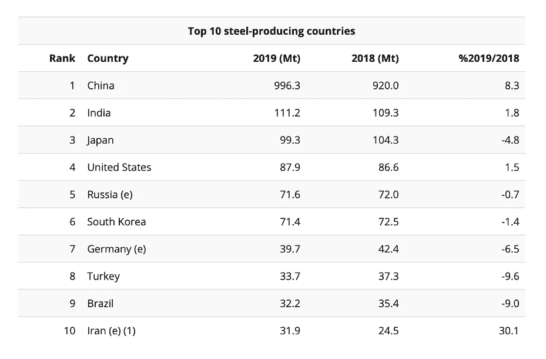
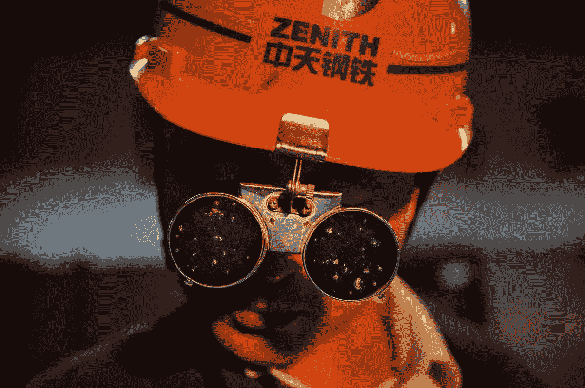
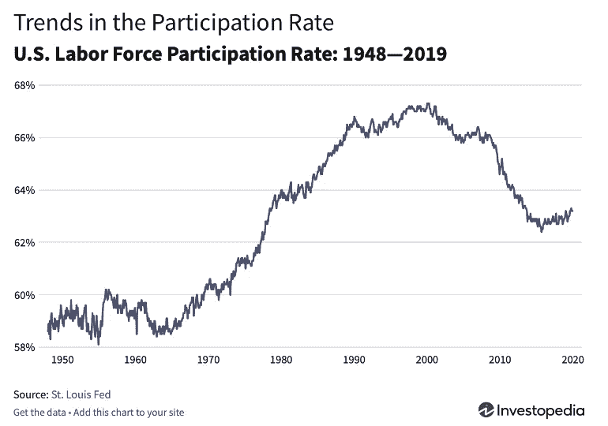

# 这是资本主义的致命弱点。

> 原文：<https://medium.datadriveninvestor.com/its-the-achilles-heel-of-capitalism-12fcf17129c6?source=collection_archive---------8----------------------->

作为一个在 70 年代和 80 年代长大的孩子，我有太多的回忆。在某种程度上，我们都生活在一个故事中，这个故事是我们通过经验的镜头，经过我们的期望、偏见和观点的过滤而精心制作的。我的经历是通过我的家庭和我父亲在美国钢铁行业的高管生涯过滤出来的。

作为总结，对于那些想要提纲以决定是否值得你花时间阅读的人来说:

*   “全球化的诱惑”
*   贪得无厌的要求
*   盲目的野心
*   讲述与被讲述(华尔街与主街)
*   “解决挑战”

# “全球化的诱惑”

作为一个在 70 年代和 80 年代长大的孩子，我清楚地记得水门事件对政治和整个社会的影响；石油禁运，越南战争的结束；伊朗人质危机的影响；由我们的宿敌苏联领导的“里根革命”和反对“暴政”的斗争。我还记得 80 年代对投资者来说是“嗨的一天”,以及从 70 年代的阴霾中走出来的繁荣景象。回想起来，当时的生活似乎令人难以置信。我当时没有看到，也没有理解的是，70 年代政治家们做出的一系列决定的含义，这些决定开启了美国翻天覆地变化的闸门。

 [## 如果资本主义失败了，那么还有什么选择呢？数据驱动的投资者

### 在当前政治领域的修辞之旅中，我们都可以面对面地接触到流行词汇，如…

www.datadriveninvestor.com](https://www.datadriveninvestor.com/2020/03/16/if-capitalism-is-a-failure-then-what-is-the-alternative/) 

在 70 年代作出的许多“重大”决定中，1978 年 12 月 16 日中华人民共和国和美利坚合众国签署关于建立外交关系的联合公报是对美国社会影响最深远的决定之一。除此之外，美国和中国还签署了几项科技合作协议、文化协议、教育协议、商业协议、太空协议和开设领事馆协议。随着与中国建立“正常化”关系，美国企业获得了一个难以置信的巨大、低成本的劳动力市场，这不同于以前对美国公司“开放”的任何市场。

这种关系的变化为美国和中国在未来 40 年的发展轨迹带来了根本性的变化。通过我小时候的镜头，我经历了我父亲在试图解决从 60 年代的行业高点到挣扎中的钢铁行业的快速下滑时所经历的挑战，对来自日本、欧洲、中国和印度的外国钢铁的涌入毫无准备。在 70 年代和 80 年代，外国“倾销”、显著的货币估值失衡和有限的投资资本导致美国钢铁产量和相关就业大幅下降。由于可以获得低成本的外国钢铁，美国各行各业都通过将采购转向外国制造的钢铁而获益。事后看来，美国企业的决策促成了导致美国钢铁业现状的事件。

从全球钢铁行业的现状来看，2019 年亚洲粗钢产量为 1，341.6 公吨，比 2018 年增长了 5.7%。2019 年，中国粗钢产量达到 9.963 亿吨，比 2018 年增长 8.3%。中国占全球钢铁产量的份额从 18 年的 50.9%上升到 19 年的 53.3%。印度 2019 年粗钢产量为 1.112 亿吨，较 2018 年增长 1.8%。日本 2019 年产量为 99.3 公吨，比 2018 年产量下降了 4.8%。

2019 年北美粗钢产量为 120.0 Mt，比 2018 年下降 0.8%。美国生产了 87.9 吨粗钢，比 2018 年增长了 1.5%。

如今，中国的钢铁产量比美国高出 1，135%，但总体而言，中国的钢铁产量绝对令欧盟相形见绌。

从 20 世纪 60 年代钢铁行业的就业高峰来看，美国已经损失了大约。到 2019 年创造 51.8 万个就业岗位。

钢铁行业只是经历了“全球化诱惑”影响的众多例子之一。为了结束这个故事，我父亲的公司成立于 1894 年，于 2001 年 10 月申请破产保护。在通过破产程序被私募股权收购后，该公司最终在 2 年后倒闭。

如今，除了数千人失去工作之外，美国最大的工厂占据的大片土地现在是一个物流仓库，专注于主要来自亚洲制造商的产品分销。

这个故事反映了许多其他人可以讲述的故事，但从个人的角度来看，它塑造了我对全球化的看法。当我们查看美国贸易代表办公室谈判的贸易协定数量时，它为美国政府和企业确定的机会提供了背景，并对美国工人的影响进行了并列。大多数美国人会对美国谈判的自由贸易协定的数量感到惊讶——澳大利亚自由贸易协定；[巴林 FTA](https://ustr.gov/trade-agreements/free-trade-agreements/bahrain-fta)； [CAFTA-DR(多明尼加共和国-中美洲 FTA)](https://ustr.gov/trade-agreements/free-trade-agreements/cafta-dr-dominican-republic-central-america-fta)；[智利 FTA](https://ustr.gov/trade-agreements/free-trade-agreements/chile-fta)；[哥伦比亚 TPA](https://ustr.gov/trade-agreements/free-trade-agreements/colombia-tpa)；[以色列 FTA](https://ustr.gov/trade-agreements/free-trade-agreements/israel-fta)；[约旦 FTA](https://ustr.gov/trade-agreements/free-trade-agreements/jordan-fta)；[韩国 FTA](https://ustr.gov/trade-agreements/free-trade-agreements/korus-fta)；[摩洛哥 FTA](https://ustr.gov/trade-agreements/free-trade-agreements/morocco-fta)；[阿曼 FTA](https://ustr.gov/trade-agreements/free-trade-agreements/oman-fta)；[巴拿马 TPA](https://ustr.gov/trade-agreements/free-trade-agreements/panama-tpa)；[秘鲁 TPA](https://ustr.gov/trade-agreements/free-trade-agreements/peru-tpa)；[新加坡 FTA](https://ustr.gov/trade-agreements/free-trade-agreements/singapore-fta)；[美国-墨西哥-加拿大协议](https://ustr.gov/trade-agreements/free-trade-agreements/united-states-mexico-canada-agreement)；现任美国联邦政府最近决定不批准跨太平洋伙伴关系协定。

这些自由贸易协定代表了美国国务院定义的出口方面的积极趋势，但没有考虑“其他”因素。[https://www . state . gov/trade-agreements/outcomes-of-current-u-s-trade-agreements/](https://www.state.gov/trade-agreements/outcomes-of-current-u-s-trade-agreements/)。这些考虑因素包括总部设在美国的公司或已将生产从美国工厂转移的全球性组织将美国就业外包。一个简单的例子。当拉塞尔体育关闭了它在亚拉巴马州亚历山大市最大的工厂，解雇了 250 名工人，这些职位被拉塞尔在洪都拉斯和萨尔瓦多拥有的制造工厂吸收。Russell 网站上的一段引文称:“我们是洪都拉斯和萨尔瓦多最大的私营雇主之一。”这些工厂现在出口回美国和全球。正是这种情况，以及其他许多情况，使得美国国务院和美国贸易代表办公室的数据在贸易平衡方面不准确，因为这些数据没有考虑到这些国家用于支持美国制造业的出口。

# 贪得无厌的要求

当你整体看待“资本主义”时，挑战是巨大的。有多少好处和积极的属性，就有多少平行的坏处。你认为“贪得无厌”意味着消费，但实际上贪得无厌的需求反映在华尔街的需求中。在过去的 20 年中，他领导了通用电气、美国银行、贝莱德、美林、SunTrust 等大型管理咨询项目。关于需求的见解很有说服力。

首先，华尔街是由银行、证券交易员和对冲基金等组成的。正是这些公司推动了绝大多数的企业决策，也正是这些决策反映在我们今天所定义的“资本主义”的总体方法中。在华尔街之外，私募股权(PE)和风险资本(VC)利用相同的投资标准和不同要求的资本回报预期。所以，让我们看看是什么推动了资本主义，特别是，是什么造成了当今美国版资本主义的致命弱点。主要措施包括:

*   流动性比率
*   杠杆财务比率
*   效率比率
*   盈利率
*   市场价值比率

根据定义，这些业绩类别是用于运营上市公司和由 PE 或 VC 资助的公司的典型指标。这些事实上已经成为我们衡量美国公司的致命弱点。在与大型包装消费品(CPG)和耐用消费品公司的战略合作中，运营重点受到在复杂的生态系统中交付指标的压力的推动。我们举一个沃尔玛的例子。沃尔玛的每股收益预期是由分析师设定的，分析师反过来也为他们的供应商设定预期，如 P&G、卡夫亨氏等。为了实现每股收益目标，沃尔玛要求其供应商以一定的成本水平交付产品，使沃尔玛的利润率最大化，并推动库存的最大化。如果没有 SPIF(销售业绩激励基金)和促销，制造商必须解决的挑战是以尽可能低的制造成本交付产品，同时将最少的营销成本用于产品并实现销售目标。那么，一家公司如何做到这一点呢？面对来自零售分销渠道的持续最大化成本节约的压力，答案很简单——将“自有”生产外包给能够在美国境内或海外以更低成本生产的第三方，同时关闭自有的美国工厂。通过关闭所拥有的美国设施，国税局对冲销和其他税收激励的规定成为一种反直觉的结构，实际上刺激了这种生产转移。**结果——**宝洁和沃尔玛的利润率都有所提高；实现每股收益目标和消除美国就业机会的商业周期。虽然这非常直接，但这给美国经济带来的挑战是如何在发达、新兴和发展中经济体的全球市场中运营，这些经济体的劳动力价值和生活成本根本不同。美国无法与发展中经济体竞争，也难以与新兴经济体竞争。结果实际上是一场“逐底竞赛”。在美国，工资为每小时 25-30 美元的制造业工作被支付最低工资或略高工资的服务业工作所取代，这些工作的福利有限甚至不存在。从失业到低薪工作替代的循环已经驱动了一种需要联邦和州津贴支持的次生经济。这一循环的最大受益者是沃尔玛——获得所有食品券付款的大约 18%,总收入为 124 亿美元。

华尔街的预期建立在一个季度比一个季度增长的扩张模型上，与盈利能力增长相关。想一想这个问题。作为商业领袖，分析师预计公司会达到他们的预测，而企业会根据短期和长期的增长承诺达到被认为是强劲的表现。这包括基于 R&D、预聘、资本投资等的盈利能力波动。今天，美国版的资本主义是基于一种降低资本支出、降低劳动力成本、外包给第三方等的“成本降低”模式。在一个季度中的一个月之后，必须做出决策来调整成本和收入。这意味着，在一个报告周期的每 3 个月中，有 2 个月的时间用于尝试将财务绩效与分析师预先确定的每股收益等保持一致。这个季度。这是致命的弱点。

# 盲目的野心

资本主义致命弱点的复杂性是由一种与生俱来的欲望驱动的，即以“不惜一切代价”的心态实现财务业绩。对于一家上市公司或 PE / VC 支持的公司来说，财务失误可能意味着职业生涯的终结。就这么简单。相关的降级、股票贬值，加上不利的贷款条款，导致股东和董事会施加压力。这个循环随着随后的失误而加速，向下的压力定义了透镜，通过它随后的决定被过滤。那么，什么是盲目的野心。我在不同的上下文中使用这个术语。在顶级全球投资和银行公司呆过一段时间后，这种总体一致的洞察力反映出对他们投资的业务和类别缺乏了解，因此“覆盖”了这些业务和类别。等式的盲区代表了对经济学的有限理解和“普适性”,不考虑行业、变化速度、投资策略、劳动强度等因素。根据经验，全球投资银行根据其持股和市场战略所定义的雄心，使用第一、盲目和第二模型，做出买入、卖出、持有、跑输大盘和跑赢大盘的建议。简而言之，一家企业应该如何运营与如何运营之间的关联，实际上受到了全球投资银行的操纵，因为企业领导人做出的决策符合投资界、公司及其员工的利益。在决策已经过时，个人已经转移到新的角色和不同的组织之后，决策的影响会留给下一代领导人。

# 讲述与被讲述

美国式的资本主义是由投资美元的最高回报率驱动的。从表面上看，这似乎是合理的，但不幸的是，构成“最高回报率”背后的驱动因素不再一致。协调需要 5 类目标:

*   产品/服务设计投资(R&D)
*   智力资本投资(人)
*   供应链可持续性
*   组织同理心——以人为本
*   “漫长的游戏”

资本主义必须在利润高于人民的结构下运行的观点是由“告诉与被告诉”驱动的。华尔街、投资银行家、风投等。看 EPS，市场份额等。来确定人类方程式的价值。在此期间，领导层是否有所作为？挑战很简单。我们需要一个范式的转变，从分析师告诉企业他们应该赚多少钱，应该如何表现，到企业首先实现 5 个关键类别，这反过来将指导企业的长期盈利能力和可持续性。投资者、贷方等。都在做短期生意。就像做空者押注于一家公司的业绩一样，现实情况是，基于他人对企业交付的“预期”来经营企业是违背直觉的。回到作为顾问在全球投资银行工作的故事——一旦你“在幕后”,你就会意识到对他们所报道的类别和业务的了解是多么的少，这是令人震惊的。例如，由 EPS 预期驱动的按季度发生的组织操纵水平使得计划业务变得极其困难，并有效地限制了基于投资战略、知识产权开发、人员等的轨迹。

最终，必须发生的变化是，首先，公司需要告诉华尔街什么是重要的，他们是如何经营业务的，而不是被告知。当一家公司亏损 0.01 美元，股价下跌 15%时，问题是谁设定了每股收益目标，它的依据是什么。一家经营良好的企业业绩会有波动。期望每个季度都有一个不断加速的增长百分比，这基本上是不可能实现的——然而这就是我们今天的“资本主义”版本的要求。

# “解决挑战”

尽管这一挑战可能很复杂，但解决它的步骤是一个需要决心的问题。向最低**竞争的结果——最低的 COGS、最高的利润、最高的 EPS 和其他来自“成本外”模型的关键指标，推动了我们在美国经历的资本主义版本。结果——全球供应链似乎带来了一个不可思议的机会。从表面上看，这似乎是美国企业的“灵丹妙药”。利用美元对人民币的强势等。并在中国、越南、孟加拉国等国家建立完整的供应链。事实上，这种方法产生了 5 个主要结果。**

1.  **美国熟练和非熟练劳动力岗位的减少**自 1980 年以来，美国制造业相关岗位减少了 750 万个。今天，中国占全球制造业产出的 28%，而美国占 18%。2010 年，美国领先中国。www.statista.com
2.  **劳动力参与率下降。**劳动力参与率的下降推动了为那些失业和无法找到同等就业水平的人制定更大福利计划的需求。这一循环包括更高的税收、更高的联邦、州和地方债务，以及更大程度上依赖政府来弥补生活工资和可持续家庭收入之间的差距。

3.**收入集中和不平等大幅增加。**回顾与美国收入最高的 1%和 0.01%与其余收入者之间的收入差距有关的统计数据，在截至 2015 年的过去 35 年中，总收入中 0.01%的份额比其余 1%的份额增长得更快。根据 2015 年的数据，0.01%的人占总收入的比例上升到 5%，1%的人占 22%。在截至 2012 年的 35 年里，0.01%的人在美国总财富中所占的份额翻了两番，达到 11%。这种程度的贫富差距是美国版资本主义可持续性面临的最大挑战之一。

4.**知识产权流失增加了依赖的深度。通过将研发和自动化制造流程外包给富士康、中国宝武钢铁集团、恒立、三菱电机和海尔等第三方，美国的知识产权被有效地转移给了法律要求不那么严格的第三方。除了合法性问题之外，更少的美国员工具有支持制造技术的知识和能力，这导致他们依赖外国知识产权来满足从基础到高度复杂的产品工程的需求。**

5.环境和社会破坏加速。尽管有《巴黎协定》等协议以及一系列其他环境公约和法规，但美国企业热衷于将制造业务外包给环境政策限制较少的国家，这意味着在美国销售的产品，在许多情况下，根据美国环保局的规定，无法在美国制造。除了对环境的影响和对人类生活的影响，在美国公司选择生产的许多国家，童工法和安全的基础限制较少。当我们想到苹果的 iPhone 和稀土矿物的使用，以及它们是如何被提取的和被谁提取的，我们会对我们购买的东西有一个可怕的印象。当我们看到这些宽松的控制对以通用电气、苹果、耐克、安德玛、哈雷戴维森、憨豆和李维斯等知名品牌制造产品的员工造成的身体和心理伤害时，很明显，实现利润的“盲目”方法超过了影响。现实情况是，作为一个国家，美国建立标准的目的与投资者提出的实现特定回报水平的要求相反。

建议——为了“修复”美国目前所处的资本主义，需要做出一些改变。其中包括:

1.  **证券交易委员会制定的季度报告要求的变化。**调整为半年一次的报告为组织提供了更大的灵活性，使其能够在其业务计划的背景下运营，而不是按照街道定义的财务指标运营。
2.  **为分析师制定要求，以满足估计、预测和后续评级的严格指导原则。**当前系统的缺陷使得分析师能够根据对业务、类别和行业的有限或有偏见的了解，建立本质上任意的预测，从而有效地操纵上市公司。
3.  **降低在美国生产 75%或以上美国采购零部件的公司的公司税**，同时增加未达到这一门槛的公司的税收。或者，提供减税和激励措施，以实现制造业回流的目标。
4.  提供免费的贸易技能教育。这是一个有趣的机会。事实上，交易技巧不仅仅适用于历史镜头。为了把制造业带回美国的公司如苹果、亚马逊、特斯拉、康宁、德事隆、美国钢铁、美国铝业等。可以通过他们的基金会发展项目，利用联邦和州的资金来源以及补助金来发展技能发展的“学校”的新表达。今天，我们有 Udacity、IDEO U、TEDx 和许多其他非传统的在线教育和认证项目，这些项目侧重于“白领”职业，但很少是为了支持美国经济在关键制造能力上重新站稳脚跟而建立的。

不管你同意与否，我都欢迎你的想法。

你可以在推特上找到我— @digitalquotient

*₁*[*https://review . Chicago booth . edu/economics/2017/article/never-mind-1-percent-let-talk-about-001-percent*](https://review.chicagobooth.edu/economics/2017/article/never-mind-1-percent-lets-talk-about-001-percent)