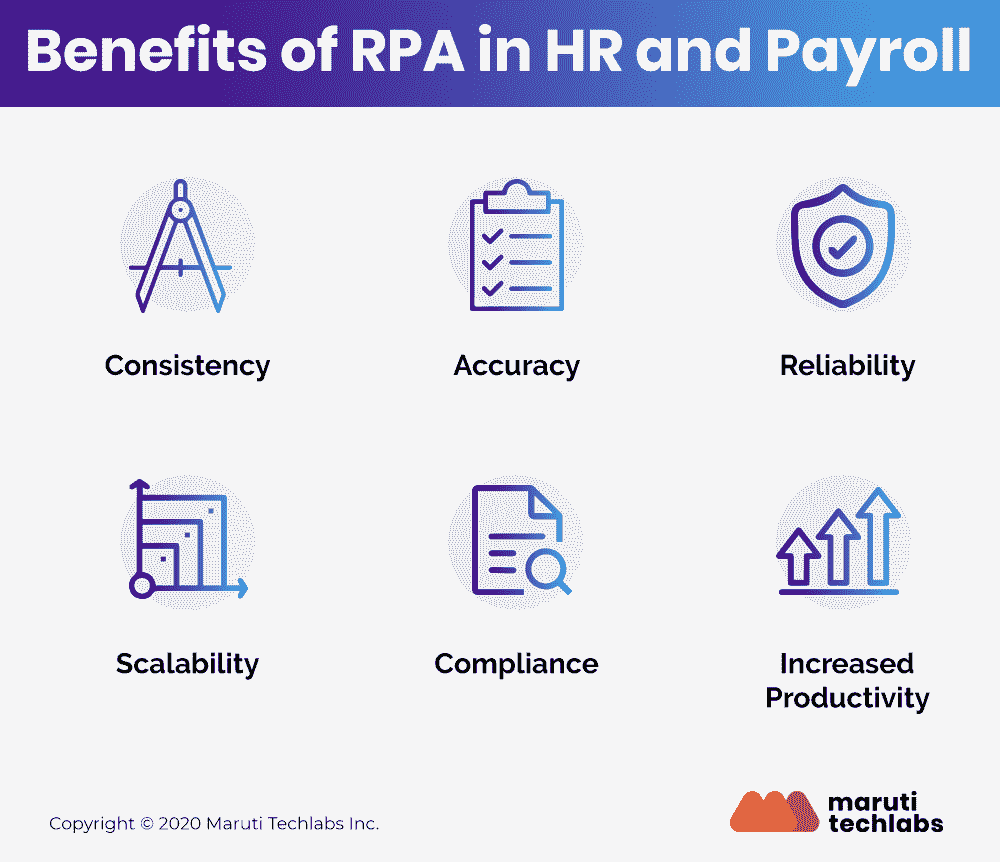
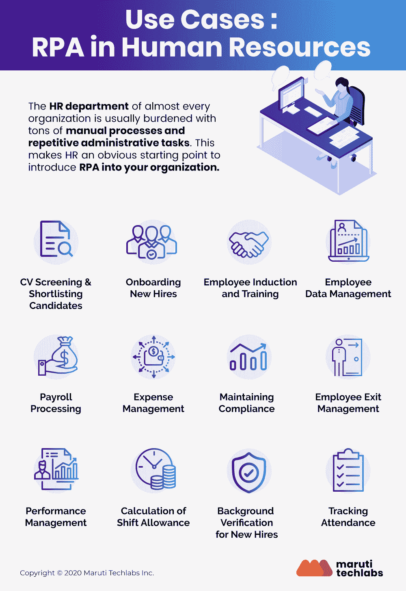

# 是时候使用 RPA 来简化您的人力资源运营了

> 原文：<https://medium.datadriveninvestor.com/its-time-to-streamline-your-hr-operations-using-rpa-f995859ce65e?source=collection_archive---------2----------------------->

信不信由你，机器人流程自动化正在帮助工作场所变得更加人性化。是的，人力资源部的 RPA 有助于提高人力资源运营的效率和生产力。组织正在使用 RPA 来简化人力资源部门的事务性任务，从而节省时间和资源，并使他们能够将更多精力放在战略任务上。

怎么会？让我们来了解一下！

机器人过程自动化(RPA)是最近的技术之一，它彻底改变了我们看待常规和重复性任务的方式。Deloitte 最近进行的一项[调查证实 RPA 是一种可行且经过验证的解决方案，超过 74%的受访者计划在未来几年探索该技术，其中近 22%的人已经试点或完全实施了 RPA。](https://www2.deloitte.com/ch/en/pages/human-capital/solutions/human-capital-robotic-process-automation.html)

> 自动化人力资源的管理和运营任务可以释放大量的时间和资源，这些时间和资源可以用于更具生产力和战略性的行动，例如与员工面对面交流或解决问题。

在本帖中，我们将讨论您需要了解的关于人力资源和工资单中的 RPA 的所有信息，包括在人力资源中实施 RPA 的好处、使用案例和最佳实践。

# 什么是人力资源中的机器人流程自动化？

机器人流程自动化(RPA)是提高人力资源数据管理能力的绝佳方式。RPA 是一种软件机器人，可在人力资源部门自动化基于规则的高度事务性流程，几乎不需要或完全不需要人工干预。

*人力资源运营中的 RPA*主要通过让软件机器人执行人力资源员工的大量重复性操作任务来工作。这些任务包括新员工入职、处理工资单、福利登记和合规性报告，这些任务需要大量的手动和重复性劳动。除了提高数据处理的准确性和速度，RPA 还有助于降低总体人力资源相关成本。

# RPA 在人力资源和薪资方面的优势

一般来说，任何组织中的人力资源部门在支持员工和改善整体工作环境以确保员工有效工作方面都发挥着关键作用。但是，考虑到大量的数据管理——表单填写、更新和验证记录，以及不断涌入的请求处理，人力资源经理将淹没在重复的管理任务中。

> 实施人力资源自动化后，组织可以通过自动化最重复的任务来大幅压缩日常流程，并允许人力资源经理专注于对公司发展至关重要的其他生产性和更具战略性的任务。人力资源运营中 RPA 的重点主要是微观任务，因此集成了大型遗留系统没有或无法解决的所有流程。

RPA 具有巨大的潜力，可以带来更高的效率和更快的投资回报，从而彻底改变整个人力资源行业。作为一种完全非侵入性的技术，RPA 可以在后台工作，不需要任何人工关注。在人力资源和工资单 中使用 [*RPA 有几个好处，包括:*](https://marutitech.com/rpa-in-hr/)

*   **精确度和提高的生产率**

RPA 使用预编码技术，最大限度地减少误差。此外，通过允许员工专注于更高价值的任务，该技术直接有助于公司的整体战略目标和生产力。

*   **一致性**

有了 RPA 作为后台，人力资源部门可以期望任务以一致的水平顺利完成。事实上，RPA 旨在实现完美的复制和无错性能，消除运营期间任何种类的输出变化。

*   **可扩展性**

大规模运营时，RPA 的每项任务或工作的成本相当低，并且可以根据要求轻松地上下调整。这使得整个系统的工作浪费或停机时间最小化。

*   **可靠性**

由于没有人工干预，没有任何树叶，效率成倍增加，因为机器人全天候工作，性能始终如一。

*   **灵活性**

RPA 解决方案非常灵活，无论部署环境如何，都可以遵循编程的程序。

# 使用案例—人力资源中的 RPA

几乎每个组织的人力资源部门通常都背负着大量的手动流程和重复性管理任务。这使得人力资源成为在您的组织中引入 RPA 的明显起点。

RPA 为组织及其人力资源部门提供了大量具体且可衡量的 [RPA 优势。下面讨论了一些最重要的问题](https://marutitech.com/benefits-of-rpa-in-business/)

# 1.简历筛选和候选人入围

当涉及到招聘等基本的人力资源职能时，很多时间被浪费在筛选空缺职位候选人收到的简历和申请表上。

软件机器人可以通过轻松收集应用程序并将所有信息与特定工作要求列表进行比较，使这一过程变得更加简单。使用 RPA 技术，可以将这些要求视为指导整个选择过程的预定义规则。在此基础上，合格的候选人可以发送面试通知电话，而拒绝通知可以发送给那些不符合选择标准的人。

> 此外，人力资源经理可以使用 RPA 技术来消除流程中涉及的大量文书工作。使用保存所有潜在员工资料的数据库，人力资源部门的 RPA 可以对所有候选人进行分类，并通知他们面试结果。在 RPA 的帮助下，人力资源部门可以将相当复杂的招聘流程变得更加顺畅，并帮助吸引和留住顶尖人才。

# 2.简化入职流程

人力资源入职通常是一个非常漫长而乏味的过程，其中候选人的加入需要多人的协调努力，因为需要同步来自几个系统的数据以创建新的用户帐户、应用程序的访问权限、IT 设备、电子邮件地址等。为了能够在组织的程序和员工的概况和偏好之间找到一致，需要强大的数据集成能力。

# 通过自动激活用户帐户的入职工作流的特定模板，机器人流程自动化可用于简化整个入职流程。然后，软件机器人可以做出基于规则的决定，例如发送哪些入职文档，为新员工分配什么凭证等等。

此外，机器人使员工 ID 创建等过程变得更快，并允许新员工以平稳、无障碍的方式开始工作。

简而言之，在入职流程中集成 RPA 有助于:

*   降低入职流程成本，因为机器人可以帮助人力资源团队处理繁琐的手动和重复流程，并自动将各种来源的信息转录到多个系统中。
*   通过自动验证新员工数据并将其输入不同的系统，提高整体入职处理速度。
*   通过跨多个系统准确更新个人和帐户信息以促进快速处理，减少人力资源入职流程中的错误率。

# 3.员工数据管理

员工数据管理是人力资源相关职能的主要领域之一。它通常需要跨多个数据库(具有多种数据格式)的系统和一致的操作，范围从工资单和员工福利到公司法规，等等。

随着现有员工、新员工、承包商等形式的员工数据不断涌入。，手动管理这一切对于人力资源团队来说可能是一项噩梦般的任务。

机器人流程自动化可以轻松处理与员工管理相关的任务，从而将错误数据输入的风险降至最低。机器人还可以定期执行数据清理任务，以确保多个数据库之间的数据兼容性。

> 这也意味着人力资源服务可以更高效、更快速地提供给员工。例如，人力资源中的 RPA 可以自动生成员工需要的重要文档，而不是人力资源人员必须将所有员工数据从 HRIS 传输到文档模板。

# 4.工资单处理

工资单处理是最重复和单调的人力资源任务之一，组织通常离不开它。由于需要定期输入大量数据，手动管理工资单通常会导致出现多个错误的风险。

此外，不断变化的税法和快速发展的报告要求加上系统故障，可能会使薪资处理成为人力资源部门一个漫长而累人的过程。

> 人力资源中的 RPA 可以简化流程，因为它能够收集和连接多个系统之间的数据，如人力资源和员工管理、时间跟踪、应付账款和总帐。

此外，RPA 机器人可以验证系统中记录的员工小时数，并根据报告或与轮班相比的任何差异进行更正。由软件机器人完成的自动报告可以显示是否有大量的注册时数、超时、丢失时数或超时使用，以进一步简化工资处理。

# 5.费用管理

任何组织中的人力资源经理通常都会发现，由于多种因素，如缺少收据、延迟提交费用、不符合政策的支出和混乱的电子表格，很难跟上差旅和费用管理的手动流程。

尽管现在有各种复杂的费用管理解决方案，但大多数组织仍然使用过时的系统，要求员工手动提供费用的详细信息。在这种人工输入数据(包括雇员提供的费用金额、日期或地点)的过程中，出现错误的可能性很高。

采用 RPA 解决方案进行费用管理，使公司能够从费用收据中自动提取所有重要字段，从而节省大量时间。这也避免了随身携带费用收据的麻烦，因为他们只需对收据拍照，所有相关数据都将自动从收据中提取出来。

此外，RPA 软件配备了基于规则的程序来识别发票提交的类型，从而批准真正的费用。在确保符合所有合规性要求后，软件将处理费用报销。

# 6.维护组织的合规性

保持合规性是任何组织中最重要的人力资源职能之一。严格的劳动法和其他法规要求公司优先考虑无差错和顺利合规。然而，确保组织层面的高合规性需要人力资源专业人员的大量时间和注意力，其中每个细节都需要彻底分析和输入。

> 将 RPA 软件用于法规遵从性相关活动不仅可以加快流程，还可以最大限度地减少流程中的延迟和人为错误，因为所有工作都由软件机器人完成，从而提高了流程的整体准确性。

# 7.员工离职管理

与入职相似，确保员工顺利顺利地离职对每个人力资源经理来说都是一个重要方面。在退出时，有许多人力资源任务需要处理，如生成退出文档、撤销系统访问以及完全和最终结算。在这里留下任何错误范围都会导致多个审计标志。

> 人力资源部的 RPA 通过预先定义撤离过程中涉及的每个流程，对实施更好、更有组织的撤离流程有很大帮助。软件机器人可以轻松地从员工的完整和最终报告中捕获所有相关的详细信息，并在财务应用程序中更新这些信息以进行验证，前提是所有必需的信息都被准确地提及，然后向相关部门发送电子邮件以进行更新。

类似地，一旦从相关部门收到确认，机器人可以向员工发送电子邮件，如果员工这边一切正常，它将通过将其发送到财务部门进行最终批准，然后发送到相应的银行进行支付处理来结束流程。

# 8.员工入职和培训

RPA 技术可以帮助您的组织和人力资源部门完全自动化入职流程，这意味着新的候选人将在申请和收到工作邀请后立即获得数字档案。

> 在这种数字档案下，RPA 软件可以触发新员工入职的自动流程，并确保向候选人更新所有业务流程、合规性标准和其他法规。

再加上精心设计的电子学习和培训支持平台，基于 RPA 的自动上岗流程可以显著提高培训的整体效果和采用率。

# 9.性能管理

各行各业的组织都在不断探索如何在人力资源中使用 RPA 来重新评估他们的绩效管理系统。从员工的目标设定、激励计算到奖励评估，RPA 软件使人力资源部门更容易保持组织的高生产率。

作为一个高度耗时且重复的流程，[使用 RPA](https://marutitech.com/successful-rpa-implementation/) 的自动化使绩效管理流程更加高效、无错误且耗时更少。

# 10.轮班津贴的计算

越来越多的组织为在不同时区为国际客户进行不同流程工作的员工提供轮班津贴。这种轮班津贴通常通过员工从多个人力资源后端系统刷卡/刷卡来计算。作为一个完全手动的过程，这需要花费大量的时间，并且由于数据集很大，会产生很大的误差。

引入 RPA 进行轮班津贴计算，可以让机器人从多个后端系统自动读取和验证数据。此外，机器人可以定期这样做，从而按时清除限额，同时减少手动工作和零错误的平均处理时间。

# 11.新员工的背景核查

新员工的背景验证过程通常包括交叉验证所有面试候选人的详细信息，如姓名、地址、出生日期等。与大量的多个数据库进行比对。处理这一至关重要的流程所花费的时间是巨大的，因为它需要高度的准确性。

> 使用 RPA 技术，公司可以轻松地从输入源接收所需的详细信息，自动与后端数据库交叉检查所有详细信息，同时创建流程报告，而无需任何手动干预。

然后，所有这些报告由软件机器人协调成最终的主报告，该主报告以预定的方式自动上传到后端系统。为了进一步简化流程，可以在多个 RPA 机器人之间分担处理负载，以便在更短的时间内交付结果。

# 12.跟踪出勤情况

有多种原因使考勤跟踪成为人力资源团队的一项繁琐任务，包括组织的庞大规模和员工在准确的时间记录上的粗心大意。

基于 RPA 的软件机器人可以根据公司记录中记录的时间交叉检查自我报告，然后向人力资源经理报告任何不一致的情况，从而使考勤跟踪变得更加容易。此外，机器人还可以在高缺勤率的情况下建议重新分配各种劳动力资源，以帮助人力资源部门防止工作流程中断。

# 人力资源中机器人流程自动化的最佳实践

如果设计和实施得当，RPA 技术有能力让您的人力资源团队的生产力和效率提高许多倍。以下是您定义和自动化人力资源流程时应遵循的一些最佳实践——

# a)开发定义良好的共享服务模型

为了确保成功，通过自动化操作简化您的人力资源流程，并为所有信息提供一个集中的位置。使用 RPA 的人力资源自动化允许您减少与耗时的人力资源流程相关的所有手动任务，例如入职、工资单处理、薪酬变更或离职管理。这也有助于你降低成本，打造更高效的人力资源团队。

# b)始终从选定的自动化流程开始，以证明有效性

从选定的最适合自动化的人力资源流程开始 RPA 实施总是明智的，这样可以挖掘机器人的巨大潜力。您可以在此处寻找 RPA 实施的一些流程功能:

*   稳定、可预测且记录完善的流程，具有一致且明确定义的运营成本
*   异常率低的流程，几乎不需要人工干预
*   以可衡量的节约来衡量的可量化流程，例如与更高的准确性、更低的成本或更快的响应时间相关的流程
*   高频或高容量流程，可提供更快的投资回报

# c)寻求并获得领导层和利益相关者的一致支持

只有在整个团队的协作下实施和执行，在人力资源中实施 RPA 才有助于获得最佳结果。因此，获得各部门的一致支持至关重要，包括将受到新技术影响的领导层和利益相关方。

在规划阶段，从将受到数字化变革影响的每个人那里寻求广泛的反馈，因为这可能有助于确定战略需要改变或改变的领域。

# d)设定期望值和投资回报目标

为了确保 RPA 项目带来积极的投资回报，关注流程的每一步所带来的价值至关重要。确保在开始的时候设定期望，定义目标并设计策略来达到同样的目标。你需要回答的一些问题包括-

*   项目的预期结果是什么？
*   在流程、技术、资源和最终用户方面，自动化的好处及其对组织的总体影响是什么？

# e)就 RPA 功能及其个人职责对您的所有人力资源人员、利益相关方、领导和用户进行培训

培训内部员工和其他利益相关者在 RPA 的有效实施中发挥着重要作用。

为员工和职员创建一个自助服务区，在那里他们可以访问所有常见的查询。这将使您能够简化人力资源流程，因为员工只有在遇到具体问题时才会联系人力资源部门。这也会节省大量时间，让人力资源团队更加高效。

请记住，这里的效率意味着清楚地了解 RPA 自动化能做什么和不能做什么，这最终有助于将预期保持在现实水平。

# 最后

到 2025 年，RPA 行业预计将达到[31.1 亿美元，这是一个激动人心的转折点，在接下来的几年里，企业将开始真正意识到它所带来的好处。通过将人类从重复和单调的工作中解放出来，该技术有望为组织提供更具吸引力的就业和明确的竞争优势。](https://www.grandviewresearch.com/press-release/global-robotic-process-automation-rpa-market?source=post_page---------------------------)

人力资源领域的机器人范围正在迅速扩大，而不仅仅局限于组织内的任何特定元素。在人力资源部门实施 RPA 可以提高准确性、显著节省劳动力并减少处理时间，从而提高员工和客户的满意度。RPA 为人力资源流程带来了所需的创新解决方案，从而转变了其运营方式。随着许多运营模式已经采用自动化，大多数组织意识到 [RPA 技术](https://marutitech.com/robotic-process-automation-services/)在削减成本、提高效率和提高人力资源流程整体质量方面的作用只是时间问题。