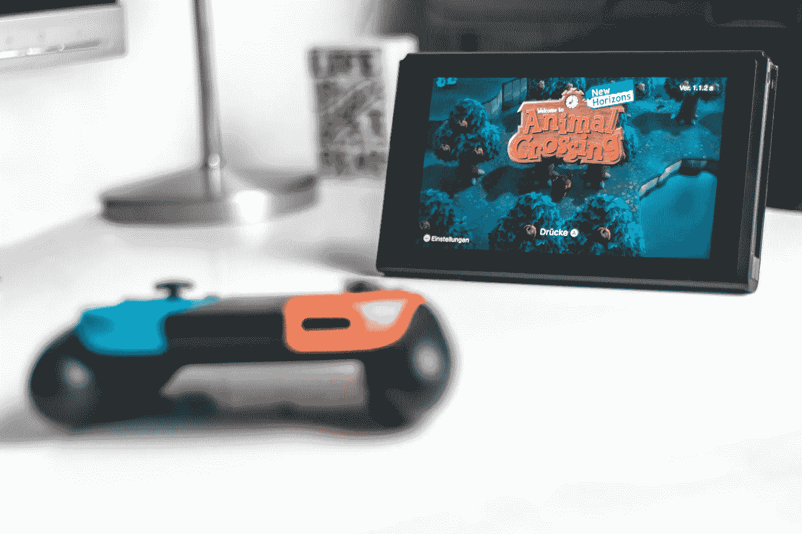
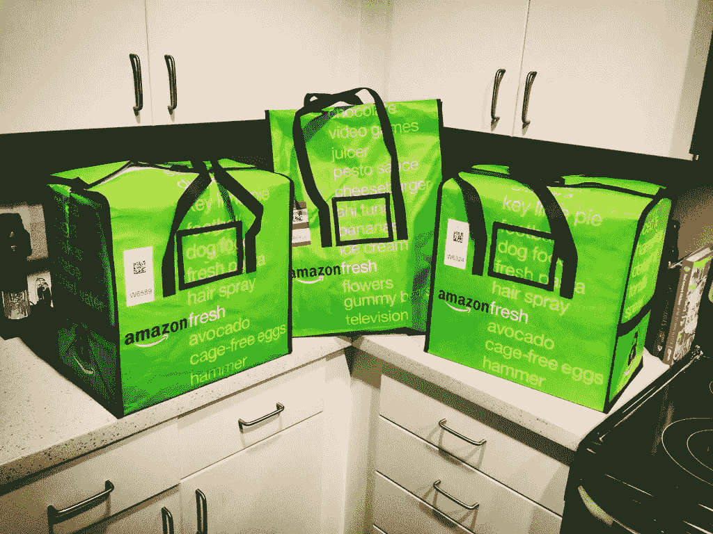

# 我被电脑“劫持”过，你可能也是

> 原文：<https://medium.datadriveninvestor.com/ive-been-cart-jacked-by-a-computer-and-you-might-ve-been-too-3fe91e30c4aa?source=collection_archive---------4----------------------->

## 电脑程序会阻止你得到你想要的东西，而且随着时间的推移，情况只会变得更糟

(Source: [Justin Parker](https://medium.com/u/792faf76be88?source=post_page-----f32e3c8c40e8----------------------))

> **:当你网上购物车里的物品突然消失，无法再购买时。原因包括从快速点击器到电脑购物程序。您虚拟“购物车”中的物品实际上已经被“劫持”…**

*在一个星期五的早上 8 点之前，我醒得很早。我是一名大学生，所以睡眠至关重要，但当我有机会从最受欢迎的街头服饰品牌 Supreme 获得一件 t 恤时，谁还需要睡眠呢？我打开我的笔记本电脑，希望我不会吵醒我的鼠标垫点击我的室友。*

*当它到达早上 7:59 时，我的心脏开始无理性地跳动，就好像我要和暗恋的人说话，或者告诉我的父母我在一次测试中得了 F(非弯曲)。我在想，今天是不是终于有一天，我可以买到一件梦寐以求的“Box-Logo”Supremet 恤。*

*我在上午 8 点前几秒刷新了网页，看到网站上弹出了这件衬衫。几秒钟之内，我就把这件衬衫添加到了我的购物车，并在谷歌浏览器自动填充的帮助下输入了我的支付信息。我点击“处理支付”，下一页开始加载。*

* [## 如何使用自动化从您的数据中获得更多价值？数据驱动的投资者

### 去年的新闻故事不停地谈论机器学习变得多么先进。电脑现在…

www.datadriveninvestor.com](https://www.datadriveninvestor.com/2020/02/27/how-to-use-automation-to-get-more-out-of-your-data/) 

你知道那种感觉吗，当你点击某个东西的时候，你觉得它会按照你的想法运行？我也有同样的感觉。我以为我终于做到了。但我得到的只是:“您购物车中的部分商品现已售完”。这些话是每个超级发烧友最不喜欢的话。就这样，结束了。我刚刚成为“劫车案”的受害者。

许多“手动用户”都经历过这种失败的尝试，他们不使用计算机程序的帮助(除了自动填充)来加快他们的结账时间。另一方面，有“机器人用户”，他们利用计算机程序以无与伦比的速度结账。人工用户无法竞争，经常无法成功结账，而 bot 用户可以大量购买某种物品的库存，并以更高的价格转售。

Supreme Bags ([Source: Piqsels)](https://www.piqsels.com/en/public-domain-photo-zvhfh)

举个例子，我正在寻找一件村上的“盒子标志”t 恤。这是 Supreme 有史以来最受欢迎的合作之一。在这种情况下，这是与日本著名艺术家村上隆的合作。这款 t 恤的零售价约为 60 美元，一些尺码的 t 恤在不到 2.7 秒的时间内就销售一空。 [(来源:Supremecommunity)](https://www.supremecommunity.com/season/spring-summer2020/times/us/2020-04-24/) 这些衬衫现在正以大约 550 美元的价格转售，**略高于零售价的 9 倍！** [(来源:StockX)](https://stockx.com/supreme-covid-19-relief-box-logo-tee-white) 如果你问我的话，这对于一件白色 t 恤来说有点离谱。

你可能想知道对于一个机器人用户来说，转售高级产品的劳动成果是什么。作为一个狂热的 Supreme 粉丝，我有几个朋友恰好是这个行业的老手。我问其中一个，当时是高中生，他们最赚钱的单笔交易是什么？抓紧你的座位。卖出 6 件 Supreme 帽衫后，**他们一天就赚了 5928 美元**(算上运费+税+零售费用)！一天。作为一名高中生。我继续追问，问他们最赚钱的月份是哪个月。他们的回答是 9000 美元。这基本上相当于一份高薪专业工作的收入。现在很清楚为什么这么多人都涌向这些机器人了。无论是副业还是某人的主要收入来源，赚那么多钱的前景都会让人眼前一亮。这是我们现代的淘金热。

Nintendo Switch Console (Source: [Sara Kurfeß](https://unsplash.com/@stereophototyp?utm_source=unsplash&utm_medium=referral&utm_content=creditCopyText) on [Unsplash](/?utm_source=unsplash&utm_medium=referral&utm_content=creditCopyText))

使用“机器人”在网上购买物品的做法已经影响到了其他行业。你可以在从阿迪达斯、亚马逊到全食超市的网站上找到机器人活动。在新冠肺炎疫情期间，任天堂 Switch 游戏机变得几乎和至尊服装一样难以买到。隔离令迫使许多人要求娱乐和游戏系统，因为他们无限期地呆在家里。注意到这种需求的增长，许多机器人用户开始在各种在线零售商如 Target 和 Best Buy 购买任天堂交换机的全部股票。这些机器人用户以 299 美元零售价的两倍转售这些游戏机。看来我短期内不会玩动物穿越了。

Amazon Fresh Bags [(Source: Kyle Brazil)](https://www.google.com/url?sa=i&url=https%3A%2F%2Fwww.flickr.com%2Fphotos%2Fkjbrazil%2F11411839496&psig=AOvVaw3ec1YP-Op5nX4R3xiEvllu&ust=1592947605327000&source=images&cd=vfe&ved=0CAIQjRxqFwoTCICykruuluoCFQAAAAAdAAAAABAD)

这些机器人不仅被用来购买娱乐项目和服装，它们还被用来确保食品杂货和食品配送等必需品的安全。亚马逊生鲜、全食超市和 Instacart 等热门服务都是在线的，没有接触杂货配送服务。由于疫情，对这些服务的需求变得很大。过去几个月使用过这些服务的人都知道，安排送货几乎是不可能的。机器人再次发挥作用，允许用户一旦有空就自动预约送货时间。[(来源:Vice)](https://www.vice.com/en_us/article/n7jaw7/amazon-fresh-whole-foods-delivery-time-slot-bots) 没有伤害就没有犯规对吗？不完全是这样……与 Supreme t 恤衫或任天堂 Switch 不同，我们可以很容易地承认败在机器人手里，并从这些随意购买中走出来，杂货店送货服务是一个不同的问题。在新冠肺炎疫情期间，我们看到了这些服务对生存的重要性。当人们在疫情期间无法获得食物，并且他们在与机器人竞争时，就有问题了。我们的部分人群，如老年人或免疫功能低下者，可能需要依赖这些服务，因为他们无法亲自去超市购买必需品。其他人完全不知道机器人的存在，或者不了解技术。所有这些弱势群体都在不知不觉中与一支看不见的机器人大军竞争。

值得注意的是，现在计算机程序和在幕后操纵它们的人对某些商品的供给和需求负责。任何商品，从游戏机到宣传服装，再到洗手液，都不能幸免于机器人。只要有盈利空间，机器人用户就准备抓住这个机会。理论上，少数机器人用户可以买下某种产品的所有库存。由于拥有这些产品的很大一部分，他们可以提高价格，并从根本上控制市场。这彻底改变了网上购物的含义。

这些计算机程序背后的技术在不断更新和改进。他们几乎总是比在线零售商的安全性领先一步。尽管在线零售商努力检测非人类客户，但程序员总是能够绕过 Captcha(那个烦人的小弹出窗口，要求我们点击所有人行横道的图像)等安全措施。它们甚至是调整程序速度的方法，因此它不会触发任何检测异常高执行速度的安全措施。到目前为止，这些项目一次又一次地被证明是不可阻挡的。

说到这里，我提出几个问题:

*   在线零售商如何为人工用户创造公平的竞争环境？
*   是否有办法在短缺时期严格监管机器人购买洗手液或卫生纸等必需品？
*   由于网上购物的竞争日益激烈，我们会不会有一天每个人都需要自己的电脑程序来购买网上商品？

如果其他人都在玩这个游戏，我们会和他们一起玩吗？还是我们被丢下一辆空车？

**进入专家视角—** [**订阅 DDI 英特尔**](https://datadriveninvestor.com/ddi-intel)*