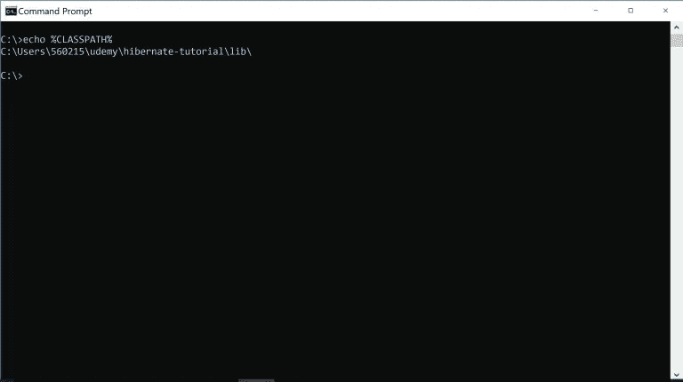
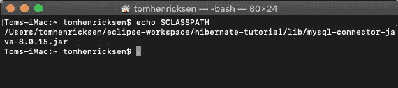
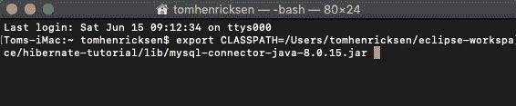
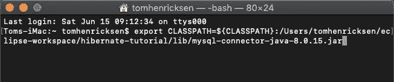
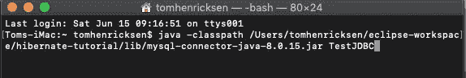
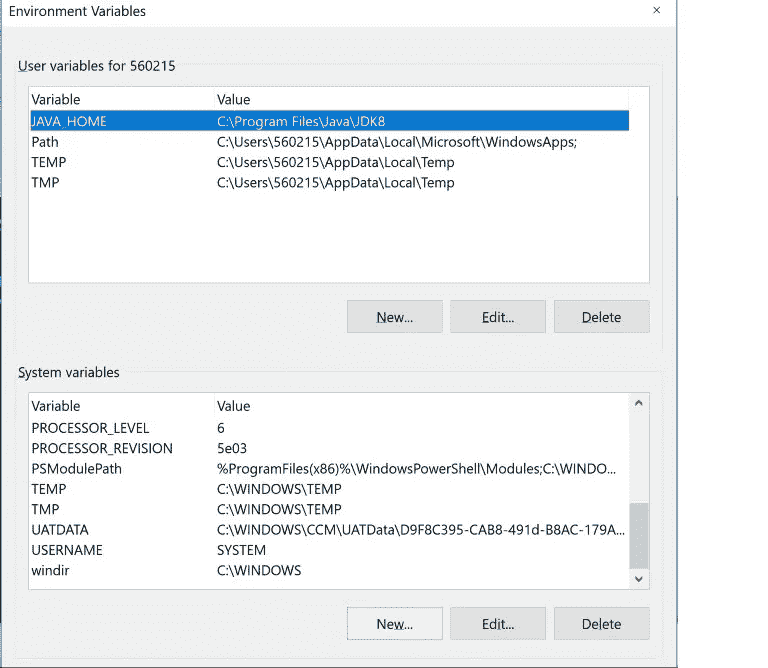
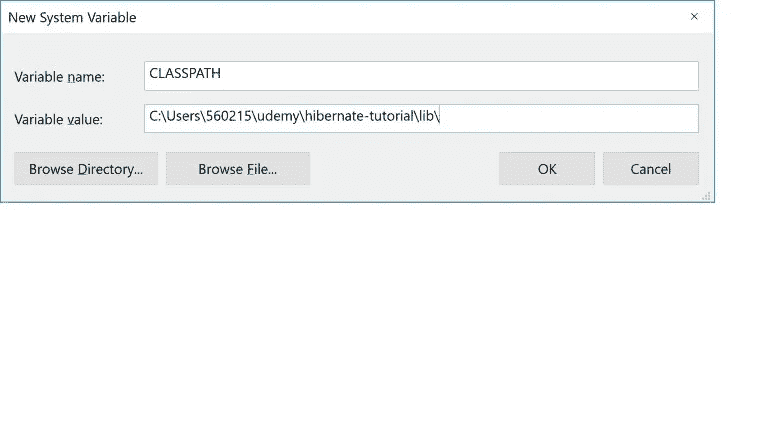

# Java 类路径，了解它，并正确使用它！

> 原文：<https://medium.datadriveninvestor.com/java-classpath-know-it-and-use-it-correctly-2cf6e4dc87ee?source=collection_archive---------0----------------------->

刚开始的时候 Java 可能是一个很深的池子。我记得有一个挑战是类路径。让我们一劳永逸地解决您可能遇到的任何挑战！

在我真正成为一名 Java 开发人员之前，我下载了 Java 开发工具包或 JDK 并到处玩。换句话说，我浏览了一些例子，但是偶尔会遇到类路径的问题。

# 什么

谈到 Java，最好从源代码 Oracle 获取信息。他们这样描述[类路径](https://docs.oracle.com/javase/8/docs/technotes/tools/windows/classpath.html#A1100617)“类路径告诉 JDK 工具和应用程序在哪里可以找到第三方和用户定义的类，它们不是 Java 平台的扩展或一部分。”本质上，这就是 Java 寻找代码运行的方式。

# 类路径和路径

虽然我们在这里[之前讨论了路径](https://myitcareercoach.com/is-your-machine-java-ready/)，但是我们还没有谈到类路径。类路径帮助 Java 虚拟机或 JVM 知道在哪里寻找资源。该路径面向操作系统。

如果你在 Windows 上，它需要知道在哪里寻找你正在运行的文件或应用程序。这同样适用于你的 Mac 或 Linux 电脑。每个人只是做的稍微不同。

# NoClassDefFoundError

在我理解类路径是什么之前，我看到了许多 [NoClassDefFoundError](https://docs.oracle.com/javase/7/docs/api/java/lang/NoClassDefFoundError.html) 异常。例如，您正在尝试使用一些新的库(JAR 文件),并得到以下错误:

> 线程“main”Java . lang . noclassdeffounderror 中出现异常。

很可能您的类路径有问题。

# 支票

当您认为类路径可能是一个问题时，请检查它。它类似于 Windows 和 Mac。要在 Windows 上检查我们的类路径，我们可以打开命令提示符并键入 echo %CLASSPATH%。

要在 Mac 上检查它，您需要打开一个终端并键入 echo $CLASSPATH。

这并不太难，而且对你正在操作的任何机器来说都是一件好事。(Linux 与 Mac 类似)

# 一组

有几种方法可以设置类路径。例如，在命令行中，我们可以使用 export 语句:export class path =/path/to/some . jar:/path/to/some/other . jar。

这将覆盖任何以前的类路径设置。要添加到现有的类路径，请执行以下操作。

我们只是添加${CLASSPATH}来保留之前设置的类路径。

Java 还允许您在命令行中使用-classpath 或-cp 选项设置类路径:

如果你想让一个 JAR 文件对所有 Java 应用程序可用，你可以把这些文件放在`/Library/Java/Extensions`中。此处详解更多[。](https://stackoverflow.com/questions/1675765/adding-to-the-classpath-on-osx)

在 Windows 10 中，打开搜索并键入“env ”,然后单击 Enter。

在“环境变量”部分，单击“新建”。

然后单击 OK，您的类路径就应该设置好了。

总之，理解类路径及其作用是成为一名合格的 Java 开发人员的关键部分。即使作为一名经验丰富的 Java 开发人员，我仍然会看到由类路径和类加载器混淆引起的问题。

**为这个鼓掌，跟我来。**