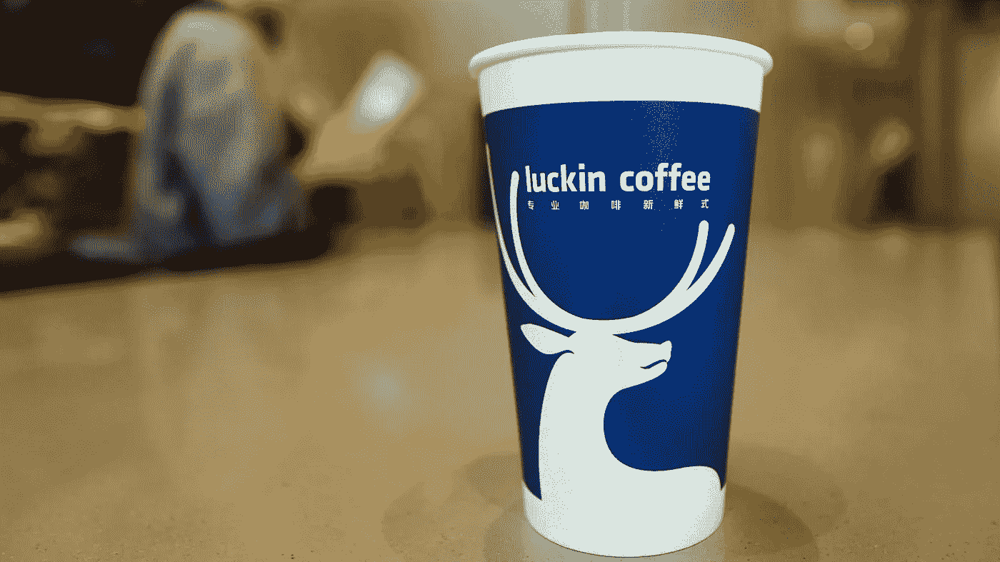

# 爪哇摇摆舞

> 原文：<https://medium.datadriveninvestor.com/java-jive-a34e75b0e9ff?source=collection_archive---------13----------------------->

## 关于 Luckin 咖啡丑闻的内部消息

几年前，我听说了一家名为 Luckin Coffee 的亚洲咖啡公司，这是一家无现金、应用驱动的连锁咖啡店。这家特许经营店开始直接与星巴克竞争，因为这个老牌巨头在整个亚洲对咖啡要价过高。他们还在业务的各个层面依靠先进的技术。出于好奇，我焦虑地从旁观者的角度观察这家公司，在 Crunchbase 上设置警报，并阅读了大约一年时间里有关该公司的每一篇媒体报道。

 [## 利用股市相关性的最佳方式|数据驱动的投资者

### 当阿尔弗雷德·温斯洛·琼斯开创了世界上第一个“对冲”基金(后来“d”被去掉了)时，他让其他投资者大吃一惊…

www.datadriveninvestor.com](https://www.datadriveninvestor.com/2020/02/02/the-best-way-to-use-stock-market-correlations/) 

Luckin Coffee wad founded by Chinese Billionaire Charles Lu and the young ambitious sweet eyed entrepreneur, “Jenny” Qian Zhiya 钱治亚. Appropriately named, Jenny’s surname qián literally means “money” and zhìyà means “rule Asia.” Their mission was to stay ahead of the market by offering steeply discounted coffee, delivery service, employ aggressive marketing campaigns targeting the middle-class office workers, and to launch friend referral offerings via the app to customers.

2018 年 6 月，重量级的新加坡政府投资公司(Government of Singapore Investment Corporation)向该公司注入了 2 亿美元，因为这家咖啡连锁店计划将其零售网点扩大到亚洲各国。Luckin Coffee 家族增加了 1300 家店铺。早期，该公司号称估值 10 亿美元。2018 年 12 月，又增加了 2 亿美元。到 2019 年 4 月，贝莱德资本投资公司(black rock Capital Investment Corporation)又筹集了 1.5 亿美元。截至 2019 年底，该公司的估值达到 50 亿美元。红旗在我脑海里响起！有些不对劲。一家成立两年的公司怎么可能在如此短的时间内实现如此高的估值？

Luckin Coffee 于 2019 年 5 月宣布 IPO。将首次公开募股定价为每股 17 美元。该公司还将其首次公开募股规模扩大至 3300 万股。2019 年 5 月 17 日，股票上市，创始人敲响了纳斯达克的钟声。纳斯达克股票代码:LK，首日最高价为 20.38 美元/股。八个月后，该股达到 50.02 美元/股的峰值。再次提高估值。

2020 年 1 月，Muddy Waters Research 发布了一份内部 Luckin Coffee 文件，并警告称，这家被称为“从根本上破碎的业务”的咖啡巨头夸大了销售数据和制造费用，而管理层则抛售了股票。根据该公司的新闻稿，该公司的高管抱歉地承认了首席运营官和下属的欺诈活动，他们至少在 2019 年 4 月 1 日至 9 月 30 日期间严重捏造了公司指标。Luckin Coffee 还声称，内部调查发现伪造的交易金额超过 3 亿美元。4 月 2 日，随着欺诈消息的曝光，该公司股票跌至每股 6.40 美元。

中国证券监督管理委员会(CSRC)周五表示，将调查 Luckin Coffee 的欺诈指控，消息人士称，参与这家中国连锁企业去年在美国成功上市的一些银行正在评估自己在上市中的作用。

安永会计师事务所宣布，他们已经在对 Luckin Coffee 的审计中发现了问题。

4 月 3 日，股价跌至 5.38 美元/股，让 Luckin Coffee 的投资者倒霉了！该公司宣布，在调查期间将继续运营。

Gena 瓦兹奎 2020

感谢您的阅读！如果你喜欢这篇文章，请随意阅读我写的类似文章。

[**超越肉—超越一个趋势？**](https://medium.com/swlh/beyond-meat-beyond-a-trend-73d2bc511297)