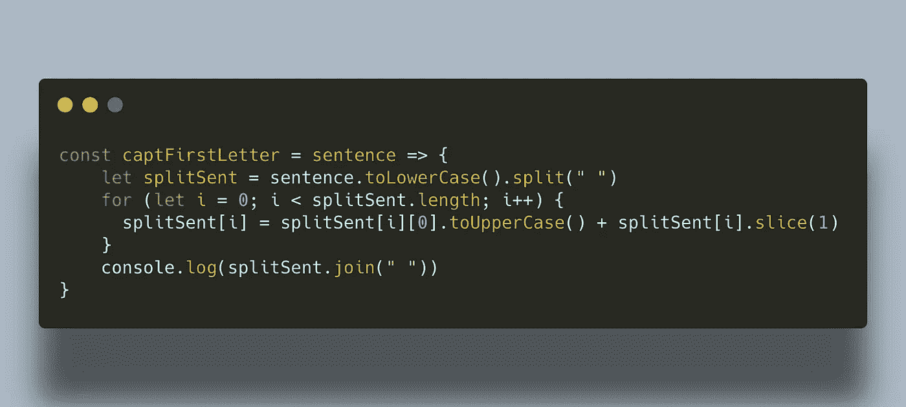

# JavaScript:将句子中每个单词的首字母大写

> 原文：<https://medium.datadriveninvestor.com/javascript-capitalizing-the-first-letter-of-each-word-in-a-sentence-60f57d73aa20?source=collection_archive---------4----------------------->

## 解释了一个常见面试问题的答案


Image by [PIRO4D](https://pixabay.com/users/piro4d-2707530/?utm_source=link-attribution&utm_medium=referral&utm_campaign=image&utm_content=3403546) from [Pixabay](https://pixabay.com/?utm_source=link-attribution&utm_medium=referral&utm_campaign=image&utm_content=3403546)

上周，我被要求回答一个软件工程师职位技术面试中最常见的问题，我想在今天的文章中与你分享我的解决方案。挑战是要求**编写一个程序，将给定句子**中每个单词的首字母大写。这里有几个例子:

```
**Example 1:****Input:** Hi everyone
**Output:** Hi Everyone**Example 2:****Input:** hello class
**Output:** Hello Class
```

这个问题有几种可能的解决方案，比如使用 for 循环、`.map()`方法或`.replace()`方法，我在面试中选择了使用 **for 循环**。

我如下解决了这个问题:

1.  小写给定`sentence`中的所有字母。
2.  用一个空格字符将小写句子分割成一个单词数组。
3.  遍历数组中每个单词。
4.  将每个单词的第一个字母转换成大写，然后将这个大写的第一个字母与单词的其余部分连接起来。
5.  将数组中的每个单词连接成一个字符串，并打印出大写的单词。

[](https://www.datadriveninvestor.com/2020/05/18/how-could-algorithms-put-individuals-and-communities-in-harms-way/) [## 算法是如何将个人和社区置于危险之中的？数据驱动的投资者

### 尽管数学方程看起来遥远而冷漠，但它们通常也与可靠的硬科学联系在一起…

www.datadriveninvestor.com](https://www.datadriveninvestor.com/2020/05/18/how-could-algorithms-put-individuals-and-communities-in-harms-way/) 

以下是我的 JavaScript 代码:



给定的问题是要求我们写一个函数，打印提供的句子，每个单词的第一个字母大写。我们首先小写给定输入的所有字母，以确保在我们大写第一个字母后，单词的其余部分也是小写。然后用空格将字符串分隔成单词数组。接下来，遍历数组，大写每个单词的第一个字母，通过只切分第一个字符将其与字符串的其余部分连接起来，并将其赋回数组。最后，打印新的标题大小写字符串，用空格将它们连接起来。该算法的上述解决方案以 **O(n)时间复杂度**运行，其中`n`是给定句子的长度。

为了解决这个挑战，我们使用了各种 JavaScript 方法的组合，比如`.toUpperCase()`和`.slice()`。无论是在你的某个项目中，还是在像我这样的技术面试中，你都可能会遇到这个概念。

希望这篇文章对你有帮助，谢谢你的阅读！如果您对解决不同的算法感兴趣，可以查看我的其他文章:

[](https://medium.com/swlh/javascript-binary-search-algorithm-ec996e14c229) [## JavaScript:二分搜索法算法

### 用 LeetCode 的一个问题解释

medium.com](https://medium.com/swlh/javascript-binary-search-algorithm-ec996e14c229) [](https://medium.com/swlh/javascript-remove-duplicates-from-sorted-array-in-place-d3d959fb4d77) [## JavaScript:从已排序的数组中删除重复项

### 挑战选自 LeetCode 的顶级面试问题列表

medium.com](https://medium.com/swlh/javascript-remove-duplicates-from-sorted-array-in-place-d3d959fb4d77) [](https://medium.com/javascript-in-plain-english/javascript-valid-anagram-challenge-70bc346fdf4c) [## JavaScript:有效的字谜挑战

### 顶级面试问题列表— LeetCode

medium.com](https://medium.com/javascript-in-plain-english/javascript-valid-anagram-challenge-70bc346fdf4c) 

## 访问专家视图— [订阅 DDI 英特尔](https://datadriveninvestor.com/ddi-intel)