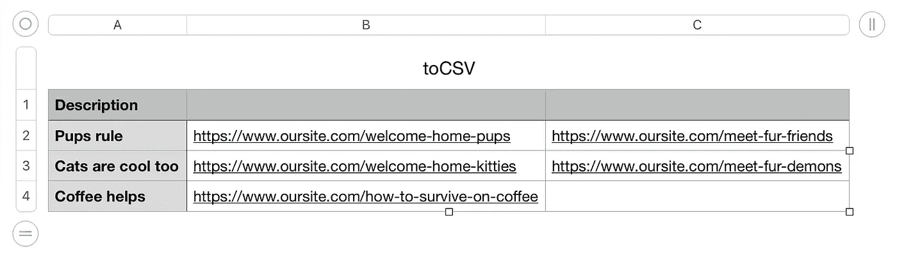

# JavaScript:如何格式化 JSON 对象以输出 CSV

> 原文：<https://medium.datadriveninvestor.com/javascript-how-to-format-a-json-object-to-output-a-csv-c4aecbf6346f?source=collection_archive---------3----------------------->

九月的一个晴朗的下午，我的经理有一个请求…


Photo by Mika Baumeister

# 该问

就这样，在一个晴朗的日子里，当我听到 Slack 发出的臭名昭著的“tss-da- da-da”声时，我正劈砍着。我的经理给了我一个额外的任务来满足我们的一个满意的人的需求。我们一直致力于网站的国际化，作为采用新网站的一部分，我们需要确保我们所有的旧页面都在新网站上。

为了实现这一点，他希望我查询所有路线的旧站点，并将它们导出到一个文本文件中。我想，好吧，好吧，我想我曾经在我的训练营里做过类似的事情，觉得那会很有趣。

我们使用 Contentful 作为我们的内容管理系统，我对他们的系统非常熟悉，知道我应该能够简单地在 postman 上请求特定的内容类型，然后得到商品。我得到的货物，经过一些像 fun 这样的“编码挑战”，我设法满足了要求，或者说我是这样认为的。

一天后，我的经理再次打电话给我，这一次，我的要求更加具体了。他希望我再次获取路由，但是这次指定一个特定的地区，哦，并将数据输出到一个. csv 文件中，并将路由作为可用的 URL，以便于使用。这也是重要的和优先的，所以，我需要尽快完成它。这很有趣，因为我从来没有真正在 postman 上请求过特定区域的内容，所以我必须整理出一点点内容，然后输出到 csv。

*嗯*..**没有**，没做过这种事。我不完全确定我能不能做到，但是我觉得，嘿，这是 JavaScript，我最好能做到，否则，*我还能编码兄弟*吗？在重写了我之前的算法并用棍子戳了戳之后，我完成了任务。我是这样做的:

[](https://www.datadriveninvestor.com/2020/07/07/introduction-to-time-series-forecasting-of-stock-prices-with-python/) [## 用 Python |数据驱动投资者进行股票价格时间序列预测简介

### 在这个简单的教程中，我们将看看如何将时间序列模型应用于股票价格。更具体地说，一个…

www.datadriveninvestor.com](https://www.datadriveninvestor.com/2020/07/07/introduction-to-time-series-forecasting-of-stock-prices-with-python/) 

# 代码

# 数据

因为为您提供完整的生产数据列表有点冗长且不明智，所以我们将模拟我们的数据对象。我们的文件现在看起来像这样:

# 魔力

最后，我们来测试一下这个坏蛋。打开您的终端，导航到该文件，并使用以下命令运行它:

```
node yourFile.js
```

在同一个目录中，您应该会看到输出。如果显示为纯文本，它在这里看起来不会很漂亮，但是，以. csv 格式打开它，它看起来会像这样:



voila!

编辑它以适合你的喜好，并认为它是一个很好的点缀。一个 *t* 很好的穿越。如果你愿意的话，这是件好事。

## 附加阅读

[](https://medium.com/swlh/javascript-sets-a-painless-introduction-90f18ac63242) [## JavaScript 集:轻松入门

### 学习如何使用 JavaScript 集，保持它的简单版本

medium.com](https://medium.com/swlh/javascript-sets-a-painless-introduction-90f18ac63242) [](https://medium.com/swlh/a-helpful-alternative-to-console-log-7a2c5c91a8cf) [## console.log 的有用替代品

### 学习一种有用的方法，以一种整洁有序的方式记录数据

medium.com](https://medium.com/swlh/a-helpful-alternative-to-console-log-7a2c5c91a8cf) [](https://medium.com/swlh/how-not-to-suck-as-a-new-software-engineer-f92eee4fbf65) [## 作为一名新的软件工程师，如何不让人讨厌

### 新手和蹩脚的开发者要记住的 5 件关键事情

medium.com](https://medium.com/swlh/how-not-to-suck-as-a-new-software-engineer-f92eee4fbf65) [](https://medium.com/swlh/gaining-visibility-as-a-new-developer-3a0d3e5866f2) [## 作为新开发人员获得可见性

### 当你是这个街区的新成员时，如何被注意到并受到欢迎

medium.com](https://medium.com/swlh/gaining-visibility-as-a-new-developer-3a0d3e5866f2) [](https://blog.usejournal.com/using-react-with-redux-and-typescript-c7ec48c211f6) [## 使用 React with Redux 和 TypeScript

### 了解如何使用 Redux 设置您的 TypeScript-React 项目。

blog.usejournal.co](https://blog.usejournal.com/using-react-with-redux-and-typescript-c7ec48c211f6) [](https://medium.com/@christopherbeards/javascript-interview-practice-pure-functions-2366ff562e24) [## JavaScript 面试练习:纯函数

### JavaScript 纯函数的“保持简单”复习

medium.com](https://medium.com/@christopherbeards/javascript-interview-practice-pure-functions-2366ff562e24) 

珍惜你自己，克里斯托弗·比尔德

## 访问专家视图— [订阅 DDI 英特尔](https://datadriveninvestor.com/ddi-intel)