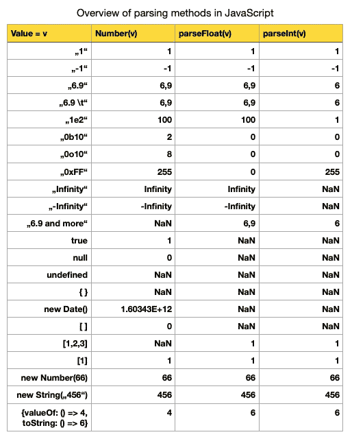
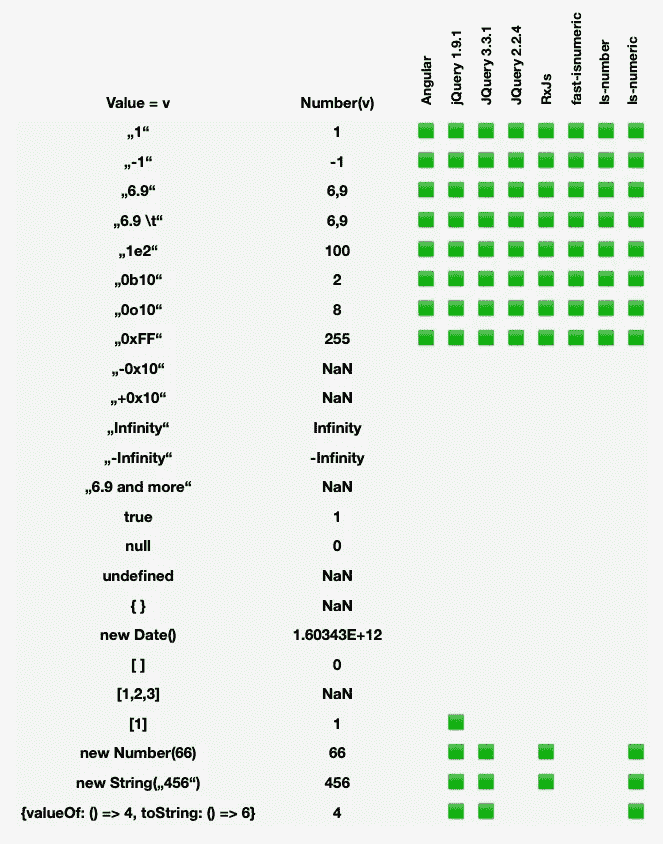

# JavaScript ES6 数字解析

> 原文：<https://medium.datadriveninvestor.com/javascript-numbers-parsing-how-to-89997964207a?source=collection_archive---------4----------------------->

## 如何解析 JavaScript 中的数字

Photo by [Volkan Olmez](https://unsplash.com/@volkanolmez?utm_source=medium&utm_medium=referral) on [Unsplash](https://unsplash.com?utm_source=medium&utm_medium=referral)

# 问题描述

avascript 是一种种类繁多的语言，适用于任何类型的 web 应用程序。这是有意的，但对于像电子商务平台或网站这样的 web 应用程序，这种动态可能是非常混乱的数字转换的起源，因此很多时候会导致无意义的结果。如果您的应用程序得到的输入表单可以使用不同的数字格式，如 10e5 或 0b11，甚至是 10px 或 10em，而您想要解析它们，这对您来说可能是一个很长的时间。

在 JavaScript 中，算术运算可用于任何类型。但是，当两种类型不同时，这会导致类型强制，从而导致令人惊讶的结果:

使用“+”操作符，让 JavaScript 选择字符串类型并添加第二个。如果您使用“*”或“-”运算符，数字类型将胜出。因此，最后两个导致正确的算术运算。

为了确保指定的算术运算产生正确的结果，从输入字段获取的数据应该总是被显式地转换成正确的类型。JavaScript 在这里派上了用场，并为此提供了 3 个函数。不幸的是，它们都以不同的方式工作。解析 CSS 样式定义中的值时的示例:

正如你所看到的，第一个删减了小数位，第二个精确，第三个毫无帮助。

> 我们有一个问题要回答:如何用 JavaScript 解析我的数字，并且不会再出错？

# JavaScript 中的数字类型

为了更接近答案，我们需要对 JavaScript 中的数字有一个基本的了解。与强类型语言不同，在强类型语言中，大多数数字被分成子部分，就像在 C#中，无符号整数只能是正数，浮点数是小数，而在 JavaScript 中没有这样的东西。“类型”操作员将证明:

任何种类的数都被浓缩成类型数。JavaScript 总共有六种类型，显示的这四种:string、number boolean 和 object 几乎都是。

我们可以用数字文字创建一个数字类型的值。常见的数字文字是整数(10)和有符号浮点数(-34.8)。但是在 JS 中还有更多:

他们四个都代表相同的价值。第一种是科学记数法，第二种是十六进制记数法，第三种是二进制记数法，第四种是八进制记数法。可以通过前缀区分。JavaScript 还区分有限数值和无限数值:

尽管数学上没有定义被零除，但是 JavaScript 允许这样做。它产生特殊值+/-无穷大。所有其他未定义的算术选项都会产生 NaN(非数字)。那些未定义的是什么？无限/无限。JavaScript 遵循 IEEE-754-浮点数规范！

JavaScript，哦 JavaScript！所有的特殊值都是像 number 这样的类型，尽管文本说“不是一个数字”！

为了确定两个值是否是算术定义的，必须检查这些数字是否是有限的。幸运的是 JS 提供了静态函数编号。IsFinite:

但是也要小心(JS 真的是丛林)！ES6 引入的功能号是有区别的。和全局函数。

全局的那个在偷偷的把其他类型转换成数字，会导致奇怪的结果。静态变量只接受 number 类型的变量。兄弟函数也是如此:IsNaN 和 Number.IsNaN。

记住这一点，你就比以前更接近你的目标了！

# 用 parseFloat 和 parseInt 转换值

有时输入值(来自表单或输入字段)没有类型号。因此，转换是必要的。JavaScript 也为我们提供了 3 种解析它们的可能性。

*   数字
*   parseFloat/ Number.parseFloat
*   parseInt / Number.parseInt

ParseInt 和 ParseFloat 在数字上也有一个兄弟。构造函数，但幸运的是，它们的工作原理是一样的。这两个函数都将字符串转换成数字。只要得到第一个非数字字符，它们就会读取，然后立即中断转换过程。空格、换行符、回车符和制表符会被忽略。当字符串只包含不可转换的字符或为空(null)时，两者都返回 NaN 作为输出。

我们在这里可以清楚地看到不同之处。ParseInt 立即将小数点视为无效，并中断转换。结果总是一个整数。它转换其他数字文字和特殊值:

但是文字是有限制的。一方面，ParseInt 可以转换十六进制，但极度渴望八进制、二进制和科学指数记数法的转换。另一方面，ParseFloat 可以读取科学指数记数法，但不能读取其他三种记数法。

这是一个潜在的鬼鬼祟祟的错误和转换过程中的错误。没有这些明确的知识，你就不会意识到那些细微的差别，并且在没有任何线索的情况下编码完成任务。最棘手的是前缀只是被截掉了，剩下的被视为有效值。根本不知道之前的值是多少。

如果值不是字符串，那些函数也会把它转换成字符串。问题又来了:字符串有它自己的规则集:

*   字符串(未定义)= >未定义
*   String(null) => null
*   String(true)/String(false)= > true/false

是输入类型对象，那么 String 试图从对象本身调用方法 ToString()来获得一个基本类型，除 object 之外的所有其他类型。这是不是没有达到目标，然后调用 valueOf()。这也没有达到目标，会抛出一个错误。

在你的大脑中有这些转换规则，转换是可以理解的:

一个数组被转换成一个单一的数字可以用上面的规则来解释:

1.  parseFloat([1，2，3])使用 String-Method 将输入转换为字符串
2.  String([1，2，3])调用了方法 toString，因为数组是 JS 中的一个对象
3.  [1,2,3].toString()产生字符串“1，2，3”
4.  转换继续使用 parseFloat([1，2，3])
5.  parseFloat 一直读到第一个不可转换的字符，即 1 后面的逗号，然后停止转换
6.  因此，结果是 1

# 数字:JavaScript 中转换数字的第三种方式

将任何东西转换成数字的第三种方法是全局方法号。适用于 parseInt 和 parseFloat 的规则相同。整个字符串必须是可转换的，混合转换是不可能的，也不会带来结果。存在以下特殊规则:

*   ""，null 和 false 将被转换为 0
*   真实结果为 1
*   NaN 中未定义的结果
*   允许所有前缀

如果输入是 object 类型的，那么这个函数的工作方式正好与 parseInt 和 parseFloat 相反。它首先使用 valueOf 进行转换，如果失败，它将调用 toString 转换。因此，有一些细微的区别:

正因为如此，日期对象在与数字的用法上是特殊的。valueOf 的调用返回一个 UNIX-timestamp，它也是 number 类型，根本不会被转换，只是通过管道传递。数组在被调用 valueOf 时会返回自身，由于这种失败的转换(Number 需要一个数字)，导致调用 toString-method。返回包含特殊字符的字符串会导致转换中止。结果是楠。

# JavaScript 中解析数字的结论

下面，我总结了这三个功能是如何工作的。

现在的问题是:应该使用这三个函数中的哪一个来转换给定的输入，以便通过转换正确地进行计算？

如果浮点数和整数都需要，parseInt 不是您的候选。另外，是否接受十六进制文字？— parseFloat 也不是正确的。使用 Number 可能是非常正确的，但是当涉及到日期、布尔值、null 或一些单独的对象时，可能会导致奇怪的结果。此外，转换可能会导致 NaN 和 Infinity，这对于算术运算来说是无效的值。

在成功完成转换之前，必须有一个筛选器。一个函数，检查输入是否可以转换成一个有限的数字。

一些框架也设法回答了这个问题。JQuery 提供了 IsNumeric 方法。在不同版本的 JQuery 发布期间，实现也发生了一些变化。根据您的需要检查正确的版本:下面，我总结了不同的框架及其将值转换为数字的能力。

Overview of frameworks and their conversions

在 JavaScript 中转换数字不是一项简单的任务。选择函数来明智地转换您的数字。过滤掉不想要的值(NaN，Infinity，带有 Unix 时间戳的 Date)，否则会产生不想要的奇怪结果。为你的过滤和转换方法编写单元测试。

> 因此，安全转换需要以下步骤:
> 
> 检查给定的输入/值是否为数值
> 
> 将值转换成数字

[***节省自己大量的时间，专注于重要的主题。***](https://arnoldcodeacademy.ck.page/26-web-dev-cheat-sheets)