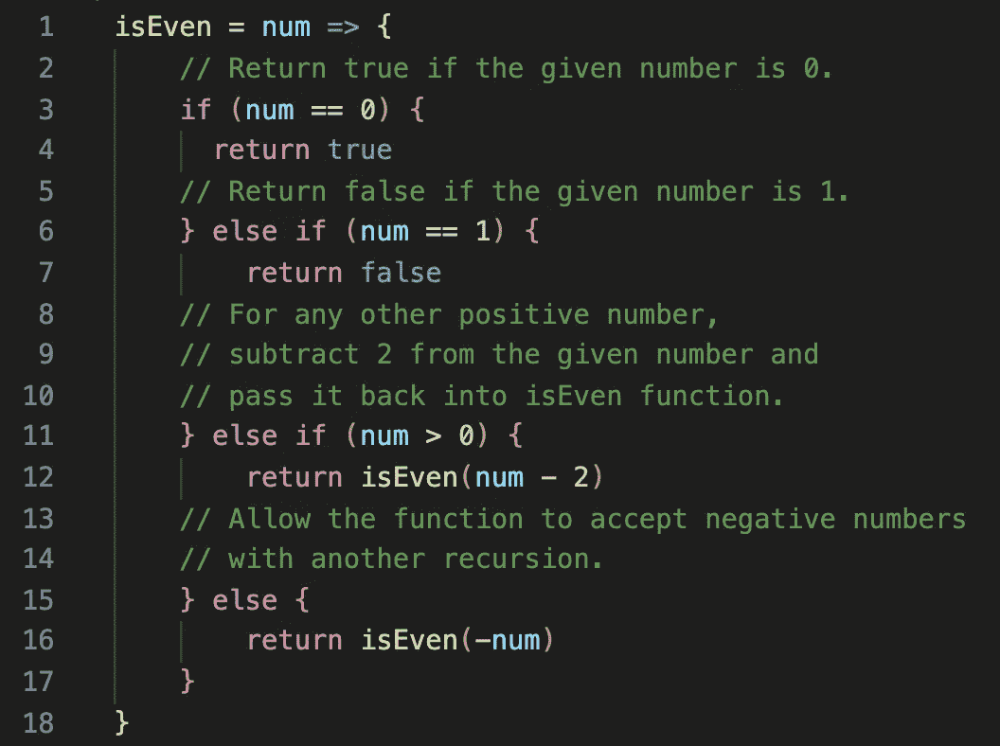

# JavaScript:使用递归函数来确定给定的数字是否是偶数

> 原文：<https://medium.datadriveninvestor.com/javascript-use-a-recursive-function-to-determine-if-a-given-number-is-even-72466d8a6e5b?source=collection_archive---------3----------------------->

## 用雄辩的 JavaScript 解释了一个练习的解决方案


Image by [Tuan Hung Nguyen](https://pixabay.com/users/nguyentuanhung-17678/?utm_source=link-attribution&utm_medium=referral&utm_campaign=image&utm_content=250212) from [Pixabay](https://pixabay.com/?utm_source=link-attribution&utm_medium=referral&utm_campaign=image&utm_content=250212)

我从本周的算法(第三版，第三章)的雄辩 Javascript 书的第三章中选了一个名为“递归”的练习。功能)。我们将编写一个递归函数，它将一个整数作为其单个参数，并通过返回一个布尔值来定义给定的数字是偶数还是奇数。这里有几个例子:

```
**Example 1:****Input:** (5)
**Output:** false**Example 2:****Input:** (82)
**Output:** true**Example 3:****Input:** (-1)
**Output:** false
```

在本练习中，我们将不使用模/余数运算符(`%`)。相反，我们将使用递归函数；`isEven`，其**称自己为**，直到满足给定的条件。

1.  如果给定的数字为零，则返回`true`(偶数)。
2.  如果给定的数字是一，则返回`false`(奇数)。
3.  对于任何其他正数，通过从给定的数中减去 2 来进行递归调用。
4.  对于小于零的数字；使用另一个递归来更改数字的负值。

让我们看看 JavaScript 中代码的实现:



当你从一个数中减去 2 时，这个数的均匀度不会改变。注意，当我们从函数内部调用`isEven`函数来测试它直到满足其中一个条件时，我们传递了`num — 2`的值。这样每次都会从我们的数字中减去 2，直到它等于`0`或`1`，然后返回相应的布尔值`true`或`false`(偶数或奇数)。换句话说，偶数达到值`0`，而奇数达到值`1`。该函数最终会根据均匀度返回一个适当的布尔值。当给定数为负数时，最终的`else`条件递归调用函数`isEven`。

感谢您阅读这篇博文，请随意查看我关于 JavaScript 算法的其他文章:

[](https://medium.com/dev-genius/javascript-generating-a-range-of-numbers-76d7f926f223) [## JavaScript:生成一系列数字

### 用三个论点；开始、结束和步进

medium.com](https://medium.com/dev-genius/javascript-generating-a-range-of-numbers-76d7f926f223) [](https://medium.com/swlh/javascript-three-ways-to-reverse-an-array-32f9819e9a97) [## JavaScript:反转数组的三种方法

### 不使用反向方法

medium.com](https://medium.com/swlh/javascript-three-ways-to-reverse-an-array-32f9819e9a97) [](https://medium.com/swlh/javascript-chessboard-program-6740c855e44f) [## JavaScript:棋盘程序

### 来自雄辩 JavaScript 的练习

medium.com](https://medium.com/swlh/javascript-chessboard-program-6740c855e44f) [](https://medium.com/dev-genius/sort-array-by-parity-problem-584bfbf861a1) [## 按奇偶问题排序数组

### 解释了 JavaScript 和 Ruby 中的两种方法

medium.com](https://medium.com/dev-genius/sort-array-by-parity-problem-584bfbf861a1) [](https://medium.com/swlh/remove-adjacent-duplicates-problem-5b9ac4abe87f) [## 删除相邻重复问题

### 使用堆栈在 JavaScript 和 Ruby 中解决

medium.com](https://medium.com/swlh/remove-adjacent-duplicates-problem-5b9ac4abe87f) [](https://medium.com/dev-genius/subtract-product-and-sum-problem-6d4d39a3c91e) [## 减法乘积和求和问题

### 用 JavaScript 解决

medium.com](https://medium.com/dev-genius/subtract-product-and-sum-problem-6d4d39a3c91e) [](https://medium.com/swlh/unique-number-of-occurrences-problem-cf25bd3fab4f) [## 唯一出现次数问题

### 用 JavaScript 和 Ruby 解决

medium.com](https://medium.com/swlh/unique-number-of-occurrences-problem-cf25bd3fab4f)