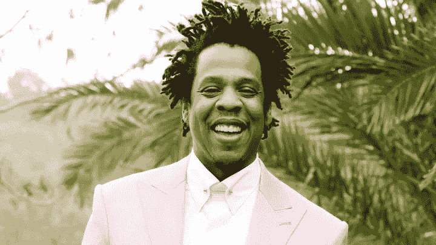
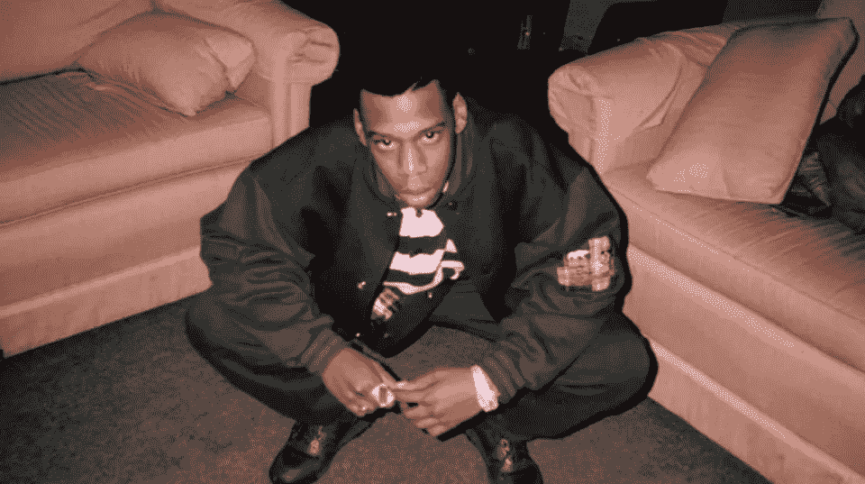
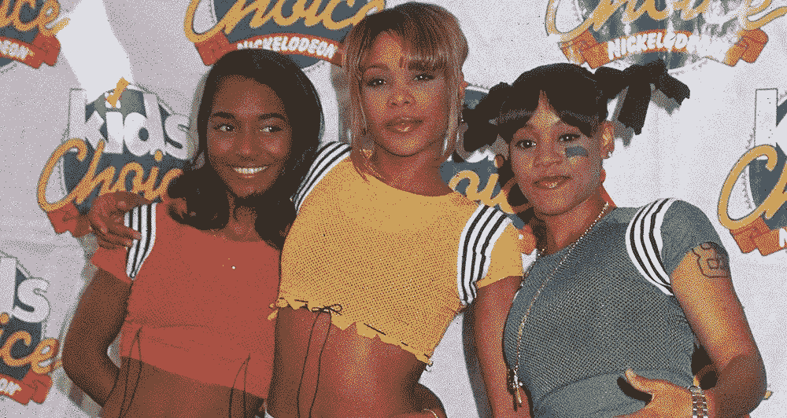
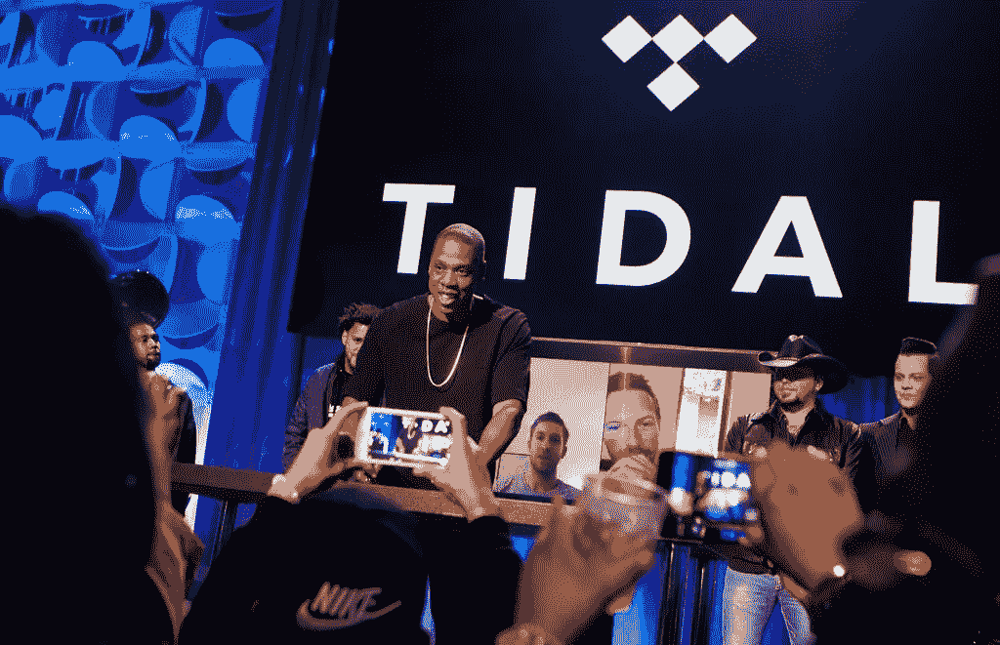
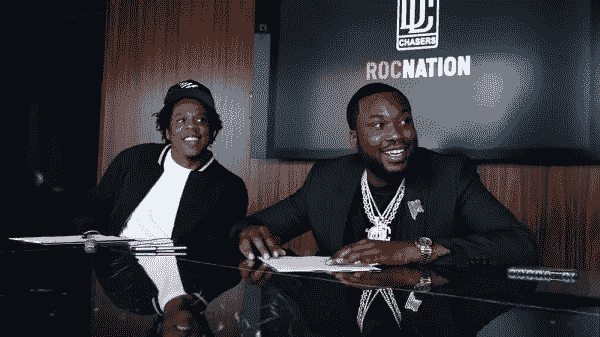

# Jay-Z 是世界上第一个亿万富翁说唱歌手——以下是他成功的秘密

> 原文：<https://medium.datadriveninvestor.com/jay-z-is-the-worlds-first-billionaire-rapper-here-s-the-secret-to-his-success-14f33bd1beaa?source=collection_archive---------9----------------------->

Photo by Roc Nation

Jay-Z 最臭名昭著的一句话大概是这样的:

> “我不是商人。我是做生意的，伙计！”

果然，这位说唱歌手积累的十亿美元财富是精心打造的个人品牌的结果，这是前所未有的。

除了巨大的财富之外，Jay-Z 还获得了多项音乐界的最高荣誉[22 项格莱美奖就是其中之一，并且巩固了众多记录(他作为 Billboard 历史上的独唱歌手拥有最多的专辑](https://en.wikipedia.org/wiki/Jay-Z#Music_career))。

但是你会惊讶地发现 Jay-Z 的生活并不总是一帆风顺；如果说有什么不同的话，那就是他非常适合经典的白手起家的故事。

# **Jay-Z 曾经以贩毒为生**

A young Jay-Z

Jay-Z(本名 Shawn Carter)在纽约出生长大，在著名的布鲁克林 Marcy 住宅区过着 T4 式的艰苦生活。不得不每天依靠食品券生活，Jay-Z 经常违反法律来维持生计。

是的，每个人最喜欢的说唱歌手曾经是一个臭名昭著的毒贩；他甚至在贩卖可卡因的时候中了三枪。

在他决定永远退出犯罪生活后，Jay-Z 转向说唱并出售他的混音带作为替代收入来源。在遭到无数唱片公司的无数次拒绝后，他最终放弃了，并创建了他的独立唱片公司 Roc-A-Fella Records，在那里他发行了他的首张专辑《合理怀疑》,获得了很多好评。

其余的，正如他们所说，都是历史了。

但是 Jay-Z 到底是如何从一个说唱歌手变成世界上第一个音乐家变成亿万富翁的呢？

有许多成功的音乐人，他们都在职业生涯中积累了可观的财富，但没有一个人达到 Jay-Z 那样的成功水平。

在研究了这位说唱歌手的全部简历后，我发现了一个秘密——如果你愿意的话，可以称之为蓝图——它使他与众不同，并使他积累了如此巨大的财富。

这就是:Jay-Z 做得好(而其他人做得不好)的一件事是**资产所有权。**

 [## 抓住智能营销，获得巨大成果|数据驱动的投资者

### 网上的人都看过。每当人们在谷歌上搜索某样东西，他们最终都会与类似的广告互动…

www.datadriveninvestor.com](https://www.datadriveninvestor.com/2020/08/19/grab-on-to-intelligent-marketing-for-great-results/) 

# **为什么资产所有权如此重要？**

简单地说，企业中的资产是你或你的公司拥有或租赁给其他企业的有价值的项目。它们可以有不同的形状和形式，如房地产、设备，甚至艺术品。

更重要的是，合适的资产可以成为创造巨大价值的手段，并为您带来持续的丰厚回报。

Real estate is one of the most valuable assets to obtain. Photo by [Ralph (Ravi) Kayden](https://unsplash.com/@ralphkayden?utm_source=medium&utm_medium=referral) on [Unsplash](https://unsplash.com?utm_source=medium&utm_medium=referral)

拥有最少的资产反映了企业的财务稳定性。如果一家企业的资产很少，可能会造成严重的财务困难，比如拒绝银行/投资贷款。

在 Jay-Z 的案例中，资产所有权帮助他成为亿万富翁。

Jay-z 非常擅长收购和拥有资产。从他的财富中我们可以清楚地看到，他有选择有可能给他带来最大回报的资产的诀窍。

以下是他取得今天成就的三个关键资产(及其背后的原因):

# **Jay-Z 获得了他音乐的 100%所有权**

Jay-Z 获得的最大资产之一是**自己的音乐**。

你知道，通常，当一个艺人与唱片公司签约并与该公司合作制作音乐时，他们只能从售出的专辑和唱片中获得一小部分收入。

我说的小，其实是指极小的。根据词根 [**，**](https://www.theroot.com/the-music-industrys-funny-money-1790880088) 的说法，每卖出 1000 美元的音乐，艺术家只能赚 23 美元，或者 2.3%。这对他们通常投入的工作来说是微不足道的。

所以你可以想象有多少“成功”的艺术家实际上并没有从他们的销售中赚到多少钱。

Popular 90’s girl group TLC, once filed for bankruptcy with their record label even after selling millions of records

这也是 Jay-Z 几乎放弃一切去获得所有师父的唯一原因。

简单地说，拥有你的母带意味着你可以完全控制你创作的歌曲或专辑的所有方面。这意味着你可以决定对你的音乐做些什么:从音乐的分销渠道有多广，到你想把它放在哪个广告上。

最重要的是，当你的音乐被公众购买或播放时，你将获得更多的收入。

你可能会问，这种资产所有权有多重要？嗯，仅仅获得硕士学位就让 Jay-Z 获得了他十亿美元净资产的十分之一。

只要人们继续购买他的音乐，他将在未来几年继续创造可观的收入。

# 他也拥有其他艺术家的音乐

Jay-Z at a Tidal Event

拥有自己的音乐已经非常困难了，只有少数人成功做到了。

但是拥有其他艺术家的音乐？这是一个全新层次的商业策略。

早在 2015 年，这位说唱歌手[向](http://mb.cision.com/Main/1052/9718782/340280.pdf)提交了以不到 6000 万美元收购流媒体服务 Tidal 的报价。Jay-Z 旨在挑战更大的竞争对手，如 Spotify & Apple Music，Jay-Z 希望 Tidal 能够[为其平台上的艺术家提供更多创意和对其音乐的财务控制](https://www.bbc.com/news/business-38725806#:~:text=Jay%20Z%20bought%20Tidal%20three,more%20control%20over%20their%20music.&text=As%20a%20result%20of%20the,access%20to%20exclusive%20Tidal%20content.)。

这对那些选择把音乐放在 Tidal 上的艺术家来说很好，但对 Jay-Z 来说更好。

基本上，现在只要其他艺术家的音乐在平台上流动，这位说唱歌手就能赚钱。

Tidal 现在拥有令人印象深刻的超过 4000 万首歌曲的[目录，并拥有像碧昂斯和加尔文·哈里斯](https://www.bbc.com/news/business-38725806#:~:text=Jay%20Z%20bought%20Tidal%20three,more%20control%20over%20their%20music.&text=As%20a%20result%20of%20the,access%20to%20exclusive%20Tidal%20content.)这样的一线投资者，这只会让公司更有价值。

尽管流媒体服务受到了批评(尤其是订阅价格，比 Spotify 高得多)，Tidal 现在价值 6 亿美元，是 Jay-Z 最初购买时的 10 倍。

# 他创立了自己的娱乐公司

如果你对他获得的前两项资产印象深刻，那么准备好被下一项资产震惊吧。

2008 年，Jay-Z 创立了他的娱乐公司 Roc Nation。该公司目前拥有一个唱片公司，人才机构，服装，巡回演出和音乐会制作。

拥有自己的娱乐公司背后的独创性在于，无论你的艺人为公司赚了多少钱，你都可以获得很大一部分收入。无论是唱片销售、音乐会门票还是商品，你都可以从中分一杯羹。

中华民国赚多少钱呢？嗯，这家公司每年平均收入惊人，达到 5000 万美元。想象一下 Jay-Z 从中获得了多少。

Roc Nation 也不是一家小公司。目前，它[管理着 50 多位知名艺术家](https://en.wikipedia.org/wiki/Roc_Nation)(在大约 500 名员工中)，其中一些属于像蕾哈娜和大肖恩这样家喻户晓的名字。

Jay-Z with his artist, Meek Mill @ Roc Nation

但是这位商业头脑的说唱歌手肯定没有就此止步。[2019 年，Roc Nation 宣布与美国国家足球联盟](https://en.wikipedia.org/wiki/Roc_Nation)合作，该公司将成为该联盟的“现场音乐娱乐策略师”。

与 NFL 合作本身就是一个狡猾的策略，因为这意味着你和你的艺术家的音乐将比以往任何时候都更广泛地传播，从而为你赚更多的钱。

这只是 Roc Nation 在过去十年中建立的众多战略合作伙伴关系之一，每一个都为公司乃至 Jay-Z 带来了更多新的成功。

# **最后的想法**

以上三项资产有助于我们深入了解 Jay-Z 这位聪明的商业战略家，但我只是触及了他全部财富的表面。此人还是一名房地产收购者、珍贵艺术品收藏家和大胆的投资者。

如果有什么可以从这一切中吸取的，那就是:**获得有价值的资产是将你的财富推向更高高度的关键组成部分**。即使你目前没有可观的收入，也要从小处着手，然后在将来逐步提高。

不要害怕失败。Jay-Z 本人在资产收购中经历了重重障碍，其中一些让他损失了数百万美元。但是你只要看一眼他现在在哪里，就知道这是旅程的一部分。

我将用这位嘻哈大师自己的一条恰当的建议来结束这篇文章，那就是:

> "你从失败中学到的比成功中学到的更多."

## 访问专家视图— [订阅 DDI 英特尔](https://datadriveninvestor.com/ddi-intel)