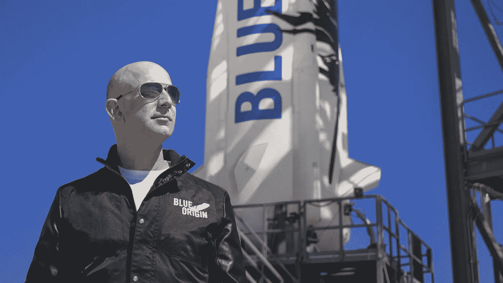
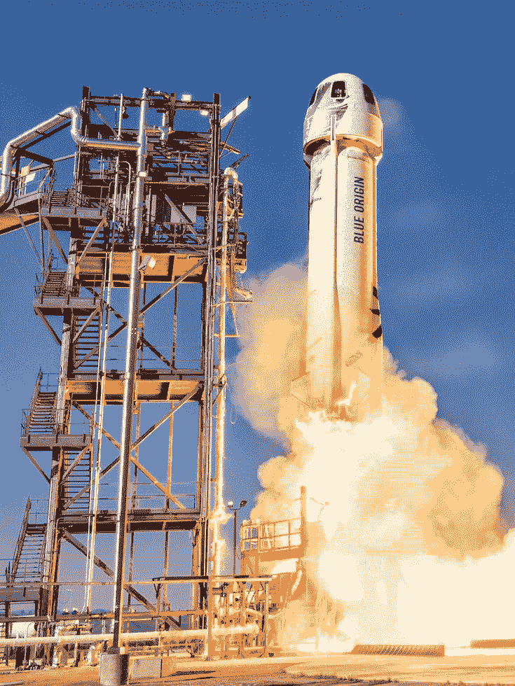
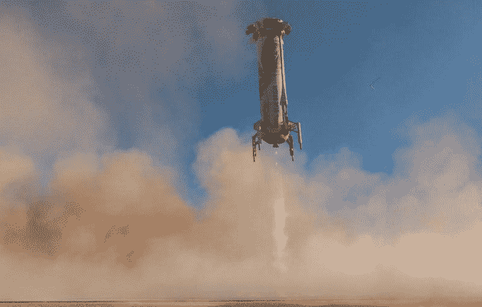
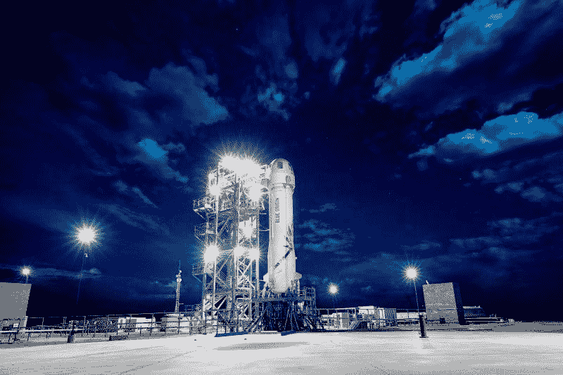
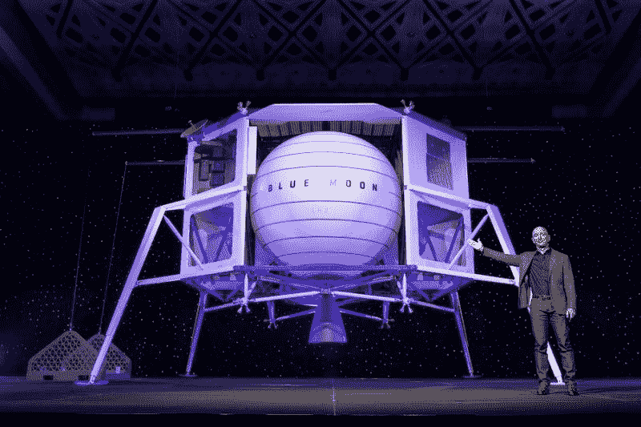
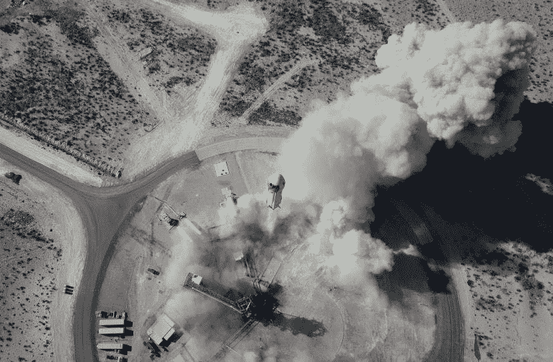
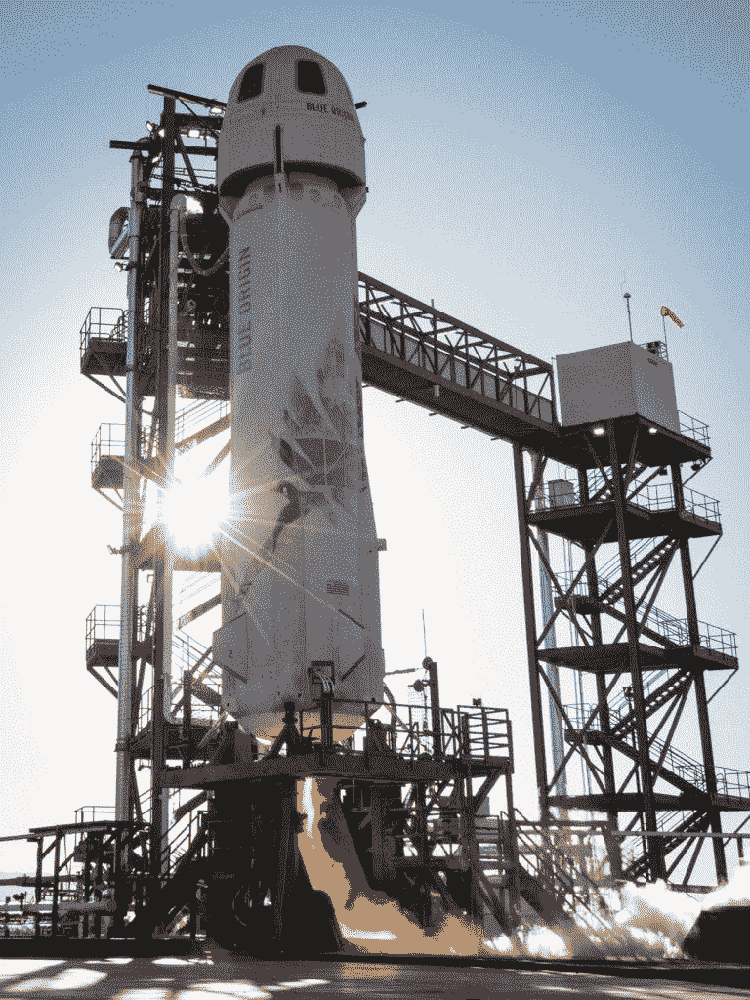

# 杰夫·贝索斯登上顶级市场《疯人院》

> 原文：<https://medium.datadriveninvestor.com/jeff-bezos-goes-out-on-top-market-mad-house-aeca1f1f4a93?source=collection_archive---------38----------------------->

杰夫·贝索斯是一个商业天才，对时间有很强的判断力。财务数据显示，这位亚马逊(Amazon)首席执行官选择了一个完美的时机。

例如，**亚马逊(NASDAQ: AMZN)** 报告称，截至 2020 年 12 月 31 日，季度收入为 1255.55 亿美元，季度毛利为 462.71 亿美元，季度收入为 68.73 亿美元。此外，亚马逊当天有 843.96 亿美元的现金和短期投资，总资产为 3211.95 亿美元。

随着亚马逊创造出令人难以置信的巨额现金，贝佐斯即将离开。例如，**亚马逊(Amazon)**在 2020 年 12 月 31 日公布的季度运营现金流为 304.31 亿美元。此外，亚马逊在同一天报告了 121.75 亿美元的季度末现金流。

# 亚马逊令人难以置信的增长

此外，**亚马逊(纳斯达克代码:AMZN)** 正在经历令人难以置信的增长。值得注意的是，在截至 2020 年 12 月 31 日的季度中，Stockrow 给亚马逊带来了 43.59%的[收入增长率。](https://stockrow.com/AMZN/financials/income/quarterly)

令人印象深刻的是，亚马逊的季度收入从 2019 年 12 月 31 日的 874.37 亿美元增长到 2020 年 9 月 30 日的 961.45 亿美元。同样，季度毛利从 2019 年 12 月 31 日的 334.6 亿美元和 2020 年 9 月 30 日的 390.39 亿美元增长。

此外，季度营业收入从 2019 年 12 月 31 日的 38.8 亿美元和 2020 年 9 月 30 日的 61.94 亿美元上升。此外，季度运营现金流从 2019 年 12 月 31 日的 196.59 亿美元和 2020 年 9 月 30 日的 119.64 亿美元增长。

我认为亚马逊惊人的增长证明了市场先生在 2021 年 2 月 9 日支付的 3305.05 美元是合理的。此外，从 2021 年 2 月 9 日起，亚马逊 1.664 万亿美元的市值可能有一些合理性。

贝佐斯在这里的成就非同寻常，很容易看出他为什么要离开。我不认为杰夫能在亚马逊取得更多成就。贝佐斯永远不可能超过这些财务数字。

亚马逊已经成为世界上最大的赚钱机器之一。我认为贝佐斯的离开恰逢其时。他的百货店生意兴隆，我看到的唯一真正威胁是理论上的:反垄断诉讼。

# 关于亚马逊，主街是对的

我认为亚马逊最近的表现证明了普通投资者对 AMZN 的信心。

有趣的是，据《华尔街日报》报道，2020 年 10 月，对冲基金持有的亚马逊股票很少，而普通公众持有约 26%的亚马逊股票，个人投资者持有约 14.9%。因此，2020 年 10 月，个人和普通公众拥有亚马逊 40.9%的股票。

因此，大量普通人持有亚马逊股票，而对冲基金却忽视了他们。我的怀疑是，普通人拥有亚马逊是因为他们看到其服务被广泛使用。另一方面，对冲基金经理可以忽略亚马逊，因为它对他们的生活几乎没有影响。

亚马逊投资者的另一大群体是内部人士，以贝佐斯为首。2020 年 10 月，贝佐斯是亚马逊最大的股东，拥有约 11%的股份。

# 为什么投资者喜欢亚马逊

所以，熟悉亚马逊的人；内部人士和客户，购买 AMZN 股票。我认为这是一个优秀公司的标志，人们相信。

人们购买亚马逊的另一个原因是它对生活和社区的影响越来越大。许多投资者购买亚马逊是因为他们在每个门廊上都能看到它的包装，在他们的社区里也能看到它的货车。其他人注意到主街上空荡荡的商店和废弃的购物中心，并寻找原因。

同样，将我们许多人困在家中的 COVID-10 疫情迫使人们去亚马逊购物。这些人发现亚马逊是多么方便和便宜，并开始对它的股票感到好奇。

因此，我认为亚马逊的股价是一个行为投资指标。人们在他们喜欢和相信的事情上冒险。正如**特斯拉(TSLA)** 一样，时间正在证明普通投资者对一家公司的怀疑是正确的，而许多分析师的怀疑是错误的？

# 见见亚马逊的新 CEO

贝佐斯离开的方式是正确的，在公司强大的时候退出，任命一个合乎逻辑的替代者。

可能的替代者是亚马逊网络服务(AWS)背后的大脑。Jassy 是亚马逊的终身从业者，在接管 AWS 之前，他担任了几年贝佐斯的首席助理。

Synergy Research 估计， [AWS 在 20202 年第二季度控制了 33%](https://www.srgresearch.com/articles/quarterly-cloud-spending-blows-past-30b-incremental-growth-continues-rise) 的云服务基础设施市场。因此，AWS 控制的云基础设施市场比任何国家都多，甚至比中华人民共和国都多。Synergy 估计，中国公司控制着全球云服务市场约 12%的份额。

唯一能够在云中完成 AWS 的公司是**微软(MSFT)** 。**微软(纳斯达克股票代码:MSFT)** 在 2020 年第二季度控制了大约 18%的云服务市场。

Jassy 是 AWS 成功的建筑师，也是亚马逊增长引擎的创造者。据 The Verge 估计，2020 年，AWS 为 T2 贡献了亚马逊 63%的利润和 500 亿美元的收入。

我认为 Jassy 可以通过利润最大化让亚马逊更像一台赚钱机器。然而，Jassy 可能比 Bezos 更有争议，他因极左翼政治和对执法的怀疑而闻名。奇怪的是，杰西是黑人的命也是命运动的公开支持者。

只有时间能告诉我们 Jassy 会把亚马逊带向何方。然而，我感觉投资者会喜欢那个地方。

# 贝佐斯先生接下来会去哪里？可能去太空

媒体猜测，贝佐斯计划将更多注意力放在他的私人太空公司蓝色起源上。

贝佐斯是一个终生的徒步迷，他一直声称他的目标是将人类带入太空。蓝色起源的网站[傲慢地宣称该公司的目标](https://www.blueorigin.com/)是让数百万人在太空生活和工作。

然而，蓝色起源在私人太空竞赛中已经落后于埃隆·马斯克的 SpaceX。蓝色起源已经失去了价值数十亿美元的政府发射合同，输给了 SpaceX 和联合发射联盟(ULA)。ULA 是由波音公司和洛克希德·马丁公司组成的财团。

目前，蓝色起源是洛克希德马丁公司、**诺斯罗普格鲁曼公司(NOC)** 和德雷珀公司国家队的一部分。国家队正在竞争建造[人类着陆系统(HLS)](https://www.blueorigin.com/blue-moon/national-team) 的合同，这是美国宇航局的下一代月球着陆器。

我认为贝佐斯想利用 HLS 和他的可重复使用的新牧羊人和新格伦火箭建立一个月球基地。蓝色起源将把月球作为建造空间站和环绕殖民地和工厂的基地。贝佐斯的目标之一是将所有重工业转移到太空。

# 贝佐斯一生在太空工作

贝佐斯认为太空和蓝色起源是他一生的工作和遗产。路透社(Reuters)估计，贝佐斯多年来每年都会从亚马逊(Amazon)股票中拿出价值 10 亿美元的资金来资助蓝色起源。

我的预测是，贝佐斯将在未来十年或更长时间内扩大蓝色起源，并创建基于太空的产业。例如，蓝色起源可以在月球上建造第一家工厂，为空间站制造卫星和组件。

蓝色起源更直接的计划将包括赢得美国宇航局的合同，发展太空旅游和工作太空舱。亚马逊(Amazon)也在计划[项目柯伊伯](https://www.amazon.jobs/en/teams/projectkuiper)，一群低地球轨道卫星将提供高速宽带连接，并与马斯克的[卫星互联网计划](https://www.cnet.com/features/how-spacex-starlink-broadband-service-will-envelop-earth-transform-the-sky/)竞争。

因此，投资者会想，贝佐斯是否能让蓝色起源和柯伊伯项目的所有者柯伊伯系统公司(Kuiper Systems)像亚马逊(Amazon)一样赚钱。可悲的是，我们将不得不等待和观望，因为蓝色起源和柯伊伯系统都被紧紧抓住。

然而，如果有人能在太空赚钱，那就是杰夫·贝索斯。只有未来的历史会告诉我们亚马逊是否只是杰夫·贝索斯传奇的一部分。

*原载于 2021 年 2 月 9 日 https://marketmadhouse.com**的* [*。*](https://marketmadhouse.com/jeff-bezos-goes-out-on-top/)