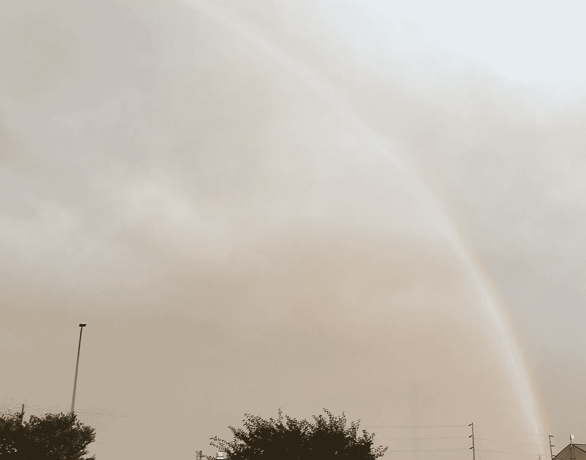
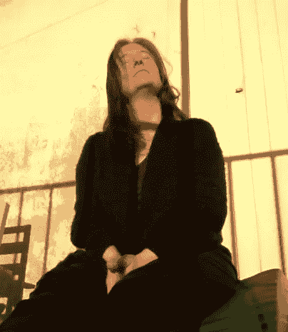
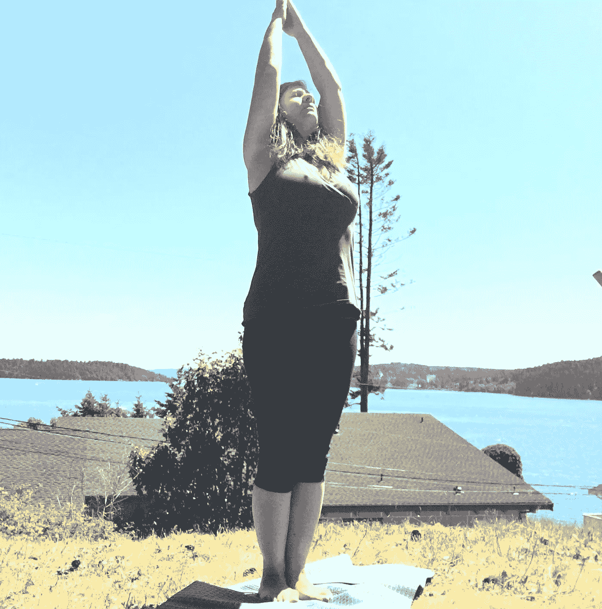

# 问与答:我在华盛顿州的 10 天静心…

> 原文：<https://medium.datadriveninvestor.com/jennifer-karchmer-was-a-student-in-a-ten-day-silent-meditation-retreat-in-washington-state-f1af95577f27?source=collection_archive---------2----------------------->

After the rainstorm in Olympia, Washington, October 2019\. Source: Jennifer Karchmer.

2011 年 3 月，詹妮弗·卡奇默是一名学生，她在位于华盛顿州 Onalaska 的西北内观中心**参加了一个为期十天的静心静修。以下是詹妮弗的个人经历，2012 年她住在冰岛的雷克雅未克时接受采访时讲述的。**

***问:是什么让你去参加 10 天静心禅坐？***

*詹妮弗·卡克默(jk):几年前，当我的一个室友提到她有一个朋友在华盛顿州完成了这个静修，她说这个静修太棒了。我很惊讶你能在美国这么做。我以为你必须去印度或尼泊尔做类似的事情。经过一番研究，我报了名，几个月内就去了。*

***问:你如何描述这次撤退？***

*在这十天中，有一个养生法，一个非常具体的日常惯例。你不能偏离主题说，“我现在想去购物”，或者检查电子邮件。首先，你完全脱离了技术，没有互联网，手机，短信，电子邮件，电话，甚至写作或阅读材料是被禁止的。我说“禁止”,但当你了解这个项目时，你会意识到你正在尽可能地将自己置于一种纯净的状态，减少任何会让你偏离你为什么在那里的分心——那就是冥想。*

> *“…我所能看到的就是自由——远离我们现代生活中所有的干扰。”*

*基本上，在这十天里，你所从事的活动只有吃饭、睡觉，当然还有冥想，单独地或集体地，饭后在草地上散步，偶尔在休息时间手洗衣物。除此之外，不要运动、瑜伽、慢跑、阅读、日光浴、性爱、酒精，甚至咖啡因。男人和女人有分开的睡觉和吃饭的地方和进入冥想大厅的入口。我甚至有 10 天没有拿起一支笔，这对于一个作家来说是非常不和谐的。*

* [## 良好的生活是习惯的形成|数据驱动的投资者

### 过度思考是过度紧张。仅仅几个简单的习惯就会在一天中产生巨大的影响。那是…

www.datadriveninvestor.com](https://www.datadriveninvestor.com/2020/01/17/a-good-life-is-habit-forming/) 

在我离开之前，我向一个朋友描述了这次撤退。他说，“听起来像监狱。”我吃了一惊，因为我所能看到的是自由——远离我们在现代生活中所消耗的所有分心事物的自由。我们从未关闭。即使你去上一个小时的瑜伽课，你真的不在状态吗？

**问:在这十天里，你按照时间表做得怎么样？**

我非常密切地跟随它，几乎是完美的，除了我不得不说，在第一天我确实在一个冥想时间小睡了一会儿，感觉太好了！每天凌晨 4 点，有人走来走去敲响钟声，非常细微，但声音足够大，以至于醒来都觉得很美。那时，天一片漆黑，有时还下着雨，很冷。我其实很期待起床，刷牙，穿上几层衣服——一件羊毛衫，一条长披肩，盖着一条毯子。当我在冥想大厅的空间安顿下来时，感觉就像一个茧。

问:你有没有过这样的感觉，“让我离开这里！这不是给我的"？

不，当我知道这件事的时候，我非常赞同。我知道这很困难，但这就是吸引我的原因，挑战。事实上，第二天是我的生日，这对我来说是一个非常令人兴奋和社交的日子，但当我报名时，我意识到我必须放弃生日蛋糕和欢呼声。通常我会和朋友出去玩，庆祝节日(圣帕特里克节)。为了庆祝这一天，我穿了绿色的袜子，围了一条绿色的长围巾，尽管如此，我还是感到非常开心。它结束了，就像其他任何一天，没有大张旗鼓，这很好。我还是大了一岁。* 

***问:高贵的沉默是如何工作的？你真的十天不能说话？***

*你发誓你将遵循高贵的沉默，不与他人交谈或交流。我会独自行动，专注于自己。这不是为了惩罚。而是专注于你的冥想。你不是去社交或者认识人的。也许之后你可能会与志同道合的人建立网络或闲逛，但即使在计划开始之前，我们也有几个小时的时间来安顿下来，吃晚饭和问问题，我感到平静的焦虑席卷了我，就像，嘿，让我们继续吧。在大多数情况下，我是一个非常健谈和外向的人，并把这看作是一个关闭所有这些的机会，并与我自己的另一部分，我的灵魂协调一致。我想知道，我说这么多，问这么多问题是因为我害怕沉默吗？为什么我总是试图填满空间？我觉得这是我的责任还是什么？*

*如果你有关于冥想的问题、疑问或需要澄清，你可以报名参加助教的 5 分钟面试。我利用了那三次，所以从技术上来说，我不是“沉默”，而是跟随高贵的沉默到“t”*

*我发现让它自由的，是白天发生的所有不必要的、在我们之外的闲聊。例如，如果是在营地或会议上，比如说，我会和我的室友有更多的互动，“你觉得昨晚的演讲怎么样？在餐厅给我留个座位。想一起去什么什么的吗…？等等等等。所有这些都被放弃了。你不在乎别人在做什么，穿什么，感觉如何。*

> *“冥想背后的想法是坐着，确切地说是坐着，不管你在想什么。”*

*当然，我保持了个人卫生，比如洗澡和刷牙，但是你知道我们在日常生活中花了多少时间在镜子前。这话出自一个不化妆也不像 80 年代那样把头发弄大的人之口。这听起来很自私，但这只是看待它的一种方式。真的是关于自省。你被要求表现得好像你是孤独的。当然，还有实际问题。如果你在草地上散步，而另一个人正朝你走来，你会避开她的路。你仍然带着同情心行动，但这是为了你自己，反过来，这使你成为你能成为的最好的人，这样你就能在那里帮助别人。*

*有一次，当我们在大厅里聚在一起共修时，我意外地碰到了另一位女士。甚至没有看着对方，我们都本能地抓住对方的手来平衡自己，然后继续前进。另一个信条是没有身体接触。有一瞬间，我就像‘啊哦’我们碰到了对方，但这是物理现象，因为两个物体相撞，这只是自然的一部分。*

**

*Meditation in Marseille, France, 2015\. Source: Jennifer Karchmer*

*问:最困难的部分是什么？*

*实际上，它在地板上静止了两个小时。因为膝盖受伤，我要求一把椅子，但几次挑战自己以经典的冥想姿势坐在地板上，背部挺直，膝盖交叉。我在一些博客和网上对话中读到了对静修的批评，说你被要求“折磨”自己，这是胡说八道。这只是那些不理解或不在正确位置的人，他们无法真正从该计划中获得最大收益。我想说他们只是孩子，但我无权批评别人。冥想背后的想法是坐着，确切地说是坐着，不管你在想什么，可能是背痛、鼻子发痒或情绪痛苦。当然，你可以做一些小的改变。例如，有几次我对自己说，让我们坐在地板上，看看情况如何。*

*有几次，我挪到了椅子上。但是我发现我在椅子上更容易打瞌睡，因为我太舒服了，并不是真的在冥想。30 分钟后，当我坐在地板上，膝盖尖叫时，我带着那种疼痛坐着，观察它。嗯，这是怎么回事，我能忍吗，管他呢，别分析了，陪着坐就好。我鼻子上的小痒也是一样，我学会了不对每一件小事做出反应，而不是立即去挠它。*

*我们生活在对他人和外界发生的事情的反应中，因为我们想要控制。当然，这是我对自己经历的所有观察，绝不是节目告诉你的想法。*

***问:你遇到过什么问题吗？***

*当然了。我认为这就是静修的意义所在，让我们通常不会处理的事情浮出水面，因为现代生活让我们忙得不可开交。我注意到我有两个主题:一个是与工作相关的。就在静修前几天，我和一个客户发生了负面的互动。我想我已经尽可能地处理好了这种情况，但它让我感到不安。他似乎不满意，这种互动让我经受了一次考验。在我冥想期间，我几乎每天都感觉到它的出现。我质疑自己的反应，觉得自己本可以更有同情心，更好地倾听这个人。然后我意识到我在为这种情况自责，这已经是过去的事了。戈恩卡谈到要对自己“温柔”，所以我努力让自己摆脱困境。*

*对我来说，另一个主题是几个月前发生的一段罗曼史。它突然结束了，虽然我知道我需要继续前进，但我内心渴望见到这个人，再次交谈。我们有许多美好的回忆，我的心仍然相连。我只是似乎不能接受，既然我们身体上分开了，我的心怎么还在那里？我在脑海中播放着那些美好时光的磁带，试图重温，甚至重写，结局。通过冥想，我开始接受已经发生的事情，只是观察它，而不是为自己的行为辩护或解构他的言语或行为。他为什么这样做，却又那样说？爱情中有太多不合逻辑的东西，但我花了太多时间试图去理解它。在冥想中，首先我意识到自己的生理反应，比如心跳加速，喉咙哽咽，感觉到他时心里七上八下。这些都是真实的反应。我没有安抚或关闭它们，而是努力接受并最终平静我的身体和思想。我肯定不是这方面的专家。这是一项正在进行的工作，但至少现在我已经在这条路上了。*

*问:你最喜欢静修的哪一点？*

*每天晚上 7 点，都有演讲。这很有趣，因为你在森林里，没有技术，没有手机，坐在这个美丽的冥想大厅里，然后你看到两台大电视，不是“大屏幕”，但足够大，足以让一个满是 100 人的大厅都能看到和听到，你还可以在 DVD 上录制 S. N. Goenka。这是最基本的视频——肯定有人在与现场观众交谈时架起了三脚架，并按下了“录制”。我不确定是在哪里录制的，但上面写着“1991 年。在几个点上，镜头拉远，你看到他的妻子坐在他旁边，有一些咳嗽，磁带上有很多笑声。事实上，我不确定笑是否不礼貌，但他讲这些故事很有趣。其中许多是寓言和对生活的隐喻。你知道，那个男孩去河边为家人打水，他很粗心，当他回来时，他学到了关于生活的一些重要的东西。我发现这些演讲令人大开眼界，因为它们很有趣，而且信息量也很大。戈恩卡解释的冥想技巧中有很多科学，这让我感觉扎根了。我对你盲目追随的宗教不太舒服，所以他的演讲帮助我明白了整个项目都是关于选择的。作为一名持怀疑态度的记者，我对将要听到和接触到的东西感到不满。我在想，你不能让我去喝 Kool-Aid，但是在了解了更多之后，我愿意并且很兴奋去深入。*

*我也喜欢沉浸在大自然的声音中，包括寂静。每天早上都有奶牛哞哞叫和公鸡喔喔叫！我在几个城市生活过(纽约、巴黎、雷克雅未克),发现自己对交通越来越过敏——噪音和车辆的移动。我有一辆车，大部分时间都在步行或骑自行车，并且已经越来越远离汽车作为一种生活方式。当然，和朋友一起自驾游很有趣，但是我在金属盒子里变得越来越幽闭恐惧症。举行静修的中心是一个可爱的地方，有一片草地，从你的房间走到冥想大厅或餐厅用餐需要 90 秒，所以一切都在那里。我想你可以称之为复合，但这个词可能有负面含义。*

***问:有什么事情让你不舒服吗？或者你感觉有多舒服？***

*第一点让我印象深刻的是它是免费的。是的，人们不能相信你将被安置和喂养十天而不用付钱。我认识到能够休假十天是一种奢侈，但是我在我的职业中创造了一个灵活的时间表和生活方式，并利用了这一点。它完全依靠已经参加过静修的人的捐赠来运作。因为[他们只接受那些被称为“老学生”的参与者的钱](http://www.pali.dhamma.org/donation)，而且它发展得很快，向我展示了这个项目的力量。我就是活生生的例子。当我回家时，我捐了一笔现金，数额不大，但我觉得，嘿，有人捐了钱，所以我有机会参与。我想现在就作为一名志愿者回馈社会，这样其他人也可以这样做。*

***问:是宗教吗？***

*戈恩卡在他的演讲中特别提到了这一点，佛教不是宗教。至少我们在静修所做的不是宗教。这不是一个盲目信仰的事情。事实上，内观冥想是一种技巧。与一些人相信的相反，你没有控制你的呼吸或专注于佛，或说“嗯”你只是在那里观察。接受你所拥有的。你没有评判、评估、批评，甚至没有让自己为此感到高兴。如果你感到快乐，那么你观察到自己在那一刻感到快乐。如果你因为任何原因感觉像狗屎，那么你观察它。最初几天是关于适应，你在大厅里有将近 100 个人，咳嗽，打喷嚏，移动，起床，去洗手间，出去呼吸空气，擤鼻涕，除了说话之外的一切。这个过程的一部分也是处理那些分心的事情——观察到我生气了，因为我后面的女人每五秒钟就清一次嗓子。这是生活的一部分，观察那里发生的事情并接受它。你不能控制你周围的一切或所有人。*

*戈恩卡探索渴望和厌恶。这是我们每天都会经历的两种基本情绪，它们表明这不仅仅是为了让生活感觉良好，而是为了找到一种平衡。当然，我们都想快乐，但是即使我们中了彩票，我们为钱而高兴，或者我们遇到了某个很酷的人成为我们的男朋友，当我们渴望这些东西时，它们也会变得不正常。相反，当我们对那些我们不喜欢的东西感到仇恨、嫉妒或厌恶时，我们真的会杀死自己。再次，平衡。*

*在科学和身体方面，我真正喜欢的是例行公事，我所做的一切就是冥想，让我的身心平静下来。那十天我瘦了五斤。我只吃给我的东西，不多吃，因为我知道从身体上来说，我不会像在家里那样耗费精力。我没有锻炼身体，一天大部分时间都坐着。此外，这些食物教会我对食物更加感恩，在我的家庭生活中，每天我都要为三个人吃饭。我可以做得更少，但在我们的日常生活中，我们周围的便利店，每个角落的星巴克，它们都在提醒我:“哦，是的，我需要一杯咖啡，我可以吃一块糖，”等等。甚至可能是我们渴望的健康食品，去营养商店或食品合作社买东西。但它们只是提醒我们被洗脑要做的事情，而不是相信我们的身体会告诉我们什么时候饿了。打破常规，打破模式，忽视和反对这些信息是一个巨大的挑战。这就是为什么节食是假的。我认为，它们永远不会对我们现代人起作用，因为我们不断被告诉我们要吃和消费的信息轰炸。*

**

*Yoga in Anacortes, Washington, 2017\. Source: Jennifer Karchmer.*

*在静修中，有固定的用餐时间，志愿者服务员正在准备食物，人们慷慨解囊，所以有食物。在吃了一碗有新鲜蔬菜、豆腐和沙拉的米饭后，我该说些什么呢？有饼干吗？给我更多？从实际的角度来看，静修也是很通融的。在你到达之前，你已经填写了一份内容广泛的申请表，询问你对这个概念的熟悉程度，以确保你已经接受了这个概念。此外，如果你有食物过敏，药物，低血糖，你需要一个中午小吃，或特殊的食物要求，他们将完全适应这一点。在特殊情况下或紧急情况下，人们可以打电话，或在某些情况下提前离开，但这些都是不鼓励保留真正的节目。如果有人提前离开或打电话，会对其他参与者造成很大的干扰，所以这一点非常重要。*

*我有机会在一个项目中服务，这让我大开眼界。不幸的是，我自己有一个医疗问题，不是紧急情况，而是我认为足够重要的事情，可以在家里处理。我只服役了三天就离开了，但我已经了解了自己一生。*

*问:你能多谈谈那个詹妮弗吗？*

*在做了十天之后，我知道我想以某种方式回报。我捐了一小笔钱，但我真的知道志愿服务的重要性，以及如何通过参与幕后活动从这个项目中获得如此多的收益。志愿者管理厨房，准备饭菜。这对我来说有点令人生畏，因为我在厨房里笨手笨脚的。我主动提出打扫浴室。我真正想做的是成为敲响凌晨 4 点钟声的人。记得我说过那有多可爱吗？然而，我意识到对一个志愿者角色吹毛求疵对我来说是不成熟的，我真的只是想尽我所能去帮助。*

> *“坐下来观察听起来很容易，但这是人类有史以来最难的工作。”*

*2011 年 12 月，我去了俄勒冈州的一个静修处，我是最后到达那里的女性志愿者之一。他们都设置在厨房，但需要有人担任女经理。我想起了我第一次静修时的女经理。她似乎经常带着一个小笔记本到处走，这似乎正合我的胃口。我同意，然后了解到这是一个 24/7 的角色，因为你基本上是学生/参与者和助教之间的联络人。学生们想到的任何事情，比如“我需要一块肥皂，有多余的毯子吗，你有耳塞来淹没我打鼾的室友吗，我怎么知道我是否正确地冥想，我需要一把特殊的椅子。”对于所有这些问题，女学生来找你。我的职责并不总是寻找解决方案，而是将它们提交给 AT。一些简单的东西，如洗发水，或创可贴，我可以得到，但任何关于技术或情感的东西，都需要去 AT。你基本上是随叫随到的，所以学生们一天中的任何时候都会来找你。*

*对一些学生来说，这成了与人交谈的借口。我们会窃窃私语，如果学生有复杂的情况，我会请他们到旁边或另一个房间，这样我们就不会因为我们的谈话而分散别人的注意力。我在那里的三天中，有两天凌晨 4 点被响亮的敲门声吵醒*

*我跳下床，擦去眼中的睡意。当我打开门时，一个心烦意乱的女人出现了。*

*我说:“是啊，怎么回事？我能帮什么忙？”*

*“我必须回家，”她恳求道。“这不是给我的。我只需要车钥匙。我丈夫也在这个项目中。他可以留下，但我需要离开这里。”*

*“好吧。我会穿好衣服和 AT 商量。其他都还好吧？”*

*“是的。我只需要离开这里。”*

*我为这位学生安排了一次会议，在一个小时后，这位女士离开了。她为什么要离开不关我的事。学生总是在 at 上提出这个问题，所以基本上你是一个促进者。*

*在下午时段，学生可以要求与 AT 进行五分钟的面试。因为外面很冷，当学生们问她问题时，我坐在大厅里，所以我参与了那些对话。我坐在大厅的后面，所以我不可能听不见。出于保密的考虑，我不会透露细节或身份，但在一个例子中，一位女士解释了她是如何在脑海中听到音乐的，她无法让音乐停止或关掉它。AT 解释说你的职责不是关掉它，而是观察它。像其他一切一样，就让它存在吧。坐下来观察听起来很容易，但作为一个人，这是最难的工作。*

*问:在冥想期间，你有没有“啊哈”的时刻？*

*在一个晚上的共修中，每个人都在大厅里，包括所有的男人、女人和所有的志愿者、厨房工作人员，大厅里的每个人都在共修。这是第 6 天或第 7 天，当我们都在使用这种技术时，人们已经找到了他们的舒适点，他们不是每五分钟就起床，咳嗽和运动被最小化，大厅非常安静，你可以听到一根针掉在地上。这种集体的理解和行为，就像这个房间里的每一个人一样，都致力于同一件事情，至少在目前，这是非常美好和神奇的。这让我觉得和平是可能的。如果每个人都以自己的方式，每天花几分钟时间进行冥想，这种能量在全世界都是强大的。我喜欢冥想的那一部分——科学和它的能量部分。我感觉到了，那些你无法带走的东西。*

***问:打破高贵的沉默是什么感觉？回到现实生活中来？开车离开静修处？***

*在倒数第二天结束高贵的沉默对我来说是非常情绪化的。这是一个巨大的成就。我真的不敢相信我做到了。那天早上我们吃了早餐，在共修之后，高贵的寂静被解除了，这意味着一旦你离开了共修大厅，就可以说话了。你被要求尊重大厅内外的安静。我记得听到一些妇女欢呼和大笑，觉得这有点不尊重，因为她们在大厅里太吵了。我不知道为什么我会对别人有那种感觉。走出大厅的时候，我哭了。在这里，我被允许开始说话，但我没有说一个字，想一个人呆着。午餐时间快到了，我饿了，看到他们为我们准备了一顿丰盛的午餐，有各种新鲜沙拉、鹰嘴豆泥、塔布里酱、水果和糖果，都是为这一天特别准备的。有人在餐厅大厅拥抱了我，我的反应是，不许碰我！那里太吵了，人们在说话，头晕目眩，我只想一个人坐着吃饭。我只能用不知所措来形容我的感受。我坐在角落里，眼泪顺着我的脸流到我的食物里。午饭后，我在草地上抽泣。我去散步，然后睡了一个长时间的午觉。到了吃晚饭的时候，我又回到了我认识的那个自己，并且很兴奋地和别人交谈、分享故事和认识别人。我想我只是需要那种释放，感觉很好。我知道这听起来很悲伤，但这就是发生在我身上的事，我已经接受了。我不需要去解构或者解释或者觉得不对，因为这是和别人不一样的反应。同样，我也没有资格评判别人是如何打破沉默的，比如他们是如何欢呼或社交的。*

*第二天离开有点超现实，有点像《暮光之城》或者电影《绿野仙踪》从黑白变成彩色。在下来的路上，我和两个女人共乘一辆车，所以我们有很多对话、故事和笑声。在回来的路上，他们都找到了其他直接去他们镇上的车，所以我独自骑着车，享受着孤独。我真的不想和其他人一起讨论这个项目，“你喜欢吗？你觉得这个或那个怎么样？”我真的只是想反思一下我自己的经历，但这才是真正的意义所在。开车回家大约要五个小时，所以我有很多时间独自开车。即使只是离开这个偏僻的小镇，上高速公路，也是很奇怪的。就像，哦耶，生活还在继续。拐角处有一个加油站，那边有一家餐馆，警察会让超速行驶的人靠边停车。这一切都没有停止，即使你已经连续十天专注于冥想而不说话。*

*问:你是如何保持冥想并将其融入日常生活的？*

*这是最困难的部分。当我第一次回来时，我每天都做冥想，持续了大约一个月。在这个项目中，你在上午和下午冥想一个小时。我从来不认为我能支持那么多时间，但我觉得我可以在早上至少花一个小时。我开始跑了，在某个时候，然后完全脱落的马车。我把这种经历本身作为一种学习工具。我对自己不太挑剔，并且相信我会有机地重新投入其中。在更实际的层面上，我注意到的是我的日常体验:活在当下，呼吸，注意我的肩膀何时耸起和绷紧。我经常(比如一天几次)提醒自己回到当下。在我的职业中，我带着一些焦虑，赶着最后期限，在脑子里计划事情，我要写什么，然后意识到那都是未来的事情。其实并不存在。所以在短短的一瞬间，我可以让自己慢慢地回到现在，然后说，“我还好吗？现在，此时此刻？我需要什么？哦，我需要的都有了。那好吧。”*

*问:你会再做一次静修吗？*

*是的。事实上，在提前离开我作为志愿者的一个项目后，我想再回来做一名学生。当你服务时，这是一种不同的体验，非常令人满意的是，你在帮助别人，你与你的同情心合拍。但是我意识到我还不成熟，或者说我还处于冥想的初级阶段，需要建立更多的基础，所以我想回到一个完整的项目中。报名参加一个项目有点可怕，因为你需要提前很长时间，比如几个月，因为你会看到它在网上被填满，然后有一个等待名单。这对我来说有点可怕，因为我不想错过任何事情，所以我不擅长制定计划。我不担心我能不能做到，但更担心的是，我能不能走出现代生活一段时间，然后回来时变了一个人。*

**~采访结束~**

**本文原载于此:*[https://blogger lite . WordPress . com/q-a/10-days-of-silent-mostation/](https://bloggerlite.wordpress.com/q-a/10-days-of-silent-meditation/)*

*前参与者的博客:*

*[http://www . nikki yoga . com/10-days-of-silence-is-a-Vipassana-boot-camp-for-you/](http://www.nikkiyoga.com/10-days-of-silence-is-a-vipassana-boot-camp-for-you/)*

*网站了解更多信息:*

* [## 总说明

### 西北内观中心，也被称为 Dhamma kuja，位于华盛顿西部的乡村，占地 50 英亩…

www.kunja.dhamma.org](http://www.kunja.dhamma.org/GeneralInformation.html)*