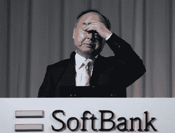
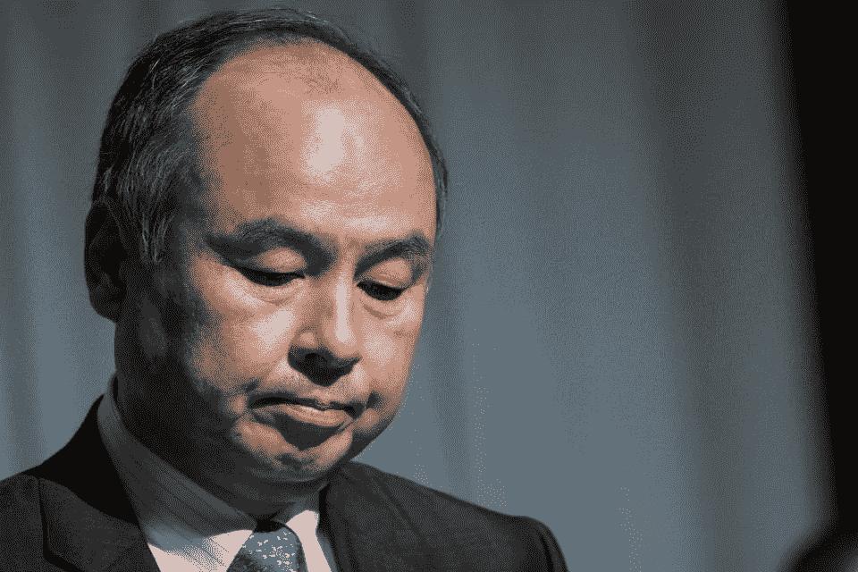
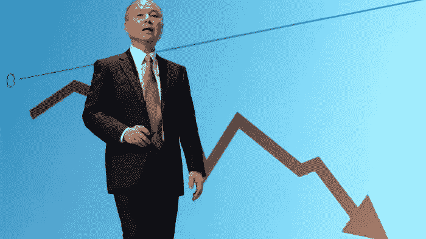

# 软银的孙正义告诉投资者，耶稣基督也被误解了

> 原文：<https://medium.datadriveninvestor.com/jesus-christ-was-also-misunderstood-softbanks-masayoshi-son-tells-investors-c1302e4feadc?source=collection_archive---------5----------------------->

## 软银创始人将自己比作上帝之子，为 130 亿美元的年度亏损辩护

安东尼·布隆伯格

> 在软银巨亏、阿里巴巴马云从软银董事会辞职之后，CEO 孙正义是否已经失去了点金术？

## 日本软银集团报告了 130 亿美元的损失，主要来自其在优步、WeWork 和 Oyo 的投资，并因冠状病毒而加剧

## 随着更多董事会成员的离开，包括阿里巴巴创始人马云和他的儿子似乎把自己比作耶稣，谁能控制他的冒险冲动？

在最近的一次投资者电话会议上，孙正义(Masayoshi Son)在为自己的投资策略辩护时，将自己比作耶稣基督，此前他透露，软银周一出现了创纪录的 130 亿美元年度亏损。

据参加电话会议的人说，在周一的电话会议上，分析师向孙正义强调了该公司迄今为止的糟糕表现，孙正义指出，耶稣也遭到了误解和批评。孙正义显然用这个类比暗示，如果他的投资运气好转，他的声誉将会被重新评估。

孙正义过去曾引用《星球大战》电影中的尤达，并敦促投资者“倾听原力”，他还暗示甲壳虫乐队刚成立时并不流行。

他在被问及是否觉得自己被媒体误解，公众对软银的看法与他的愿景是否有差距后发言？

投资者电话会议涉及 1000 亿美元愿景基金的未来问题，该基金的价值已缩水 180 亿美元，原因是其数笔大额投资受到冠状病毒危机的打击，其中包括租车公司优步和滴滴以及酒店公司 Oyo。

孙正义将这场危机与大萧条相提并论，称道琼斯用了 25 年时间才恢复，他预计疫情也会产生“类似的影响”。“我认为这是我们正在经历的前所未有的危机，”他在财报电话会议上表示。

 [## 使用谷歌搜索趋势预测首次申请失业救济人数|数据驱动的投资者

### 几年来，我的重点一直是使用多种替代数据来预测宏观经济统计数据…

www.datadriveninvestor.com](https://www.datadriveninvestor.com/2020/03/25/using-google-search-trends-to-predict-initial-jobless-claims/) 

他补充称，由于第一只愿景基金的表现“不太好”，软银将继续用自己的资金成立第二只愿景基金。“我们决定暂时不为合作伙伴进行愿景基金 2 的营销。如果业绩不是很好，那么，当然，愿景基金 2 的钱是不能向其他人要的。”

软银周一还警告称，自 1994 年上市以来，该公司可能首次不支付下一财年的股息，并补充称，中国互联网公司阿里巴巴(Alibaba)创始人马云(Jack Ma)将在担任董事 13 年后卸任。

*SoftBank’s CEO Masayoshi Son*

近几十年来，日本很少有软银首席执行官孙正义这样规模的创业成功故事，而且自从索尼和卡西欧这样的公司——这两家公司都是在日本二战战败后立即成立的——以来，也没有许多新的日本公司开始开拓真正的全球业务。但随着他最近一些最大的投资出现数十亿美元的亏损，以及越来越多的人离开他的董事会，有人猜测这个日益孤立的儿子是否已经失去了他备受称赞的点石成金的能力？

周一，孙正义宣布软银集团今年前三个月亏损 127 亿美元。赤字主要源于软银 1，000 亿美元愿景基金的 180 亿美元损失，这是由于对优步、WeWork 和 Oyo 等公司的投资失误造成的，而疫情冠状病毒加剧了这一损失。

同一天，阿里巴巴联合创始人、儿子的长期密友马云表示，他将离开软银董事会。周二，孙正义在推特上说:“失败的原因不在外面，而在我。不承认这一点，就无法前进。”

62 岁的孙正义曾经东山再起，最著名的一次是在世纪之交网络泡沫破裂后，他损失了 700 亿美元——据报道这是历史上最大的个人财务损失。正是在那个泡沫时期，他向阿里巴巴投资了 2000 万美元，在阿里巴巴 2014 年 IPO 后，这些股份的价值超过了 700 亿美元。然而，他最近的损失不是自己的钱，而是软银及其愿景基金的全球投资者的钱。

《儿子的起源故事》中充满了描述这个男人及其事业的决心、无畏和远见的片段。他是九州一个贫穷的韩国移民的孩子，他谈到了自己面临的歧视和被扔石头的经历。从那以后，他成为了世界上最杰出的商人之一。

在他的家人为了同化而采用了一个日本名字后，他没有逃避偏见，而是把自己的姓改回了韩国原来的名字。16 岁时，孙正义在麦当劳日本公司总裁的办公室外安营扎寨，直到他被允许参加一次会议，在会上他询问关于成功的建议。在被告知应该学习商业和英语后，儿子去了美国的高中和大学，在那里开始了他的第一次创业。

1981 年，孙正义在东京创立了软银，最初他的业务是围绕软件转售展开的，尽管他一直在寻找新的投资机会。在互联网泡沫破裂期间，孙正义将目光投向了当时基本封闭的日本电信行业。2001 年，他臭名昭著地冲进通信部，威胁称，如果官僚们不给他发放许可证，他就自焚。他后来说服史蒂夫·乔布斯(Steve Jobs)给他 iPhone 的日本独家版权，尽管苹果公司尚未公布该产品，他也没有自己的移动运营商。这种情况在 2006 年发生了变化，当时软银收购了沃达丰苦苦挣扎的日本移动业务。他在三天内为沃达丰的交易筹集了 150 亿美元，并在 iPhone 的帮助下，在六个月到一年的时间里扭转了公司的局面；很少有人能单独或多或少做到这一点。

日本手机业务的成功是孙正义全球雄心的跳板，即使在其他部门陷入困境之际，它仍是一个利润来源。但是儿子在国内的成功并没有在国外重演。他进入的游戏是由硅谷生态系统主导的，它吸引了来自世界各地的一些最聪明的人。他现在在一个非常具有挑战性的比赛场上与一支完全不同的球队比赛。

*SoftBank’s CEO Masayoshi Son*

孙正义迄今为止最大的失误是投资了 185 亿美元给 WeWork，这是一家商业模式非常有问题的办公空间提供商，其估值在不到一年的时间里从 470 亿美元跌至 29 亿美元。前 WeWork 首席执行官亚当·纽曼(Adam Neumann)现在正在起诉软银。在周一的财报电话会议上，孙正义称这笔投资是“愚蠢的”，软银宣布将削减资产以筹集现金，包括出售约 115 亿美元的阿里巴巴股票。软银目前拥有不到 1170 亿美元的阿里巴巴股份，这将使其在中国电子商务巨头中的股份减少到 1050 亿美元。“WeWork 的决定是在与首席执行官一起乘坐出租车后做出的。

柳井正去年 12 月离开软银董事会(优衣库背后的人，也是当代唯一一个建立了全球认可的日本品牌的商人)——之后，有人质疑谁能抑制孙正义的冒险冲动。毫无疑问，在经历了这些巨额亏损后，孙正义将不得不重新思考软银的整个战略，但行业领袖们有一个压倒性的共识，他们认为像孙正义这样的人不会改变他们是谁，为什么他应该是例外？

本文是软银及其在金融和创业行业的全球崩溃系列文章之一。点击此处查看更多信息:

[**> >软银的远景基金四面楚歌**](https://www.anthonyblumberg.com/blog/softbanks-vision-fund-under-siege)

[**> >亚马逊如何计划在印度拿下 Swiggy 和 Zomato**](https://www.anthonyblumberg.com/blog/how-amazon-plans-to-take-on-swiggy-and-zomato-in-india)

[**> >这些创业公司融资数十亿然后裁员数千**](https://www.anthonyblumberg.com/blog/these-startups-raised-billions-and-then-laid-off-thousands)

更多金融新闻报道，请查看我的博客:[https://www.anthonyblumberg.com/](https://www.anthonyblumberg.com/)