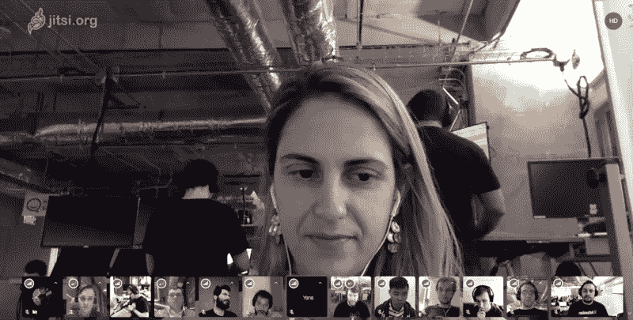
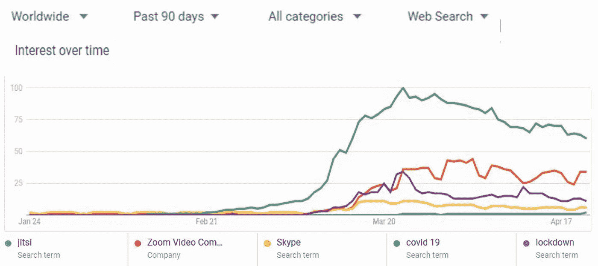
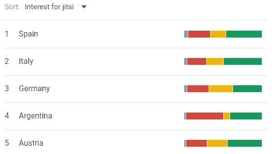
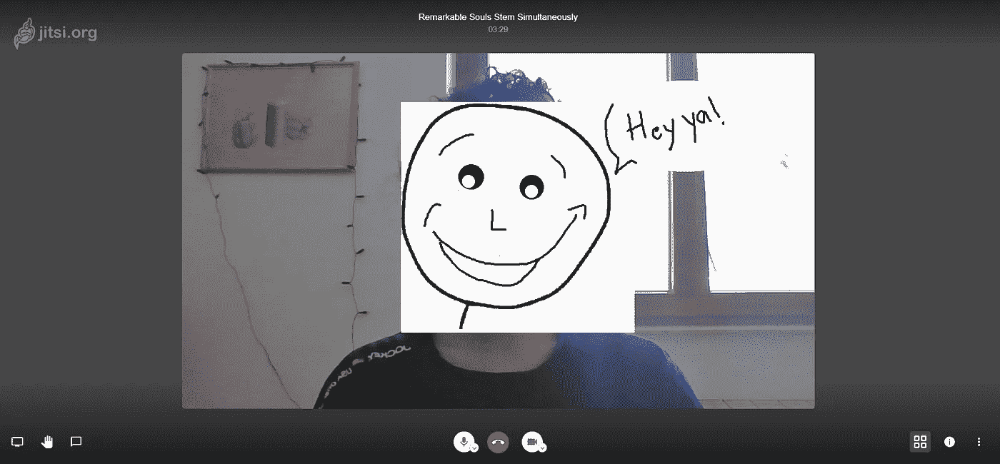
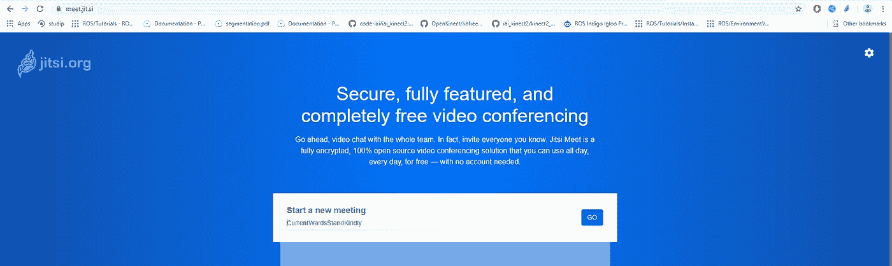
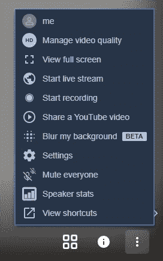
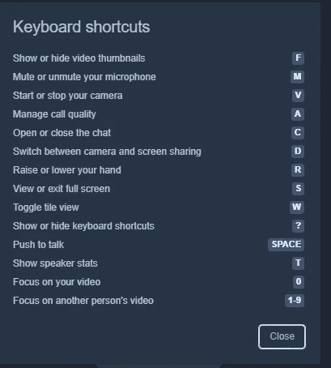
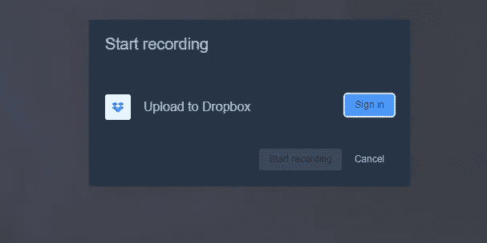
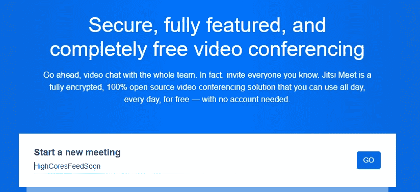
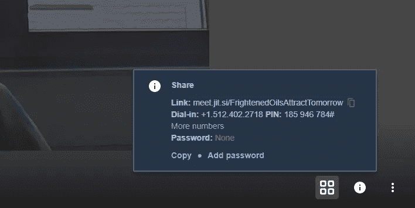

# jitsi Meet——匿名、免费和开源的变焦视频会议替代方案

> 原文：<https://medium.datadriveninvestor.com/jitsi-meet-the-anonymus-free-and-open-source-alternative-to-zoom-conferencing-3e112ce6a9d5?source=collection_archive---------2----------------------->

## 全球视频通信软件趋势

Source: Wiki commons

## 根据谷歌的说法，这就是世界正在做的事情

在过去的 3 周内，谁没有在 Zoom 上进行过视频通话，除非他们一直生活在岩石下。过去几周，Skype 和 Zoom 是我每天听到最多的关键词，仅次于“新冠肺炎”和“锁定”。

快速浏览一下谷歌趋势告诉我，我并不孤单。在 google Trends 上的以下搜索词中，看看过去 90 天人们对 Google 的兴趣:

Search Interest on Covid-19 vs Video Communication Software. Source: Google Trends

视频通信搜索和新冠肺炎搜索词之间的相关性是不可思议的！不难猜到原因。现在，看看相同搜索词的地区细分。

The length of the bar indicates the percentage of searches for each search element. Source: Google Trends

对通讯软件的搜索与对疫情本身的搜索相比毫不逊色。事实证明，欧洲人(和阿根廷人)比人们想象的更加社会化！(还是努力工作？或者，精通技术。)

Source: Jitsi.org

上图中相对较小但发展迅速的蓝点是 Jitsi-Meet，这是我喜欢使用的 Zoom 的完全免费的开源替代品。如果你正在寻找一个无限的，高质量的替代视频通信形式，Jitsi 是正确的选择。

## 我尝试了 Jitsi 会议，这里是它是如何去

Source: [Freepik.com](https://www.freepik.com/premium-photo/word-with-dice-white-background-open-source_4533479.htm#page=1&query=open%20source&position=1)

阅读这篇文章的大多数人都已经打过电话，并且熟悉自由会议的 40 分钟限制。Jitsi Meet 是一个完全免费的开源解决方案，每天都有新的功能加入。(我们可能很快就会看到一个具有端到端加密功能的 zoom 等价物！).事情是这样的:

## 基础知识

Source: Jitsi.org, My Jitsi call, I haven’t added callers here yet.

首先，我喜欢视频质量。如果你碰巧发现自己在一个缺乏高网速的地方，Jitsi 可以选择降低视频质量来满足你的需求。体贴的触摸。屏幕共享、音频和视频选项、切换菜单等选项都很方便。

## **不注册，不下载。**

我不需要注册！多棒啊！没有必要注册，安装或经历任何其他过程，你不舒服给你的电子邮件或设置另一个密码。对我来说，这是最好的部分。打开你的浏览器，输入 jitsi.org，然后一头扎进去。

source: Jitsi.org

## 正在登录

您可以使用自己选择的唯一句柄加入 Jitsi 上的会议。 ***我强烈建议你把这个手柄做的尽可能的独特，并且在开头设置一个密码*** 以免“入侵者”发现。没有密码保护的普通会议名称(如“hello ”)可能会欢迎一些您没有预料到的成员。默认情况下，这是在 Zoom 开始时完成的，但是 Jitsi 允许您选择会议名称和密码。

## 用户界面和选项面板

Jitsi 的用户界面类似于 zoom 的用户界面。它提供了更广泛的选择，让你的生活更轻松。

The Jitsi Options Palette. Source: [https://meet.jit.si/](https://meet.jit.si/)

它还提供了一些很酷的功能，如**实时流媒体**您的群组呼叫到您的 youtube 频道，与您的*合作者共享 youtube 视频*，在会议结束时查看发言者统计以了解您的发言量，以及一系列内置的键盘快捷键，这样您就不必每次想静音或取消静音时都要摸索鼠标。

Easy-access shortcuts on Jitsi

Speaker stats are a fun way to see how it went.

## **参会人数、录像及会议统计**

Jitsi 为多达 75 个用户提供良好的会议体验。对于更多的观众，Jitsi 建议使用 YouTube 上的直播选项，这反过来又支持数百万次。在我看来，这是视频通话服务的一个很酷的选择。虽然这不是一个最佳的“会议”，但我无法想象有大约 300 名听众的情况，其中每个人都需要临时发言。

 [## 软件开发过程:如何选择正确的过程？数据驱动的投资者

### 软件是任何企业组织成功的生命线。没有软件的帮助，一个…

www.datadriveninvestor.com](https://www.datadriveninvestor.com/2020/01/16/software-development-process-how-to-pick-the-right-process/) 

虽然 Zoom 的视频录制功能仅限于其付费会员，但 Jitsi 允许您在仍然免费的情况下录制所有会议。如果您选择，录像将被备份到您的收存箱或您电脑上的某个位置。意气相投！

Jitsi provides an option to upload your conference recording directly to Dropbox or local computer

## **隐私**

Jitsi-Meet 和 zoom 一样，还没有进行端到端加密。它的每个会议实例都是在成员进入或离开会议时创建和销毁的。在这里，我再怎么强调也不为过，在 Jitsi 上设置一个强密码和一个唯一的会议名称是多么重要。为此，Jitsi 还提供了一个随机名称生成器。这里有一个例子:

Start a new meeting with a random name generator and a strong password

If you start a meeting without adding password, it is reasonable to expect intruders in your Jitsi meeting

## **还有什么牛逼的**

使用 Jitsi，任何用户都可以使参与者静音/取消静音。虽然这可能会被认为是一件令人讨厌的事情，但在我参加的会议中，如果没有人对着麦克风笨拙地尖叫并打断他，来电者会疯狂地移动他的嘴唇和手臂，而不知道他的麦克风已经静音。我欢迎这种改变。

## **您可以创建自己的视频会议解决方案！**

使用 Jitsi，可以在自己的服务器上创建自己的会议实例。您可以将 Jitsi 服务集成到您自己的移动应用程序和云服务中，并根据需要进行扩展。一个活跃的开源开发者社区为这些应用程序提供支持。

这里是自部署的说明和 docker 映像:

 [## jitsi/jitsi-meet

### Jitsi 会议-安全，简单和可扩展的视频会议，你可以作为一个独立的应用程序或嵌入到您的网络…

github.com](https://github.com/jitsi/jitsi-meet#installation)  [## jitsi/docker-jitsi-meet

### Jitsi 是一组开源项目，允许您轻松构建和部署安全的视频会议解决方案…

github.com](https://github.com/jitsi/docker-jitsi-meet#jitsi-meet-on-docker) 

这是我和 Jitsi 的经历。如果你试用它和/或在你的手机应用程序或网站上使用它，请在评论中告诉我。我希望这能解决你的时间限制，让你保持联系。愉快的会议！