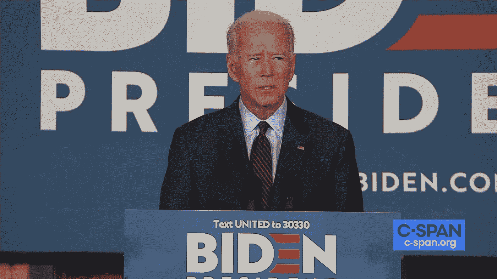

# 乔·拜登:让政府再次变得无趣

> 原文：<https://medium.datadriveninvestor.com/joe-biden-make-government-boring-again-3ce32cf593b1?source=collection_archive---------12----------------------->

> 最好的统治者对他的臣民来说只是一个影子。接下来是他们热爱和赞美的统治者；下一个是他们害怕的人；
> 下一个是他们随意对待的人。
> 没有足够的信仰，就缺乏诚信。
> 犹豫不决，他不轻易说出话来。当他的任务完成了，他的工作完成了，人们都说，“这是自然发生在我们身上的。”
> —老子，道德经，十七

也许我去年说的最愚蠢的话，当民主党总统初选开始时，是“我希望拜登不会赢；他很无聊。”

随着初选进程的推进，我几乎为所有其他候选人都花了时间。我发现卡玛拉·哈里斯极具魅力，并期待着她当选总统后的新闻发布会。我认为伊丽莎白·沃伦有一个充满令人兴奋的政策建议的聪明头脑。我认为伯尼·桑德斯将会是一位了不起的总统，他将会彻底改变现状。另一方面，拜登是一套旧衣服——一件众所周知的商品，总体上很体面，但有点傻，只不过是对现状的投票。

我是多么愚蠢的自由主义者。

今天早上——在我所在州提前投票的第一天——我自豪而高兴地投了乔·拜登一票——正是因为他很无聊。因为我想要无聊。越沉闷越好。唐纳德·特朗普(Donald Trump)四年的日常混乱和破坏让我兴奋不已。在经历了小丑车政府后，我迫不及待地想让一个乏味且可预测的人来掌舵。

 [## 为什么看起来不可能战胜特朗普？数据驱动的投资者

### 我注意到标题说拜登仍然在总统竞选中领先。在这样的标题背后，人们可以感觉到一种恐惧…

www.datadriveninvestor.com](https://www.datadriveninvestor.com/2020/10/07/why-it-seems-impossible-to-trump-trump/) 

我想再去一整周不去想政治。我想要一个能让我偶尔忘记总统是谁的人，因为他只是不停地推动政府机构运转，而不引人注意。我想去其他国家，不用回答我总统在飞机上做的令人尴尬的事情。我想登录一个新闻网站，看到讨论高速公路账单和资本收益税率的头条新闻，而不是支付给色情明星的费用。我想在我的社交媒体订阅上看到暴躁猫迷因和人们午餐的照片。我希望我的政府再次变得无趣。

越想越觉得政府本来就应该是无趣的。在一个运转良好的国家，政府做的大多数事情都是没有争议的家务事。他们决定在哪里修建高速公路，何时修桥。他们谈判条约并在签证上盖章。他们建造学校，帮助学生支付教育费用。不是所有的问题都是生死攸关的，也不是所有的事情都是危机。

这根本不是什么新见解。这是世界上最古老的政治理论之一，可以追溯到中国古代哲学家老子和《道德经》。无论老子是否真的存在(热门话题:他可能不存在)，道教哲学肯定是在中国历史上最激动人心的时期之一——“战国时期”(公元前 475-221 年)出现的。在此期间，七个小王国为了将帝国统一在一个统治者的统治下，相互争斗了 250 年。

战国时期也被称为“百家争鸣时期”，因为几乎所有主要的中国哲学都是在这个时期出现的。这是孔子、孟子、墨子、荀子、孙子、庄子、韩非子、老子以及(人们可以想象)至少 92 个以上的人的时代。所有的哲学家都试图回答这个问题，“国家应该如何被统治？”

答案到处都是。孔子提倡礼和传统。韩非子想要严格的法律和严厉的惩罚。墨子说爱是你所需要的一切。但老子有一个最激进的解决方案:最好的领导者根本不做太多:他们只是呆在幕后，让事情继续下去。大多数人并不真正知道他们是谁或他们做什么，因为他们不是政府的重点。事情就这样完成了，人们继续他们的工作。

美国历史上曾有过政府令人厌烦的时候。詹姆斯·门罗主持了有时被称为“美好感情的时代”(1816-1824)。他在 1820 年竞选连任时甚至没有画出一个对手。很少有人记得门罗做了很多事情，当你看的时候，这就是问题的关键。切斯特·a·阿瑟是一个如此乏味的总统，以至于大多数人都不记得他的存在。然而，通过签署最终消除政治庇护的[彭德尔顿公务员改革法案](https://medium.com/@michaelaustin_47141/a-presidents-day-salute-to-chester-a-60dd3165145c)，他以一种平静的方式创建了现代美国政府。威廉·麦金利、卡尔文·柯立芝和德怀特·艾森豪威尔像干油漆一样乏味，但他们主持了美国历史上一些最美好的时代。

如果乔·拜登成为美国总统，他可能不会对这个体系做出任何重大改变。没关系。这不仅仅是好，这正是我们现在所需要的。人类不是生来就生活在兴奋和愤怒的持续状态中的。这些州应该是例外的。生活的大部分应该是平淡无奇的，偶尔会有不寻常的兴奋和十足的快乐。美国需要一个单调的时代——一个单调的时刻，或者甚至是十年的沉闷。乔·拜登是唯一有资格带领我们实现这一目标的人。他和他们一样无聊。投票给乔，让政府再次变得无聊！

## 访问专家视图— [订阅 DDI 英特尔](https://datadriveninvestor.com/ddi-intel)