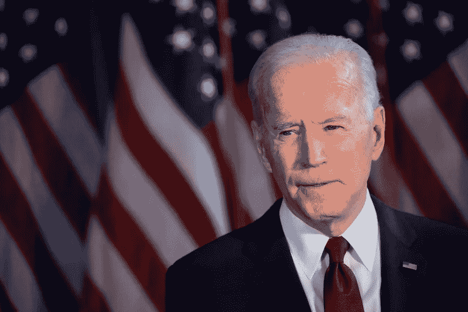
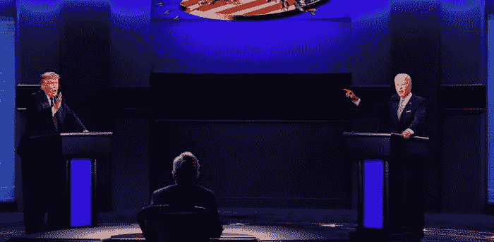
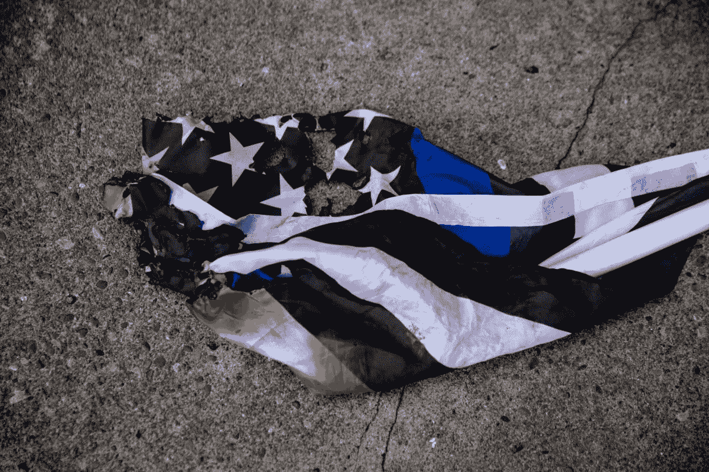
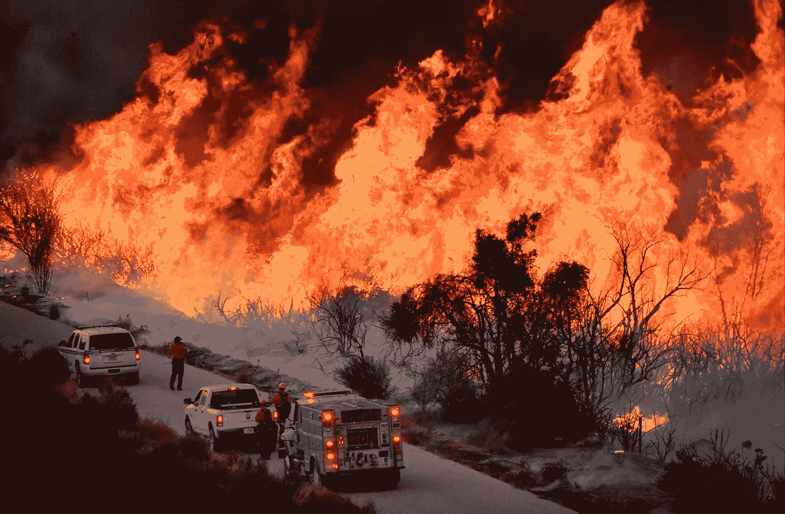

# 欢迎来到“哦，我的上帝，我认为特朗普可能是法西斯”派对

> 原文：<https://medium.datadriveninvestor.com/joe-biden-needs-to-fight-right-now-bae5612dc2ce?source=collection_archive---------20----------------------->

## 唐纳德·川普拥有新冠肺炎，乔·拜登现在就需要战斗

Former Vice President Joe Biden (D) as the 2020 presidential candidate. Photogrpahy Credit: Brendan McDermid | Reuters

**举手**:还有谁对*自己*没有更早地预见到总统的困境感到惊讶？谁被抓到相信交战规则将适用于自然和今天的美国白人皇族？

出于某种原因，我想是的。

我想我以为他太有钱了。太受保护了。太贪得无厌，太腐败，讽刺无法触及他。

但是我们怎么会惊讶于“**自由**”世界的领袖——在那里你有不可剥夺的权利不戴面具呼吸，但不是没有白人至上的重量在你的黑*黑*脖子上——我们怎么会惊讶于那个世界的保护者可能最终尝到了他自己的药？

事实上，这是他自找的。

当然，这可能是一个骗局——鉴于“特朗普”()一直象征着傻瓜的黄金，这种可能性太大了。

但如果这是故意的，我得给他们信任。因为还有谁会因为讽刺藏在一艘名为[希望](https://www.bbc.com/news/newsbeat-54387620?at_custom2=facebook_page&)的船里潜入白宫而窃笑呢？

当我在家的时候，我同情所有因为新冠肺炎而受苦的家庭。但是[和我的兄弟姐妹和同志们走在街上](https://medium.com/afrosapiophile/i-am-a-modern-black-revolutionary-and-i-am-good-trouble-7d910b355580)，我的心就在这里。因为*更大的战斗*还没有结束。

今年的现代黑人起义——一个新的全国性反种族主义联盟的开始——绝不是一场针对特朗普的战斗。那场战争早在 2016 年就输了。

我们在打一场反对白人资本主义霸权的战争。尽管敌人的领导人被卡在床上，嘴里还叼着一只脚，但这种愤怒仍在继续。

特朗普的团队似乎已经具有欺骗性。他们出奇地安静，一反常态地采取理智的行动。我们将不得不看到骄傲的男孩军盈余-布莱巴特-仇外-郊区-白人妈妈-美国之王如何处理这个潜在正义甜点的特洛伊木马。

但我现在要告诉你乔·拜登必须做什么。他不会做的事。事实上，为什么这种事件的转变会让他成为我文学作品中的焦点。

我知道我们都很震惊。但是请回想一下…

## 周二晚上。

Reuters

如果你像大多数美国人一样，对这场辩论感到震惊，那么恭喜你...

欢迎来到“*天啊，我觉得川普可能是个法西斯*”派对。

多棒的派对啊。当太阳升起的时候它不会停止，当主人回来的时候它也不会放慢速度

这场全国性狂欢的新邦联参与者仍在润色他们的派对主张。我猜，现在他们更加渴望把房子拆掉。但是，是的…欢迎参加派对。

你以前去过吗？

主持人说墨西哥人是[强奸犯和杀人犯](https://www.nydailynews.com/news/politics/trump-outrageous-comments-mexicans-article-1.2773214)的时候你在吗？那是一个多么美好的夜晚。或者也许你还记得他[敦促警察暴力逮捕](https://edition.cnn.com/2020/06/01/politics/donald-trump-race-police/index.html)和平抗议者的时候？我记得很清楚，我有伤疤可以证明。

但周二晚上还是有意义的，对吧？

美国第二次白人反叛的名义领袖告诉他的棕色(军队剩余)衬衫给“[袖手旁观](https://medium.com/afrosapiophile/stand-back-and-stand-by-b99646bbf417)但是他已经说了一段时间了。

乔·拜登做了什么？

他妈的*没什么。*

面对一个受感染的法西斯分子，拜登决定对所有的红色窃笑。很性感。旗帜。

第二天早上，我看了标题——宿醉未醒，但痛苦地意识到我仍然记得的一切。我简直不敢相信。拜登*赢了*？？

*哪里！？*

这场辩论让我很痛苦。不是因为这是一场垃圾箱火灾。不是因为我们的民主国家在我们眼前实时崩溃。因为我和我的战友们每天都为这场运动牺牲*。拜登所能做的反映我们决心的一切就是面对敌人不屑一顾地微笑。*

*我的朋友们，这是白人的特权。*

*更糟糕的是…他整晚都这样做是因为你。*

*因为普通的美国中产阶级希望一切回归正常。这就是拜登的全部推销内容。他想让你知道他是值得尊敬的候选人。理智的那个。奥巴马的法律和秩序的恢复。*

*你知道——当移民的孩子第一次被关在笼子里的时候。*

*当特雷沃恩·马丁在街上行走时被侧写、袭击并谋杀。当奥巴马不是把矛头指向美国无处不在的暴力反黑，而是把不公的矛头指向美国[缺乏*控枪*](https://www.huffpost.com/entry/obama-george-zimmerman_n_3595631) *。**

*还记得那次全球灾难颠覆了数百万美国人的生计吗？*

*哦，对不起…*

*2008 年？你还记得奥巴马的回应是给银行更多的钱吗？*

*对不起但是*【恢复正常】*对我来说就是不行。对我们来说不是。经历了这一切之后。*

*为什么我们总是要自己去战斗*？**

*我们真他妈的累了。*

*看到乔·拜登在系统性种族主义问题上结结巴巴——字面上的 ***唯一的*** 那天晚上我想看到他提出的坚实观点——足以让我把遥控器扔到房间的另一边。看着他击落绿色新政抓人的温和派， ***而西海岸却兼被夷为平地的地狱火，*** 足以让我坐以待毙。*

**

*Reuters*

*因为那是乔的计划。不是吗？*保持冷静*任由法西斯和系统性灾难继续？*

*为什么——即使我们看着火焰吞噬我们的世界——我们沉浸在新一轮正当的革命中——大多数美国人只想对和平撒谎？*

*有人告诉我吗？因为我已经听够了。*

*有人告诉我这个联盟是唯一准备好真正为未来而战的吗？*

*从我激进灵魂的最深处感谢你，感谢所有的盟友——那些身体上和精神上的盟友。如果你参加聚会迟到了，没关系。保持队形。*

*但是我在呼唤那些所谓的“进步”政客，他们听不到这些*的可怕状况是如何在此刻呼唤革命。**

**[*美元上十分之一*](https://www.brookings.edu/blog/up-front/2020/02/27/examining-the-black-white-wealth-gap/)和[十*他妈的*年](https://www.washingtonpost.com/energy-environment/2018/10/08/world-has-only-years-get-climate-change-under-control-un-scientists-say/)**

**这是我现在唯一在乎的两件事。**

**普通黑人家庭每挣一美元，就挣一毛钱。在野火成为我们担忧的补充之前，我们有十年的时间来阻止气候变化的轨迹。贫穷(警察迫害的首要条件)和气候变化现在正在杀死我们。如果没有任何改变，他们会杀了我的孩子。**

**拜托你们了！**

****

**Gene Blevins/Reuters**

*****得到。英寸队形。*****

**只是为了保住我认识的恶魔，希望白宫能处理好自己的事情。**

**但如果拜登不利用这一点——如果他不利用特朗普谎言和好战性的缓刑来实际参与美国的未来——那么他就不值得我在 11 月投票。**

**无论如何我都会投他的票。**

**但我为加入这个党付出了太多——这个“*我们* ***必须*** *停止法西斯主义和剥削”*的党——我将永远负担不起。**

**必须结束了。要么纳粹把房子推倒，要么你承诺改变我们的未来。**

**不会有温和的乔·拜登。革命不允许。**

**没有中间地带。**

***思念和祈祷***