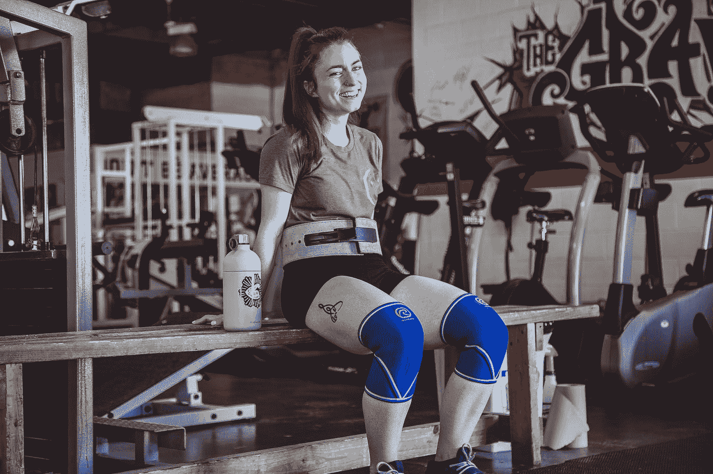

# 关节友好健身:让轻重量感到沉重

> 原文：<https://medium.datadriveninvestor.com/joint-friendly-fitness-make-light-weights-feel-heavy-d8ee4caec553?source=collection_archive---------14----------------------->

Photo by [Alora Griffiths](https://unsplash.com/@aloragriffiths?utm_source=medium&utm_medium=referral) on [Unsplash](https://unsplash.com?utm_source=medium&utm_medium=referral)

在所有不同类型的运动中，我认为力量训练是最有价值的运动之一——原因有很多。定期执行，它将:

*   提高静息代谢率(更多肌肉= 24/7 燃烧更多卡路里)
*   增加骨密度(随着年龄的增长尤其重要)
*   改善心脏健康
*   可能有助于管理慢性疾病

…以及许多其他好处。**但是**，力量训练的一个通常被忽视的方面是它可以在长时间内对我们的关节产生累积效应。

我们的关节就像轮胎——它们只有这么多胎面。为了防止它们磨损，偶尔将一些对关节更友好的技术纳入我们的训练方案是一个好主意。

下面是我最喜欢的三种让关节休息的方法——*而不会牺牲你的训练强度。*

## 100 重复组(休息暂停技术)

3 套 10 个，4 套 12 个，5 套 5 个。有时，我们会犯这样的错误，只是走过场，去“达到我们应该达到的数字”，不管那可能是什么。⁣A 把事情搞混的痛苦而有趣的方法是把集合/重复方案扔出窗外，取而代之的是执行一组 100 个重复

*   在给定的练习中，取你通常用于“3 组 10 个”的任何重量，大致减半。⁣
*   不停地完成尽可能多的重复。⁣
*   一旦你接近失败，休息很短的时间——大约 10 到 15 秒——然后继续你的运动。⁣
*   重复，直到你达到 100 分。

这被称为休息暂停技术，这是一种测试你身体和精神韧性的好方法——只需你通常使用的重量的一小部分。

 [## 医疗保健太便宜，无法计量|数据驱动的投资者

### "当世界末日来临时，每个人都将独自购买医疗保健."戴夫“ePatient”德布朗卡特掉了这个…

www.datadriveninvestor.com](https://www.datadriveninvestor.com/2020/11/02/healthcare-too-cheap-to-meter/) 

## 最后表演大动作

我已经说了很多关于你的训练应该如何集中在大型复合举上——按压、深蹲、划水和硬拉变化都是合理力量训练计划中的主要内容。

传统上，这些动作首先在锻炼中进行，当我们处于“最精力充沛”的时候，这样我们可以尽可能地移动最重的重量。在这个主要的提举完成后，我们转到辅助动作上，比如弯曲和侧举；越是“健美运动员”式的锻炼。

这是合理的逻辑，如果你的唯一目标是在那一天尽可能多的负重前行，这显然是正确的。但是，一个让事情变得更“关节友好”同时仍然获得有效锻炼的好方法是偶尔颠倒一下锻炼的顺序。

通过首先进行这些辅助运动*，*，你会预先耗尽肌肉，这意味着当你在锻炼结束时进行复合运动时，你将无法像平时那样移动更多的重量。从关节健康的角度来看，这是一件好事，因为你仍然可以努力训练，并获得这些复合升降机提供的肌肉建设的好处，但重量更轻。

如果你是一个有竞争力的力量训练者，为了比赛而训练，这可能对你来说并不理想——但对几乎所有其他人来说，这是一个很好的策略，每隔几个月就开始训练，让你的关节从全年的繁重训练中得到休息。

我喜欢以这种方式进行复合托举，每次大约 6 周，每 3 或 4 个月一次。

## 放慢古怪的速度

锻炼的“偏心”部分是肌肉被拉伸的阶段。思考:降低卧推，下蹲，降低二头肌弯曲，等等。(当肌肉缩短时，与偏心相反的是“同心”阶段。)

故意放慢任何特定练习的偏心阶段可以保持你的形式诚实，防止你试图移动你无法以近乎完美的形式真正处理的重量，并且是用更轻的重量提供最佳训练效果的另一种方法。

此外，它还是一个很好的诊断工具。如果你的技术有缺陷，放慢动作会让它暴露出来，因为你可以更好地在练习中找到你的状态正在崩溃的*确切的*点。努力提高你所做的练习的执行力，尽可能最大化肌肉的张力，最小化关节不必要的压力。

**试试看:**拿一个你通常能做 10-12 次的重量，做一组 6 次。但是在这 6 次重复中的每一次，**每次重复降低重量 6 秒钟。你可能会惊讶于那些“轻量级人物”开始挑战你的速度有多快。**

长寿是这个游戏的名字。如果你想在 60 岁时能像 30 岁时一样训练，不要忽视你的关节健康。

用“100 重复组”来鞭策自己，减缓这些怪癖，颠覆“传统”锻炼——三种通过让轻重量感觉重来锻炼肌肉的方法。

你的关节会感谢你的。

## 获得专家视图— [订阅 DDI 英特尔](https://datadriveninvestor.com/ddi-intel)⁣⁣