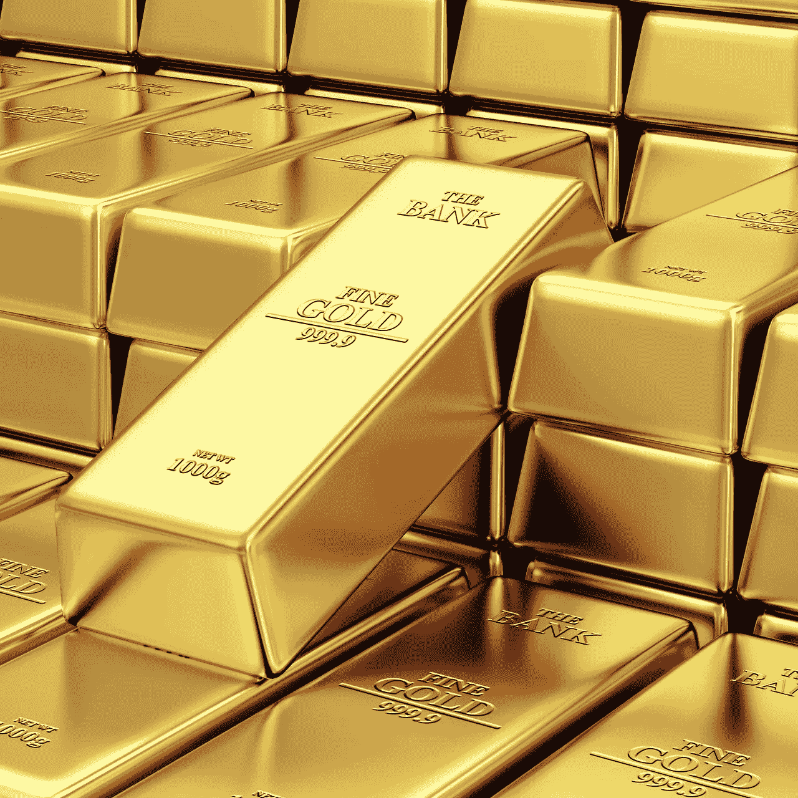
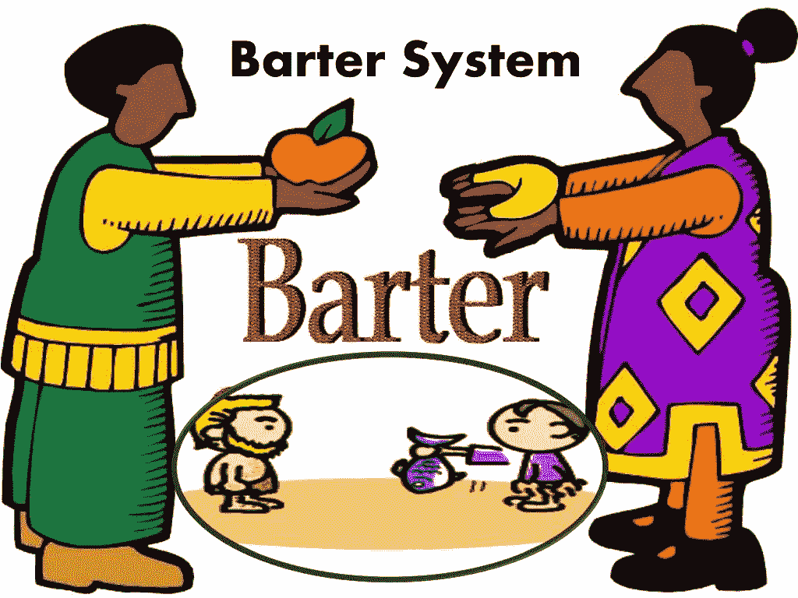
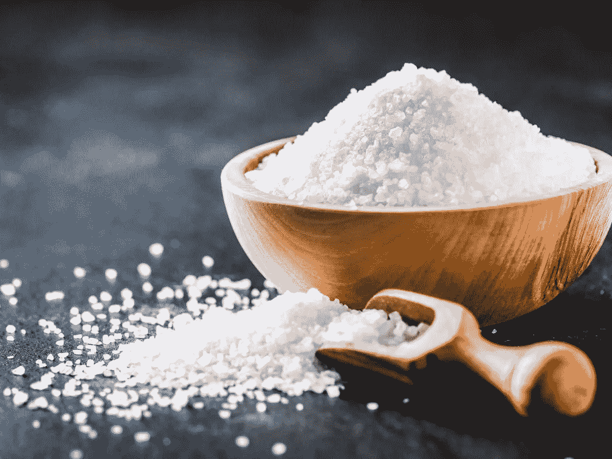
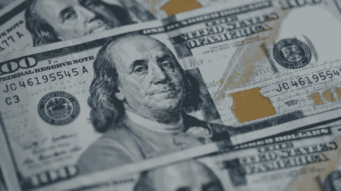
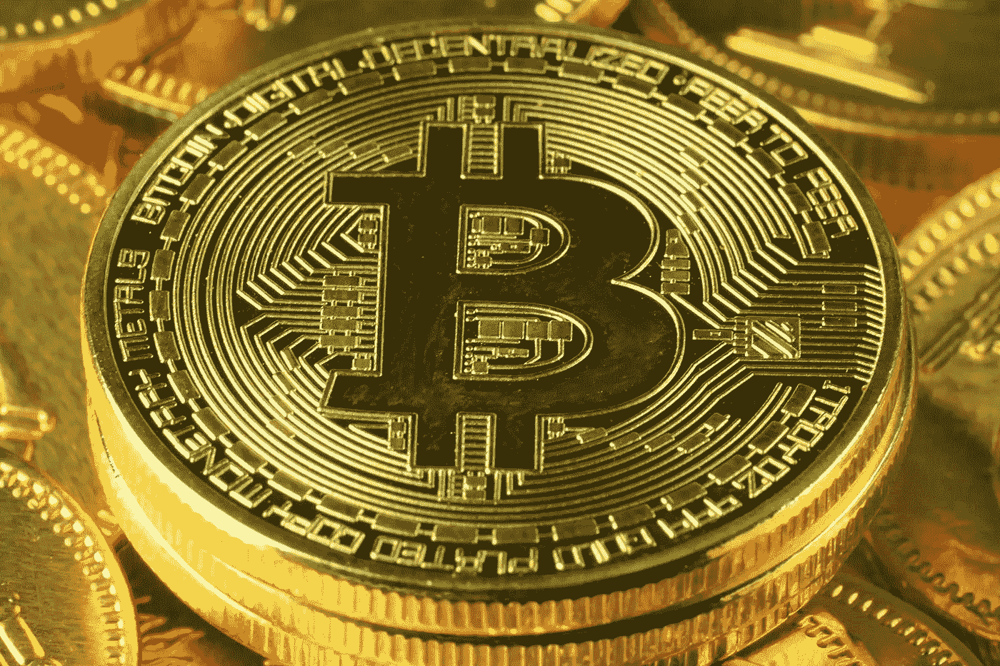

# 从实物黄金到数字黄金的旅程(带音频)

> 原文：<https://medium.datadriveninvestor.com/journey-from-physical-gold-to-digital-gold-5e9746870332?source=collection_archive---------14----------------------->

自从人类文明开始以来，有一种货币形式具有价值。第一个这样的系统是物物交换系统。

(2 不同种类的商品在达成某种共识后在人与人之间交换)

但是这非常复杂。因为每种商品都有不同的货币价值。因为涉及到不同的艰苦工作。比如理发和农作物种植完全是两码事。

同样，人类也尝试过

1.  将贝壳视为货币，因为它们很有吸引力，而且稀缺。
2.  动物的毛皮不容易被杀死，尤其是在早期寒冷的国家。
3.  令人惊讶的是，盐很难获得，所以它是一个非常有价值的贸易项目。

生产新货币单位的相对难度决定了货币的硬度，而货币的供应量很难增加。

第二代案例是货币金属，自然界中稀缺的贵金属被用来制造充当货币的硬币。

例如，银币在许多王国被广泛使用。

时间线:

1.  1509–1526 = 92.5%的银用于制造硬币
2.  1526–1544 = 50%的银用于制造硬币
3.  1544–1574 = 33%的银用于铸币

由于白银的下跌，这个想法也被放弃了。

所以现在纸币开始出现了。

这始于美国，人们根据存放在政府金库里的黄金数量获得纸币。

此外，如果我们谈论今天的世界场景，我们只有 8%的实物货币，其余 92%的非实物或数字货币。

还有，一些伟大的思想家说

“你真正的财富是你的时间和自由。”

“你做的每一个决定，都是为了让自己的生活和未来更美好。”

“财富是你不花的东西。”

金钱就像一种语言；越多的人采用它，它作为一种技能或媒介就变得越有价值。

决定特定交换媒介如何成为货币的因素:

1.  耐用(保存)
2.  价值密集(大量存储)
3.  流动性(固定金额)
4.  保持购买力(未来前景)
5.  被广泛接受的人
6.  便携式(可移动)
7.  可分的(分成小部分)
8.  容易接近
9.  相对稳定
10.  可替换的(容易互换)

黄金作为货币= >

"金钱是黄金，其他任何东西都不是。"

~ JP 摩根(1912 年)

因为它具有延展性、延展性和中性。

现在在选择黄金的过程中涉及到了一些化学因素。

1.  在对 118 种元素进行剔除之后，我们只剩下五种贵金属:金、铂、钯、铑、银和金。
2.  人们把银当作货币使用，但随着时间的推移，它会失去光泽(我们已经在家里看到银是如何变黑的)
3.  铑和钯是最近发现的，历史用途有限。
4.  铂极高的熔点不实用。
5.  因此，留给我们的黄金具有延展性，熔点较低，易于加工。

货币的可伸缩性因素围绕着三个因素，即规模、时间和空间。

黄金是所有三种个人选择中的赢家，也是因为它的稀缺性和需求。

还有，金子不能印；因此没有通货膨胀。

但是美元被用于全球贸易，因为它占世界 GDP 的 24%并且稳定。

但是现在银行正在增加他们的基础供给和通货膨胀，由于通货膨胀，货币贬值。

正如我们所看到的，当像维贾伊·马尔雅和尼拉夫·莫迪这样的人诈骗这家银行时，一些银行没有印出钞票，作为回报，普通人为他们的必需品受苦。

比特币(或经常被比作数字黄金)

为什么是比特币？

1.  价值储存(耐用、价值密集、动力液体)
2.  交换媒介(广泛接受、可移植、可替代、可分割、可访问)

不可能有通货膨胀。

没有 CEO，没有歧视；任何人都可以使用它；此外，当与涉及金钱的区块链技术结合时，它将消除所有的骗局。

可能只有 2100 万个比特币。

希望你喜欢。

希望得到积极的回应。

请关注我的@Medium 简介 [Yash Kamal Chaturvedi](https://yashkamalchaturvedi.medium.com/)