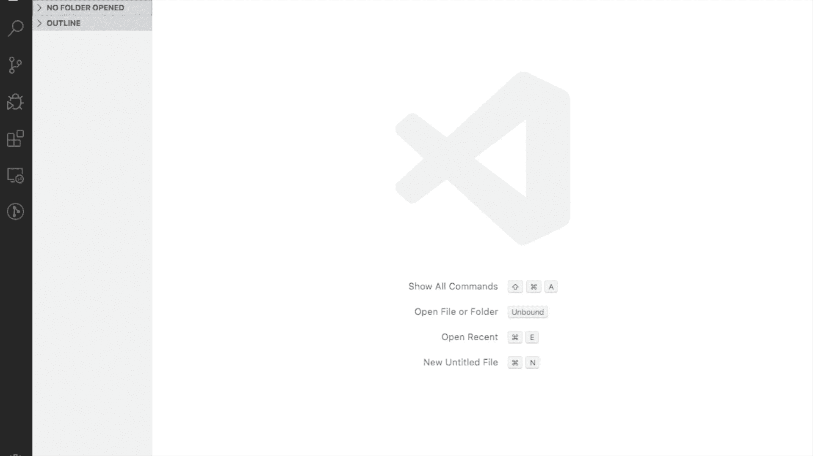
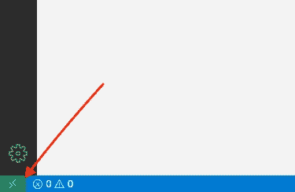
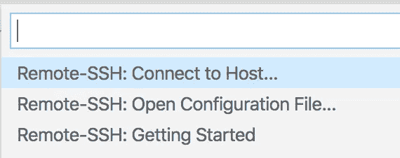
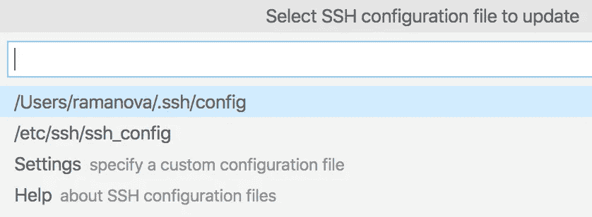
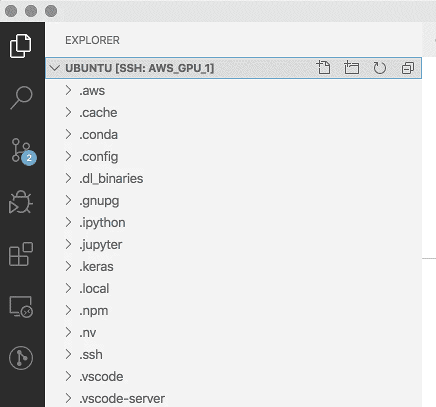

# 关于 AWS 的 Jupyter 游戏攻略

> 原文：<https://medium.datadriveninvestor.com/jupyter-on-aws-introduction-e077f2914d5a?source=collection_archive---------7----------------------->

在本文中，我们将讨论如何在 [AWS](http://aws.amazon.com/) 上对 [Jupyter](https://jupyter.org/) 进行最小化设置。

## AWS 和笔记本电脑

AWS 对笔记本的支持力度很大。 [SageMaker](https://aws.amazon.com/sagemaker/) 是使用 [Jupyter 实验室](https://pypi.org/project/jupyterlab/) - #1 Jupyter 插件建造的。它改进了已经不错的 Jupyter IDE，支持多个文件标签，支持插件等。

根据本文，我们将建立自己的 Jupyter 实验室实例。

建立我们自己的实例将提供更多的灵活性，同时在不同的项目上工作。

由于 AWS 支持团队的配额请求，整个过程可能需要几天时间。


Jupyter Lab

## 1.AWS 设置

EC2 实例—使用 GPU 的弹性计算，我正在运行 **g3s.xlarge**

S3 —磁盘空间，我从 90Gb 开始，增加到了 300Gb

根据使用情况，这样的设置每月大约需要 200 美元，我有一个脚本可以让它关闭一个晚上: [AWS 说明](http://EC2 Instances - Elastic computing with a GPU, I'm running **g3s.xlarge**   S3 - disk space, I started with 90Gb, increased to **300Gb**   Such setup will cost ~200$ per month, depending on usage, I have a script to shut it down for a night: [AWS instructions](https://aws.amazon.com/premiumsupport/knowledge-center/start-stop-lambda-cloudwatch/)  You will need to: * Request a quota increase for g3 instances from support. This will take some time. * Create an [instance](https://docs.aws.amazon.com/AWSEC2/latest/UserGuide/Instances.html), I'm using g3s.xlarge for now with Ubuntu. Run it! Please keep your .pem file. * Configure inbound rules, you will need to open access on 22 nd port for SSH connections.     Also need 8888 port for remote jupyter notebook access)

您需要:

*   向支持部门请求增加 g3 实例的配额。这需要一些时间。
*   创建一个[实例](https://docs.aws.amazon.com/AWSEC2/latest/UserGuide/Instances.html)，我现在在 Ubuntu 中使用 g3s.xlarge。运行它！

请保持你的。pem 文件。

*   配置入站规则，您需要为 SSH 连接打开 22 号端口的访问，并为远程 Jupyter 笔记本访问打开 8888 (8889、8890 等)端口。最好只为您的 [IP](https://www.google.com/search?q=my+ip) 设置访问权限。
*   为此，您需要转到实例中的“描述”部分，然后转到安全组: [AWS 说明](https://docs.aws.amazon.com/AWSEC2/latest/UserGuide/authorizing-access-to-an-instance.html)
*   连接到实例。有很多方法，我用 ssh 连接 PEM 文件认证。[定位私钥](https://docs.aws.amazon.com/AWSEC2/latest/UserGuide/connection-prereqs.html)。
*   您可以使用任何 ssh 文件浏览器甚至 IDE 来连接到远程设备。

一种方法是对 [Visual Studio 代码](https://code.visualstudio.com/)使用 ssh 插件: [ssh 插件](https://code.visualstudio.com/docs/remote/ssh)



Short intro, screenshots to follow



To connect, press the button



Proceed to ‘Open Configuration File’



Choose your ssh config file

这里，您需要使用您的实例公共 DNS 添加配置:

```
# Aws GPU one
Host aws_gpu_1
    HostName ec2-23-19-3-502.us-east-2.compute.amazonaws.com
    User ubuntu
    IdentityFile ~/keys/amazon_key_pair_1.pem
    LocalForward 8888 localhost:8888
```

**主机名:**它在你每次重启你的实例时都会改变，你可以在你的实例的描述部分找到

**用户:**用于 ubuntu 实例的 ubuntu

**IdentityFile:** 是您的实例。pem 文件

**本地转发:**稍后将用于设置 Jupyter 笔记本

现在，您可以使用 vscode 插件连接到新的‘AWS _ GPU _ 1’实例。

建议只打开一个包含项目的文件夹，以免淹没 vscode 代码分析工具。



ubuntu /home folder on your remote instance

这也很好，因为您可以使用 VSCode 中的集成终端在 AWS 服务器上执行命令！一旦您在 VSCode 中选择了 python 解释器，它将在任何新打开的 bash 终端中被激活。

[](https://www.datadriveninvestor.com/2020/02/19/cognitive-computing-a-skill-set-widely-considered-to-be-the-most-vital-manifestation-of-artificial-intelligence/) [## 认知计算——一套被广泛认为是……

### 作为它的用户，我们已经习惯了科技。这些天几乎没有什么是司空见惯的…

www.datadriveninvestor.com](https://www.datadriveninvestor.com/2020/02/19/cognitive-computing-a-skill-set-widely-considered-to-be-the-most-vital-manifestation-of-artificial-intelligence/) 

注意:python 环境应该是一个“真实”的环境，默认情况下，conda 不会在 conda envs 目录中创建文件夹结构。我推荐使用 python 命令来创建[env](https://packaging.python.org/guides/installing-using-pip-and-virtual-environments/):

```
python3 -m pip install --user virtualenv
python3 -m venv env
```

## 2.Jupyter 设置(在 AWS 上；) )

*   安装 jupyter 和 jupyter lab
    
*   安装 jupyter 实验室插件支持
    `conda install -c conda-forge nodejs`所需的节点
*   切换到您特定的 conda 环境。AWS ubuntu 实例附带了许多预装的实例:

```
(base) ubuntu@ip-232-11-12-39:~$ conda env list
base                  *  /home//anaconda3
aws_neuron_mxnet_p36     /home///envs/aws_neuron_mxnet_p36
.
.
pytorch_p27              /home//anaconda3/envs/pytorch_p27
pytorch_p36              /home//anaconda3/envs/pytorch_p36
tensorflow2_p27          /home//anaconda3/envs/tensorflow2_p27
tensorflow2_p36          /home//anaconda3/envs/tensorflow2_p36
tensorflow_p27           /home//anaconda3/envs/tensorflow_p27
tensorflow_p36           /home//anaconda3/envs/tensorflow_p36
```

或者为每个项目创建一个您个人的(推荐):

```
python3 -m pip install --user virtualenv (if not yet)
# go to your project folder or conda envs folderpython3 -m venv my_project_venv
```

*   确保你使用的是最新的 jupyter lab，他们改进很快
    `pip install jupyterlab --upgrade`
*   奔跑

```
jupyter notebook --ip=0.0.0.0 --no-browser
```

现在如果你打开[http://<your _ public _ instance _ IP>:8888/？authToken......](http://0.0.0.0:8888/?authToken......)

(从技术上讲，您也可以使用 localhost:8888 和 token，因为我们之前设置了 LocalForwarding) )

它应该会将您连接到 AWS 上的 jupyter 实例。

确保将链接中的 **/tree** 替换为 **/lab** 以获得 jupyter lab 功能。

你也可以设置密码，这样更容易分享你的进展

转到[http://<your _ public _ instance _ IP>:8888/](http://0.0.0.0:8888/?authToken......)并按照说明进行操作

## 3.酷酷的 Jupyter 实验室功能

1.  将文件从本地机器拖放到 jupyter 实验室文件浏览器(什么？？？不需要 scp！)
2.  从 Jupyter 实验室浏览器下载任何东西(什么？？？)
3.  使用终端(文件->新终端)
4.  调试器、变量检查器(插件)、python 解释器来测试变量/函数
5.  像一个真正的 IDE 一样分割多个文件的视图。或者..您可以多次打开同一个文件！
6.  等等……
7.  与他人共享指向您的文件或文件夹的链接(任何文件->上下文菜单)
8.  更多的插件(但不要安装太多，只安装最少的)

## 4.AWS 经济

确保晚上停止运行实例，这样账单会更少:)

使用定点实例

谢谢！

## 有用的链接

*   [设置-jupyter-配置](https://docs.aws.amazon.com/dlami/latest/devguide/setup-jupyter-config.html)

## **奇怪的东西**

1.  奇怪，因为如果你用完了内存，你的操作将会被 OOM 异常或一些随机错误中断。[https://server fault . com/questions/218750/why-dont-ec2-Ubuntu-images-have-swap](https://serverfault.com/questions/218750/why-dont-ec2-ubuntu-images-have-swap)

**解决方案:**

`sudo dd if=/dev/zero of=/var/swapfile bs=1M count=2048 &&
sudo chmod 600 /var/swapfile &&
sudo mkswap /var/swapfile &&
echo /var/swapfile none swap defaults 0 0 | sudo tee -a /etc/fstab &&
sudo swapon -a`

2.更多后续