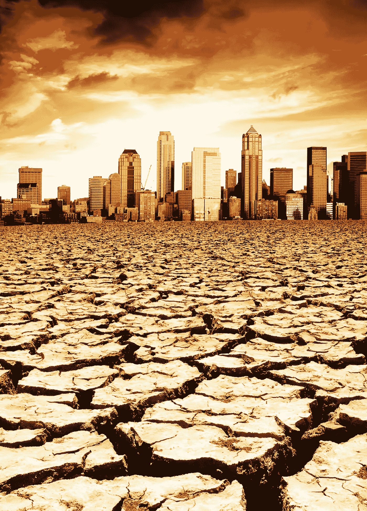
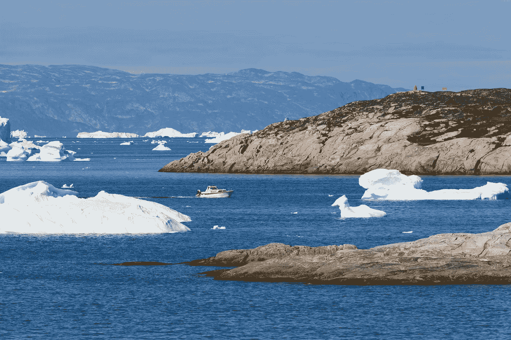

# 在 2020 年气候变化的众多后果中，只有 7 个…

> 原文：<https://medium.datadriveninvestor.com/just-7-of-the-many-consequences-of-climate-change-in-2020-f114fd6ad6a2?source=collection_archive---------24----------------------->

全球正在变热 …如果 10 年前我们能在这个问题上找到很多怀疑的话，现在随着温度计上的**数字上升**，怀疑的**水平正在下降**。

自从 1880 年**有记录以来，地球表面、海洋和大气逐渐变暖。**

这是人类增加温室气体排放的结果，尤其是二氧化碳，它将热量聚集在地球表面。

也许人们不知道如何测量？那些 100 年前的**记录和今天的**记录一样准确可靠吗？

不止是可靠…

20 世纪初，气象局的温度计可以精确到 0.1 度，露点温度是使用通风湿球读数手工计算的。

我们的电子温度传感器被认为是精确的，但公差为正负 2 度，自动露点为正负 4 度。

今天的降水测量自动化系统使用翻斗式雨量计，当风力较大或出现严重冰冻降水时，该雨量计可能会给出错误的读数。它比不上 20 世纪使用的 8 英寸精确雨量计。

整体平均来看，2020 年 3 月的全球陆地和海洋表面温度比 20 世纪的平均温度 12.7 摄氏度高出 1.16 摄氏度，是 141 年来第二高的记录。

所以数字不会说谎…我们的身体传感器也不会…

正如美国国家航空和宇宙航行局所说,“声称全球变暖并没有发生是因为短期内观察到的变冷忽略了自然的可变性，这是误导。”

从对我们的大气和海洋的观察中，全球变暖变得显而易见，这是气候之谜中紧密相连的部分，它将对我们星球上的许多地方产生深远、持久和毁灭性的后果。

温度稍微高一点有什么不好呢？不是很多人喜欢寒冷的冬天。

首先，我们的星球在丰富的水资源方面是独一无二的。

我们都知道，没有水我们的身体也无法生存。它利用所有细胞、器官和组织中的水来帮助调节温度和维持身体的许多其他功能。

任何正常身体水分的缺乏，我们会感到口渴和疲劳，可能会出现轻微的头痛，很快就会出现脾气暴躁，精神和身体衰退…随着脱水的进展，肌肉痉挛变得更严重，持续脱水会降低肾功能。一个人没有水只能坚持三到四天。

然而，**喝太多的水也不是一个选择**，并导致水中毒。这意味着我们体内的盐和其他电解质的量变得过于稀释，导致混乱、定向障碍、恶心和呕吐。

在极少数情况下，水中毒会导致大脑肿胀，这可能是致命的。

**人体是一个复杂的系统，但地球，很可能，甚至更多样化。**

水是**维持地球生命的关键**，并有助于将陆地、海洋和大气连接成一个统一的系统。

全球水循环是水在地球和大气中的持续运动。这是一个非常复杂的订单，包括许多不同的流程…

**在那种最好的情况下**，即在我们决定干预之前由大自然母亲计划的情况下，地球上水的质量随着时间的推移保持不变，但分离的部分，如进入冰、淡水、盐水和大气水的主要水库的水是波动的，并取决于广泛的气候变量。

**随着地球变暖**，我们体验了水循环如何加速，使得海洋、大气和陆地之间的水交换越来越快。温度越高，蒸发越多，结果土壤干得越快。大气中有更多的水——其他地方有更多的雨或雪。

我们经历了洪水、土壤侵蚀和不断增加的蒸发，导致一些地区干旱，而另一些地区则暴雨成灾。

**生态系统**也对春天和夏天的变暖和绿化做出反应，提前八天开始，植被继续进行光合作用的时间估计延长了四天。

**还有什么？**

1)研究人员认为，如果排放继续按照目前的趋势发展，那么到 2100 年，全球海平面可能会上升 238 厘米。

当海平面像现在这样快速上升时，它会对沿海栖息地造成毁灭性影响，导致破坏性侵蚀、湿地洪水、含水层和农业土壤盐污染；鱼、鸟和植物也会死亡，失去它们的栖息地。

“上世纪初，海平面每年上升不到 1 毫米；在本世纪中叶是每年 2 毫米，现在是每年 3 毫米。美国宇航局喷气推进实验室的气候科学家威利斯解释说:“这是由地球温度上升直接造成的。

在过去的 100 年里，海平面上升了 10 到 25 厘米。

-水受热膨胀，

-全球冰川正在融化。

美国宇航局重力恢复和气候实验的数据显示，1993 年至 2016 年间，格陵兰岛平均每年损失 2860 亿吨冰，而同期南极洲每年损失约 1270 亿吨冰。在过去的十年里，南极洲的冰量减少了两倍。

2)海洋吸收了增加到气候系统中的 80%以上的热量，促使海水膨胀，导致海平面上升。自工业革命开始以来，海洋上层吸收的二氧化碳量每年增加约 20 亿吨，海洋表层水的酸度增加了约 30%。

3)以前**阿拉斯加和西伯利亚的冻土(永久冻土)也在融化**，从而对生态系统和基础设施造成破坏。在过去的 100 年里，北极平均气温的上升速度几乎是全球平均速度的两倍。

此外，融化和苔原变暖导致有机物质的腐烂和被困碳和甲烷的释放…这是一个巨大的额外的温室气体来源…除了我们的活动已经造成的影响之外。

4)卫星观测显示，在过去的五十年里，北半球春季积雪的**量已经减少**，积雪融化的时间也越来越早。

5) **死亡率更高**。

6) **更脏的空气**。

7) **较高的野生动物灭绝率**。

谁知道未来几年我们还会发现什么呢…

乔希·威利斯解释说:“例如，大规模火山爆发会导致持续数年的降温。当火山爆发时，它将灰尘喷入高层大气，在那里反射阳光，给地球降温，有点像一把天然的雨伞。”

我们应该希望更多的火山爆发来冷却地球吗？…

而且……如果我们的温室气体排放继续保持目前的水平，几乎没有减少，到 21 世纪末，我们的星球可能会变暖大约 4 摄氏度。

科学家们在理解地球气候的细微差别方面取得了进展，但他们非常清楚过去一个世纪碳排放、全球变暖和海平面上升之间的联系。

即使我们的全球碳排放量明天开始下降，并且下降很多，由于气候系统的惯性，地球仍将持续变暖一段时间。

由于极热使风景干燥，自然更容易发生火灾。研究表明，由于气候变化导致气温上升，导致全球火灾增加

炎热通过影响我们吃的食物、喝的水、呼吸的空气和经历的天气来威胁我们的健康…

**根据一个人的居住地、对健康威胁的敏感度、一个人暴露于气候变化影响的程度以及他们和他们的社区适应变化的能力，影响会有所不同**。

但这是下一篇文章和视频中讨论的另一个主题。

来源:

-美国国家航空航天局

气象局

作者:海伦娜·马克舍姆 2020 年 9 月 27 日，lenkamaxem@gmail.com