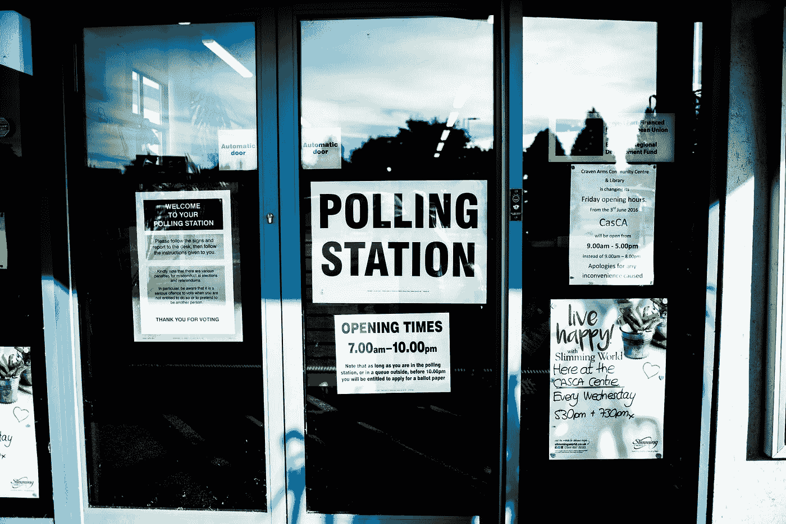

# 卡玛拉·哈里斯的经济政策到底有多有限？

> 原文：<https://medium.datadriveninvestor.com/just-how-limited-are-kamala-harriss-economic-policies-3d7f29fa7e25?source=collection_archive---------6----------------------->

## 洞察 2020 年大选如何影响你的钱包或根本不动它。

Photo by [Elliott Stallion](https://unsplash.com/@eagleboobs?utm_source=medium&utm_medium=referral) on [Unsplash](https://unsplash.com?utm_source=medium&utm_medium=referral)

大多数人多少知道唐纳德·特朗普的企业减税、反全球主义贸易政策和保护主义。

同样，一些人知道乔·拜登的战略[——增加政府支出以创造就业，修改医疗保险，对收入超过 40 万美元的人征税，以及废除公司税。](https://www.thebalance.com/what-are-biden-s-economic-policies-5071356)

随着卡玛拉·哈里斯作为副总统候选人加入到拜登的竞选活动中，出现了新的担忧。

许多人认为拜登精神健康状况不佳，并认为如果他当选，他将无法胜任两届任期。

这给哈里斯的经济政策带来了更大的压力，因为她可能会在拜登的第一个任期的后期产生更大的影响——可能会在四年后以民主党的名义竞选总统。

大多数人知道特朗普和拜登会给他们带来什么。

**但是哈里斯的经济观点是什么？**

我们对这些信息有所了解，因为她是 2019 年民主党提名中宣传较多的候选人之一。

当然，我们也应该认识到，这是 COVID 之前，一些优先事项可能已经改变。

# 华尔街

哈里斯以挑战大银行而闻名。她在回忆录中有一个章节讲述了她打给摩根大通首席执行官的一个电话，当时他们正在争论该银行应该为其在金融危机中的角色支付多少钱。

当拜登在推特上说她是他的副总统人选时，他提到了这个名声。

哈里斯调整了桑德斯的计划，减少了增量增税，支持对华尔街交易征税。股票将被征收 0.2%的税，债券将被征收一半的税。

尽管如此，华尔街认为她是一个温和的人，是比桑德斯或沃伦等人更好的选择。

 [## 对有商业头脑的投资者有用的行为经济学概念|数据驱动的投资者

### 在美国企业界，高斯统计，对我们周围世界的确定性解释，以及理性…

www.datadriveninvestor.com](https://www.datadriveninvestor.com/2020/07/09/helpful-behavioral-economics-concepts-for-the-business-minded/) 

哈里斯一直对商业银行严格要求，在 2010 年开始担任加州司法部长期间，她为加州房主赢得了 200 亿美元的和解金。

尽管如此，一些人认为，哈里斯没有做足够的工作来帮助穷人和外国房主，他们可能是最脆弱的。作为加州司法部长，她几次拒绝对银行采取行动。

然而，哈里斯为自己辩护说，由于法律不允许各州对金融机构采取某些法律行动，她受到了限制。

**这是她的妥协还是她向银行让步？**

# 卫生保健

Harris 打算继续支持患者保护与平价医疗法案，并致力于一项 10 年计划，以降低医疗保健费用。

起初，她支持全民医保，但很快改变了立场，结果在她的竞选中失去了影响力。

她提议让美国人在高度监管的私人医疗保健和公共医疗保健之间做出选择。

*哈里斯吹捧了许多由桑德斯首先推动的支付该计划的提议，包括改变收入、工资税和遗产税，使其更具累进性，以及对企业和最富有的美国人征收更高的税(NBCNews)。*

# 流行病

现在由于当前的危机，将会更加强调帮助挣扎中的美国人。哈里斯似乎已经将这一点作为她的主要政策点之一。

*哈里斯已经* [*在美国参议院就过去几个月的经济危机*](https://www.datadriveninvestor.com/glossary/address/) *发表演讲，共同发起立法，给予数千万美国人* [*【每月 2000 美元】*](https://www.washingtonpost.com/us-policy/2020/08/12/harris-biden-economic-policy/) *【以及在疫情期间禁止驱逐、取消抵押品赎回权、提高租金和关闭公用事业。*

她在这方面也有经验，因为她在参议院国土安全和政府事务委员会任职。

在这个委员会中，她监督联邦政府对国家灾难和紧急情况的反应，包括川普对新冠肺炎的反应。

但是 COVID 很快就会结束。这只是攻击特朗普的权宜之计吗？我也这么认为

# 租房和买房

哈里斯还非常重视确保在租房、买房和卖房的过程中消除种族不平等。

她还包括一项为低收入租房者提供数十亿美元税收抵免的计划。这包括对那些将收入的 30%以上花在房租和公共设施上的人的税收抵免。

由于她在加利福尼亚州的所见所闻，她对住房的可负担性感到担忧。

# 工资和税收

哈里斯赞成 15 美元的最低工资。

*自 2016 年当选美国参议员以来，卡玛拉已经提出并共同发起了帮助中产阶级的立法，将最低工资提高到 15 美元。*

她还想找到惩罚无视这些工资法的公司的方法，并使其更容易成立工会。

在她最突出的立场中，有一项为中产阶级和下层阶级减税的 3 万亿计划。

她希望扭转特朗普倡导的对企业和美国富人的减税政策。

*哈里斯网站上展示的政纲承诺“逆转唐纳德·川普总统为大公司和 1%的富人减税数万亿美元的政策。”(NBC 新闻)*

随着对富人征收更高的税，她希望通过更多的所得税减免和信用来给更穷的美国人更多的钱。

对于年收入低于 10 万美元的家庭，计划中的税收抵免将提高到 6000 美元。

# 结论

哈里斯选择关注的大多数问题都有些重要。这个国家有太多的经济问题，每个候选人都必须选择他们的经济战。

和她选择关注什么一样重要的是她不关注什么。

学生贷款等问题仍然是美国学生的一大障碍，但她并没有解决这个问题。

与伯尼或沃伦提议取消大部分或全部学生债务不同，哈里斯的贷款方法要狭窄得多。她提议免除两万美元的债务，但有一个条件。

*他们必须是 1)* [*佩尔助学金的接受者*](https://studentaid.ed.gov/sa/types/grants-scholarships/pell)*；2)在贫困社区创业；3)设法让生意维持至少三年。*

对于许多明显对此不满意的左倾人士来说，这可能是一个值得注意的问题。难怪她很少提及这一点作为她的政纲的一部分。

哈里斯也没有提供多少让人们重返工作岗位或帮助灰心丧气的工人的解决方案。她没有提到学位膨胀、工资停滞或制药业的问题。

在我看来，她似乎专注于最令人担忧和权宜之计的问题，但对更紧迫的结构性和代际问题却没有答案。她似乎是一个完美的中间派候选人，可以获得最多的选票，安抚尽可能多的左派和温和派。

但她是解决我们问题的方法还是前进的好方法？我说不。她会保持现状吗？绝对的。

*原载于 2020 年 8 月 28 日*[*【https://www.datadriveninvestor.com】*](https://www.datadriveninvestor.com/2020/08/28/just-how-limited-are-kamala-harriss-economic-policies/)*。*

## 访问专家视图— [订阅 DDI 英特尔](https://datadriveninvestor.com/ddi-intel)