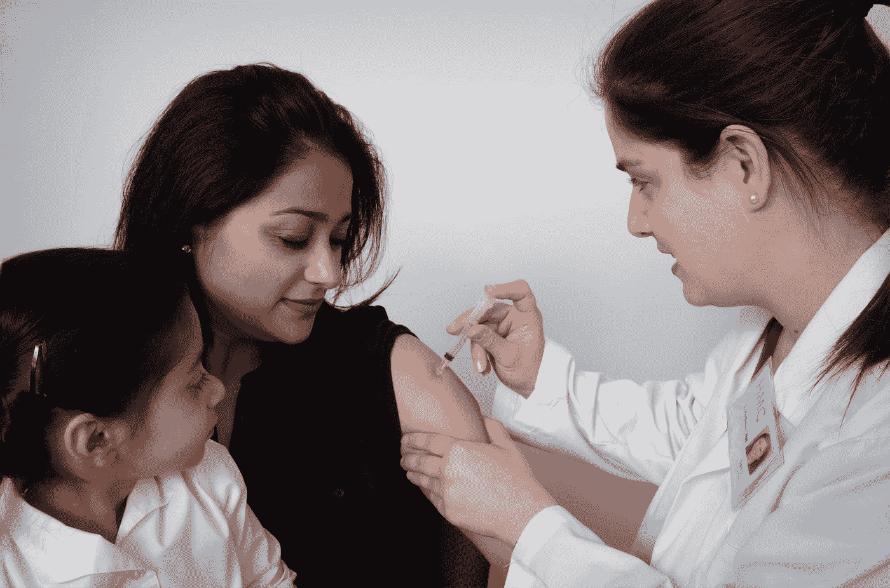
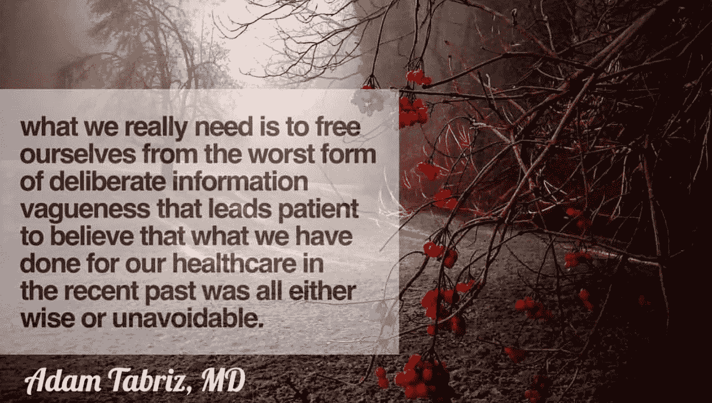
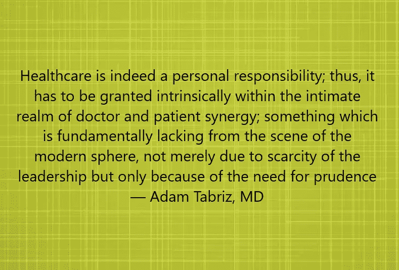

# 仅仅告诉病人做什么通常不会改变他们的行为

> 原文：<https://medium.datadriveninvestor.com/just-telling-a-patient-what-to-do-isnt-usually-going-to-change-their-behavior-ebc9c39eb88b?source=collection_archive---------6----------------------->

要让人们改变他们的行为是不可能的，除非有一种能让他们感同身受的人际关系

[数据驱动投资者最初发表本文](https://www.datadriveninvestor.com/2020/12/18/just-telling-a-patient-what-to-do-isnt-usually-going-to-change-their-behavior/)

Photo by [CDC](https://unsplash.com/@cdc?utm_source=medium&utm_medium=referral) on [Unsplash](https://unsplash.com?utm_source=medium&utm_medium=referral)

人类是一种行为动物。作为个体，我们都以某种方式行事。并不是我们做的每件事都能吸引旁观者。然而，除了作为行为动物，我们也在努力引诱对方改变行为。但是影响他人去改变行为是艰难而又舒适的。这是可以理解的，因为两党之间有一种偶像化的联系。一个这样的例子是名人对粉丝的影响。

患者依从性是医生和患者之间的个人关系如何发挥有意义作用的一个明显例子。换句话说，服从反映了由设定的**行为**驱动的临床相遇的两个中心角色之间的亲密联系。

行为是关于我们作为个人和集体如何对待自己、他人和周围的环境。无论是内在的还是外在的，有意识的还是潜意识的，公开的还是隐蔽的，自愿的还是不自愿的，几乎总是有一个对各种刺激或输入的预编程反应的因素。行为与各种动作、操作、交互和特征有关。行为的质量仅仅是相对的。决定好的和坏的行为的，无非是一个人从周围环境和其他重要的人那里感知到的反映的产物。例如，一个宗教人士重视基于圣书(上帝)或精神领袖规范的正确行为。而患者或医生看到的良好行为是基于患者对治疗医生的信任。不管怎样，一个动作总是与特定的相互关系级别相关联。它与两个人和一些其他现象或媒介之间的联系有关，如一种思想、学说和社会规范。话又说回来，行为的善与恶只是相对于这些场景的精确标准来决定的。例如，良好的行为通常被认为是忠诚的，表现出同理心，并尊重他人。相比之下，搬弄是非，行为恶劣得到帮助，才是可怕的。

# 行为的改变是个人情况的结果

除非有必要的因素，否则人们不会考虑改变行为。每个人都可以改变，但这不一定意味着他们会改变。然而，任何人都可以努力改变特定的习惯或惯例。甚至一些态度和性格的观点也会随着时间而改变。通过一些专注的努力，他们甚至可以做到。总而言之，行为的改变是环境的产物。

 [## 该选项是成功的个性化医疗保健的关键

### 义务不是答案

medium.com。](https://medium.com/illumination/the-option-is-the-key-for-successful-personalized-healthcare-c0f38800a39d) 

情况往往需要某种形式的煽动者，如个人联系，同情，或理想化。在人际关系的每一个事件中，都有个性的因素。后者是一个用来描述在时间和地点上统一的属性的短语。例如，我们期望一个高度外向的人在家里、工作或学校都很愉快。虽然性格不是行为的经典预测因素，但它仍然提供了一个人应该如何思考和行为的总体印象。一个有强烈消费主义态度的非常固执己见的患者不太可能遵循治疗医生指示的纯粹功利主义的人群健康方法，而不是患者真正认为的正确治疗方法。因此，尽管病人的要求有时可能不切实际，但在**医患关系**中，重要的是在他们之间建立一种特殊的纽带。一旦个人联系也建立起来，同样的结果可能会出现，也可能不会出现，就好像一个人坚持纯粹的功利主义方法一样。简而言之，行为的改变不是指手画脚或说服病人，而是医患关系的个性化。

事实上，变化是一个过程，而不是一个事件。这是理想情况下在患者门诊中发生的事情。成功的行为改变只发生在一步一步的过程中，这种改变的时间长短取决于个人。当自我激励并根植于积极的自省时，最有可能发生持久的变化。

# 要求某人改变行为

仅仅用证据和实践推理轰炸病人不会改变他们的生活方式或行为。病人需要有机会检查他们的轶事。当医生试图说服病人时，病人需要动机，但没有信息，扔更多的证据会适得其反。相反，创造一个安全的氛围，让病人可以探索他们已经拥有的动机。为了证明某种形式的现状，患者需要重新评估他们的叙述，特别是他们自己讲述的任何弄巧成拙或有创意的故事。让某人承诺改变和让他们改变是不一样的。每次行为改变的主要困境是人们高估了意志力的影响。他们没有看到他们面前的风险。所以，他们全心全意地投入到一项不可企及的努力中。他们被从未预料到的障碍绊倒，通常依赖快速解决方案。

解决方案；作为医生和病人，我们必须启发我们的眼睛。我们需要发现我们周围隐藏的影响和让我们停滞不前的力量。一旦我们记住了它们，我们就能解决它们。

人类倾向于[将行为的各种影响分为六个来源](https://www.forbes.com/sites/kathycaprino/2015/02/06/the-3-most-powerful-ways-to-change-people-who-dont-want-to-change/):三个激励因素(个人、社会和结构激励因素)和三个促成因素(个人、社会和结构促成因素)。大多数顽固的小故障之所以持续存在，是因为看不见或没注意到的影响让我们陷入困境。一旦我们看到它们，我们就能改造它们。然而，如果我们不改变它们，我们将会一直停滞不前。

# 说到促进行为改变，我们是建议还是命令？

期待一个**患者**改变健康的生活方式是每个医生的动机。然而，有些人希望病人无条件地接受这些行为的改变；其他人扮演顾问的角色。毫无疑问，下令改变行为很方便但不一定有说服力；因此它是短暂的，所以患者的依从性是短暂的。另一方面，提供没有人际关系和信任的建议也将无法持续。

患者行为改变是关于对医生建议的依从性。没有特定的干预技术可以提高所有患者的依从性。成功取决于使干预措施适应患者的独特特征、疾病状况、治疗方案以及患者对医生的评价。

# 患者对医生建议的依从性超出了信任关系

**依从性**是患者的行为与医师的建议相匹配的程度。它意味着患者参与不足，通常与消极特征如屈服和顺从有关。

不顺从常常无法解释，因为病人理解他们的问题，这与他们的医生不一致，他们也不能理解他们得到的诊断。然而，他们的诊断和治疗在他们的日常生活中起着特殊的作用，这解释了他们为什么不听从医生的建议。患者对治疗的使用经常反映出他们希望在日常生活的约束下控制症状。这指出了医患关系中压倒性的个人坚实本质，以及在这样的框架内，诊所会面的合作伙伴关系风格的重要性。

 [## 个性化医疗保健-真正的定义

### 希波克拉底曾经说过:“知道什么样的人得了什么病比知道什么样的人得了什么病更重要。”

medium.com。](https://medium.com/illumination/personalized-healthcare-the-true-definition-198b48005ac) 

提高患者遵守医嘱的程度对于他们的健康和整个医疗保健系统的状况具有重大意义。患者的年龄是决定是否遵守医疗建议的众多因素之一。对于最年长和最年轻的人群来说，能力控制是最具决定性的因素之一。高满意度似乎阻止了患者不遵守推荐的治疗方案。此外，最年轻年龄组的依从性主要基于理性的不信任。同时，年龄最大的病人的行为完全取决于他们与医生的关系。

# 患者动机和最大化其依从性的因素

患者完全坚持长期治疗策略仍然是一个具有挑战性的问题。今天，一小部分病人听从医生的建议。考虑到合规的复杂性，有必要对计划进行个性化处理。然而，提高顺应性的一些系统和方法是:

**1。**保密性； **2。**融洽和持续的护理； **3。**预防药物不良反应对依从性的影响； **4。**简化治疗方案； **5。**自我监控； **6。**规避给予药物代替改变习惯的需要的效力； **7。**辨别患者的计划，了解病情，以及他们对坚持的重要性和信心； **8。**让患者参与临床判断；和 **9。**动机面谈和谈判旨在发现和解决各种因素，并使用适当的策略创造一个独特的环境来激发患者的动机。

Photo by [Rafael Bonilla](https://unsplash.com/@rafabogo7?utm_source=medium&utm_medium=referral) on [Unsplash](https://unsplash.com?utm_source=medium&utm_medium=referral)

# 人类行为和对建议的接受

暗示性是被点头接受并按照别人的建议行动的品质。后者是典型的催眠方式。它是引导一个人不加批判地做出反应的过程，即信念或行动。这是一种暗示模式，通常是口头的，可能是视觉的，也可能涉及任何其他的感觉。当回忆一个场景或时刻时，人们可能会用错误的信息来填补特定记忆中的空白。暗示性利用线索来扭曲回忆:当受试者一直在讲述过去的事件时，他们对该事件的记忆坚持重复的信息。

一个经历极端情绪的人更容易接受想法，因此更容易受影响。一般来说，受暗示性会随着年龄的增长而降低。自尊和自信的个人水平会使一些人比其他人更容易受影响。这一发现引发了一系列暗示性的想法。

三种不同类型的暗示性包括情绪、身体和智力的易感性。

 [## 医疗保健太便宜，无法计量|数据驱动的投资者

### "当世界末日来临时，每个人都将独自购买医疗保健."戴夫“ePatient”德布朗卡特掉了这个…

www.datadriveninvestor.com](https://www.datadriveninvestor.com/2020/11/02/healthcare-too-cheap-to-meter/) 

**情绪暗示易感性**的特点是对影响情绪和限制身体反应的暗示有高度反应。

**另一方面，身体暗示性**是指对影响身体并限制情绪反应的文字指令的高度反应所描绘的暗示性行为。

**智力暗示性**是催眠暗示性的类型。受试者害怕被操作员控制，总是试图分析、拒绝或合理化操作员所说的一切。有了这个问题模型，操作者必须对每一个建议给出合理的解释，并让事情感觉到他在催眠自己。

该建议可以转向并调谐到医生正在寻找的时刻；然而，意识是必需的，以帮助患者识别向他们提出的建议。如果一个人没有意识到你从别人那里发送或接收的信息，就很难抵消他们听到的负面建议。因此，关注周围发生的事情是至关重要的。

通过识别信任我们的人来创建一个支持网络，我们可以保持密切联系。有意和无意的建议都会永远影响我们。积极的影响传播鼓舞人心的建议。我们必须思考我们和谁在一起的时间最长，并确保他们带来积极的能量，帮助我们在生活中创造更多积极的结果。

 [## 人口健康及其当前的挑战

### 当我们可以拥抱个人决定因素时，为什么要强调社会决定因素呢？

medium.com](https://medium.com/illumination/population-health-and-its-current-challenges-8d1a35efaf3c) 

默认情况下，每个人都倾向于保持僵化的心态。当我们陷入这种心态时，我们都倾向于将失败视为个人问题，并认识到改进的机会很少。因此，作为患者，我们必须继续保持灵活的态度来改变行为。改变一个人行为的艺术是首先建立灵活的状态。带着放松的反思，我们继续学习、成长、进步，并把影响我们进步的东西带入我们的生活。

重要的是要明白暗示的力量总是有效的。因为如果一个病人希望在医生给出具体结果的情况下接受某种治疗，那么对这种结果的预期在治疗过程中起着重要的作用。仅仅是期望或暗示常常会无意识地改变病人的行为和反应，以帮助实现预期的结果。

# 可信度是人们接受建议的推动力

感知受暗示性的最强决定因素之一是暗示者的可信度。例如，一旦一个病人决定去一个医生的办公室，通常是那个特定医生的研究。让我们不要把这和受欢迎程度混为一谈，当医生被认为是好的时候，病人会忽略对他们的资质和可信度的研究。

**可信度**是医患关系中的一个重要特征，它为更好地接受医疗建议和患者依从性铺平了道路。一般来说，医生在适应新观点的同时，还面临着维护其职业形象的挑战性任务；在这个过程中，他们会遇到能力、同意和生产力方面的挑战。医生倾向于通过执行不同的策略来处理这些问题，精心制作相关性、共鸣和内容，以在寻求他们需要的信息时保持专业和自信的外表。如果执行成功，这些策略将使医生能够减少与学习可信度紧张相关的焦虑，并支持他与特定患者的关系。

# 受欢迎是被接受的有力工具

声望是可信度的丑陋表亲，因为许多灵魂，不管是有意识的还是无意识的，都在后两种现象之间混淆不清。虽然可信度衡量的是医生的可信度，但受欢迎程度仅仅是被患者或任何其他人喜欢、钦佩或支持的状态或情况。知名度并不总是等同于可信度，因为它有很强的视觉主观成分。这种方法以前奏效过，将来很可能会在主流中保持其影响力。人气让人们更容易接受偶像的建议，而且通常是无条件的。在我们的政治舞台上，我们经常看到受欢迎的力量，那些对医疗保健系统一无所知的著名政客，仅仅因为他们赢得了选民的信任，就凭一些毫无根据的说辞当选了公职。

# 私人关系是不可信的

行为的好、坏、丑可以用人际关系、可信度和受欢迎程度来概括。可信度是对医生提供模范医疗服务能力的客观评估，但外行人并不总是能轻松准确地确定。受欢迎是方便的，但也是有风险的，而且经常是被操纵的。但是个人联系在双方之间建立了真正的信任；因此，它比受欢迎程度更具决定性。然而，个人关系需要更多的时间和努力。

 [## 知名度是可信度的危险表亲——亚当·塔布里兹，医学博士

medium.com。](https://medium.com/@Adamtabriz/popularity-is-the-risky-cousin-of-credibility-adam-tabriz-md-cd474a34530) 

人际关系是一个高效和稳健的因素；这就是为什么大公司试图实现某种形式的端到端客户体验。在这种情况下，他们可以“控制”顾客如何与公司的品牌、产品、促销和服务在线互动的各个方面。然而，他们对人际关系的愿景并不止于此，因为他们打算永远学习和操纵用户的暗示性思维模式，以实现利润最大化。后者使用各种人工智能工具和深度学习方法轻松完成。此外，大多数公司缺乏跨越客户旅程的战略目标，以在整个企业中实施并增加客户价值。因为它们没有确切的真实数量，也没有如此清晰、可衡量、创造价值的目标。

# 患者已经知道医生并不完美，但仍然可以信任他们。

对于每一个期待照顾病人的医生来说，打破暗示性抗拒的障碍是一项重大的任务。如果他们不能建立信任关系，把他们的执照挂在墙上不会有助于克服这个障碍。病人已经知道医疗保健没有十全十美，但他们想要的只是他们的医生会尽全力保护他们生命中最神圣的资产；健康。

 [## 个性化医疗与人群健康:风险效益比的应用

### 几个世纪以来，人类的进化以生存和改善生活的概念为中心。结果是…

medium.com](https://medium.com/datadriveninvestor/personalized-healthcare-vs-population-health-application-of-risk-benefit-ratio-25022a497635) 

医患关系是神圣的，因为没有一种关系的信任纽带会如此牢固。医生需要病人对他们诚实，就像他们应该看到自己一样。这就是他们如何提供最高质量的医疗建议。然而，近年来医患关系出现了恶化。

公众对医生失去了信任，这并不全是医生的错。包括保险公司在内的第三方经常做出决定，比如指定他们自己的处方集。医生在开什么药方面受到限制。另一方面，局外人医生一直在玩弄这个系统，将病人的护理放在利润之前。但是也有一些人不正当地利用他们的医学学位牟取暴利。

许多法令强加于医生身上，影响了电子病历(EHR)和基于绩效的报销系统的病人护理。基于后一种课程，医生被迫记录许多指标，将数据输入他们的 EHR 系统以满足要求。患者将这种与医生参与保险公司数据收集相关的缺乏目光接触视为我们对他们的数字记录比对他们更感兴趣。他们觉得医生不再听他们的，没有意识到医生是被迫这样做的。

与此同时，健康维护组织大幅削减了对医生的补偿。为了维持运营，医生必须拜访更多的病人。患者感受到这一点，表示我们是为了暴利而推着他们通过，并不关心他们。

媒体也把医生描绘成医疗保健领域的一个坏影响。有很多关于推销药丸的医生和那些因欺诈或骚扰而被捕的人的故事。在烂苹果周围有许多勇敢的医生的非凡故事。但是媒体故意不给予他们信任。这也倾向于把医生都描绘在一个负面的空间里。

 [## 个性化和精准的真正含义(个性化医疗保健、个性化医疗…

### 个性化医疗保健、个性化医疗和精准医疗是我们在医疗领域听到的前三大流行语…

medium.com。](https://medium.com/writers-guild/the-true-meaning-of-personalization-and-precision-personalized-healthcare-personalized-medicine-f5b68a26a042) 

正确的医生不怕承认自己不完美的一面。一般来说，病人认为这是真诚的表现。当一个合格的医生承认对病人的特殊问题缺乏足够的了解时，他仍然会指导病人去找正确的专家。患者正在理解这样的情景。从病人的角度来看，这不会降低医生的可信度，只会增强暗示性。

# 带回家的信息

患者不会因为**建议**而改变，因为患者依从性的底线是建立在**医患**关系的复杂本质上的。这种关系与其他关系的不同之处在于，它是建立在相互**合作基础**上的同理心互联。患者需要大量的同情和支持来做出自己的决定。意义；同情主要用于表达对其他遭遇不幸的人的同情、怜悯或悲伤之情。同时，同理心意味着想象自己在这种情况下，分享那个人的情感、想法或观点的能力。因此，重要的是要认识到，同情可能会对病人的明智性和依从性产生矛盾的影响，因为它可能会传达一种无助感。

**个性化保健**是确保患者**依从性的必需品。它**建立在相互信任、感同身受的基础上，增强对患者的暗示性，建立医生的合理可信度，从而为健康生活提供最佳环境。

 [## 道歉法强制推行个性化医疗保健

### 某人遗憾地承认失败或嘲弄是很有争议的，尤其是在…

medium.com。](https://medium.com/beingwell/apology-law-compels-personalized-healthcare-baa66332245b)  [## 为了主流的利益和反叛的少数人的利益而进行的个性支配

### 医生与患者代理的一瞥

medium.com](https://medium.com/datadriveninvestor/the-sway-of-individuality-for-the-benefit-of-mainstream-and-sake-of-rebellious-minority-20e70b5c8d0f)  [## 当今人口保健和实际个性化医疗的两面性

### 公共卫生是通过预防疾病、促进健康和延长每个人生命的科学

medium.com](https://medium.com/datadriveninvestor/the-duplicity-of-the-present-day-population-healthcare-and-factual-personalized-medicine-fa2e7768a604) 

## 访问专家视图— [订阅 DDI 英特尔](https://datadriveninvestor.com/ddi-intel)