# k 均值聚类

> 原文：<https://medium.datadriveninvestor.com/k-means-clustering-c92463d5fa0e?source=collection_archive---------5----------------------->

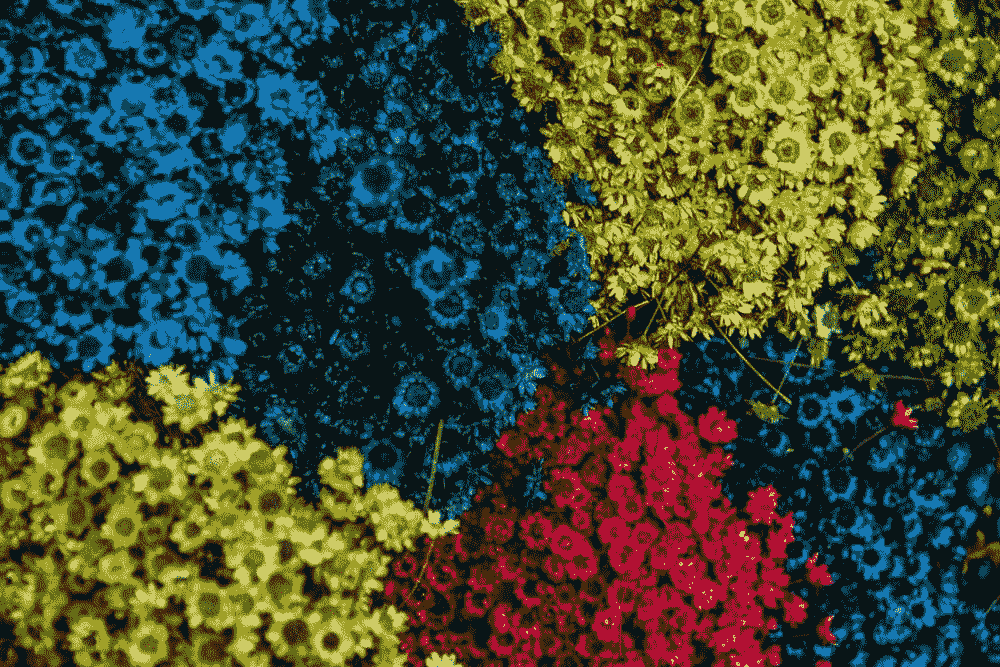

**简介**

K-Means 聚类是一种无监督的机器学习算法，用于解决机器学习中的聚类问题。在现实世界的场景中，可能存在未标记的数据来解决问题。在这种情况下，K-means 算法在解决问题中起着至关重要的作用。由此将未标记的数据分成子组。其中组可以被称为集群。可以通过具有相似大小、形状、度量、特征的数据来进行分组。最后，将数据分组到单独的群集中。这里是 K 值，需要创建多少个集群。有一个单独的技术来确定 k 值。我们将在本文的后面讨论。

**什么是 K-Means 算法？**

K-Means 聚类是一种无监督学习算法，它将未标记的数据集分组到不同的簇中。这里 K 定义了在这个过程中需要创建的预定义的集群的数量，如果 K=2，将有两个集群，对于 K=3，将有三个集群，以此类推。

它是一种迭代算法，将未标记的数据集划分为 k 个不同的聚类，使得每个数据集只属于一个具有相似属性的组。

它允许我们将数据聚类到不同的组中，并且提供了一种方便的方法来发现未标记数据集中的组的类别，而不需要任何训练。

这是一种基于质心的算法，其中每个聚类都与一个质心相关联。该算法的主要目标是最小化数据点和它们对应的聚类之间的距离之和。

该算法将未标记的数据集作为输入，将数据集划分为 k 个聚类，并重复该过程，直到没有找到最佳聚类。在这个算法中，k 的值应该是预先确定的。

k-means 聚类算法主要执行两项任务:

*   通过迭代过程确定 K 个中心点或质心的最佳值。
*   将每个数据点分配到其最近的 k 中心。靠近特定 k 中心的那些数据点创建一个聚类。

因此，每个聚类都有一些共性的数据点，并且远离其他聚类。

下图解释了 K 均值聚类算法的工作原理:


**K-Means 算法是如何工作的？**

假设我们的目标是在数据集中找到几个相似的组，比如:

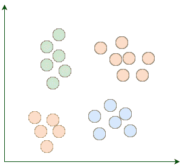

K-Means 从 k 个随机放置的质心开始。质心，顾名思义，是星团的中心点。例如，这里我们添加了四个随机质心:

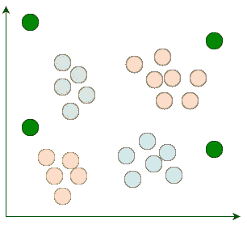

然后，我们将每个现有数据点分配到其最近的质心:

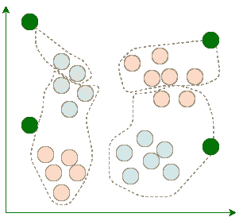

在指定之后，我们移动质心到指定给它的点的平均位置。请记住，质心应该是群集的中心点:

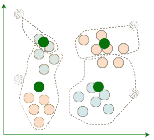

每次重新定位质心后，当前的迭代就会结束。我们重复这些迭代，直到多个连续迭代之间的赋值停止变化:

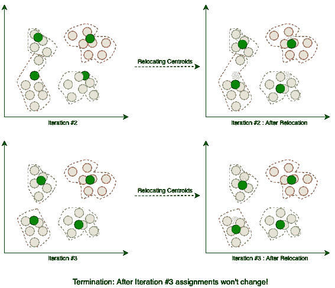

当算法终止时，这四个聚类如预期的那样被找到。

**K 均值聚类方法:**

如果给定了 K，K-means 算法可以按以下步骤执行:

*   将对象划分成 k 个非空子集
*   识别当前分区的聚类质心(平均点)。
*   将每个点分配给特定的聚类
*   计算每个点的距离，并将点分配到距质心距离最小的聚类中。
*   重新分配点后，找到新形成的群集的质心。

循序渐进的过程:

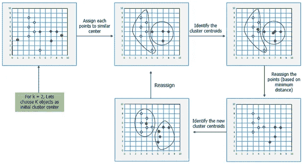

**确定集群的‘k’个数量**

肘方法是寻找最佳聚类数的最流行的方法之一。这种方法使用了 WCSS 值的概念。WCSS 代表聚类平方和内的**，它定义了一个聚类内的总变化量。计算 WCSS 值(针对 3 个集群)的公式如下所示:**

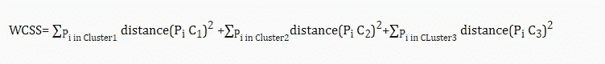

在 WCSS 的上述公式中，


它是聚类 1 中每个数据点与其质心之间距离的平方和，其他两项也是如此。

为了测量数据点和质心之间的距离，我们可以使用任何方法，如欧几里德距离或曼哈顿距离。

让我们开始使用 Python 实现确定 K 值。这里使用 Google collab 来实现。

**导入库**

```
**import** pandas **as** pd
**import** numpy **as** np
**from** google.colab **import** files
uploaded = files.upload()
```

**加载数据集**

```
import io
train_data = pd.read_csv(io.StringIO(uploaded['Mall_Customers.csv'].decode('utf-8')))
```

**显示数据集中的前 5 条记录**

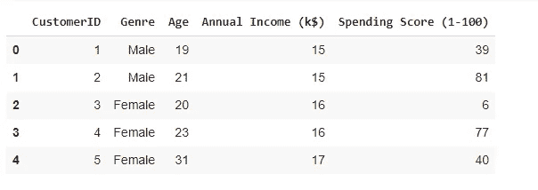

**确定 X 值**

计算年收入和支出分数。

```
**X**= train_data.iloc[:,3:]
**X**
```

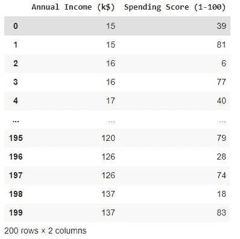

**确定 K 值**

```
**from** sklearn.cluster **import** KMeans
**from** matplotlib **import** pyplot **as** plot 
wcss = []**for** i **in** range (1, 15):
  kmeans = KMeans(n_clusters=i, init='k-means++', random_state=42)
  kmeans.fit(X)
  wcss.append(kmeans.inertia_)
plot.plot(range(1,15), wcss)
plot.title('The Elbow Method')
plot.xlabel('Number of clusters')
plot.ylabel('WCSS')
plot.show()
```

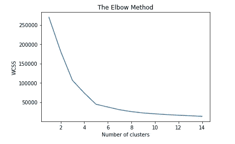

弯曲的尖点或图中的点看起来像一只手臂，那么该点被认为是 K 的最佳值。因此，最佳 K 值是 5。

让我们继续应用 K 值。

```
**kmeans** = KMeans(n_clusters=5, **init**='k-means++',  random_state=42)
**y_kmeans**= kmeans.fit_predict(X)
**y_kmeans**
```

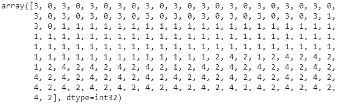

**可视化**

```
plot.scatter(X[y_kmeans == 0]['Annual Income (k$)'], X[y_kmeans == 0]['Spending Score (1-100)'], s = 100, c = 'red', label = 'Cluster 1')
plot.scatter(X[y_kmeans == 1]['Annual Income (k$)'], X[y_kmeans == 1]['Spending Score (1-100)'], s = 100, c = 'blue', label = 'Cluster 2')
plot.scatter(X[y_kmeans == 2]['Annual Income (k$)'], X[y_kmeans == 2]['Spending Score (1-100)'], s = 100, c = 'green', label = 'Cluster 3')
plot.scatter(X[y_kmeans == 3]['Annual Income (k$)'], X[y_kmeans == 3]['Spending Score (1-100)'], s = 100, c = 'cyan', label = 'Cluster 4')
plot.scatter(X[y_kmeans == 4]['Annual Income (k$)'], X[y_kmeans == 4]['Spending Score (1-100)'], s = 100, c = 'magenta', label = 'Cluster 5')
plot.scatter(kmeans.cluster*_centers_*[:, 0], kmeans.cluster*_centers_*[:, 1], s = 300, c = 'yellow', label = 'Centroids')
plot.title('Clusters of customers')
plot.xlabel('Annual Income (k$)')
plot.ylabel('Spending Score (1-100)')
plot.legend()
plot.show()
```

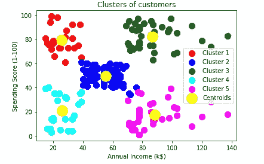

输出图像清楚地显示了五个不同颜色的簇。聚类是在数据集的两个参数之间形成的；客户年收入和支出。我们可以根据要求或选择改变颜色和标签。我们还可以从上述模式中观察到一些要点，如下所示:

*   聚类 1 显示平均工资和平均支出的客户
*   聚类 2 显示客户收入高但支出低
*   集群 3 显示了低收入和低支出
*   聚类 4 显示了高消费的低收入客户
*   Cluster5 显示了高收入和高支出的客户，因此可以将他们归类为目标客户，这些客户可能是商场所有者最有利可图的客户。

现在展示我们如何使用轮廓值方法来找到“k”的值。

```
**from** sklearn.metrics **import** silhouette_samples, silhouette_score
**import** seaborn **as** sns 
clusters_range = range (2,15)
results = []
**for** i **in** clusters_range:
  cluster = KMeans(n_clusters=i, init='k-means++', random_state=42)
  cluster_labels= cluster.fit_predict(X)
  silhouette_avg =  silhouette_score(X, cluster_labels)
  results.append([i, silhouette_avg])
result =  pd.DataFrame(results, columns=['n_clusters','silhouette_score'])
pivot = pd.pivot_table(result,index='n_clusters', values='silhouette_score')
plot.figure()
sns.heatmap(pivot, annot=True, linewidths=.5, fmt='.3f', cmap=sns.cm.rocket_r)
plot.tight_layout()
```

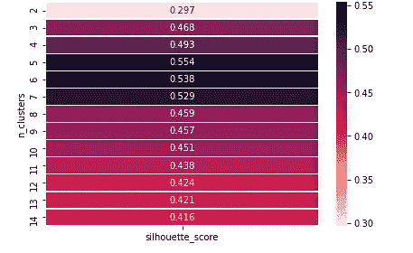

如果我们观察，我们得到 n = 5 时的最佳聚类数，因此我们可以最终选择 k = 5 的值。

**使用 k 均值聚类的优势**

*   容易实现。
*   对于大量的变量，K-Means 在计算上可能比层次聚类更快(如果 K 很小)。
*   k-Means 可以产生比层次聚类更高的聚类。

**使用 k-means 聚类的缺点**

*   难以预测群集的数量(K 值)。
*   初始种子对最终结果有很大影响。

希望这篇文章能让你更好的理解 K-Means 机器学习模型。

另一篇有趣的文章再见。

快乐学习:)