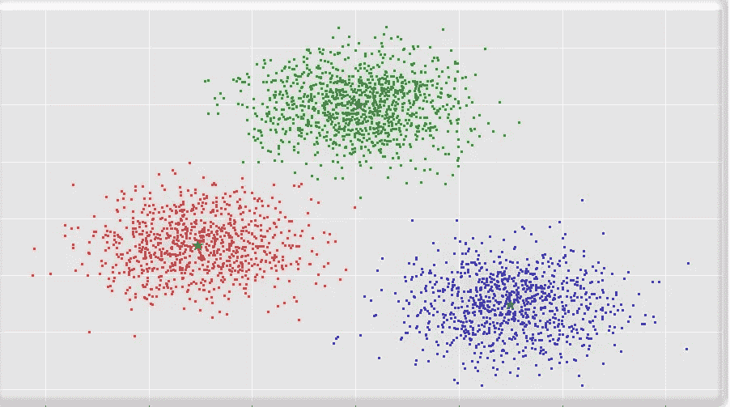
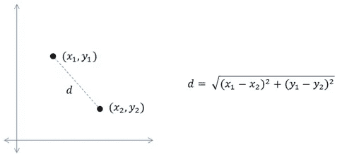
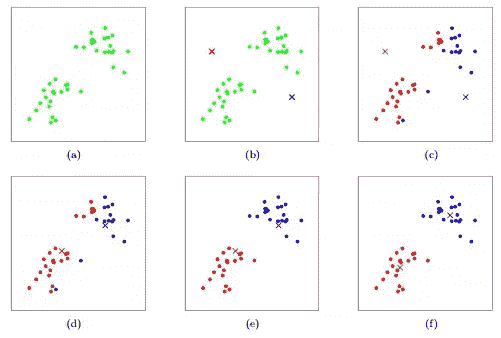

# 数据科学:K 均值聚类

> 原文：<https://medium.datadriveninvestor.com/k-means-clustering-f0140eba8311?source=collection_archive---------3----------------------->

**简介:**

为了理解 K-Means 聚类，让我们首先理解机器学习中的聚类。

聚类是同类或相似数据点的组。它们在一个集群内共享相同的信息，但是这些集群彼此是异构的/不相似的。

让我们给一个恰当的定义

因此，一个群集是它们之间“相似”而与属于另一个群集的对象“不相似”的对象的集合

下图显示了三个集群红色，蓝色和绿色。

**两种聚类技术:**

1.分层聚类

2.非层次聚类。

这里我们将重点讨论**非层次聚类**和 **K-Means** 是一种非层次聚类技术。

## **直觉:**

K-Means 聚类是一种无监督的机器学习算法。在无监督机器学习技术中，不会给定任何目标变量。我们需要分析数据点，找出它们之间的聚类。

我们使用距离作为度量来寻找数据点之间的相似性或不相似性，并使用聚类方差作为形成同质组的度量。

如下所述，有各种距离度量。

1.  欧几里得距离
2.  曼哈顿距离
3.  闵可夫斯基距离

**欧几里德距离:**

欧几里德距离表示两点之间的最短距离。

这里(X2，y2)和(X1，Y1)是二维空间中的两个点，我们使用给定的公式计算两个点之间的距离 d。

我们将使用欧几里德距离进行 K-Means 聚类，所以让我们坚持下去。

**K-Means 中的 K 是什么？**

k 是我们需要在数据集之间找到的聚类数。选择合适的 K 值有助于从数据集中发现本质。

**K 均值聚类的执行步骤:**

1.  假设 K 个质心(对于 K 个簇)。
2.  用这些质心计算每个物体的欧几里德距离。
3.  将对象分配给距离最短的簇。
4.  基于分配给每个簇的
    对象，计算每个簇的新质心(平均值)。获得的 K 个均值
    将成为每个聚类的新质心。
5.  再次重复步骤 2-4，直到出现收敛(即，没有对象从一个集群移动到另一个集群，或者出现阈值数量的迭代)

就是这样。我们完了。现在我们得到的聚类将包含所有相似的数据点。(当我说相似时，我的意思是每个数据点的大多数特征都是相关的。我不是说“相同”，这里的“相同”是指所有特征完全匹配)。

**查看下图:**

步骤(a):拥有所有的数据点

步骤(b)初始化两个质心(红色和蓝色十字)

步骤(c )(d)(e):移动数据点和质心

步骤(f):显示沿着其相似数据点的最终聚类。

image credit: standford.edu

**如何决定最佳聚类数？**

WSS 图或误差平方和图用于确定最佳聚类数。

在分析行业中，WSS 图也被称为碎石图或肘形曲线。图中的肘形表示聚类的最佳值。

 [## 将定义 2020 年就业前景的五大数据科学和机器学习趋势|数据驱动…

### 数据科学和 ML 是 2019 年最受关注的趋势之一，毫无疑问，它们将继续发展…

www.datadriveninvestor.com](https://www.datadriveninvestor.com/2020/02/19/five-data-science-and-machine-learning-trends-that-will-define-job-prospects-in-2020/) 

我们应该从图表中选择最佳的聚类数(基本上是 K ),在图表中我们可以看到肘形曲线的突然下降。比如这里 K=3 是 K 的好选择。

**使用 python 代码一步步实现 K-means:**

**K-Means 聚类的优势:**

1.  快速，更适合用于大型数据集。
2.  使用类内方差作为相似性的度量。
3.  K-Means 保证收敛。
4.  推广到不同形状和大小的群集，如椭圆形群集。

**缺点:**

1.  手动选择 K 值。
2.  质心可能会被离群值拖动，或者离群值可能会得到自己的聚类，而不是被忽略。考虑在聚类之前移除或剪切离群值。
3.  K-means 聚类在算法的不同运行中给出不同的结果。随机选择聚类模式会产生不同的聚类结果，从而导致不一致。
4.  对缩放敏感**。**通过规范化或标准化改变或重新调整数据集将完全改变最终结果。
5.  K-means 算法只能在数值数据中执行。

**结论:** K-Means 是最常用的无监督机器学习算法之一，如果 K 值选择明智，并且适用于大数据集，则用于发现聚类。

希望你喜欢我的文章。请鼓掌(最多 50 次)，这将激励我写更多。

想要连接:

联系方式:[https://www.linkedin.com/in/anjani-kumar-9b969a39/](https://www.linkedin.com/in/anjani-kumar-9b969a39/)

如果你喜欢我在 Medium 上的帖子，并希望我继续做这项工作，请考虑在 [**patreon**](https://www.patreon.com/anjanikumar) 上支持我