# Google BigQuery ML 中的 K-Means 聚类

> 原文：<https://medium.datadriveninvestor.com/k-means-clustering-in-google-bigquery-ml-b02907a961a8?source=collection_archive---------1----------------------->

## 关于 Google BigQuery (data+ML)中最流行和最实用的集群技术的完整指南


Get this image on [Wikimedia Commons](https://commons.wikimedia.org/wiki/File:K-means_convergence.gif) | [License details](https://creativecommons.org/licenses/by-sa/4.0)

在本帖中，详细展示了 K-means 聚类在 Google 云平台(BigQuery)中的实现。任何以前没有接触过 Google 云堆栈的人都应该能够很容易地理解。


[License details](https://decipherzone.com/) Creator: Decipher Zone Softwares Copyright: Created by Decipher Zone Softwares (Free to use content)

## 这篇文章适合你，如果你是:

*   对最常见的业务问题和可以用来解决它的工具感到好奇吗
*   陷入编码 K——意味着要么用 Python 要么用 R 进行集群，并且想要探索
*   零到较少的谷歌云平台经验
*   不确定完整的 K 均值聚类逐步演练
    (定义问题、创建模型、解释)
*   想学习很酷的数据科学的东西(而且实际上很有用)

## 这篇文章不适合你，如果你是:

*   试图获得 k-means 聚类的基本字典理解
*   已经是 ML 的专家了
*   想学 Python/R
*   想编码吗

但是对于那些想重温 k 均值聚类是什么的人来说，

**K-means 概述**

1.  该过程从随机初始化 k 个质心开始。
2.  这些质心用于将点分配给它们最近的簇。
3.  然后，使用聚类内所有点的平均值来更新质心的位置。
4.  重复上述步骤，直到质心的值稳定。

*【参考】(*[*https://blog . Cambridge spark . com/how-to-determine-the-optimal-number-of-clusters-for-k-means-clustering-14f 27070048 f*](https://blog.cambridgespark.com/how-to-determine-the-optimal-number-of-clusters-for-k-means-clustering-14f27070048f)*)*

好的。让我们开始吧


Photo by [Hasin Hayder](https://unsplash.com/@hasinhayder?utm_source=medium&utm_medium=referral) on [Unsplash](https://unsplash.com?utm_source=medium&utm_medium=referral)

# 动机

如果您目前是一名数据分析师/科学家/业务分析师，或者如果您是一名有抱负的数据专业人士，您可能至少曾经遇到过(或听说过)**分类或聚类问题**。它是现实商业案例中最常见的问题之一，也是对各种商业决策影响最大的问题(根据我的经验)。

尽管如此，在许多商业组织中，聚类通常是由最优秀的人(高级成员或高管)来进行的。例如，每月的营销预算简单地根据受众的年龄组来决定(即，不考虑消费习惯、访问频率)。作为数据专业人员，这是一个禁忌。

我们希望利用数据科学来指导团队做出更复杂的猜测。


[License details](https://www.istockphoto.com/legal/license-agreement?utm_medium=organic&utm_source=google&utm_campaign=iptcurl) Creator: structuresxx | Credit: Getty Images/iStockphoto

# 什么是 Google BigQuery？

Google BigQuery 可以提供很大的帮助。

我**保证**你对一种新方法的学习能够有益于在高级编程语言中应用相同的概念(*所以请通读*)

在大多数数字组织中，每个组织都有自己的存储某种数据的数据库，许多组织已经将 Google BigQuery 作为他们的主要 SQL 数据库。因此，了解 Google BigQuery 的功能/可伸缩性是非常有用的，它可以通过许多不同的方式进行扩展。

> BigQuery 是一个完全托管的、无服务器的数据仓库，能够对数 Pb 的数据进行可扩展的分析。它是一个平台即服务，支持使用 ANSI SQL 进行查询。它还具有内置的机器学习功能

 [## BigQuery

### BigQuery 是一个完全托管的、无服务器的数据仓库，能够对数 Pb 的数据进行可扩展的分析。这是一个…

en.wikipedia.org](https://en.wikipedia.org/wiki/BigQuery) 

*本文总结了【谷歌云网站】上的官方文档(*[*【https://cloud.google.com/bigquery-ml/docs/kmeans-tutorial】*](https://cloud.google.com/bigquery-ml/docs/kmeans-tutorial)*)*

对于那些仅仅将 Google BigQuery 视为数据库的人来说，你可能会感到惊讶。

## 目录

本文的先决条件可能是 SQL，但没有必要。

1.  创建新的 GCP 项目
2.  加载演示数据
3.  创建数据集(存储模型)
4.  检查数据
5.  编写一个 SQL 查询
6.  创建 K 均值聚类模型
7.  使用“ml.predict”函数预测分类
8.  商业见解/结论
9.  (可选)删除数据集

## 它是如何工作的

## 1.创建新的 GCP 项目


如果您还没有谷歌云平台帐户，您可以轻松地创建一个。点击谷歌云网站上的“免费入门”后，按照步骤进行操作。这很简单。

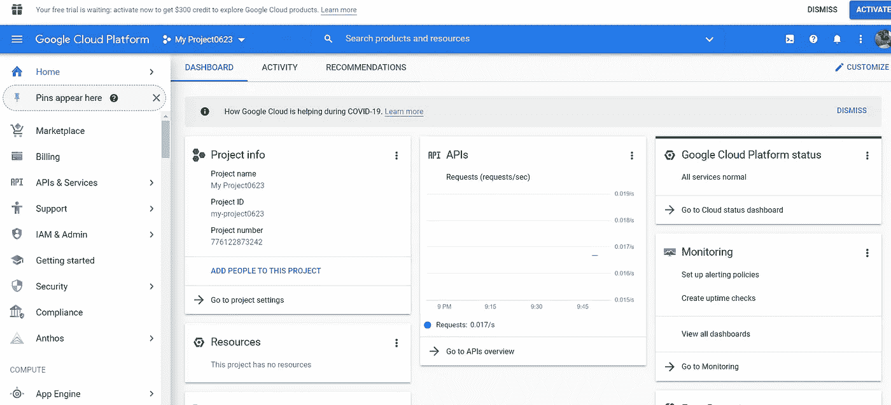

然后，登录【https://console.cloud.google.com/home 控制台】()，你应该会看到这样的东西

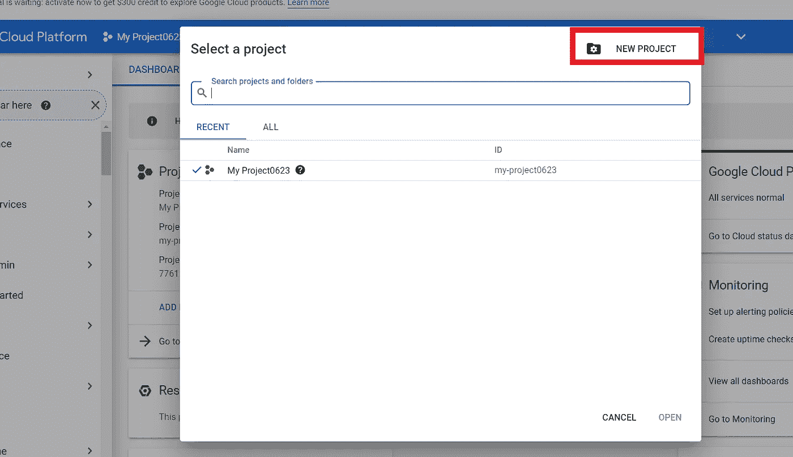

对于本演练，我将在这里创建一个新项目。点击左上角的“选择项目”，点击里面的“新建项目”。

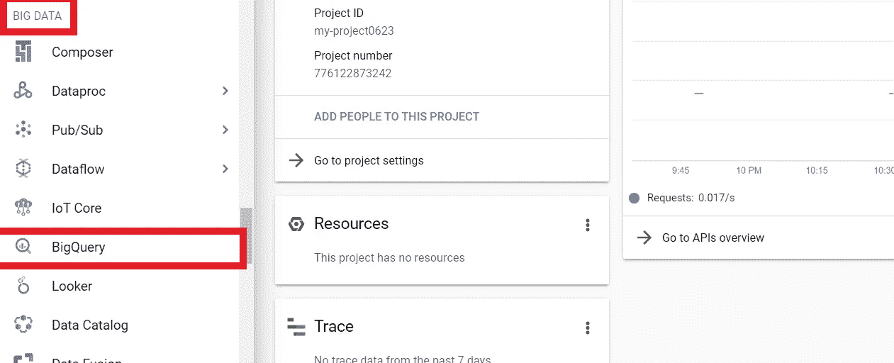

命名您的项目，然后单击“创建”。然后项目被创建。您可以在仪表板格式中查看项目的基本信息。

我们将使用 BigQuery，因此在左侧窗格中找到并单击**【大数据】**→**【Big query】**。

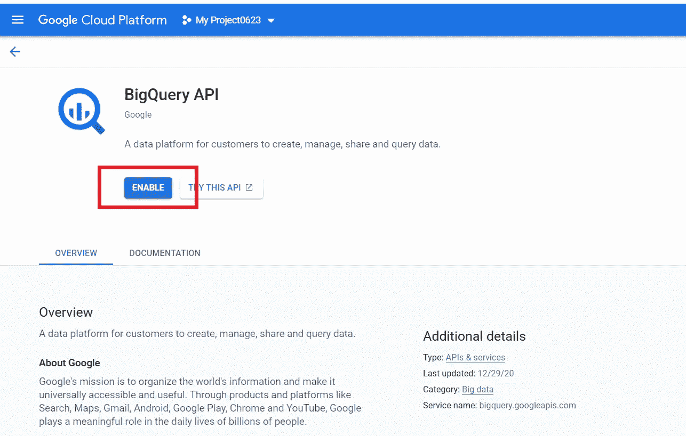

如果你是第一次在 Google 云平台上使用 BigQuery，你会看到这个。点击**‘启用’**

## 2.加载演示数据

BigQuery 有许多演示数据集，每个人都可以免费使用。在这个具体的例子中，我们将使用“伦敦自行车租赁”数据集来构建 K-means 聚类。

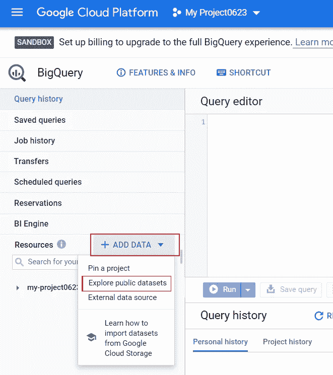

首先，在左侧窗格中找到**"+添加数据"**，点击**‘探索公共数据集’**

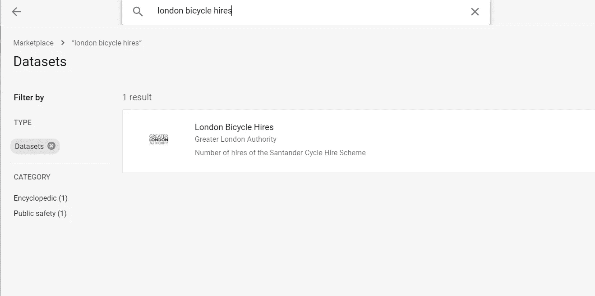

搜索**“伦敦自行车出租”**，点击**“查看数据集”**

然后你可以看到左下角添加了**“big query-public-data”**DB。如果向下滚动*、*时看到*London _ bikes*，那么我们准备好了！

## 3.创建数据集(存储模型)

为了在 BigQuery 中创建 K-means 聚类模型，我们需要创建一个“数据集”来保存我们将要构建的模型。

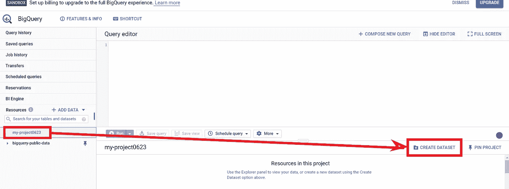

为此，单击您在步骤 1 中创建的**项目 ID** (在我的例子中为 **my-project 0623** )，然后单击监视器右侧的“创建数据集”

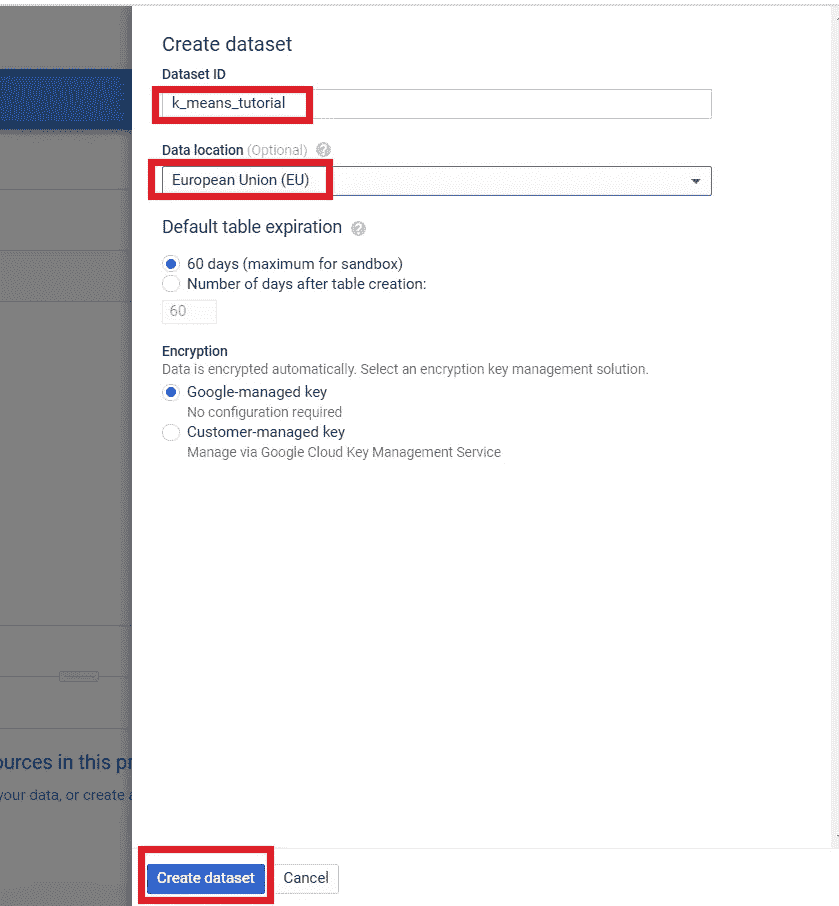

将 **k_means_tutorial** 放入 Dataset ID 中，并确保在数据位置*中选择' **EU** '(伦敦自行车数据存储在 EU 多区域中，因此该数据集也应该位于同一区域中)。*保持其他设置不变，点击“创建数据集”。

## 4.检查数据集

如上所述，我们将使用的数据集是`london_bicycles`数据集，我们将根据以下三个特征对自行车站进行聚类:

*   租赁长度
*   日租次数
*   离城市的距离

`london_bicycles`数据集有两个表(cycle_hire 和 cycle_stations)。您可以单击每个数据集来查看每个表中的列。

**cycle_hire** :以 rental_id 和 bike_id 为关键字的租赁表，其中包含每次自行车租赁的持续时间和起止站点信息

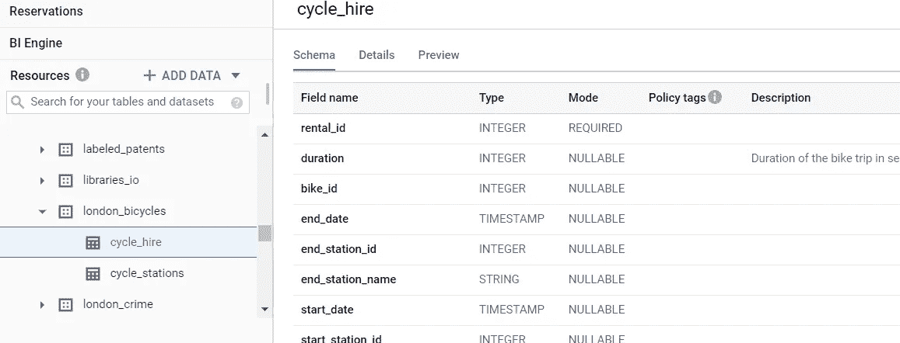

**cycle_stations** :自行车租赁站的数据(经度/纬度和每个站点的自行车数量)


## 5.编写一个 SQL 查询

我们将用来对站进行聚类的变量有

*   租赁长度
*   日租次数
*   离城市的距离

将鼠标悬停在我们创建的 **k_means_tutorial** 项目上，将下面的 SQL 查询复制+粘贴到“**查询编辑器”**中，**点击“运行”**

```
with hs as (
    select 
        h.start_station_name as station_name
        ,if (extract(dayofweek from h.start_date) = 7 or
            extract(dayofweek from h.start_date) = 1,
            "weekend","weekday") as isweekday
        ,h.duration
        ,st_distance(st_geogpoint(s.longitude, s.latitude), st_geogpoint(-0.1, 51.5)) / 1000 as distance_from_city_center
    from `bigquery-public-data.london_bicycles.cycle_hire`as h
    join `bigquery-public-data.london_bicycles.cycle_stations`as s
    on h.start_station_id = s.id 
    where h.start_date between cast('2015-01-01 00:00:00' as timestamp) and
        cast('2016-01-01 00:00:00' as timestamp)
),
    stationstats as (
        select 
            station_name
            ,avg(duration) as duration
            ,count(duration) as num_trips
            ,max(distance_from_city_center) as distance_from_city_center
        from hs 
        group by station_name
)

select *
from stationstats 
order by distance_from_city_center
```

在“查询结果”部分，您应该会看到类似下面的内容

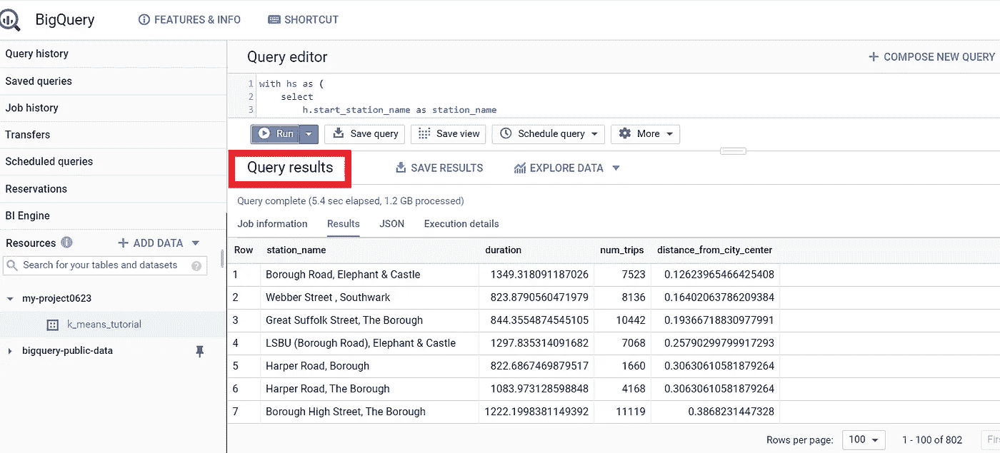

我不打算详细讨论 SQL 查询，因为这不是一篇 SQL 教程文章。简而言之，

*   我们创建了两个临时表‘hs’和‘station stats’作为子查询。
*   “hs”在每行中给出了 2015 年加油站的信息(名称、星期几、租赁期限、距离城市的距离)
*   然后在“stationstats”表中，我们使用聚合函数来计算存储在“hs”表中的一些重要的统计数据

## 6.创建 K 均值聚类模型

现在我们了解了 BigQuery 的基本逻辑，因此我们可以创建一个 K-means 聚类模型。

我们可以制作一个`create model`，用 model_type = 'kmeans '来训练聚类模型。

再次复制+粘贴下面的内容，然后**点击‘运行’**

```
create or replace model
  k_means_tutorial.london_station_clusters OPTIONS(model_type='kmeans',num_clusters=4) as
with hs as (
    select 
        h.start_station_name as station_name
        ,if (extract(dayofweek from h.start_date) = 7 or
            extract(dayofweek from h.start_date) = 1,
            "weekend","weekday") as isweekday
        ,h.duration
        ,st_distance(st_geogpoint(s.longitude, s.latitude), st_geogpoint(-0.1, 51.5)) / 1000 as distance_from_city_center
    from `bigquery-public-data.london_bicycles.cycle_hire`as h
     join `bigquery-public-data.london_bicycles.cycle_stations`as s
    on h.start_station_id = s.id 
    where h.start_date between cast('2015-01-01 00:00:00' as timestamp) and
        cast('2016-01-01 00:00:00' as timestamp)
),
    stationstats as (
        select 
            station_name
            , isweekday
            ,avg(duration) as duration
            ,count(duration) as num_trips
            ,max(distance_from_city_center) as distance_from_city_center
        from hs 
        group by station_name, isweekday
)
select * except(station_name, isweekday)
from stationstats 
order by distance_from_city_center
```

这个 SQL 查询与前一个查询的不同之处仅在于**的两个部分**。

*   我们在上面制作的 *k_means_tutorial* 数据集中添加了一行来创建模型，结果存储为`london_station_clusters`

```
create or replace model
  bqml_tutorial.london_station_clusters options (model_type='kmeans',num_clusters=4) as
```

*   stationstats 表中的' groupby '查询中新增了一列' isweekday '，还增加了`except (station_name, isweekday)`。为此，我们想看看工作日/周末如何影响租赁价格。另外， **Except (column)** 查询排除括号内的列名

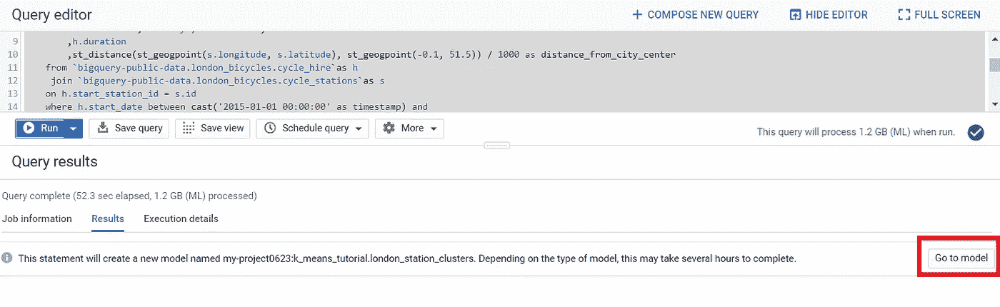

一旦完成，你应该会看到这样的东西。点击**‘转到模型’**，即可查看详情。

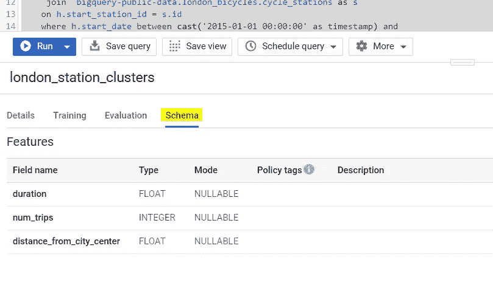

如果你点击“Schema ”,你可以看到这个模型是用三列`(duration, num_trips, distance_from_city_center)`来训练的

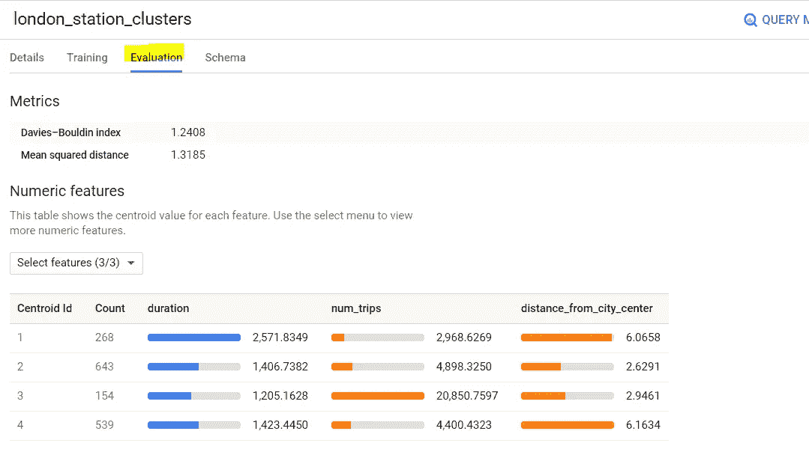

如果您单击“评估”，您可以看到每个集群。由于我们在`create model`中将`num_clusters` 를设置为 4，所以我们有 4 个集群，并且我们看到了“**质心值**”。

## 7.使用“ml.predict”函数预测分类

我们将使用内置的“ml.predict”函数来查找某个电台所属的集群。

```
with hs as (
    select 
        h.start_station_name as station_name
        ,if (extract(dayofweek from h.start_date) = 7 or
            extract(dayofweek from h.start_date) = 1,
            "weekend","weekday") as isweekday
        ,h.duration
        ,st_distance(st_geogpoint(s.longitude, s.latitude), st_geogpoint(-0.1, 51.5)) / 1000 as distance_from_city_center
    from `bigquery-public-data.london_bicycles.cycle_hire`as h
     join `bigquery-public-data.london_bicycles.cycle_stations`as s
    on h.start_station_id = s.id 
    where h.start_date between cast('2015-01-01 00:00:00' as timestamp) and
        cast('2016-01-01 00:00:00' as timestamp)
),
    stationstats as (
        select 
            station_name
            , isweekday
            ,avg(duration) as duration
            ,count(duration) as num_trips
            ,max(distance_from_city_center) as distance_from_city_center
        from hs 
        group by station_name, isweekday
)
select  * except(nearest_centroids_distance)
from ml.predict( 
    model k_means_tutorial.london_station_clusters,
    (
        select *
        from stationstats
)
)
```

上面的查询有两个部分

*   我们创建的 k-均值聚类模型
*   测试集数据(用于预测)

我们添加了`except(nearest_centroids_distance)`来只查看预测的集群

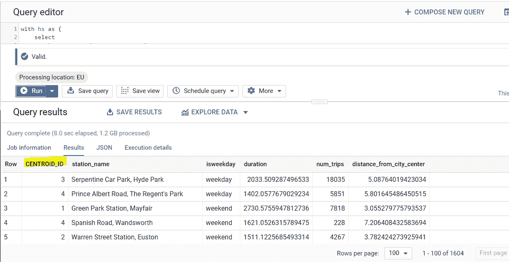

我们可以通过`centroid_id`列看到每一行属于哪个集群

## 8.商业见解/结论

假设您在伦敦市的一个数据科学团队中管理自行车租赁，并且必须根据这种聚类模型提出一个项目计划

我们再来看看评测图


从我们得到的结果，我们可以得出以下结论:

*   集群#1 远离市中心，并且平均距离更长。租赁期限
*   集群#2 离城市最近，不太拥挤
*   集群#3 具有最高的出租(出行)次数，并且靠近城市→这将是最受欢迎的**车站**
*   聚类#4 远离城市，但租赁时间比聚类#1 短

因此，我们可以采取以下业务措施:

*   对于在某些站点安装赛车的 Q1 扩建项目，**集群#1** 将是最好的测试组，因为它距离城市最远**，因此具有**最长的租赁期限****
*   为了深入分析伦敦的租赁模式，我们可以优先考虑第三组,因为它最靠近城市**,并且记录了最高的租赁数量**

上面的建议已经足够强大，可以从 GCP UI 给出的基本信息中得出，为了演示起见，省略了更高级的分析。

## 9.删除数据集

为了防止对本教程中所做的工作产生任何意外的额外费用，让我们从项目中删除数据集。

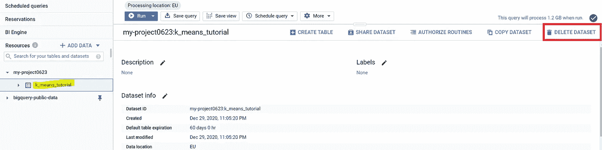

转到您的项目 ID，点击右侧的“**删除数据集**

**非常感谢你阅读这篇文章！如果你认为内容是富有成效的，我会感谢任何支持(分享/喜欢)或鼓掌(👏🏼)按钮很下面。**

# 关于作者

贤俊是一名数据分析师。他拥有加州大学洛杉矶分校的统计学学位。他是一名数据爱好者，喜欢分享数据科学/分析知识。
在 [LinkedIn](https://www.linkedin.com/in/hyunjoonbok/) 上联系他。

## 参考

[](https://towardsdatascience.com/machine-learning-algorithms-part-9-k-means-example-in-python-f2ad05ed5203) [## K-means 聚类 Python 示例

### K-Means 聚类是一种无监督的机器学习算法。与传统的监督机器相比…

towardsdatascience.com](https://towardsdatascience.com/machine-learning-algorithms-part-9-k-means-example-in-python-f2ad05ed5203) [](https://blog.cambridgespark.com/how-to-determine-the-optimal-number-of-clusters-for-k-means-clustering-14f27070048f) [## 教程:如何确定 k-means 聚类的最佳聚类数

### 剑桥火花大学的数据科学家和应用数据科学学生托拉·孙心怡

blog.cambridgespark.com](https://blog.cambridgespark.com/how-to-determine-the-optimal-number-of-clusters-for-k-means-clustering-14f27070048f) [](https://towardsdatascience.com/k-means-clustering-from-a-to-z-f6242a314e9a) [## k-均值聚类:从 A 到 Z

### 关于 K-均值聚类你需要知道的一切

towardsdatascience.com](https://towardsdatascience.com/k-means-clustering-from-a-to-z-f6242a314e9a) [](https://assaeunji.github.io/db/2020-12-11-bigquery_kmeans/) [## 10분 만에 구현하는大质疑 K-평균 클러스터링 모델

### 大查询 ml에서는표준SQL쿼리를사용하여bigquery에서머신러닝모델을만들고실행할수있습니다.(참조:[link)요즘빅쿼리를사용할일들이종종있어“배워야지"하기만하고아직…

assaeunji.github.io](https://assaeunji.github.io/db/2020-12-11-bigquery_kmeans/)