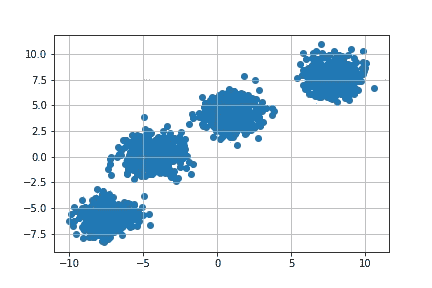
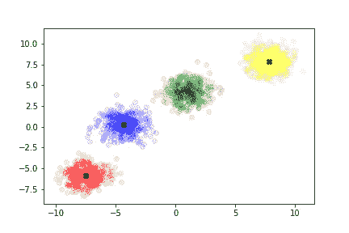

# K-Means 聚类:Python 中的机器学习

> 原文：<https://medium.datadriveninvestor.com/k-means-clustering-machine-learning-in-python-1810231efef5?source=collection_archive---------1----------------------->

通过我们从学习[K-Nearest-Neighbors](https://medium.com/ai-in-plain-english/k-nearest-neighbors-machine-learning-in-python-1c071986d260)-KNN(一种监督学习算法和一种懒惰学习器)中收集的知识，我们发现所有类似的东西都存在于附近。它取决于这个假设是否足够真实，算法是否有用。


Image Source: [towardsdatascience.com](https://towardsdatascience.com/the-5-clustering-algorithms-data-scientists-need-to-know-a36d136ef68#:~:text=Clustering%20is%20a%20Machine%20Learning,the%20grouping%20of%20data%20points.&text=In%20theory%2C%20data%20points%20that,dissimilar%20properties%20and%2For%20features.)

K-Means 也不例外。基于相似性或相似性的相同基本原理，K-Means 也能够将数据点分类成组。在这篇博客中，我们将回顾 K-Means 聚类背后的数学原理，并从头开始构建一个小模型。

# k-均值聚类—简介

K-Means 聚类，也称为 Lloyd's 算法，是一种迭代的、数据分区的、无监督的学习算法，用于将 *n* 个观察值分配给由质心定义的 *K* 个聚类中的一个，其中 *K* 是在算法开始之前选择的。

## 使聚集

聚类的最基本定义是将数据点组合在一起的技术。假设同一组的数据点具有相似的性质或特征，而来自不同组的数据点将具有高度的不相似性。

聚类是一种无监督的学习方法，通常用于许多领域的统计数据分析。对于聚类，我们只尝试通过对数据进行分组来研究数据的结构。

# 算法和数学

K 均值聚类的工作方式是:

*   我们随机选择 *K* 个初始聚类中心(质心)。
*   计算所有观测到每个质心的点到聚类质心的距离。
*   将每个观测值分配给质心最近的聚类。
*   计算每个聚类中观察值的平均值，以获得 *K* 个新的质心位置。
*   重复步骤 2 到 4，直到聚类分配不变，或者达到最大迭代次数。

K-Means 聚类解决问题的方法是**期望最大化算法**。这是一种逼近最大似然函数的迭代方法。该算法分两步工作:

*   **电子步骤** 它包括将数据点分配给最近的聚类。
*   **M 步** 它正在计算每个簇的质心。

K 均值的目标函数是:


其中 ***wᵢₖ = 1*** 为数据点*如果属于集群***k***；否则， ***wᵢₖ = 0*** 。同样，*是*星团的质心。***

***我们通过对 j 相对于*求微分来得到这两个步骤，并更新集群分配— ***E-Step*******

****

**然后我们相对于 ***μₖ*** 对 j 进行微分，并从先前的迭代 ***M 步*** 重新计算聚类分配后的质心**

****

**迭代地使用这些步骤，K-均值聚类能够找到聚类质心。**

# **从头开始实施**

> ****注意:**对于这个示例实现，我们将使用`sklearn.datasets`中的`make_blobs()`函数。**

*   ****导入库****

```
**import numpy as np
from matplotlib import pyplot as plt
from sklearn.datasets import make_blobs  # Only for Dataset creation**
```

*   ****样本数据集****

> ****注意:**强烈建议对`random_state`使用不同的值，以便更好地理解聚类。**

```
**X,y = make_blobs(n_samples = 1500, centers = 4, random_state=3)**
```

*   ****绘制初始数据集****

```
**plt.figure(0)
plt.grid(True)
plt.scatter(X[:,0],X[:,1])**
```

****

**Initial Uncategorized Clusters**

*   ****设置标签、K 值和聚类字典****

```
**k = 4
color=['Red','Yellow','Green','Blue']
clusters = {}
for i in range(k):
  p_mean = 10*(2*np.random.random((X.shape[1],))-1)
  Xp=[]
  cluster = {
       "p_mean":p_mean,
       "Xp":Xp,
       "colors":color[i]
  }
  clusters[i] = cluster**
```

*   ****定义距离功能****

> ****注:**我们这里用了欧几里德距离。尽管如此，我们也可以使用其他方法来计算距离。**随意实验。****

```
**def euclidian(p1,p2):
  return np.sqrt(np.sum((p1-p2)**2))**
```

*   ****定义集群分配功能— *电子步骤*****

```
**def compare(clusters):
  for i in range(X.shape[0]):
    euc_dist = []
    point = X[i]
    for j in range(k):
      dist = euclidian(point,clusters[j]['p_mean'])
      euc_dist.append(dist)
    clstr = np.argmin(euc_dist)
    clusters[clstr]['Xp'].append(point)**
```

*   ****定义寻找聚类点平均值的函数— *M 步*****

```
**def cluster_mean(clusters):
  for i in range(k):
    points = np.array(clusters[i]['Xp'])
    if points.shape[0]>0:
      next_mean = points.mean(axis=0)
      clusters[i]['p_mean'] = next_mean**
```

*   ****创建一个绘图功能****

```
**def plotC(clusters):
  plt.figure()
  for i in range(k):
    pnts = np.array(clusters[i]['Xp'])
    try:
      plt.scatter(pnts[:,0],pnts[:,1],alpha=0.1,c=clusters[i]['colors'])
    except:
      pass
    c_cluster = clusters[i]['p_mean']
    plt.scatter(c_cluster[0],c_cluster[1],color="black",marker="X")
    clusters[i]['Xp'] = []**
```

*   ****迭代寻找最佳匹配****

```
**for i in range(10):
  compare(clusters)
  cluster_mean(clusters)
  plotC(clusters)**
```

****

**Final Cluster Categorization**

**他的博客介绍了 K-Means 聚类算法的基本工作原理，并探究了算法背后的数学原理。本阅读旨在快速有效地复习概念。实现是从头开始的，以单独研究每个功能。要了解更多信息，建议在互联网上单独搜索每个主题。**

> **感谢阅读。
> 别忘了点击👏！**