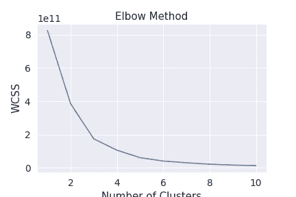
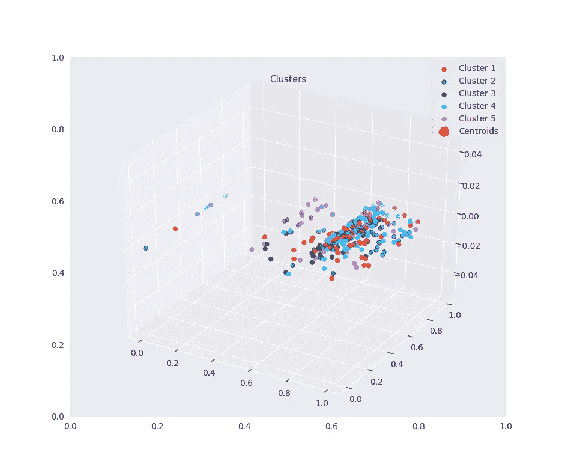
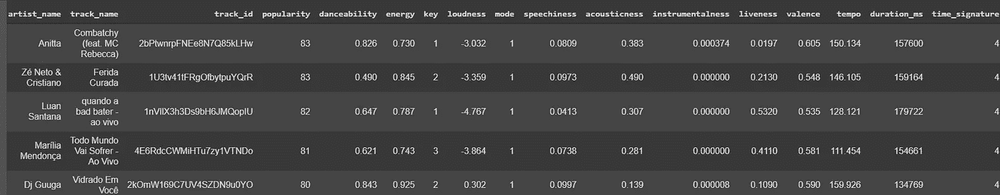
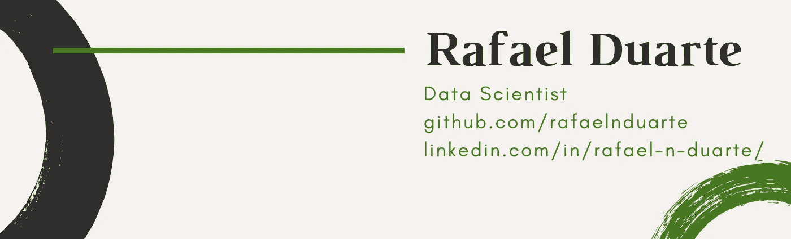

# 使用 Spotify 数据的 k 均值聚类

> 原文：<https://medium.datadriveninvestor.com/k-means-clustering-using-spotify-data-45435a7cd32a?source=collection_archive---------1----------------------->

分析 Spotify 数据并用 K-Means 聚类歌曲

根据他们自己的网站， [Spotify](https://www.spotify.com) 是一种数字音乐、播客和视频流媒体服务，让你可以访问来自世界各地艺术家的数百万首歌曲和其他内容。

# 人工智能和数据科学

像大多数现代科技公司一样，**数据科学**发挥着重要作用。由于它的目标是连接艺术家和他们的观众，**推荐系统**发挥了很大的作用，你每次使用该应用程序时都可以体验到这一点。

**探索周刊**、**每日混音**和我们每年的 **Spotify 包装的**是我们可以举出的一些例子。

你有没有搜索过一首歌，结果发现了许多你喜欢并立即保存的**相似的**歌曲？这也是他们的算法在起作用。

# 该项目

作为一个狂热的 Spotify 用户，我认为它缺少一个功能。我喜欢称之为**心情播放列表**，这将是某种 ***偏向随机*** 模式。

每当你在听你的**保存的**歌曲，你想稍微改变一下，打开**随机**模式是个好主意。这真的是随机的，有时这真的是你想要的。

 [## 数据科学和软件工程哪个更有前途？

### 大约一个月前，当我坐在咖啡馆里为一个客户开发网站时，我发现了这个女人…

www.datadriveninvestor.com](https://www.datadriveninvestor.com/2019/01/23/which-is-more-promising-data-science-or-software-engineering/) 

然而，有时你只是想用你保存的歌曲来为要播放的歌曲设置情绪。这正是这个特性要做的。你选择一首歌曲，点击模式，Spotify 会将最相关的歌曲排列成队列，以便跟上你的心情。

想象一下，你在一个晚餐约会上，想听你保存的那些浪漫的歌曲。当然，你还没有事先准备好播放列表。你所要做的就是选择“*你今晚的样子* t”，打开**心情播放列表**，它会播放所有与你选择的第一首歌曲相似的歌曲。

> 该项目的目标是探索数据，理解相关性，并提出一种算法，作为创建**情绪播放列表**功能的基础。

为此，我们将使用我通过使用 [**Spotify API**](https://developer.spotify.com/) 获得的数据集。关于使用 Python 库[**Spotify**](https://spotipy.readthedocs.io/en/latest/)从 Spotify 获取数据的过程的笔记本可以在这里 找到 [**。**](https://colab.research.google.com/drive/1-c-F9BTy2W2PkuArX0S4Rbp_kNhwB8rI)

此外，感谢 tomi gelo**，感谢他编写了我用来从 Spotify 检索数据的代码。**

**如果您对整个项目感兴趣，包括所有代码和更深入的方法，请单击此处的**。****

# ****机器学习****

****对于我们面临的情况，我们需要将我们的数据点分类成**簇** *、*，然后使用这些来收集这些数据点，在我们的情况下是歌曲，到歌曲序列中，这将成为我们的**情绪播放列表**。****

****参考 [**本帖**](https://towardsdatascience.com/the-5-clustering-algorithms-data-scientists-need-to-know-a36d136ef68) 上 [**走向数据科学**](https://towardsdatascience.com/) 博客:****

> ****“聚类是一种涉及数据点分组的机器学习技术。给定一组数据点，我们可以使用聚类算法将每个数据点分类到特定的组中。理论上，同一组中的数据点应该具有相似的属性和/或特征，而不同组中的数据点应该具有非常不同的属性和/或特征。聚类是一种无监督学习的方法，是许多领域中使用的统计数据分析的常用技术。”****

****在顶级的**聚类**技术中，面向数据科学的**提到:******

*   ****k 均值聚类****
*   ****均值漂移聚类****
*   ****基于密度的噪声应用空间聚类(DBSCAN)****
*   ****使用高斯混合模型的期望最大化(EM)聚类(GMM)****
*   ****凝聚层次聚类****

****对于这个项目，我们将使用 [**K-Means**](https://scikit-learn.org/stable/modules/generated/sklearn.cluster.KMeans.html) 。****

# ****为聚类准备数据****

********

****为了这篇文章的缘故，我不打算进行探索性的数据分析。如果你对 **Spotify** 通过他们的 API 提供的所有许多功能感兴趣，以及它们如何**关联**，影响**人气**和许多其他事情，请确保查看代码为 的 [**完整项目。**](https://colab.research.google.com/drive/1bjnEi_C9tb1YUIQ-IkqvM6IL-_DhjEzE)****

****在那里，我分析了巴西最著名的歌曲，包括分析哪些**特色**对**受欢迎程度**、**热门歌曲**和**艺术家**的贡献，等等。它确实值得你花时间，但不是本文的重点。所以让我们回到正题。****

# ****肘方法——找出正确的聚类数****

****对于 **K-Means** ，我们必须**设置**多个**簇**，以便我们的数据被划分。由于这首先是一个完全随意的任务，我们必须寻找尽可能精确的选项。****

****最流行的方法之一是肘法。基本上，我们为不同数量的**星团**计算不同的场景，然后将它们绘制成一条线。****

> ****我们正在寻找的数字是线条开始变平的位置，使它看起来像图中的一个**弯头**。经过一些测试后，我发现 **5** 集群会产生更好的结果。****

********

# ****数据预处理****

****为了使模型表现得更好，预处理我们的数据是很重要的。为了更好地解释这一步骤背后的原因，我将引用**:******

> ******“k-Means 中的距离计算对每个维度进行同等加权，因此必须注意确保维度单位不会扭曲观察的相对接近度。”******

******经过测试，我发现 **MinMaxScaler** 产生的结果最好。******

# ****k 均值****

****现在我们的数据已经准备好了，我们可以开始使用 **K-Means** 来聚类我们的数据点。****

****这里的目标是将歌曲组织成簇，相似的歌曲放在一起。****

********

****Clusterized Songs****

****由于我们正在处理许多功能，我们的可视化不像第一张图片那么简单。****

****无论哪种方式，我们仍然可以理解可视化，并有一个集群看起来像什么的想法。****

# ******心情播放列表******

******kmeans.predict()** 方法为数据集中的每一行生成一个带有指定分类的数组。为了使这些预测更容易理解，让我们将它们转换成一个数据框，并将其作为一个新列连接到原始数据集。****

********

****Top 5 Songs From Cluster 0.****

****上图中，你可以看到其中一个星团的峰值。个人觉得这几首歌放在一起很有意义。但是不要只相信我的话，你自己听听他们说的话！****

****我创建了 5 个播放列表，每个列表中有 10 首热门歌曲，你可以通过下面的链接来收听它们:****

*   ****[**集群 0**](https://open.spotify.com/playlist/57jMS8wjBbEIUdESyIaJM1?si=xz9kRYFKREy_U8ovW_1tYQ)****
*   ****[**集群 1**](https://open.spotify.com/playlist/70mvWDekbCSUAg8m5Uzep9?si=1fdr-JjNQFyrDB5-oRAIkw)****
*   ****[**集群 2**](https://open.spotify.com/playlist/07D3MZIHFORxdK8jlOH5ng?si=fxE9iVgsT7SxUj4s2oA_fw)****
*   ****[**集群 3**](https://open.spotify.com/playlist/1hx1LjBvMrZSZ5aPxUmy9G?si=ndjOn4dqSsCHwJLXzsLlcg)****
*   ****[**集群 4**](https://open.spotify.com/playlist/0gqVvYxigSfZ0fSTkSVXKI?si=ZXNxJy8pSEG2Il-IyhqXaA)****

******集群 2** 绝对是我的最爱。让我知道哪个是你的！****

# ****结论****

****分析集群，我们可以看到他们有意义，我肯定会发现这些是一个很好的歌曲组合。在生产型推荐系统中，我们经常会有**用户数据**等功能，可以使推荐更加**精细**和**精确**。我们用现有的工具尽了最大努力。****

****值得一提的是:****

*   ****大多数著名的歌曲都在 0 号簇中。****
*   ****聚类之间流行度均值非常相似****
*   ****然而，第 2 组的受欢迎程度平均值比其他组低得多。****

# ****后续步骤****

****这个过程的下一步将是创建一个管道，接收一首新歌，确定将它放入哪个集群，然后识别该集群中最相似的歌曲，并返回许多相似的歌曲供您收听。****

****我将很快实现它，并将更新这篇文章。****

****在我们结束之前，一个快速但重要的免责声明:****

****Spotify 使用了一个**非常好的推荐系统**。他们已经为此工作了**年**，**彻底开发了**他们的算法并**与来自世界各地的**顶级数据科学家团队**一起测试了无数假设**。如果我提到我的项目可以和他们做的一样好，那我就太天真了。但这不是目标。****

> **目标是提出一个**概念**，可以在推荐环境中**打磨**成一个特性，进一步**测试**和**改进**，旨在为他们的用户提供更加**完整的**体验。**

# **谢谢大家！**

**希望你喜欢这个项目到目前为止！如果您有任何问题或建议，请随时通过 [**LinkedIn**](https://www.linkedin.com/in/rafael-n-duarte/) 联系我。还有，一定要在 [**GitHub**](https://github.com/rafaelnduarte/portfolio) 上访问我的 [**作品集**](https://github.com/rafaelnduarte/portfolio) ，并查看我的其他一些项目。**

****