# 均值:营销者的算法

> 原文：<https://medium.datadriveninvestor.com/k-means-the-marketers-algorithm-8b55af7d70e4?source=collection_archive---------18----------------------->

## 基于案例的方法及其应用

Photo by [Cathy Mü](https://unsplash.com/@zyljosa?utm_source=medium&utm_medium=referral) on [Unsplash](https://unsplash.com?utm_source=medium&utm_medium=referral)

# 简介—

我们将在本文中讨论以下几个方面:

1.  探索性数据分析(EDA)来建立我们的直觉
2.  k-均值聚类在行动中
3.  营销人员用这些集群做什么？

让我们拿一个数据集，试着在旅途中揭开概念的神秘面纱。

我们的数据集是一个购物中心的客户数据集合。这种类型的数据通常通过各种来源收集—客户关系管理工具(CRM)、交易数据、停车罚单、抽奖优惠券等。

我们的数据框架包含 200 行客户数据，涵盖 5 个特征或变量。

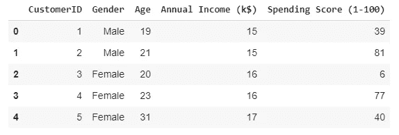

Data set snapshot

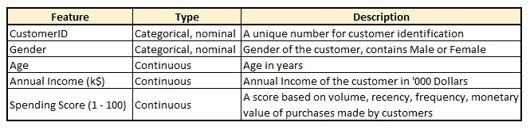

Data dictionary — containing details of various features

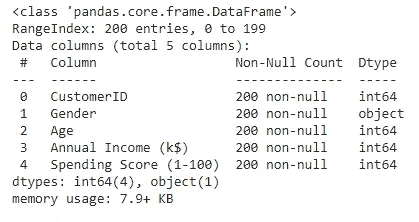

Various feature columns in the data

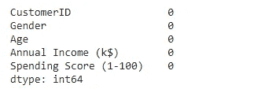

No null values in the data set

由于数据集中没有空值，并且各个字段中的值似乎都是所需的数据类型，因此我们可以直接进行 EDA。

# **1。探索性数据分析—**

## 单变量分析

*   了解购物中心客流量的性别划分——有 112 名女性和 88 名男性，显然女性比男性更多。

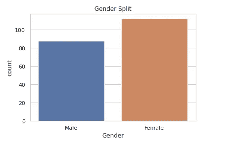

*   各个年龄层的人都来逛商场——20 到 70 岁。年龄分布稍微向右倾斜，这意味着商场有一些非常年长的顾客。顾客的模式类别是 30 至 40 岁的年龄组。

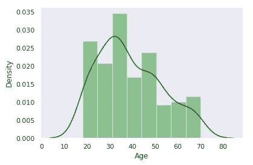

*   购物中心的顾客来自不同的收入水平——每年 1.5 万到 12.5 万以上。收入在 5 万到 7.5 万英镑之间的顾客构成了主要的人群。也有少数非常高收入的客户属于 125k 及以上的收入阶层。

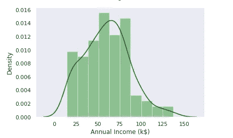

*   支出分数几乎对称地分布在平均值周围。大多数顾客的消费分数在 40 到 60 分之间。

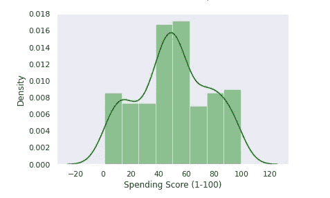

## 双变量分析

*   年龄和消费得分似乎呈负相关，即年轻顾客往往比年长顾客购买更多。

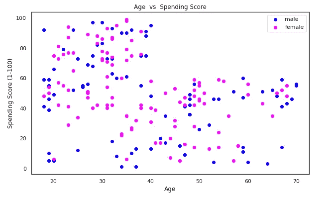

*   收入和支出得分图显示了几组变量组合的一些内在分组。在这个阶段，可以从散点图中明显地识别出 5 个这样的组，看看我们在聚类过程中实际上最终识别出多少个簇将会很有趣。由于图的对称性质，两个变量之间似乎没有相关性。

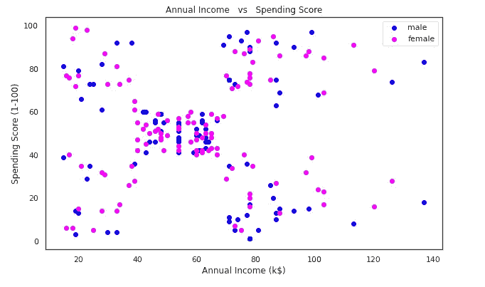

*   年龄与年收入图也具有相当一致的分布，这意味着在特定的年龄和特定的收入水平上存在着大量的客户。对于当前的数据，它们之间似乎没有相关性。

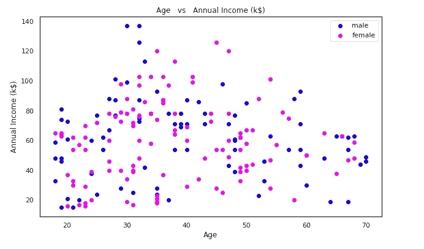

让我们通过检查相关矩阵和热图来验证我们的观察结果。

Correlation Matrix

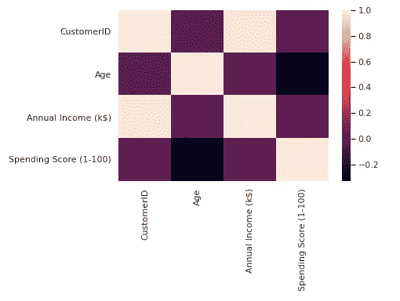

Heat map of all numerical features

年收入和客户 ID 的相关性为 0.977，这很好，但是没有特别的用处，因为客户 ID 只是一个名义上的特征。

我们最初对年龄和花费分数之间的相关性的猜测是正确的，相关系数为-0.328。

 [## 算法是如何将个人和社区置于危险之中的？数据驱动的投资者

### 尽管数学方程看起来遥远而冷漠，但它们通常也与可靠的硬科学联系在一起…

www.datadriveninvestor.com](https://www.datadriveninvestor.com/2020/05/18/how-could-algorithms-put-individuals-and-communities-in-harms-way/) 

# 2.k——意思是集群行动——

通过 K-means 聚类，我们希望根据它们之间的距离(读欧几里得距离)来识别彼此更接近的点，并将它们分组在一个聚类中。这样做，我们将能够获得紧密封装的数据点的集群，即，与同一组内的点共享相似的特征，但与该组外的点不同。

理想情况下，我们希望实现这样的聚类:类内方差最小，类间方差最大。

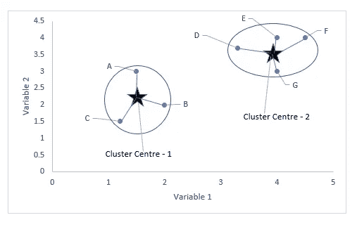

Image by author — Points ABC are similar to each other, hence grouped as Cluster 1, whereas DEFG are similar to each other and grouped as Cluster 2\. However ABC and DEFG are different from each other.

让我们用直觉来测试并应用收入和支出得分图的聚类。

但在此之前，K-Means 算法需要用户输入 K，即我们希望在数据中可视化的聚类数。

我们可以选择 1 个聚类中的所有数据点，也可以选择与数据点一样多的聚类，即 200 个。但最终，我们会希望确定有意义的客户群，这些客户群的规模足够大，并具有一系列共同特征。

那么，我们如何挑选最佳的聚类数呢？

*——*肘击法。

假设我们有一个包含“n”个集群的模型。我们可以找到类内方差，即数据点离类中心的距离，也称为类内平方和(WCSS)。所有集群的 WCSS 总和将为我们提供整个模型的 WCSS。

我们的目标是建立一个最佳模型，其聚类数量足以方便地明确识别客户群，同时以较低的总 WCSS 值进行识别。随着群集数量的增加，我们的总 WCSS 会减少，但我们最终也会有更多的群集，这可能是不切实际的——显然这是一种权衡。

为了确定最佳位置，我们观察了 WCSS 随着集群数量增加而下降的速度。总 WCSS 没有明显下降的临界点是我们的最佳 n 值。

在我们的分析中，我们对 n 从 1 到 8 变化的集群场景进行了实验，并获得了图。

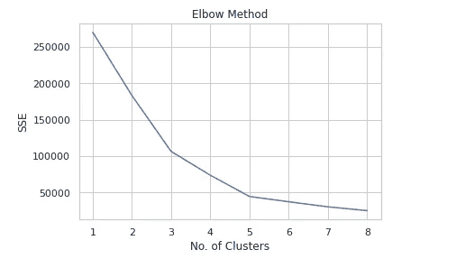

Elbow method showing optimum number of clusters

在 n = 3 和 n = 5 时，我们可以看到一个肘状的形成(因此得名)。但是 WCSS 的斜率在 n = 3 时进一步减小，但是 n = 5 之后的 WCSS 下降非常小。

因为在 n = 5 之后，WCSS 的值没有根本的减少，所以我们选择 5 个聚类并实现 K-means 聚类算法。

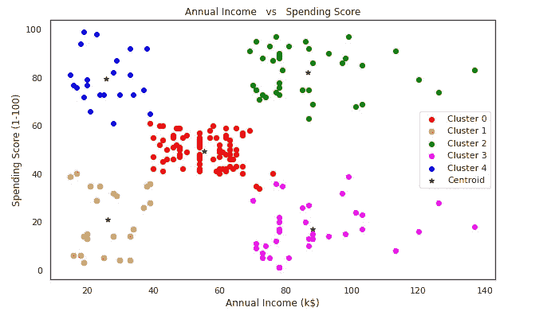

5 Clusters identified by K — Means Algorithm

# 3.营销人员用这些集群做什么？

我们通过 STP 来了解一下。

STP——目标定位细分，是营销人员用来识别和接触目标客户的最基本框架之一。

细分基本上是将顾客分成具有相同特征的群体。

我们希望根据以下内容对客户进行分类

*   人口统计——年龄、性别、教育程度、收入、婚姻状况
*   地理——国家、城市、地点、气候
*   行为——线下或线上购买行为，使用——重度用户或轻度用户，购买频率，寻求的利益，忠诚度
*   心理图形——个性、兴趣、观点、态度、信仰、生活方式、价值观

在分割结束时，我们应该能够清楚地识别这样的集群。

接下来，锁定目标将使我们能够识别最有吸引力或最相关的客户群。确定一组客户群后，我们希望评估每个客户群的吸引力，基本参数如下

*   收入潜力和目标群体的规模——我们不想为很少购买的客户花费太多
*   可访问性——我们接触他们的能力等。

目标定位使我们能够根据我们提供的产品锁定一个或多个目标群体。

最后，通过定位，我们可以将我们的产品与竞争对手的产品区分开来，并创造出理想的品牌形象。定位还可以让我们弄清楚应该传达什么价值主张，以便吸引特定的目标群体。它还可以让我们概念化我们的活动应该是什么样子，或者我们的创意应该关注什么等等。

## 恰当的例子——

我们使用我们的模型，根据年龄和收入等人口统计因素、行为因素(支出分数、行为的代理或指标)确定了 5 个集群。

让我们看看第二组，看看它看起来是什么样的—

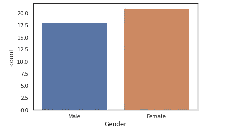

There are 21 Females and 18 Males in Cluster 2

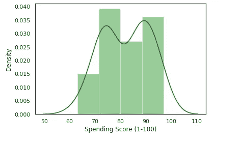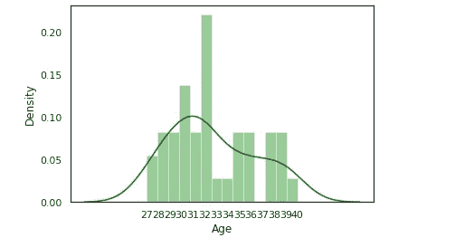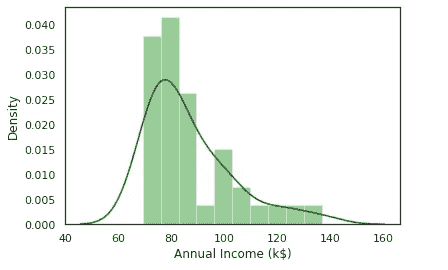

我们可以根据我们的分析建立第二组的侧写-

*   年龄— 27 至 40 岁—职业人士和/或父母
*   消费得分——作为一个整体得分很高的群体，平均值为 82.13，中位数为 83，这些客户喜欢在我们的商场购物。
*   年收入——这是一个高收入群体，范围从 69k 到 137k，平均值为 86.5k，中位数为 79k。平均值大于中值，表明存在一些异常值，即存在少数高收入个人。

基于这些属性，我们甚至可以给聚类 2
*——“高端购物者”*

与其他客户相比，这些客户的消费得分相对较高。我们希望通过承认他们对我们的重要性来鼓励他们的行为，并相应地计划我们的促销活动。我们可以根据这些客户的兴趣和购买历史，为他们提供我们的高端产品，这需要更多的数据。

同样，我们也可以为其他集群构建概要文件。

此外，我们可以建立一个购买者角色——我们理想客户的形象。
可以通过添加更多特征来制作详细版本，包括他们的兴趣、爱好、过去的客户评论、RFM(最近频率货币值)数据等。

我们越了解我们的客户，我们的营销活动成功的机会就越大。

在下一级分析中，我们可以构建稳健的模型，根据购买特定产品的概率对集群成员进行分类。这将有助于使我们的营销活动更侧重于集群内的一组高质量潜在客户，并且更有效地利用我们的预算。

可能性是巨大的！

想象一下，我们跳过这一切，运行一个一刀切的运动，我敢打赌，你会同意这是一个很好的灾难配方。

页（page 的缩写）感谢您的阅读！请在回复中留下您的建设性反馈。

Photo by [Artem Kniaz](https://unsplash.com/@artem_kniaz?utm_source=medium&utm_medium=referral) on [Unsplash](https://unsplash.com?utm_source=medium&utm_medium=referral)

# 参考文献–

1.[数据集](https://www.kaggle.com/vjchoudhary7/customer-segmentation-tutorial-in-python)

2.[达瓦尔·帕特尔的代码基础](https://www.youtube.com/channel/UCh9nVJoWXmFb7sLApWGcLPQ)

3.[与乔希·斯塔默的 StatQuest】](https://www.youtube.com/user/joshstarmer)

4.[机器学习 A-Z:数据科学中的实践 Python&R](https://www.udemy.com/share/101WciB0ITdVpTQnQ=/)

5.[K-意为 Python 代码](https://www.kaggle.com/gadevenkatesh/k-means-clustering-on-mall-data)

## 访问专家视图— [订阅 DDI 英特尔](https://datadriveninvestor.com/ddi-intel)