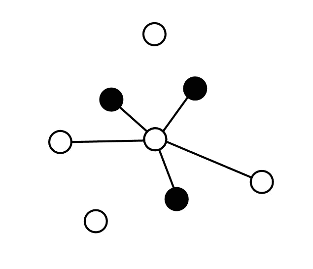
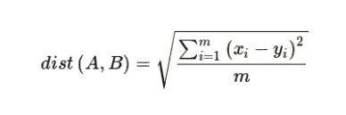
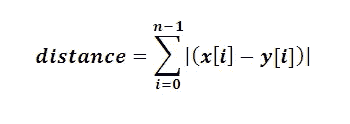

# K 近邻(KNN)介绍—机器学习 101

> 原文：<https://medium.datadriveninvestor.com/k-nearest-neighbours-knn-a9f8ba09cb8b?source=collection_archive---------13----------------------->



k 近邻或 KNN 是基本的机器学习模型之一。它简单、直观、有用。

# **你应该知道的术语:**

> ***分类:*** *分类器是指在给定一些数据的情况下，用机器学习的方法给一个未知的案例分配一个标签。它是* [*监督学习*](https://en.wikipedia.org/wiki/Supervised_learning#:~:text=Supervised%20learning%20is%20the%20machine,a%20set%20of%20training%20examples.) *的一种形式。*
> 
> ***回归:*** *回归是一种将数值/连续输出分配给输入的方法。在回归中，每个单独的输入被映射到一个单独的输出。它是* [*监督学习*](https://en.wikipedia.org/wiki/Supervised_learning#:~:text=Supervised%20learning%20is%20the%20machine,a%20set%20of%20training%20examples.) *的一种形式。*
> 
> ***K:****K-最近邻(KNN)中的 K 是指参与多数表决的邻居数量，用于测试或未知情况的分类*
> 
> ***邻居:*** *邻居是指用于 KNN 分类的数据集中的数据点*

# 什么是 KNN:(K-最近邻)

KNN 是一种受监督的机器学习模型，可用于分类或回归。KNN 利用来自 K 个邻居的**多数票**进行分类。K 的值可以是任何给定的奇数。(1,3,5,…)

KNN 模型的分类或回归过程可以简化为三个步骤:

1.  选择 K
2.  识别 K 个最近邻居
3.  ***(a)分类:*** 输出 K 近邻的众数(最频繁标签) ***(b)回归:*** 输出 K 近邻的均值(平均值)

KNN 可用于多变量或单变量问题。

# 如何选择 K:

选择 K 是一个能真正影响 KNN 模型有效性的过程。因此，知道如何选择 k 很重要。

重要的是要知道，没有特定的统计方法来选择 k。一些方法包括:

> *随机初始化 K 的值并参考精度度量来识别最佳 K*
> 
> *使用公式:* **K = sqrt(N)** *其中 N 是训练数据集中的数据点数*

请记住，较高的 K 值会导致较低的方差和较高的偏差。相反，较小的 K 导致较高的方差和较低的偏差。换句话说，较高的 K 值可能导致过度拟合，而较低的 K 值可能导致拟合不足。

# 如何计算距离:

有许多不同的方法来寻找 KNN 模型的距离。一些受欢迎的包括:

> **欧几里德距离**



这种方法利用勾股定理(A + B = C)来计算一维或多维距离。

> **曼哈顿距离**



曼哈顿距离公式假设两点之间的距离等于它们的绝对差之和。

# 优点:

*   KNN 简单明了，易于理解和实现
*   KNN 并不真正需要传统意义上的“训练”
*   KNN 不强调假设
*   KNN 可以快速适应新数据
*   该算法可用于回归和分类

# 缺点:

*   KNN 算法计算量大且速度慢
*   KNN 的效率与特征的数量成反比
*   使用公共距离(例如欧几里德距离)KNN 要求同质输入(例如这个值的增加与另一个值成比例)
*   缺少值时，KNN 无法正常运行
*   离群值对 KNN 的影响尤其大

[](https://www.datadriveninvestor.com/2020/11/19/how-machine-learning-and-artificial-intelligence-changing-the-face-of-ecommerce/) [## 机器学习和人工智能如何改变电子商务的面貌？|数据驱动…

### 电子商务开发公司，现在，整合先进的客户体验到一个新的水平…

www.datadriveninvestor.com](https://www.datadriveninvestor.com/2020/11/19/how-machine-learning-and-artificial-intelligence-changing-the-face-of-ecommerce/) 

# 从零开始制作 KNN:(python)

让我们用 python 创建一个 KNN 框架！

## 第一步:

用 python 实现欧几里德距离公式

```
import mathdef euclidian_distance(a, b):
 distances = []
 for i in range(len(a)):
  distances.append((a[i] - b[i])**2)
 return math.sqrt(sum(distances))
```

## 第二步:

找到 K 个最近的邻居

```
def find_neighbours(self):
  #predict a single input
  self.dist = []
  for i in range(len(self.X)):
   self.dist.append(['X', euclidian_distance(self.input,self.X[i])])
  for i in range(len(self.Y)):
   self.dist.append(['Y', euclidian_distance(self.input,self.Y[i])])
  self.dist.sort(key=lambda x: x[1])
```

## 第三步:

从单个给定输入生成预测

```
def predict(self):
  self.knn = []
  self.model_type
  #if regression, return mean of knn
  if self.model_type == 'regression':
   for i in range(n_neighbours):
    self.knn.append(self.dist[i][1])
   return sum(self.knn)/len(self.knn)
  #if classifcation, return mode of knn
  if self.model_type == 'classification':
   self.knn = [i[0] for i in self.dist]for i in range(n_neighbours):
    self.knn.append(self.dist[i][0])
   dict_items = [i[0] for i in self.knn]
   return max(set(dict_items), key = dict_items.count)
```

## 第四步:

使用先验函数，迭代多个输入并生成预测

```
def NearestNeighbours(n_neighbours, X, Y, input, model_type):
 preds = []
 for i in range(len(input)):
  selected_input = input [i]
  model = KNN_model(n_neighbours,X,Y,selected_input, model_type)
  model.find_neighbours()
  preds.append(model.predict())
 return preds
```

## 完整代码:

```
import math
from collections import Counterdef euclidian_distance(a, b):
 #implementation of euclidian distance formula between points a and b
 distances = []
 for i in range(len(a)):
  distances.append((a[i] - b[i])**2)
 return math.sqrt(sum(distances))class KNN_model():
 def __init__(self,n_neighbours,X,Y,input, model_type):
  self.n_neighbours = n_neighbours
  self.X = X
  self.Y = Y
  self.input = input
  self.model_type = model_type
 def find_neighbours(self):
  #predict a single input
  self.dist = []
  for i in range(len(self.X)):
   self.dist.append(['X', euclidian_distance(self.input,self.X[i])])
  for i in range(len(self.Y)):
   self.dist.append(['Y', euclidian_distance(self.input,self.Y[i])])
  self.dist.sort(key=lambda x: x[1])def predict(self):
  self.knn = []
  self.model_type
  #if regression, return mean of knn
  if self.model_type == 'regression':
   for i in range(n_neighbours):
    self.knn.append(self.dist[i][1])
   return sum(self.knn)/len(self.knn)
  #if classifcation, return mode of knn
  if self.model_type == 'classification':
   self.knn = [i[0] for i in self.dist]for i in range(n_neighbours):
    self.knn.append(self.dist[i][0])
   dict_items = [i[0] for i in self.knn]
   return max(set(dict_items), key = dict_items.count)

#defining key information
n_neighbours = 1
X = [[2,2],[2,2]]
Y = [[1,1],[1,1],[1,1]]
input = [[0,0],[0,0]]def NearestNeighbours(n_neighbours, X, Y, input, mode_type):
 preds = []

 for i in range(len(input)):
  selected_input = input [i]
  model = KNN_model(n_neighbours,X,Y,selected_input, mode_type)
  model.find_neighbours()
  preds.append(model.predict())
 return predspredictions = NearestNeighbours(n_neighbours, X, Y, input,'classification')
#print predictions
print(predictions)
```

获取专家视图— [**订阅 DDI 英特尔**](https://datadriveninvestor.com/ddi-intel)