# 使用 SAS 完成的 Kaggle 机器学习挑战

> 原文：<https://medium.datadriveninvestor.com/kaggle-machine-learning-challenge-done-using-sas-a71e72a94cf4?source=collection_archive---------1----------------------->

我已经使用 SAS 进行了一段时间的安静，但除了用于纯粹的分析，我还没有使用它进行其他一些通常需要的数据科学功能，如数据管理、清理和插补。所以我决定这样做。我决定在 SAS 中实现的项目并不新奇，但是通过它，我可以尝试 SAS 的各种产品。

# 访问服务协议

学生可以访问 SAS 大学版，也有一项服务允许您在线按需使用 SAS，浏览下面提供的链接应该可以让您找到运行本示例中提供的代码所需的资源。

[https://www . SAS . com/en _ us/software/university-edition/download-software . html](https://www.sas.com/en_us/software/university-edition/download-software.html)

# 基本 SAS 概念

**数据步骤:**数据步骤由一组以数据语句开始的 SAS 语句组成。DATA 语句开始构建 SAS 数据集的过程，并命名数据集。编译组成数据步骤的语句，并检查语法。如果语法正确，则执行语句。最简单的形式是，数据步骤是一个带有自动输出和返回动作的循环。

[](https://www.datadriveninvestor.com/2020/02/19/cognitive-computing-a-skill-set-widely-considered-to-be-the-most-vital-manifestation-of-artificial-intelligence/) [## 认知计算——一套被广泛认为是……

### 作为它的用户，我们已经习惯了科技。这些天几乎没有什么是司空见惯的…

www.datadriveninvestor.com](https://www.datadriveninvestor.com/2020/02/19/cognitive-computing-a-skill-set-widely-considered-to-be-the-most-vital-manifestation-of-artificial-intelligence/) 

**PROC 步骤:**PROC 步骤由一组调用和执行过程的 SAS 语句组成，通常使用 SAS 数据集作为输入。PROCs 分析 SAS 数据集中的数据，生成格式化报告或其他结果，或者提供管理 SAS 文件的方法。您可以用最少的努力来修改过程，以生成您需要的输出。PROCs 还可以执行诸如显示关于 SAS 数据集的信息之类的功能。

# 数据集

对于这个例子，我决定使用 Titanic 数据集的例子，而不是任何新的分析方法，我决定尝试重新创建一个现有的笔记本作为 SAS 程序。因此，在这篇文章中，作为读者的你可以预期对机器学习和数据科学最佳实践的强调会减少，而不是将现有材料翻译成 SAS 代码。

[](https://www.kaggle.com/mrisdal/exploring-survival-on-the-titanic) [## 探索泰坦尼克号上的生存

### 使用 Kaggle 笔记本探索和运行机器学习代码|使用《泰坦尼克号:灾难中的机器学习》中的数据

www.kaggle.com](https://www.kaggle.com/mrisdal/exploring-survival-on-the-titanic) 

上面的笔记本是由 Kaggle 用户 Megan Risdal 创作的，作品简单易懂，也很受欢迎，是泰坦尼克号生存预测比赛中最受欢迎的笔记本之一。它是用 R 编写的，讲述了 Kaggle 风格数据科学的一些基本知识，包括特征工程、清理和基本的树建模。我会试着把她笔记本上的一些代码加入到这篇文章中，但是我可能会去掉一部分，这样看起来会干净一些。建议您同时学习这两个教程。

# 1.加载数据

执行的第一步是加载三个数据集，即训练、测试和提交。按照教程中所做的(我将 Megans 的工作称为“教程”)，创建了一个名为 full 的数据集，它是通过将训练和测试数据集堆叠在一起而创建的，对于熟悉 r。

```
proc import datafile = '/home/***/Titanic/Data/train.csv'  
    out = train 
    dbms=csv 
    replace;
run; proc import datafile = '/home/***/Titanic/Data/test.csv'  
    out = test 
    dbms=csv 
    replace;
run;proc import datafile = '/home/***/Titanic/Data/gender_submission.csv'  
    out = submission 
    dbms=csv 
    replace;run;data full; 
    set train test;
run;
```

代码执行前面描述的内容。有几种方法可以将“csv”文件导入 SAS，但最简单的方法是使用 Proc(过程的缩写)导入。在代码中，我遵循的基本步骤是，首先描述我要读取的文件的路径，声明我的“SAS-Dataset”的名称，该名称将主动用于分析，指定我要读取的数据类型为“CSV ”,最后允许 SAS-Dataset 名称被替换或覆盖。

```
*The first line is used to specify plot size;
ods graphics / width=640px height=480px;  
proc print data = full(obs = 5);  
title 'Sample output of the Data'; 
run; proc contents data=full; *For meta data; 
title 'Summary of training data'; 
run;
```

现在让我们看看我们的数据。SAS 是一个很棒的报告工具，可以生成大量的信息图表，其中大部分我不会展示。PROC 内容是生成数据集元数据的好方法。

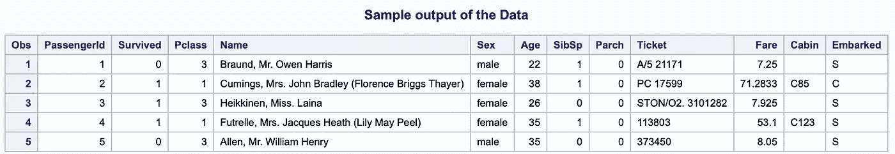

Output for PROC PRINT

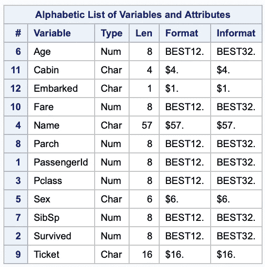

Output for PROC CONTENTS

# 2.特征工程

## 2.1 名字里有什么？

第一个特征工程步骤包括从名字中提取标题。使用 R，这个过程相对简单，但是在 SAS 中需要的步骤稍微有点复杂，但是仍然可以实现。

```
full**$**Title <- **gsub**('(.*, )|(\\..*)', '', full**$**Name)
```

上面的代码片段是从乘客姓名中提取标题的 R 代码。

```
/*Helpr macros for SAS*/%macro Reg_searchReplace(df= , col=, newcol= , regex=);
 data &df;
  set &df;
   &newcol = &col;
   array Chars[*] &newcol; 
   do i = 1 to dim(Chars); 
    retain re;
    re = prxparse(&regex); 
    Chars[i] =  prxchange(re, -1,Chars[i]); 
    ;  
   end;
   drop re i;*drop newly creatd temp columns;
 run;%mend Reg_searchReplace;
```

在本教程中，正则表达式用于优雅地从一个名字中提取标题。SAS 也有正则表达式功能，但是要对“Name”列中的所有数据点进行大规模的正则表达式运算，需要一个 for 循环。为此，我创建了如上所示的宏(宏是 SAS 函数)。

```
*import macros from tools;
%include '/home/***/Titanic/Code/tools.sas';
```

宏被保存到不同的 SAS 文件中，并使用 include 语句加载到当前文件中。

```
%Reg_searchReplace(df = full, col = Name, newcol = Title_col, 
regex = 's/(.*, )|( .*)//');
```

指定了数据集、列名、新列名和正则表达式模式，运行搜索和替换功能从乘客姓名中提取标题。现在我们使用“Proc Freq”创建信息图表，这是一种制作列联表的简便方法。

```
proc freq data = full;
title 'Contingency Table of Male and Female and their Titles';
tables Sex*Title_col / nopercent nocol norow;
run;
```

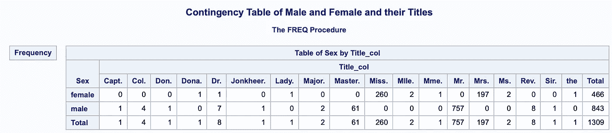

PROC FREQ Output

下一步是纠正“标题”中的一些拼写错误，然后将所有不常用的标题(如 Jonkheer、Dona 等)分组。)合并成一个叫“稀有”的单组。

```
*replace unfrequent titles with rare;
 data full;
  set full;
   Title_col = translate(Title_col,'','.');
   Title_col = translate(Title_col,'',' '); 
   re = prxparse('s/Mlle/Miss/');
   Title_col = prxchange(re, -1,Title_col);
   re = prxparse('s/Ms/Miss/');
   Title_col = prxchange(re, -1,Title_col);
   re = prxparse('s/Mme/Mrs/');
   Title_col = prxchange(re, -1,Title_col);
   array Chars{11} $ ('Dona', 'Lady', 'the Countess','Capt', 'Col', 'Don', 'Dr', 'Major', 'Rev', 'Sir', 'Jonkheer'); 
   do i = 1 to dim(Chars);
    regex_1 = catx('','s/',Chars[i]);
    regex_1 = compress(catx('',regex_1, '/Rare/'));
    re = prxparse(regex_1); 
    Title_col =  prxchange(re, -1,Title_col); regex;
    ;  
   end;
   drop Chars1 Chars2 Chars3 Chars4 Chars5 Chars6 Chars7 Chars8 Chars9 Chars10 Chars11 regex_1 i re;

 run;
```

在 SAS 中执行时间稍长，但是一旦理解了基础知识，就很容易分解和解决大问题。诸如 translate 和 scan 之类的函数对于文本处理来说是必不可少的，但是对于更繁重的操作来说，regex 总是最好的，这里使用 regex 来进行拼写纠正。稍后，重新应用正则表达式来替换不太常用的标题组，并用“稀有”替换它们。要查看这些变化，可以使用 PROC FREQ。

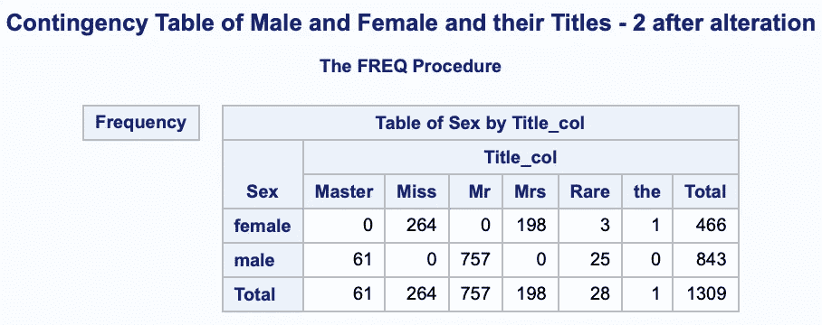

## 2.2 一家人是一起沉还是一起游？

这一步需要通过添加变量“Parch”和“Sibp”来计算家庭规模，使用 SAS 数据步骤很容易实现这一点。在数据步骤中，我们读取 sas 表“full”并用编辑过的变量“Fsize”和“FsizeD”重写该表(使用“set”)。“FsizeD”是“Fsize”变量的离散化版本，可以在 SAS 中使用简单的“if then”语句来实现。

```
*Analysis on Family Size;
 data full;
  set full;
   Fsize = SibSp + Parch + 1;
   FsizeD = 'Singleton';
   if Fsize > 1 and Fsize < 5 then FsizeD = 'samll';
   if Fsize > 4 then FsizeD = 'large';
  run;
```

下一步是观察不同家庭规模的不同性别的生存前景。为此，我们使用“SGPLOT”函数，它需要一个输入数据集。然后，我们将每个不同家庭规模的频率可视化，并输入其他变量对可视化进行分组。

```
proc sgplot data = full;
  vbar Fsize / group= Survived groupdisplay = cluster;
 title 'Survival vs Family Size';
 run;
```

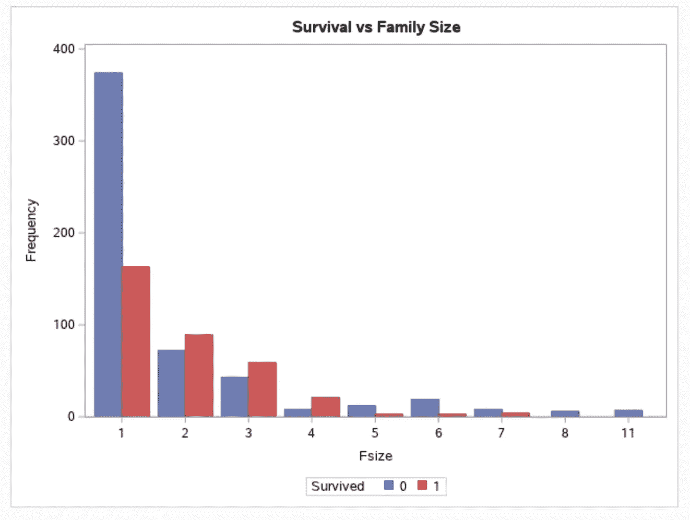

教程中指定的下一步是创建镶嵌图，以显示与上述相同的信息，并增加了一个使用离散化族尺寸而不是上述族尺寸的步骤。这个过程可以使用 PROC FREQ 来实现，并传递一个附加指令来构造一个镶嵌图。

```
ods graphics on;
 proc freq data=full;
 tables Survived*FsizeD / norow nofreq plots=MOSAIC; 
 title 'Mosaic Plot Fsize Desc. vs Survived';
 run;
```

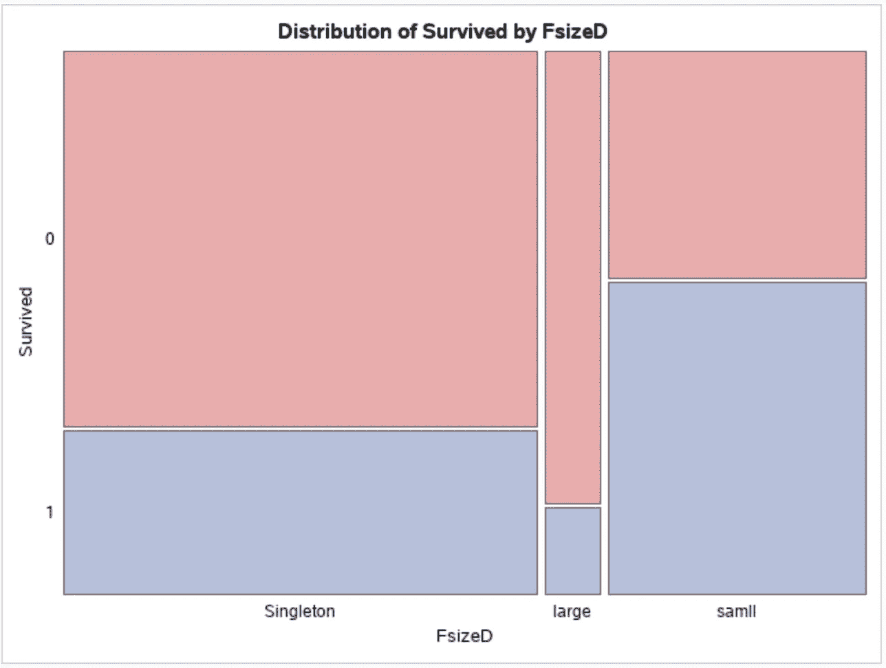

## 2.3 处理更多的变量…

最后，我们设计了变量“船舱”，这是变量“甲板”的第一个字符。为了完全公开，这个变量有许多缺失值，并从最终模型中删除，但尽管如此，经历这个过程是数据管理和特征工程中的一个很好的练习。我们使用 SAS 函数“substr”从目标变量中检索第一个索引字符。

```
*Extract deck from cabin;
 data full;
  set full;
   Deck = substr(Cabin,1,1);
 run;
```

# 3 个缺失值

## 3.1 合理价值估算

数据清理的重要性怎么强调都不为过。通常，像 R & Python 这样灵活的语言更适合使用能够处理各种数据类型的多功能函数来清理数据。SAS 也包括类似的数据清理功能。我们的第一个目标是估算 PassengerID 63 & 830 的值，它缺少变量“apollowed”。为此，我们使用变量“Fare”的分布来完成。

```
proc sgplot data = full;
  vbox Fare / category=Embarked group=Pclass;  
  refline 80;
 title 'Fare vs Embarkment';
 run;
```

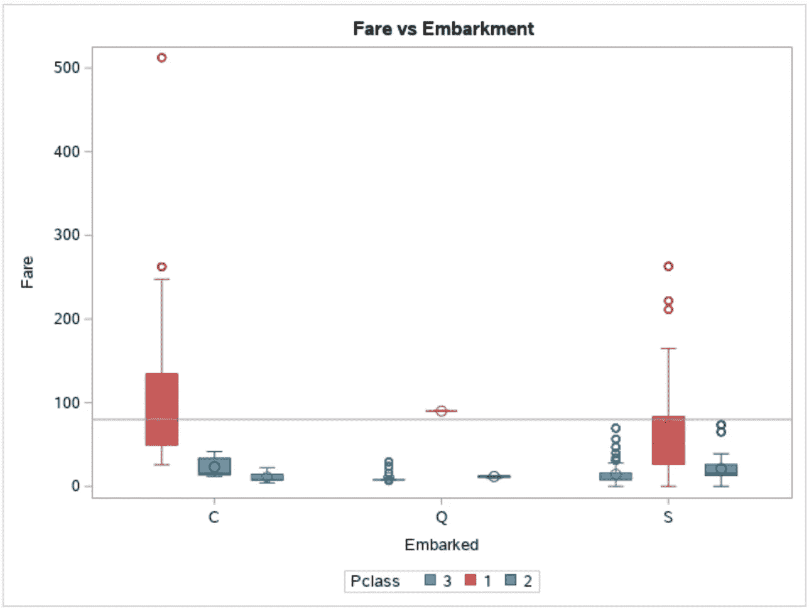

想法是；假设我们知道乘客编号 63 和 830 的机票价格为 80 英镑(上面未显示，但分析是单独进行的)，并且假设这两名乘客都属于头等舱(“Pclass”)，那么最有可能的登机地点是哪里(C、Q、S)。参考线为 80°箱线图用于说明这一点。基于视觉，很容易看出，根据给定的信息，乘客很可能是从位置“C”出发的。然后，我们使用数据步骤，用我们的分析值估算乘客信息。

```
data full; 
  set full;
   if PassengerId = 62 then Embarked = 'C';
   if PassengerId = 830 then Embarked = 'C';
 run;
```

现在，在进入下一阶段之前，重要的是要找出我们的数据集中每一列存在多少缺失值。为此，下面的过程能够检索所需的信息。

```
proc format;
   value $missfmt ' '='Missing' other='Not Missing';
   value  missfmt  . ='Missing' other='Not Missing';
 run;

 proc freq data=full; 
  format _CHAR_ $missfmt.; 
  tables _CHAR_ / missing missprint nocum nopercent;
  format _NUMERIC_ missfmt.;
  tables _NUMERIC_ / missing missprint nocum nopercent;
 run;
```

同样，PROC FREQ 能够做到这一点，上面应用的方法的好处是不需要手动输入列。使用“_CHAR_”和“_NUMERIC_”检索所有需要的列，唯一的警告是我们需要在两者上运行过程(也可以尝试“_ALL_ ”)。下面显示了该过程输出的一个小示例。

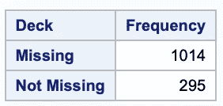

Example output from procedure.

接下来，我们创建一个宏，它能够从数据集中找到并选择包含缺失值的行。

```
%macro getMissing(df=);data missing;
  set &df;
   numMissing = 0;
   array cols1 _numeric_;
   do over cols1;
    numMissing = numMissing + cmiss(cols1);;
   end;

   array cols2 _character_;
   do over cols2;
    numMissing = numMissing + cmiss(cols2);;
   end;
 run;

 proc sql;
 title 'Rows with missing values'; 
 select * from missing where numMissing > 0;
 quit;%mend getMissing;
```

上面显示的过程(检索每列的缺失值)显示，“Cabin”、“Deck”和“Age”有许多缺失值，排除它们并运行上面的宏将找到任何需要特别注意的行。

```
*Subset dataframe with columns that don't have too many missing values;
 data sub_full;
  set full;
   drop Cabin Deck Age Survived;
  run;
 %getMissing(df = sub_full);
```

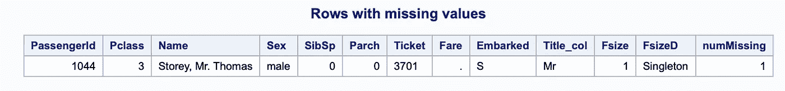

它揭示了乘客 Id 1044 有一个丢失的票价，我们将使用票价中值估算该值。首先我们将分布可视化。

```
proc sql;
 create table sub_full as
 select * from full
 where Pclass = 3 and Embarked = 'S';
 quit;proc sgplot data = sub_full;
 title 'Density of Fare'; 
 histogram Fare;
 *refline 21 / axis = x;
 run;
```

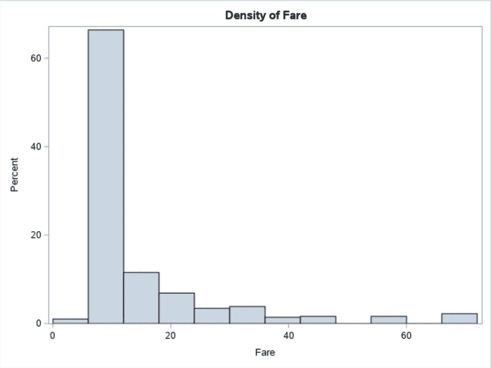

接下来，我们将使用上面显示的票价中值来估算缺失值。为此，我们将利用 PROC SQL，这是一个方便的过程，允许将 SQL 查询应用于 SAS 表。

```
*impute values with median value;
 proc sql;
     update full
     set Fare = (select median(Fare) from sub_full) 
     where PassengerId = 1044;
 quit;
 run;
```

接下来，我们询问我们的插补是否成功。

```
proc sql;
  select * from full
  where PassengerId = 1044;
 quit;
```

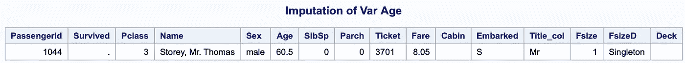

PassengerId 1044 来自测试集，因此幸存下来的可以保持原样，我们的最终目标是预测它。

## 3.2 预测插补

为了估算缺失的年龄值，我们将创建一个预测模型。这就是我使用的步骤与原始教程不同的地方。最初，R 中通过链式方程进行多变量插补的 MICE 包被用于输入“年龄”,但由于我在 SAS 中搜索类似方法被证明不成功，我决定使用 PROC MI。

```
proc mi data= full nimpute=1 out=full seed=54321;
 class Embarked FsizeD Title_col Sex;
 monotone regression ;
 var Pclass Fsize Parch Embarked FsizeD Title_col Sex Age;
 run;

 data full;
  set full;
   Age = abs(age);
 run;
```

这个过程的输出是通过分布直方图可视化的，虽然输出不如教程令人满意，但它完成了工作。任何出现的负值都被转换为绝对值(这也可以通过在程序步骤中指定“最小值”来实现)。

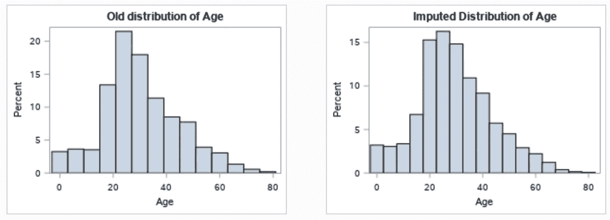

More info on PROC MI [https://support.sas.com/documentation/onlinedoc/stat/141/mi.pdf](https://support.sas.com/documentation/onlinedoc/stat/141/mi.pdf)

## 3.3 特征工程:第 2 轮

为了验证我们创建识别母亲和孩子的特征的动机(我们认为这可能是预测中的一个重要因素)，我们使用直方图来查看年龄和性别(母亲和决定是否要孩子的因素)对存活率结果的影响。

```
data sub_full;
  set full;
  if cmiss(of Survived) =0;
 run;
 proc sgpanel data = sub_full;
 title 'Age faceted by Survival & Sex';
 panelby Sex;
 histogram Age / group=Survived nbins= 30;
 run;
```

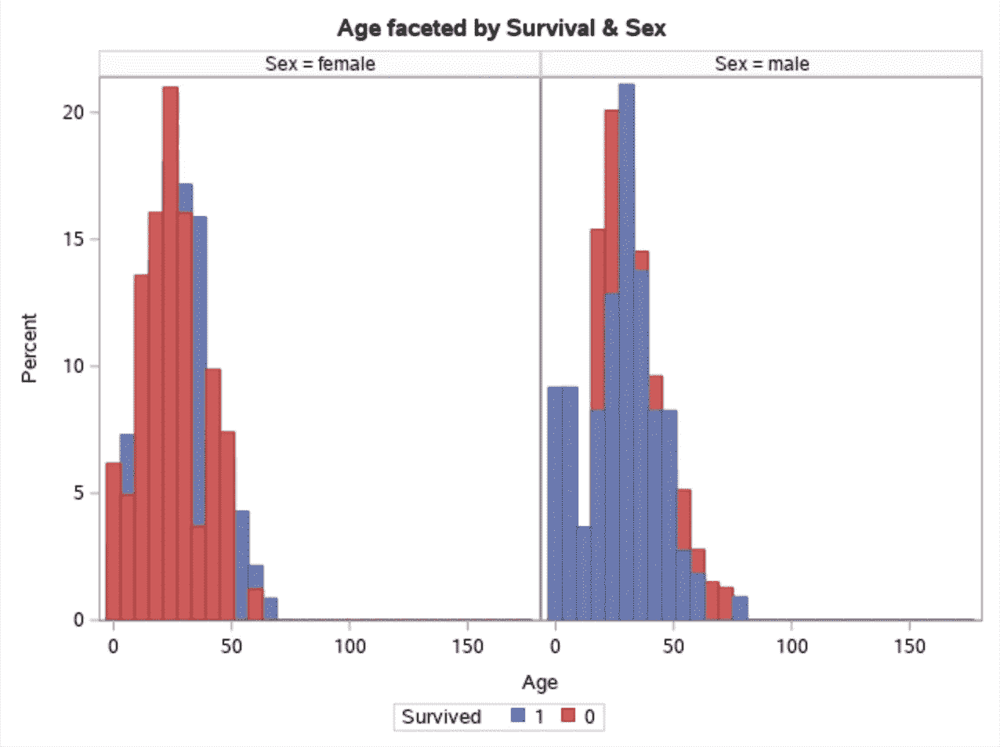

基于这些信息，我们构建我们特征的剩余部分，然后我们创建列联表来识别它们的频率。

```
data full;
  set full;
   Child = 'Child';
   if Age >= 18 then Child = 'Adult';
   Mother = 'Not Mother';
   *[https://www.educba.com/sas-operators/](https://www.educba.com/sas-operators/);
   if Sex = 'female' and Parch > 0 and Age > 18 and Title_col ~= 'Miss' then Mother = 'Mother';
 run;

 data sub_full;
  set full;
  if cmiss(of Survived) =0;
 proc freq data = sub_full;
 title 'Contingency Table Child Var';
 tables Child*Survived / nopercent nocol norow;
 run;

 proc freq data = sub_full;
 title 'Contingency Table Mother Var';
 tables Mother*Survived / nopercent nocol norow;
 run;
```

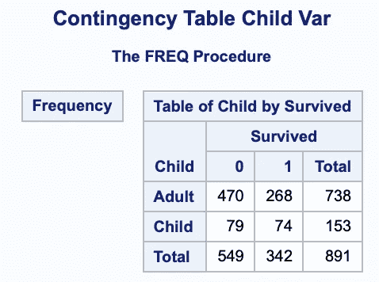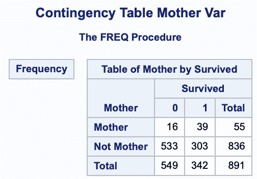

现在我们已经完成了插补和特征工程，我们可以选择好的变量，并继续进行预测建模。另一个缺失值检查已经完成(输出没有显示)，这验证了我们可以进入下一阶段。

# 4 预测

## 4.1 分成训练集和测试集

我们还选择没有太多缺失值的变量。

```
Data Train;
  set full;
   if PassengerId <= 891;
   keep Survived Pclass Sex Age SibSp Parch Fare Embarked Title_col FsizeD Child Mother;
  run;
 Data Test;
  set full;
   if PassengerId > 891;
   keep Pclass Sex Age SibSp Parch Fare Embarked Title_col FsizeD Child Mother;
  run;
```

## 4.2 建立模型

接下来，我们使用选择的变量拟合随机森林模型。为此，我们使用了 PROC HPFOREST。最初，我们并不关注模型优化，而是仅仅拟合模型并获得特征重要性信息和基本训练误差信息。

```
proc hpforest data = Train maxtrees = 50 seed = 14561 trainfraction=0.85;
 input Pclass Sex Age SibSp Parch Fare Embarked Title_col FsizeD Child Mother;
 target Survived / level = BINARY;
 ods output FitStatistics = fit_at_runtime;
 ods output VariableImportance = Variable_Importance;
 ods output Baseline = Baseline;
run;
```

接下来，我们将错误和误分类错误可视化。

```
title "The Average Square Error";
 proc sgplot data = fit_at_runtime;
  series x=NTrees y=PredAll/legendlabel='Train Error';
  series x=NTrees y=PredOOB/legendlabel='OOB Error';
  xaxis values=(0 to 50 by 1);
  yaxis values=(0 to 0.3 by 0.05) label='Average Square Error';
 run;
```

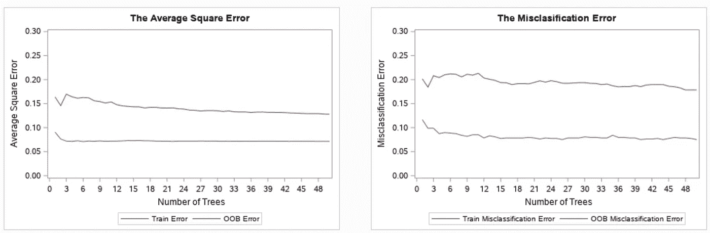

出袋(OOB)误差，也称为出袋估计，是一种测量[随机森林](https://en.wikipedia.org/wiki/Random_forest)、[增强决策树](https://en.wikipedia.org/wiki/Gradient_boosting)和其他[机器学习](https://en.wikipedia.org/wiki/Machine_learning)模型预测误差的方法，利用 [bootstrap 聚合](https://en.wikipedia.org/wiki/Bootstrap_aggregating) (bagging)对用于训练的数据样本进行子采样。OOB 是每个训练样本 *xᵢ* 的平均预测误差，仅使用在其引导样本中没有 *xᵢ* 的树。([https://en.wikipedia.org/wiki/Out-of-bag_error](https://en.wikipedia.org/wiki/Out-of-bag_error))

分类准确率也很容易通过取值反过来变成误分类率或者错误率，比如:错误率= (1 —(正确预测/总预测))* 100。([https://machine learning mastery . com/confusion-matrix-machine-learning/](https://machinelearningmastery.com/confusion-matrix-machine-learning/))

## 4.3 可变重要性

通常，训练随机森林模型的下一步涉及计算输入算法的每个特征的重要性。

```
title "Feature Importance Gini";
 proc sgplot data = Variable_Importance;
 vbar Variable /response=Gini  groupdisplay = cluster categoryorder=respdesc;
 run;
```

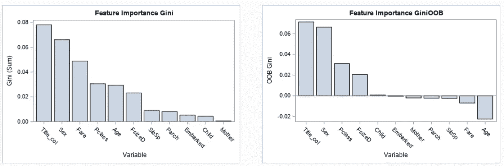

可以进行两种类型的特征重要性计算，一种使用袋外(OOB)样本，另一种不使用它们。这里的度量或测量变量是“基尼”变量，当使用传统的“基尼”分数时，结果与教程中显示的结果相同。

## 4.4 预测！

最后，我们使用一些基本的(2-3 次手动运行)网格搜索来找到超参数，从而拟合出最终模型。然后我们保存模型，该模型可以应用于我们的测试集。

```
proc hpforest data = Train maxtrees= 500 trainfraction=0.85
     leafsize=1 alpha= 0.1 seed = 14561;
 input Pclass Sex Age SibSp Parch Fare Embarked Title_col FsizeD Child Mother;
 target Survived / level = BINARY;
 ods output FitStatistics = fit_at_runtime;
 save file = "/home/***/Titanic/output/model_fit.bin"; 
 run;
```

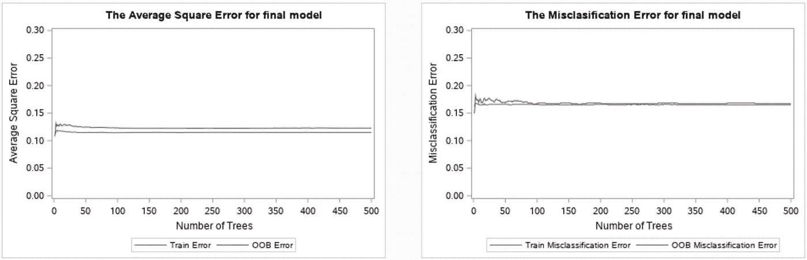

Training Statistics on the Final Model

接下来的步骤包括将最终模型应用于我们的测试集，然后清理数据，最后将其导出到“CSV”文件中，这样我们就可以提交 Kaggle 了。

```
proc hp4score data=Test; 
 score file= "/home/***/Titanic/output/model_fit.bin"
 out=Predictions;
 run;

 data submission;
  merge submission Predictions;
 run;data submission;
  set submission;
   Survived = I_Survived;
   keep PassengerId Survived;
 run;proc export data=submission
    outfile='/home/***/Titanic/output/submission.csv'
    dbms=csv
    replace;
 run;
```

# 结果

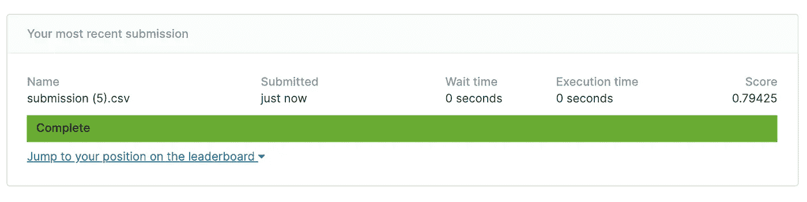

# 参考

[](https://documentation.sas.com/?docsetId=basess&docsetTarget=n053a58fwk57v7n14h8x7y7u34y4.htm&docsetVersion=9.4&locale=en) [## 数据步骤如何工作:基本介绍

### 数据步骤如何工作:一个基本介绍::一步一步的基础 SAS 9.4 编程，第二版数据…

documentation.sas.com](https://documentation.sas.com/?docsetId=basess&docsetTarget=n053a58fwk57v7n14h8x7y7u34y4.htm&docsetVersion=9.4&locale=en)  [## 过程步骤

### 过程步骤::SAS 9.4 语言参考:概念，第六版由一组调用和执行…

documentation.sas.com](https://documentation.sas.com/?docsetId=lrcon&docsetTarget=n0k19ydenc62jtn14mpv4fhzjmyg.htm&docsetVersion=9.4&locale=en) [](https://github.com/siddharthapachhai/SAS_ml_0) [## siddharthapachhai/SAS_ml_0

### 在 GitHub 上创建一个帐户，为 siddharthapachhai/SAS_ml_0 开发做贡献。

github.com](https://github.com/siddharthapachhai/SAS_ml_0)