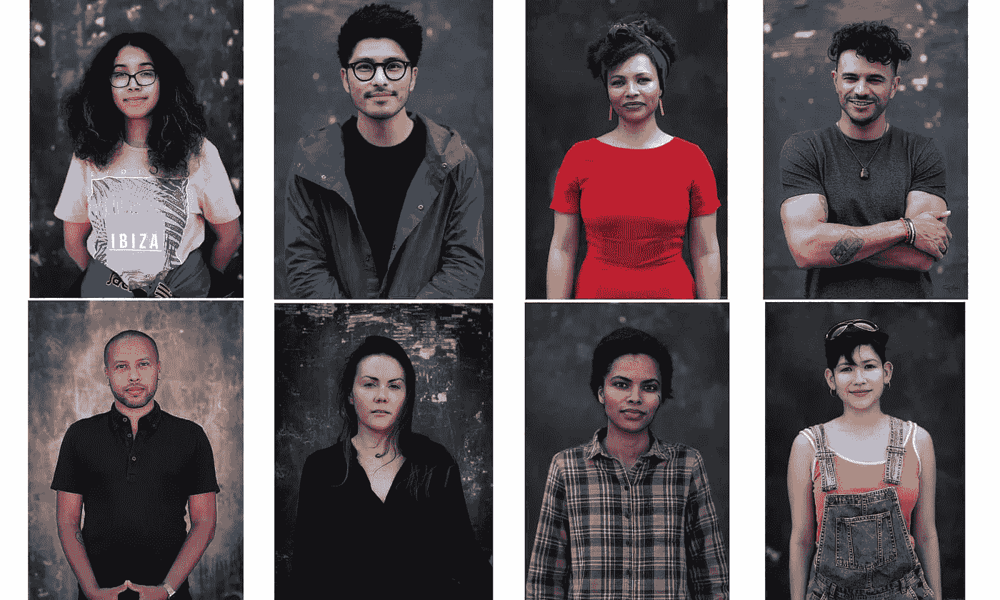
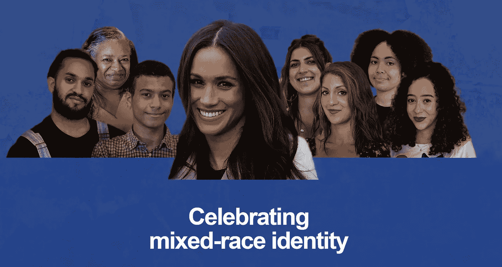

# 卡玛拉·哈里斯和混血儿亚裔身份的能见度？

> 原文：<https://medium.datadriveninvestor.com/kamala-harris-and-visibility-for-biracial-asian-identity-5867a7378c76?source=collection_archive---------8----------------------->

Photo Tenee Attoh [https://www.theguardian.com/artanddesign/2018/aug/26/the-mixed-race-experience-there-are-times-i-feel-like-the-odd-one-out-](https://www.theguardian.com/artanddesign/2018/aug/26/the-mixed-race-experience-there-are-times-i-feel-like-the-odd-one-out-)

最近，卡玛拉·德维·哈里斯成为乔·拜登的竞选伙伴，并最终成为美国副总统候选人，这让我感动得流下了眼泪。像许多人一样，我对她在参议院听证会上对布雷特·卡瓦诺和威廉·巴尔的法庭提问印象深刻，同样，她在民主党初选辩论中对乔·拜登的讽刺也给我留下了深刻印象。然而，打动我的既不是她的辩论技巧，也不是她在总统竞选中的突出表现。或者她被任命成为这个星球上第二有权力的人。当我给妻子读这篇文章的介绍时，我甚至不知道为什么或如何，泪水在我的眼中形成，我朗读的声音颤抖、哽咽、沙哑。我感到困惑的是，在我还没有读完 BBC 文章的内容之前，我就在外国经历了对一个有色人种女性的提升的如此强烈的情感反应？

如果你还没有读过关于她的资料，哈里斯是个混血儿，她的父亲是牙买加出生的斯坦福经济学教授，母亲是印度教徒、民权活动家和癌症研究者，在印度钦奈出生并长大。他们的婚姻产生了卡玛拉(她喜欢逗号拉这个发音)。她的父母在她五岁时离婚了。哈里斯和姐姐一起，由她的印度单身母亲抚养长大。父母、学者和活动家都在 60 年代的公共民权示威中相遇。因此，哈里斯的母亲足够精明，意识到她的两个混血儿女儿会被视为黑人，并培养她们完全接受自己的混血儿身份。在这篇文章中没有完全追溯她的职业生涯，哈里斯实现了一个显着的上升到高级职位，成为有史以来第一位非裔美国人和亚裔加州司法部长。当她被选入参议院时，她成为了第二位非洲裔美国妇女和第一位南亚妇女，被选入这个历史性的立法论坛。

根据大多数新闻报道，哈里斯从小就接受自己的混血儿身份。她早年的房子里充满了阿撒·富兰克林的福音音乐以及约翰·科尔特兰和狄俄尼乌斯·蒙克的爵士音乐。同时，她的母亲让她沉浸在南印度文化、食物、服装和传统中。与她的祖父、著名的印度政治家 PV Gopalan 的亲密关系也帮助塑造了哈里斯的身份。事实上，她已经完全融入了美国黑人的身份，以至于公众对她的认知是如此完整，[以至于后来许多印第安支持者非常惊讶地发现她其实有一半印第安血统！](https://amp-cnn-com.cdn.ampproject.org/v/s/amp.cnn.com/cnn/2020/08/11/politics/harris-indian-roots/index.html?amp_js_v=a3&amp_gsa=1&usqp=mq331AQFKAGwASA%3D#aoh=15974075790468&referrer=https%3A%2F%2Fwww.google.com&amp_tf=From%20%251%24s&ampshare=https%3A%2F%2Fwww.cnn.com%2F2020%2F08%2F11%2Fpolitics%2Fharris-indian-roots%2Findex.html)

尽管如此，鉴于这种双种族的传统，哈里斯很少允许自己被卷入这些冲突的潮流，利用她的身份作为政治话题。有趣的是，鉴于震撼美国的曲折的文化战争，她很少涉足这一领域。鉴于哈里斯的显赫地位和作为一名著名的黑人女性政治家，这是一个非常耐人寻味的立场。她拒绝参与讨论或辩论。关于这种方法的一个可能的线索是她在霍华德大学的转型经历，这是美国最著名的黑人大学之一。

该学院的目的是让学生们在他们的“黑暗中感到舒适，理解他们的黑暗，并作为一个人移动和超越”。当被问及她的身份时，哈里斯说“我是美国人”，这也许是一个促成因素。在一个被两极分化撕裂的国家的背景下，哈里斯的声明有着极其强大和综合的力量。通过将国家地位放在第一位，从而最终包容她的身份，哈里斯似乎超越了身份政治的鸿沟。在我看来，她拒绝将自己的背景分成小块，她似乎不想被这些单一的类别所束缚。

以上所有都是有用的背景信息，但并不能解释我在完全吸收 BBC 关于哈里斯的文章之前所经历的治愈力量和疼痛与痛苦的释放。这里我需要向读者介绍一下我自己的背景。在读到哈里斯的成功之前，我不希望发现我自己背景的复杂性、怪异性和不寻常性，[在普通或公共生活中的反映](https://www.pewresearch.org/fact-tank/2020/08/18/key-findings-about-multiracial-identity-in-the-u-s-as-harris-becomes-vice-presidential-nominee/)。

我的父亲是地地道道的英国人，出生在伦敦，听得见伦敦的钟声，有资格成为一个伦敦人，但在态度和性格上都不是。我的母亲是一个复杂得多的种族混合体，被礼貌地称为盎格鲁印度人，她的父亲是一个混血种族，部分是帕西人、印度人和爱尔兰人。我的曾祖父是一名爱尔兰士兵，是英国统治时期的铁路工程师。她的母亲死于分娩，一个葡萄牙 Goan 又一个欧亚混血儿。因为她祖父的国籍，这个家庭有权获得英国护照，过着比大多数印度人更舒适、更优越的生活。英裔印第安人是一种亚文化，既没有因为他们的肤色而被白人完全接受，也没有因为他们与英国殖民者的接近和关系而被当地居民所轻视。我姐姐在研究一个关于我们的曾祖母帕西人的传记故事的背景时，发现军队中的“低级军官”被鼓励与当地的印度妇女结婚成家。我们推测是为了稳定帝国的行政和经济活动。从而确保他们的行动不会被不安的普通士兵打断，这些士兵想要离开印度，回到英国的家中成家立业。通过与当地民众结婚，这些帝国的居民作为殖民者牢牢地扎根于当地，以支持他们的统治者的军事和商业企业。

 [## 卡玛拉·哈里斯的经济政策到底有多有限？数据驱动的投资者

### 大多数人多少知道唐纳德·特朗普的企业减税、反全球主义贸易政策和保护主义…

www.datadriveninvestor.com](https://www.datadriveninvestor.com/2020/08/28/just-how-limited-are-kamala-harriss-economic-policies/) 

所有上述遗产已经是一个复杂的混合物，不容易定义和归类这种种族身份的混合成一个容易识别的种族，民族和肤色的子集。肯定居住在一个跨文化基因融合的不舒服的十字路口，让任何像我这样的人很难找到可以认同的代表性公众人物。然而，我认为这些基因的复杂性是当代全球种族和文化融合的先驱，发生在世界上大多数大城市。当考虑到殖民主义对我母亲的印度血统的态度的影响时，这些不寻常的融合呈现出另一种色彩。

我想因为爱尔兰和葡萄牙的血统，我母亲是罗马天主教徒。她在喜玛拉雅山麓达尔豪西的一所女修道院接受了以爱尔兰修女为主的良好教育。根据天主教会可怕的传统，她从家庭和学校继承了世界观的深刻灌输。礼拜仪式、拉丁弥撒、赞美诗、教义问答以及所有为所有虔诚的信仰实践者准备的随身用品。在我母亲的一生中，她对自己的宗教产生了一种感人至深且不可抑制的信任和信念，在她人生的许多起起落落中，这种信任和信念一直是她的北极星。

然而，伴随着这种天主教的灌输，是一种对印度，对其大部分宗教、习俗和文化的根深蒂固的殖民主义的蔑视。无法说服我母亲放弃她继承的观点，即大英帝国看待世界的方式是优越的。她完全接受并吸收了她所接受的文化的衣钵。印度人在各方面都不如人。她对理查德·阿顿波罗的甘地及其对英国的描绘，以及早期对帝国掠夺的批评深感不安，这些批评大多是左派的。作为一名坚定的保守党人，她捍卫了英国在这个先前分裂的领土上的文明影响。帝国的工作是巨大的，很多，建设基础设施，统一土地成为一个国家，建设铁路，引入公立学校，提供一个共同的语言等等。等等。事实上，印度文化的一些方面渗透到我们传统的英国下层中产阶级生活的平淡无奇的特征中。偶尔会有我母亲为亲戚做的咖喱，或者是我母亲喜欢的游客带来的印度糖果，再加上来自印度母亲的家庭热情款待的罕见游客。

这种不加批判地接受殖民视角的做法，在我母亲的心灵中产生了一个深深的无意识的裂痕，在我看来，她对此完全没有意识到。因为在性格、社交、外向、友好和热情的所有其他方面，我母亲都是深深的印度人。与她那个时代有阶级意识、情感冷漠的英国人截然相反。她讲述了她祖国的友谊的生动故事，她对科学和学习的热爱，她分享自己历史的生动方式，讲述了她对祖国生活的热爱和喜悦。因此，当她第一次将公寓搬到伦敦郊区时，她在试图与邻居交朋友时遭受了巨大的痛苦，主要是与情绪沉默的种族主义居民交朋友。尽管当她在当地交朋友时，他们往往会成为终生的联系。

在我 20 岁出头的时候，我怀着一种矛盾的心态去了印度，寻求一种比当时的英国更有意义、更冒险的生活。当我抵达孟买机场时，热气腾腾，臭气熏天，我也感受到了对这片土地的热爱，事实上，我感觉自己终于到家了，我在这里呆了三年多，热爱住在印度母亲的每一刻

让我们回到卡玛拉，以及我对她突出的新角色的惊人反应。我想最让我震惊的是卡玛拉毫不掩饰地接受并表达了她混血儿的身份。事实是，这是她生命中不可分割的一部分，她不会允许自己进入关于种族的传统讨论。《华盛顿邮报》的一篇文章在报道对她的采访时，当被问及她的身份时，引用了以下内容:

> “你读过我的书吗？
> 我该如何描述自己？
> 我形容自己是一个自豪的美国人。”
> 
> 她笑着说，但带着“谈话结束”的坚定。

此外，当哈里斯被要求描述她的种族背景。
她说她没有花太多时间去思考如何给自己分类。

> “以至于，”她说，“当我第一次竞选公职时，这是我挣扎的事情之一，那就是你被迫通过这一过程来定义自己，以一种你可以整齐地融入其他人创造的隔间的方式。
> 
> “我的观点是:我就是我。我不介意。你可能需要弄清楚，但我没意见，”她说。

在我对这些互动的解读中，它们似乎并没有充满防御性或对立性。更有坚如磐石的自信。从我所读到的和一些亲密的女性朋友和亲戚那里，我了解到，身居要职的女性必须更加努力地奋斗才能确立自己的地位。因此，哈里斯在公众媒体面前证明、证明、合理化或解释自己的本能肯定是强大的。然而，她坚持自己的尊严和立场，支持自己的表达和与身份的关系。

Screenshot BBC [https://www.bbc.co.uk/news/resources/idt-sh/celebrating_our_mixed_race_identity](https://www.bbc.co.uk/news/resources/idt-sh/celebrating_our_mixed_race_identity)

这种简单而有力的态度，加上哈里斯对积极的种族认同的坚定承诺，切中了我生存困境的核心，这是一个我几乎没有意识到的双重困境。她简单直接的陈述照亮了我心灵深处的一盏灯，这是我几乎从未有过的感觉。如果有意识的话，那也是一种非常模糊的缺失意识，一种空白。更像是失去一个未知的兄弟姐妹，可能死于分娩，或者当一个婴儿，一些其他近亲可能永远不会回来。我现在意识到，这个大洞是从我母亲那里遗传来的。从她的文化根源来看，她的精神深深游离于殖民心态和她的性格态度和性格之间的鸿沟。尽管她对自己出生的土地有着显而易见的爱，但这种裂痕已经悄悄地、不知不觉地传了几代人。

因此，当我读到 BBC 宣布任命哈里斯的第一篇文章时，我在由衷的抽泣中意识到，我对任何混血儿出身的亚洲人有朝一日能成为公共代表的希望一直为零。哈里斯的成就和她明确的积极的印度身份的可见性推动了光线的破碎，进入我成长过程中长期隐藏的黑暗角落，以及对印度身份习俗和文化的探索的缺失。

不仅是哈里斯对首先是美国人的坚定不移改变了我心灵的这些构造板块；正是她全心全意健康地接受了自己的印度血统，从而打破了与我的亚洲血统不认同的真空。对我来说，尤其令人心酸的是，哈里斯混合身份的可见性挑战了身份和种族的两极分化，通常是铁板一块的公开框架。此外，她坚持强调自己的国籍高于身份，这也为超越当前身份政治所灌输的分裂的融合带来了希望。在所有关于 Harris 身份的评论中，我读到在美国只允许注册混血儿已经有[二十年了](https://www.thenational.ae/opinion/comment/kamala-harris-and-the-complexity-of-racial-identity-1.1067842)，这生动地说明了对混血儿包括那些混血儿身份的文化视而不见。

也像巴拉克·奥巴马一样有魅力和口才，加上他作为美国第一位黑人(也是混血儿)总统的成功。他的提升从来没有像哈里斯的提名那样深深地伤害到我。我把这归因于她的印度血统。此外，与奥巴马不同，哈里斯否认受到对种族、身份以及如何给自己分类的焦虑的阻碍，此外，她拒绝用他人的狭隘思维来定义自己。事实上,[《洛杉矶时报》的一名作家说,](https://www.latimes.com/california/story/2020-08-24/kamala-multi-racial)“她拥有如此多面的身份，这可能会让对话变得更聪明一点”

哈里斯的提名让她感到意外，但现在她的任命唤醒并触及了我心灵深处的一个痛处。尽管如此，在我走向完整、整体和连贯的个人旅程中，这一启示和由此产生的洞察力是非常受欢迎的。我满怀希望地等待着，希望在履行她作为被提名人和副总统的职责时，她能成为[公众的焦点](https://www-nytimes-com.cdn.ampproject.org/v/s/www.nytimes.com/2020/08/12/opinion/kamala-harris-indian-american.amp.html?amp_js_v=a3&amp_gsa=1&usqp=mq331AQFKAGwASA%3D#aoh=15974075790468&referrer=https%3A%2F%2Fwww.google.com&amp_tf=From%20%251%24s&ampshare=https%3A%2F%2Fwww.nytimes.com%2F2020%2F08%2F12%2Fopinion%2Fkamala-harris-indian-american.html)和代表超越当今美国如此明显的两极分化和分裂的声音。

如果你喜欢这个帖子，**请评论**也欢迎鼓掌

关注我的 FB 页面，了解更多如何与我和我的领导力发展业务[生成你](https://www.facebook.com/GenerativeYou/?eid=ARCS9W_onHV6q9UEM8kEIb31sxgCiElGRdDv5kUtyaetVTj6vqdw6x2hMPzak9V4gblEBz-HbA9ZJly3)。

关于作者**戴夫·彭德尔；**我综合了在非营利企业近 30 年的经验和超过 40 年的个人发展经验。热衷于激发他人的成就感、影响力和信任感，全心投入到 21 世纪的工作和生活中。

**访问专家视图—** [**订阅 DDI 英特尔**](https://datadriveninvestor.com/ddi-intel)