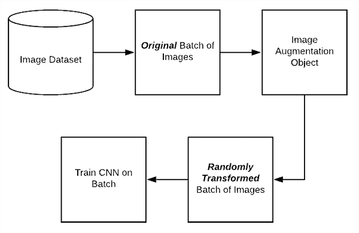

# 卡纳达语 Mnist 分类:Kaggle 案例研究

> 原文：<https://medium.datadriveninvestor.com/kannada-mnist-classification-a-kaggle-case-study-fa1b3f72b54?source=collection_archive---------2----------------------->


卡纳达语 Mnist 分类是最近结束的 kaggle 竞赛，是经典 MNIST 竞赛的延伸。卡纳达语是印度南部的一种语言，大约有 450 万人以此为母语。该数据集是在 Vinay Uday Prabhu 的得力指导下收集的。这是一场核心竞争。要了解更多关于比赛的信息和访问数据，请访问页面[https://www.kaggle.com/c/Kannada-MNIST/overview](https://www.kaggle.com/c/Kannada-MNIST/overview)。

## 数据集概述:

为了读取数据集，我们可以使用熊猫图书馆。我们提供了 4 个 csv 文件。以下代码片段有助于我们阅读所有 4 个 csv 文件。

```
train=pd.read_csv('/home/aditya123/Downloads/Kannada-MNIST/train.csv')
test=pd.read_csv('/home/aditya123/Downloads/Kannada-MNIST/test.csv')
sample_sub=pd.read_csv('/home/aditya123/Downloads/Kannada-MNIST/sample_submission.csv')
```

数据集有 60000 行和 785 列。为了了解这一点，我们可以使用下面的代码。要了解数据集的更多信息，我们可以使用 head and describe 函数。

```
train.shape
train.head()
train.describe()
```

从 head 函数可以明显看出，数据集有一个作为目标标签的标签字段。我们应该指定为 y，其余的为 x

```
x=train.iloc[:,1:].values
y=train.iloc[:,0].values
```

## 重塑:

x 值的形状为(60000，784)。在后面的阶段，我们应该把它作为卷积神经网络的输入。例如，keras conv2D 仅适用于 3 维。于是我们将其重塑为一种形态( *n_images* 、 *x_shape* 、 *y_shape* 、 *channels* )。为此，我们可以编写以下代码

```
x=x.reshape(x.shape[0],28,28,1)
```

## Y 值的一次热编码:

使用我们的模型不可能处理分类数据。所以我们必须把它转换成一个热编码值。例如，这将把数字 4 表示为[0，0，0，0，1，0，0，0，0，0]。为此，我们可以编写以下代码片段。

```
y=keras.utils.to_categorical(y,10)
```

## 列车测试分离:

我们需要在数据的某一部分上训练我们的数据，并且类似地在数据的完全未触及的部分上测试模型如何执行。为此，我们将求助于 sklearn 库。

```
x_train,x_valid,y_train,y_valid=train_test_split(x,y,test_size=0.10,random_state=42)
```

## 标准化:

神经网络通常具有小的权重值，正如我们所看到的，输入是大的。因此，这可能会在训练模型时导致许多问题，例如降低模型的速度。因此，我们应该对像素值进行归一化，使得每个像素值的值在 0 和 1 之间。为此，我们可以简单地将所有像素除以 255。

```
x_train=x_train/255
```

## 数据扩充:

它使用各种技术来创建越来越多的例子，以便模型能够学习如何进行归纳。神经网络需要大量的数据来做正确的预测。数据扩充有助于我们完成这项任务。有各种技术来执行图像增强，例如****旋转******缩放变化******剪切******水平翻转。*** 对输入图像的这些变换可以改变图像的外观，但不会改变类别标签。*

**

*(Pic Source:Pyimage Search)*

*上图显示了一些就地执行图像增强的方法。为了执行同样的操作，我们将使用一个名为 ***的 ImageDataGenerator 类。需要考虑的一件重要事情是，这个类只返回随机转换的数据。因此，数据增强的全部目的是确保网络看到从未见过的 ***新*** 图像。此外，这种增强是在训练时完成的，而不是在预处理模块的一部分。在训练期间，它生成那些随机变换的图像。这段代码创建了一个图像增强对象。****

```
*train_gen=ImageDataGenerator(rescale=1./255.,rotation_range=10,width_shift_range=0.25,height_shift_range=0.30,shear_range=0.15,zoom_range=0.30,horizontal_flip=False)*
```

## *建模:*

*所以现在轮到我们做任何机器学习项目中最有趣的部分了。我们将使用 keras 顺序 api 建立一个模型。下面是完成建模任务的代码片段。*

```
*model = Sequential()model.add(Conv2D(64, kernel_size=3, activation=’relu’, input_shape=(28, 28, 1)))
model.add(BatchNormalization())
model.add(Conv2D(64, kernel_size=3))
model.add(LeakyRelu(alpha=0.1))model.add(BatchNormalization())
model.add(Conv2D(64, kernel_size=5, padding=’same’))
model.add(LeakyRelu(alpha=0.1))model.add(BatchNormalization())
model.add(MaxPooling2D(pool_size=(2, 2)))
model.add(Dropout(0.2))model.add(Conv2D(128, kernel_size=3))
model.add(LeakyRelu(alpha=0.1))model.add(BatchNormalization())
model.add(Conv2D(128, kernel_size=3, activation=’relu’))
model.add(BatchNormalization())
model.add(Conv2D(128, kernel_size=5, padding=’same’))
model.add(LeakyRelu(alpha=0.1))model.add(BatchNormalization())
model.add(MaxPooling2D(pool_size=(2, 2)))
model.add(Dropout(0.2))model.add(Conv2D(256, kernel_size=3))
model.add(LeakyRelu(alpha=0.1))model.add(BatchNormalization())
model.add(MaxPooling2D(pool_size=(2, 2)))
model.add(Dropout(0.2))model.add(Flatten())
model.add(Dense(256))
model.add(BatchNormalization())
model.add(Dense(128))
model.add(BatchNormalization())
model.add(Dense(10, activation=’softmax’))
model.compile(loss=’categorical_crossentropy’,optimizer=’adam’,metrics=[‘accuracy’])*
```

*现在的问题是为什么这个建筑？为什么不是一些具有不同数量的内核和大小或激活功能的其他架构。原来( ***如 andrew ng 所说)*** 我们可以拥有任何一种架构，只要它与我们的输入兼容。此外，我们尝试不同的架构作为试验和错误，然后看看他们中的哪一个是最适合我们的任务。我们可以在任何标准的 mooc 中读到所有这些的功能。正如竞赛的一位奖牌获得者所提到的， ***泄漏 relu*** 激活功能帮助他提高了他的模型的性能。compile 方法通过一些初始化来创建架构，但不需要任何训练。当我们训练模型时，所有的参数都被优化到一个最佳值。*

*[](https://www.datadriveninvestor.com/2019/03/22/fixing-photography/) [## 修复摄影|数据驱动的投资者

### 汤姆·津伯洛夫在转向摄影之前曾在南加州大学学习音乐。作为一个…

www.datadriveninvestor.com](https://www.datadriveninvestor.com/2019/03/22/fixing-photography/) 

# 回访:

回调是在训练 过程中应用 ***的不同功能集。例如，我们可能希望在达到某个准确度/损失后停止训练。这些是我们在训练模型时看到的回调类型。***

## 提前停止:

该功能允许根据特定条件提前终止进程。例如，参数 ***监控*** 表示被监控的值。参数 ***min_delta*** 指监控值的最小变化。类似地，参数 ***耐心*** 是指我们必须等待的没有改善的时期的数量。

## 模型检查点:

模型检查点在每个时期后保存模型。这些是某些参数，如

*   **filepath:** 是指我们要保存的路径。
*   **监控:**该参数表示被监控的参数。
*   **save_best_only:** 如果我们不想覆盖当前的最佳模型，我们将此设置为 true。
*   **模式:**可以采用自动、最小或最大值。例如，如果模式设置为*精度*，我们希望将其最小化。

## 学习率计划程序:

它随时间将学习率调整到一个期望值，该值以历元为自变量，并返回学习率以用于随机梯度下降。在我们的代码中，我们在平台上使用 ***reduce。*** 当性能指标达到稳定水平时，它会以一定的因子降低优化器的学习率，也就是说验证损失没有改善，我们会降低学习率。

```
learning_rate_reduction= ReduceLROnPlateau(monitor=’val_loss’,patience=200,verbose=1,factor=0.2)
es=EarlyStopping(monitor=’val_loss’,mode=’min’,verbose=1,patience=200)
```

上面的代码片段达到了同样的效果。参数 ***因子*** 是指学习率降低的量。

## 测试数据的训练和预测:

在前面的步骤中，我们已经执行了图像增强。所以我们的数据集不是静态的。因此我们不能使用拟合函数。对于这种情况，我们应该使用 ***拟合 _ 生成器*** 功能。这里要记住一点，图像发生器使用时数据不要*或 ***太大。*** 需要注意的一点是***steps _ per _ epoch***参数。由于我们的图像生成器函数无限循环，keras 无法知道一个时期何时开始，何时结束。我们发现***steps _ per _ epoch***参数为数据点总数除以批量大小。*

```
*history=model.fit_generator(train_gen.flow(x_train,y_train,batch_size=batch_size),steps_per_epoch=100,epochs=epochs,validation_data=valid_datagen.flow(x_valid,y_valid),validation_steps=50,callbacks=[learning_rate_reduction,es])*
```

*上面的代码片段达到了同样的效果。*

*为了对测试数据集进行预测，我们可以编写以下代码。*

```
*prediction=model.predict_classes(x_test/255.)prediction=np.argmax(prediction,axis=1)*
```

# *提交:*

*要使用 csv 文件提交，我们可以编写以下代码片段。*

```
*sample_sub[‘label’]=predictionsample_sub.to_csv(‘sample_submission.csv’,index=False)*
```

*要访问全部代码，请参见[https://github.com/mohantyaditya/Kannada-Mnist](https://github.com/mohantyaditya/Kannada-Mnist)。**