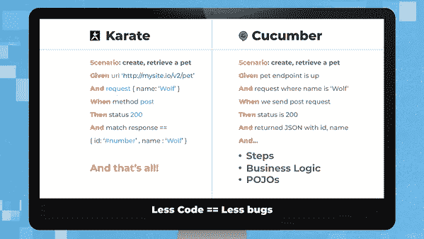
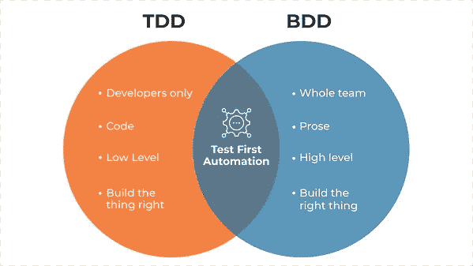
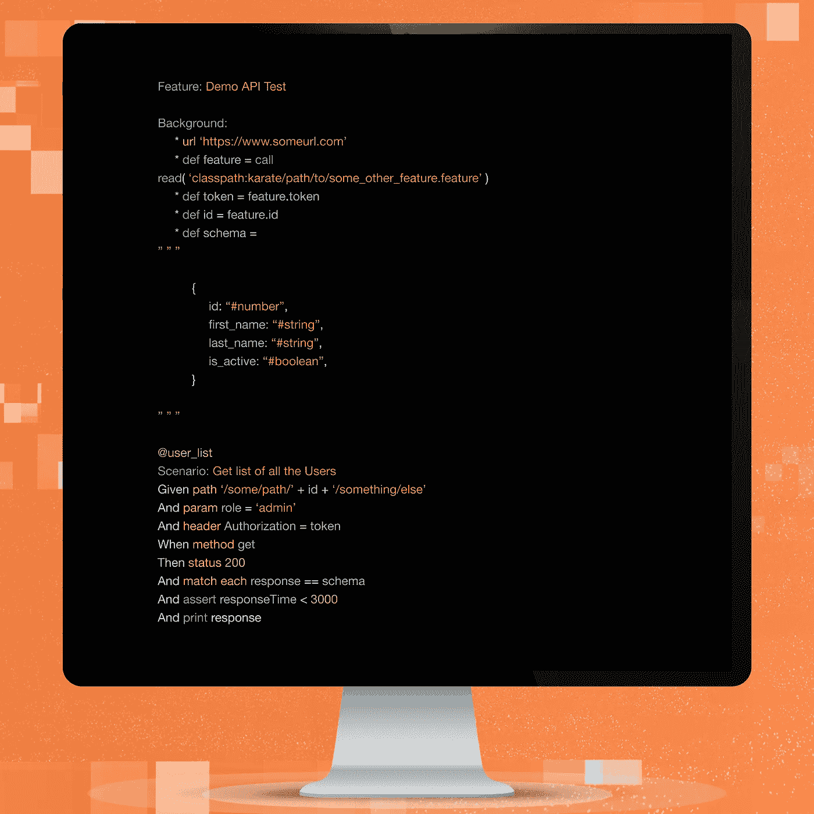
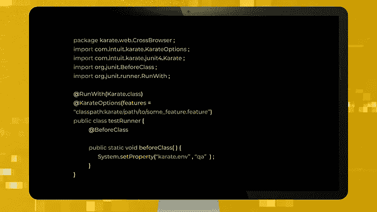
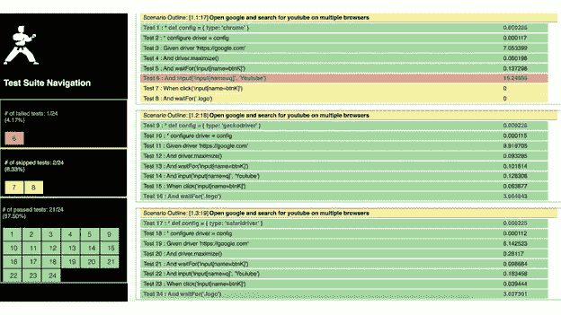

# 空手道、BDD 和 API 自动化

> 原文：<https://medium.datadriveninvestor.com/karate-bdd-and-api-automation-b4f4918c027?source=collection_archive---------1----------------------->

随着 IT 行业最近的发展及其不断增长的步伐，软件公司和专业人士都必须提升他们的水平。虽然在努力提高生产率和降低成本的过程中，已经出现了许多与开发相关的体系结构变化，但是也确实需要对软件测试给予类似的关注。但是从哪里开始呢？幸运的是，您使用 BDD 以 API 自动化开始和结束。

第一件事是寻找一种工具，帮助你更快地编写易于维护的自动化测试。对于本文，我们将重点关注自动化 Rest API 测试。多年来，我为此使用了许多工具，然而，最近我遇到了一个工具，它不仅改变了我对自动化 API 测试的看法，也改变了我对绝对自动化概念的整体看法。它叫**空手道**，如果你参与自动化 API 测试，没有编程背景，不妨考虑一下。

**什么是空手道？**

首先，这是我最喜欢的武术形式。其次，从更专业的角度来看，空手道是一个开源的测试自动化工具，用于使用行为驱动开发(BDD)语法编写的测试。不像其他 BDD 框架，像[小黄瓜](https://cucumber.io/docs/bdd/better-gherkin/)空手道默认定义了所有的步骤定义。这使得即使是非开发人员和没有编程背景的人也能快速编写 API 测试[黄瓜](https://en.wikipedia.org/wiki/Cucumber_(software)%26sa=D%26ust=1572942289138000)，

以下是对我的意思的完美描述:

现在从上面的图片可以清楚地看到，使用空手道编写 REST API 测试是多么简单。尽管测试的可读性不如 Cucumber 测试那样深入，但它确实为您省去定义步骤、业务逻辑和 POJOs 的麻烦。我认为这是值得的。关于空手道的另一个最酷的事情是，它是你的 API、Web 和本地应用程序测试的一站式商店，你可以很容易地在你的 CI/CD 管道中实现。至于上面的樱桃，您可以使用相同的测试进行性能测试。

**BDD 框架&空手道**

[行为驱动开发(BDD)](https://perspectives.mobilelive.ca/blog/bdd-making-life-easier) 是一种软件开发和测试方法，它在技术和非技术团队之间架起了一座桥梁。作为测试驱动开发的一个分支，BDD 主要处理系统用户行为。就测试和自动化而言，BDD 框架在小型团队中尤其重要，在这些团队中，人们没有能力雇佣个人来创建和维护自动化框架。这就是空手道的由来。

**空手道入门**

让我们来看看您通常会在自动化 API 测试中执行的一些操作，假设您已经有了环境设置。如果没有，请参考空手道的官方网站， [GitHub 页面](https://github.com/intuit/karate)，它会给你一个关于空手道和如何建立你的项目的完整见解。

**定义**

空手道提供了自己的 DSL(领域特定语言)，它使用一种类似小黄瓜的语言，使人们能够在没有编程知识的情况下编写测试，并用*编写测试。特征*文件。这里有一个例子:

在第一个**背景**部分，我们将定义全局访问所需的变量，以及 URL 和其他变量。现在，为了充分利用可重用性，空手道让我们可以轻松地调用和读取背景部分中定义的其他特性文件，因此我们可以从被调用的特性中访问变量。

背景部分的最后一项是用于模式验证的'*模式*'变量。从上面的例子可以清楚地看出，定义空手道的模式而不是使用复杂的 JSON 模式是多么容易。

现在让我们了解特征文件的*场景*部分下的所有组件:

你能用空手道做的事情不仅限于这个例子。你可以使用内嵌的 JavaScript 函数，因为 JS 是空手道的原生函数，另一方面，你也可以选择编写定制的 Java 函数。空手道也支持动态数据驱动测试，通过简单的“场景概要和例子”的实现，类似于 Cucumber。最后，您可以使用与使用[加特林](https://github.com/intuit/karate/tree/master/karate-gatling)进行性能测试相同的测试特性。

**执行**

要执行上述特性文件，您需要一个简单的 Java runner 文件，如下所示:

这里我们使用的是 JUnit 4 Runner。在@KarateOptions 中提供特性文件的路径，差不多就是这样。

**报道**

由于我们使用的是 JUnit 4 Runner，默认情况下，空手道可以为每次运行提供非常简单而优雅的报告，但是您也可以自定义它们并附上失败步骤的截图。另外，如果您想要更详细的报告或者如果您正在实现并行执行，您可以使用[cumber-reporting](https://github.com/damianszczepanik/cucumber-reporting)。

以下是一份实际测试报告的截图:

**与 CI/CD 管道整合**

最后，要完成自动化周期，您需要做的就是将您的测试与您的 CI/CD 管道相集成。有几个选项可供选择，然而，在我看来，最好的 web 测试是 *Jenkins 和 Saucelabs* duo，而对于 API 来说， *Jenkins 和 docker* 是最合适的。你可以在这里找到 docker 实现[的大量文档。](https://github.com/intuit/karate)

**拿走**

我使用空手道已经有一段时间了，它已经证明了它在 API 自动化方面的价值。就我而言，它简单的语法和支持复杂代码的能力使它成为所有 BDD 自动化框架中的领跑者之一。如果你没有被说服，在我们分手之前，我想请你考虑以下几点:

虽然我认为空手道的好处在这一点上非常明显，但如果我不得不留给您一个收获，那就是如果您正在寻找一个框架来编写简单快速的 API 测试，但缺乏编程知识，空手道可能是您的最佳选择。更不用说你可以在简历上加上“会空手道”。

*以上内容是与 mobileLIVE 自动化服务经理 Ragavan Balasubramaniam 合作撰写的。*

*像我们说的那样？你会喜欢我们的工作的。* [***见***](https://www.mobilelive.ca/) ***。***