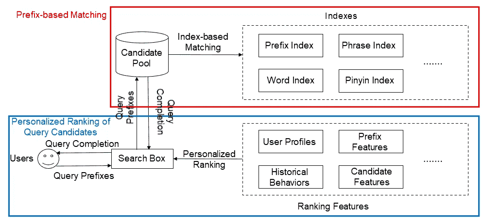
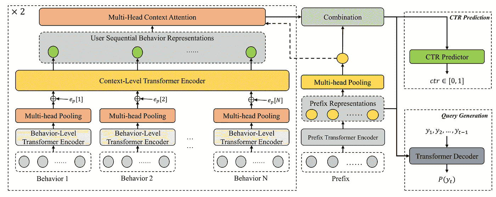
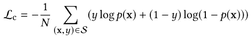
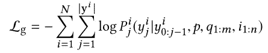
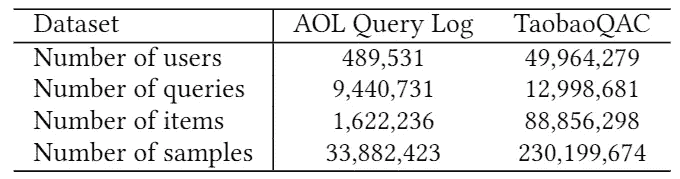
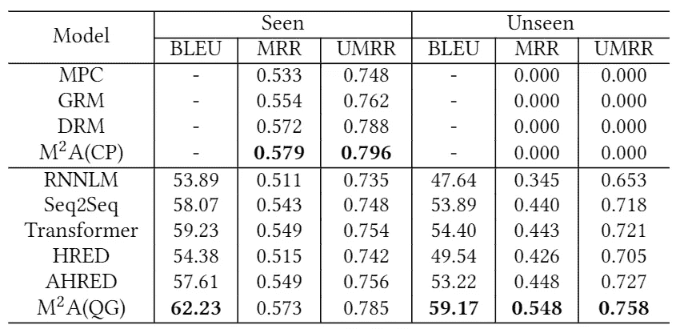
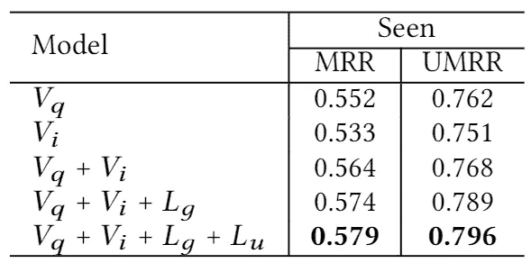
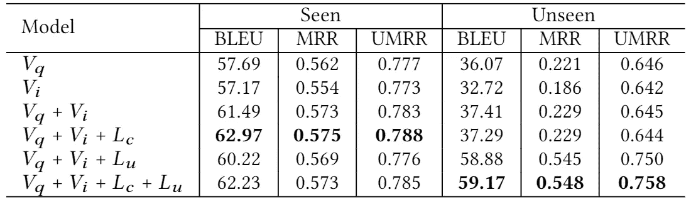
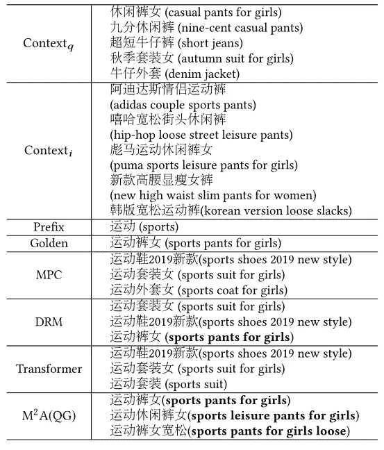
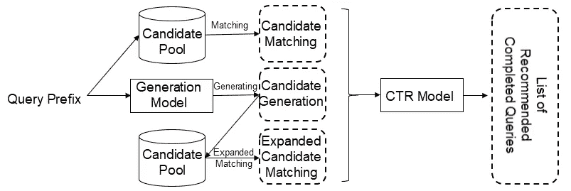

# KDD 2020:学习用新方法生成个性化查询自动完成

> 原文：<https://medium.datadriveninvestor.com/kdd-2020-learning-to-generate-personalized-query-auto-completions-with-a-new-approach-90a9cfca35cd?source=collection_archive---------12----------------------->

*下载“*[*【KDD 论文云知识发现】*](https://resource.alibabacloud.com/whitepaper/cloud-knowledge-discovery-on-kdd-papers_2592) *”白皮书，探索 12 篇 KDD 论文和 12 位阿里巴巴专家的知识发现。*

*由隐帝、谭继伟(左书)、张哲(樊轩)、邓宏博(风子)、黄书健、陈嘉俊*

# 背景

查询自动完成(QAC)是现代搜索引擎最重要的特征之一。下图显示了它的工作原理。例如，当用户在搜索框中输入查询前缀，如“blue”，QAC 系统将自动推荐已完成查询的排序列表，如“Bluetooth headset”，供用户选择后续搜索。这个特性提高了用户的搜索效率。

QAC 的性能要求包括以下两个方面:

1.  **准确性:** QAC 能够准确预测用户的意图，因此推荐的查询候选列表具有很强的个性化。例如，当用户在搜索框中输入“蓝色”时，用户可能想要搜索“蓝牙耳机”、“蓝月亮洗衣液”或“蓝色条纹连衣裙”QAC 需要根据查询前缀和一些个性化特征来预测用户的完整意图，并将推荐的完整查询排在列表的顶部。
2.  **实时性能:**大多数搜索引擎要求 QAC 在用户开始在搜索框中输入一些字符时实时提供推荐查询列表，因此 QAC 必须尽快做出响应(例如，在不超过 300 毫秒内)

与大多数搜索或推荐任务类似，QAC 通常采用两阶段流水线式架构:匹配和排名。在匹配过程中，形成一个候选库，其中包含大量从历史搜索日志中挖掘出的热门查询，从多个维度创建查询索引，如前缀、拼音和从短语中分割出的单个单词。然后，使用索引进行多特征匹配，并将结果组合成初始候选集。在排序中，学习到排序个性化模型用于对候选集中的候选进行评分和排序。最后，几个排名靠前的候选项将按顺序呈现给用户，作为最终推荐的查询自动完成。

# 主要问题

随着搜索和推荐技术的发展，QAC 已经更新换代了很多次。然而，现有的大多数 QAC 系统仍然存在以下两大问题，严重影响了 QAC 的性能和用户体验。

1.  **未被发现的查询:**在历史搜索日志中，查询的搜索遵循长尾分布规律，也就是说大多数查询只被搜索几次。当实现 QAC 系统时，出于存储开销和计算性能的考虑，许多长尾查询没有被添加到候选池或索引中。因此，该系统提供很少或没有结果。历史日志中从未记录过的新查询也会出现同样的问题。
2.  **排名的弱个性化:**大多数现有的 QAC 系统对用户的搜索意图提供不太准确的预测，并且倾向于推荐查询日志中频繁出现的查询。因此，当不同的用户输入相同的查询前缀时，系统会向他们显示类似的列表。

# 我们的解决方案

为了解决这两个问题，我们提出了一种多视角多任务注意(M2A)的 QAC 方法。这种方法包括两个部分:

1.  在匹配中，我们使用一个参数化的、基于神经网络的序列生成模型，通过一些解码策略自动生成查询完成，例如基于查询前缀的波束搜索，以补充现有的匹配方法。因此，当系统提供很少或没有结果时，我们可以解决问题。
2.  在排序中，将用户的历史查询和浏览过的项目等历史顺序行为的多个视图作为排序模型的决策依据。因此，我们可以更准确地预测用户的搜索意图，提高候选排名的个性化。

为了提高生成和排序模型的预测精度，我们在设计模型时需要考虑一个关键问题:如何在多个视图中更好地建模和挖掘用户的历史顺序行为。

在搜索引擎中，用户行为通常是指搜索查询或浏览某些内容。为了提取更全面的历史行为信息，我们引入了两种不同的历史顺序行为视图，包括搜索查询和浏览项目。这些顺序行为具有以下特征:

1.  **查询或浏览项目与用户之间交互的长尾分布:**这意味着大多数推荐方法只依赖于交互学习行为的整体嵌入，无法使模型更好地学习长尾行为的表征。
2.  **行为背后用户意图的模糊性:**比如用户搜索“南京大学”，可能会有不同的意图。他们可能打算搜索南京大学的纪念品或南京大学写的书。因此，仅根据用户的行为很难准确理解用户的意图。最好通过使用上下文信息来理解他们的意图。
3.  **不同行为之间的依赖关系:**搜索日志中记录的大多数行为都不是独立的。例如，用户可能多次修改他们的输入，修改前后的查询之间存在依赖关系。考虑如何建模和描述这些行为之间的依赖关系也是值得的。

鉴于上述特点，我们在多视图建模中引入了一种基于自我注意的变换编码器，并提出了一种新的顺序行为分层编码器模型。如下图的左块所示，这个编码器模型包括行为级转换器编码器和上下文级转换器编码器。

为了对每个行为进行建模，大多数推荐系统完全依赖于交互学习的表示，而忽略了行为的信息。这导致了长尾行为的不良表现。为了解决这个问题，我们建议使用 Transformer 编码器，它可以对每个行为中的单词级和短语级信息进行编码。这可以有效地改善长尾行为的表现，也可以推广从未见过的新行为。

在此基础上，我们引入了多头池机制来获取每个行为的上层表示，并将相应的行为级表示输入到上下文级 Transformer 编码器中进行编码。然后，我们使用转换器的自我注意机制来整合上下文信息并准确理解语义。这种机制还可以显式地描述不同行为之间的依赖关系。

通过使用分层转换器编码器，我们可以获得更准确和更丰富的顺序行为表示。然而，并不是所有的历史行为都与用户当前的搜索意图密切相关。为了减少预测过程中的冗余信息，我们引入了多头注意力模块。该模块使用查询前缀表示作为过滤历史顺序行为中的信息的关键。然后，该模块对强相关信息进行加权和组合，并将该信息与查询前缀相结合。集成的结果用作后续模型预测的基础。

 [## 机器学习和人工智能如何改变电子商务的面貌？|数据驱动…

### 电子商务开发公司，现在，整合先进的客户体验到一个新的水平…

www.datadriveninvestor.com](https://www.datadriveninvestor.com/2020/11/19/how-machine-learning-and-artificial-intelligence-changing-the-face-of-ecommerce/) 

在我们获得预测依据后，我们需要考虑如何预测用户的完整查询。目前，QAC 有两种解决方案。一种解决方案是将 QAC 模块视为一个小型搜索引擎，并使用“检索和排名”方法来推荐结果。另一种解决方案是将 QAC 视为文本生成任务，并使用神经网络模型来自动生成完整的查询。这两种解决方案都必须依赖于用户的历史顺序行为来进行决策。它们在训练目标函数和使用的训练数据形式上是不同的。

1.排名通常被认为是点击率(CTR)预测任务。您可以使用逐点目标函数(如 Lc)来训练 CTR 模型。生成模型的训练是引导模型准确生成每一个单词，有更细粒度的训练目标函数，比如 Lg。

2.在训练数据方面，排名模型可以仅使用包含用户点击行为的日志数据来进行训练，而生成模型可以使用用户主动输入的一些完整查询来通过随机分裂来构建训练数据。

因此，我们提出了通过共享分层编码器模型来进行排序和生成的多任务学习。然后，编码器可以通过优化多个目标并在训练中使用更多数据来实现更好的编码表示。

# 实验分析

为了验证我们的解决方案的效果，我们构建了一个大规模的查询日志数据集，并将其命名为 TaobaoQAC。该数据集包含 2019 年 9 月 1 日至 2019 年 9 月 10 日期间从淘宝移动的搜索引擎收集的超过 2 亿条查询日志。与现有的 AOL 日志数据集不同，TaobaoQAC 不仅包含用户输入的完整查询，还包含用户从前缀输入到查询完成的点击行为。因此，TaobaoQAC 比 AOL 数据集更适合研究 QAC。下表列出了具体的比较信息。

我们使用前七天的日志作为训练集，第八天的日志作为验证集，最后两天的日志作为模型训练和评估的测试集。评估包括可见查询和不可见查询。可见查询用于评估模型在包含查询候选项的测试数据上的性能，而不可见查询用于评估模型在不包含查询候选项的测试数据上的性能。在评估指标方面，我们使用了机器翻译中常用的双语评估替读(BLEU)指标来评估生成模型生成的预测结果与用户点击或输入的完整查询之间的相似度。我们还使用平均倒数排序(MRR)和无偏 MRR (UMRR)来评估不同模型的排序性能。查询生成模型的解码器部分可以通过将所有步骤中解码的概率相乘，然后将其转换为排名模型，来获得总得分。

基线系统包括基于统计的最流行完成(MPC)、基于 GBDT 的排序模型(GRM)和基于深度神经网络的基于深度学习的排序模型(DRM)等排序模型，以及基于递归神经网络的语言模型(RNNLM)、标准序列到序列模型(Seq2Seq)、变换器、分层递归编码器解码器(HRED)和专注 HRED (AHRED)等生成模型。)实验结果表显示，我们的 M2A 框架的排序模块(CP)和生成模块(QG)分别实现了最佳的生成和排序性能。大多数基线无法为看不见的查询产生结果，导致零相关索引，而我们的 QG 模型在所有生成模型中取得了最好的结果。

本文提出的框架包括多个视图和多个任务，因此我们进行了消融实验。在下面两个表中，Vq 代表搜索查询的视图，Vi 代表浏览项目的视图，Lg 代表点击查询的查询生成任务，Lu 代表输入查询的查询生成任务。我们从基于单一视图的 CTR 预测模型开始，逐步添加响应模块。

下表给出了 CTR 预测模型的烧蚀实验结果，表明每个视图或任务都能给模型带来明显的增益。

下表显示了查询生成模型的消融实验结果。结果表明，当使用用户主动输入的查询日志作为训练数据时，模型的性能在可见查询方面略有下降，但在不可见查询方面有较大提高。总体而言，该模型带来了良好的收益。

我们还观察了一些推荐案例，发现大多数基于排名或基于生成的方法倾向于将高频查询放在推荐查询列表的顶部。然而，这些高频查询往往与用户当前的搜索意图无关，导致排名结果的个性化不强。我们的解决方案可以缓解这个问题。排名靠前的查询候选与用户当前的搜索意图最相关。

为了验证我们的解决方案是否有利于在线服务，我们在淘宝的主要搜索引擎中进行了 A/B 测试。基于波束搜索的生成模型在生成多个候选策略时响应较慢。因此，我们提前挖掘最近一周内结果较少或没有结果的长尾查询，以离线模式生成查询候选，并创建相关索引。在在线场景中，我们将离线模式下生成的候选查询、通过扩展匹配获得的查询以及现有的候选查询组合成一个完整的候选集。然后，我们使用框架中的 CTR 预测模型对查询候选进行排序。

这种方法通过将生成模型的自动生成能力与 CTR 模型的个性化排序能力相结合，确保了在线响应时间满足要求，并实现了更好的整体性能。在近两个月的 A/B 测试中，我们的解决方案将淘宝移动 QAC 服务的浏览量(PV)、独立访客(UV)和点击率分别提高了 3.84%、1.6%和 4.12%。此外，服务响应率提高了 11.06%。我们的解决方案带来了可观的业务收益。

# 摘要

在这篇文章中，我们提出了 QAC 的 M2A 框架。该框架在用户顺序行为的多个视图中建模和使用丰富的个性化信息，因此 QAC 模型可以更准确地预测用户当前的搜索意图。该框架使用多任务来学习候选排序和查询生成，并使用多个学习目标和训练数据来训练 QAC 模型。因此，该框架实现了不同任务之间的优势互补。整个框架在在线和离线实验中都取得了良好的效果，为淘宝搜索引擎的 QAC 服务带来了显著的效益。我们计划开源 TaobaoQAC 数据集，以帮助开发者更深入地探索个性化 QAC。关于数据集的更多信息，[点击此链接](https://github.com/yd1996/KDD2020_TaobaoQAC)。

未来，我们将考虑对更长的用户行为序列进行建模，以提高模型的预测精度。我们还将开发更有效的查询生成模型或方法，以便可以实时在线生成查询候选。

*本文观点仅供参考，不代表阿里云官方观点。*

# 原始来源:

 [## KDD 2020:学习用新方法生成个性化查询自动完成

### Alibaba Clouder 年 10 月 15 日 202 下载《KDD 论文云知识发现》白皮书，探索 12…

www.alibabacloud.com](https://www.alibabacloud.com/blog/kdd-2020-learning-to-generate-personalized-query-auto-completions-with-a-new-approach_596752) 

## 访问专家视图— [订阅 DDI 英特尔](https://datadriveninvestor.com/ddi-intel)