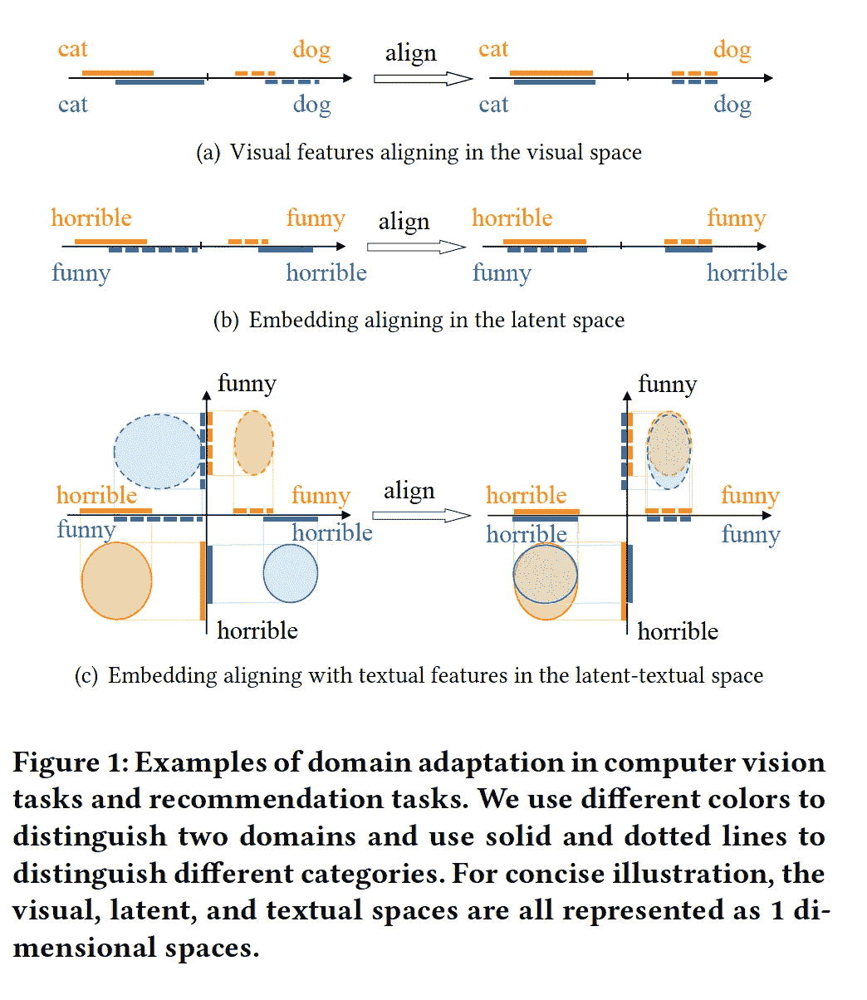
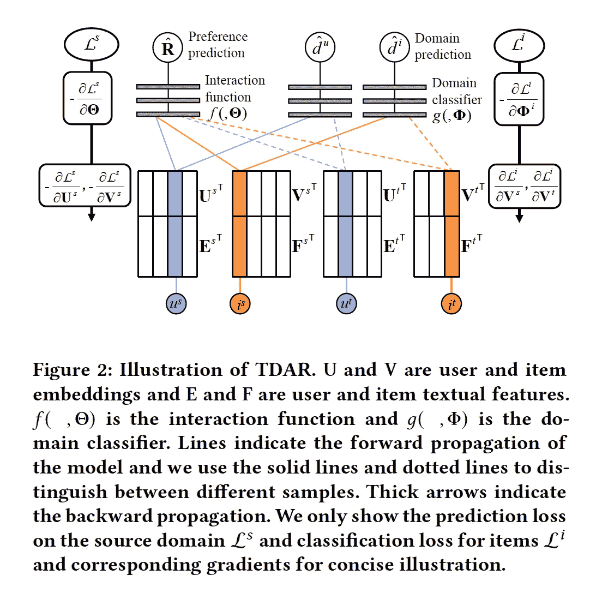
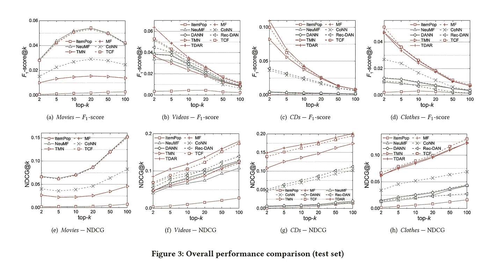

# KDD 2020:通过文本增强的领域适应的半监督协同过滤

> 原文：<https://medium.datadriveninvestor.com/kdd-2020-semi-supervised-collaborative-filtering-by-text-enhanced-domain-adaptation-dfbec4291f4?source=collection_archive---------17----------------------->

*下载“*[*【KDD 论文云知识发现】*](https://resource.alibabacloud.com/whitepaper/cloud-knowledge-discovery-on-kdd-papers_2592) *”白皮书，探索 12 篇 KDD 论文和 12 位阿里巴巴专家的知识发现。*

*由、小林(韩池)、葛俊峰(北理)、欧(三通)、*

推荐算法是机器学习的一个重要应用，在数据特征上不同于其他机器学习算法。用户行为的长尾效应导致的数据稀疏性是推荐系统的一个固有挑战。此外，隐式反馈数据广泛用于推荐算法的数据集中。具体来说，用户对推荐对象的反馈是基于用户行为的集合而不是查询获得的。为了解决这两个问题，社区提出了许多方法，并进行了大量经典的工作。然而，这些问题并没有完全解决。

为了应对数据稀疏，社区通常会在推荐算法中引入更多的信息来辅助协同过滤，例如，引入丰富的边信息，如文本、标签、图片等。对于隐式反馈，通常的做法是执行负采样来生成负样本，从而帮助模型学习。然而，这导致了一个后果，即许多潜在的正样本被错误地标记为负样本，并且模型被标记噪声严重误导。

在现有工作的基础上，我们提出了迁移学习，可以解决这两个问题。我们使用了一个模型，该模型可以进行推理，将知识从数据丰富的源域转移到数据稀疏的目标域。我们还考虑了一个极端的场景，在没有用户和项目重叠的情况下，将知识从一个领域转移到另一个领域，以帮助推荐算法。同时，我们只在源域进行负采样，然后将负样本的知识转移到目标域。这避免了直接在目标域进行负采样，实现了目标域的有效学习。

 [## 什么是数据目录，它如何使机器学习取得成功？数据驱动的投资者

### 数据目录是机器学习和数据分析的燃料。没有它，你将不得不花费很多…

www.datadriveninvestor.com](https://www.datadriveninvestor.com/2020/08/27/what-is-a-data-catalog-and-how-does-it-enable-machine-learning-success/) 

推荐算法严重依赖于用户和项目的表示或嵌入。大多数常见的迁移学习算法都是基于共享的跨域潜在嵌入空间。然而，推荐算法中的嵌入信息分布在没有特定语义的潜在空间中。因此，直接跨域共享嵌入可能会导致嵌入错位。这在很大程度上不同于在计算机视觉(CV)任务中共享潜在层。在图像任务中，图像的轮廓、颜色和其他信息具有特定的含义。两个数据集中的猫或狗的图像在轮廓和纹理上是相似的。在推荐任务中，嵌入在每个维度上都没有语义。因此，源域中的恐怖电影和目标域中的喜剧电影的嵌入向量可能非常相似。直接转移会造成很大的语义落差。为此，我们引入了来自评论的文本信息，并将两个领域的嵌入分别与相应文本的语义空间对齐。我们确保恐怖电影在两个域中的嵌入更接近单词“恐怖”，因此两个域的嵌入可以更准确地对齐空间。

因此，我们设计了一个使用迁移学习的基于文本的半监督推荐算法，并将其命名为文本增强的领域自适应推荐(TDAR)算法。首先，我们分别在两个领域的文本空间中构建用户和项目的隐式表示。具体来说，我们使用记忆网络将用户和项目的隐式表示建模为评论文本中单词嵌入的线性组合。接下来，我们使用基于文本的推荐任务来训练这些表示。然后，我们利用领域适应中的经典对抗训练设计了一个领域分类器和一个协同过滤模块。领域分类器使用对抗训练来将用户和项目嵌入与文本表示对齐，因此源领域的用户和项目嵌入可以与目标领域的用户和项目嵌入在相同的空间中。为了确保两个领域的嵌入可以基于文本对齐，我们将用户和项目的基于文本的表示与嵌入连接起来，然后将连接起来的文本表示和嵌入输入到领域分类器进行对齐。

我们在亚马逊的公共数据集上进行了实验，包括电影、视频、光盘和衣服。我们还删除了域之间用户或项目重叠的数据。在我们的实验中，我们使用数据最丰富的“电影”作为源域，其他三个域作为目标域。同时，我们使用了经典的矩阵分解(MF)协同过滤算法、神经矩阵分解(NeuMF)深度学习算法、深度合作神经网络(CoNN)基于文本的推荐算法、经典的领域对抗神经网络(DANN)对抗学习算法和用于推荐系统的区别对抗网络(Rec-DAN)，一种最先进的跨领域推荐算法，作为比较的基线。结果表明，我们的算法在多个数据集上的性能优于基线。

我们还发现，我们的算法在相似领域的任务中表现得更加出色。这也符合我们的预期，因为从一个很大程度上不同的领域转移知识对目标领域没有多大好处。这表明我们应该选择适当的领域来帮助学习。

我们的解决方案使用文本信息来对齐跨域推荐的用户和项目的表示空间，这是高度可扩展的，并且启发了跨域推荐的工业界。考虑到文本只是其中一种类型的信息，我们将重点使用其他类型的信息来促进迁移学习在推荐算法中的使用。基于其在 CV 和自然语言处理领域的成就，迁移学习将在未来的推荐系统中扮演越来越重要的角色。

*本文观点仅供参考，不一定代表阿里云官方观点。*

# 原始来源:

 [## KDD 2020:通过文本增强的领域适应的半监督协同过滤

### Alibaba Clouder 年 10 月 15 日 94 下载《KDD 论文中的云知识发现》白皮书，探索 12 KDD…

www.alibabacloud.com](https://www.alibabacloud.com/blog/kdd-2020-semi-supervised-collaborative-filtering-by-text-enhanced-domain-adaptation_596743) 

## 获得专家视图— [订阅 DDI 英特尔](https://datadriveninvestor.com/ddi-intel)