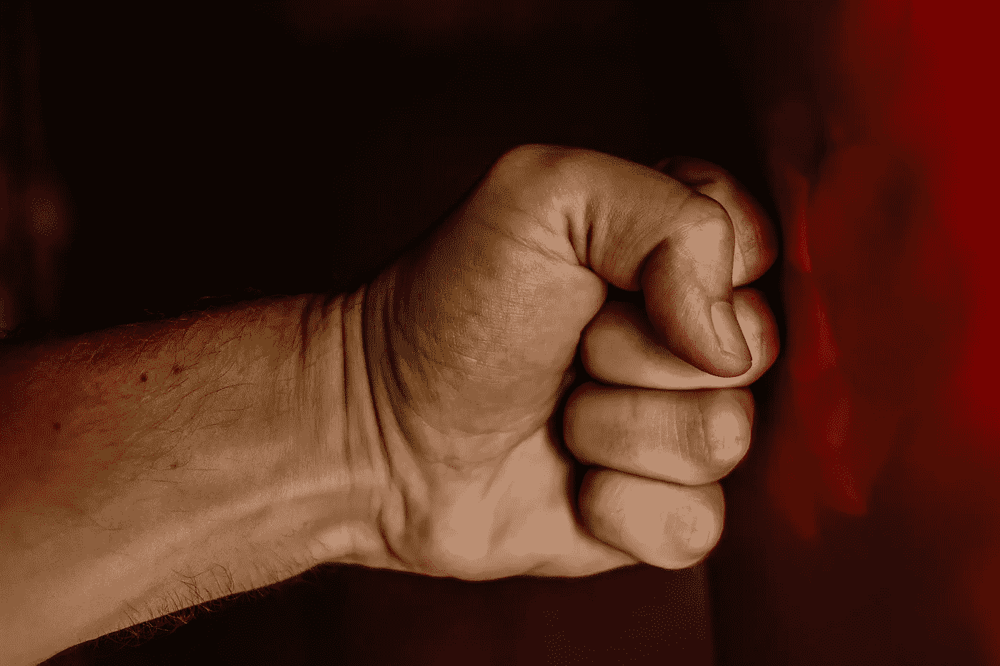

# 在群情激愤的时代保持头脑清醒

> 原文：<https://medium.datadriveninvestor.com/keeping-your-head-in-the-age-of-mass-rage-49aea18f54ae?source=collection_archive---------21----------------------->

## 当别人失去冷静时，保持冷静的 4 个技巧

Photo by [Uriel Soberanes](https://unsplash.com/@soberanes?utm_source=unsplash&utm_medium=referral&utm_content=creditCopyText) on [Unsplash](https://unsplash.com/s/photos/rage?utm_source=unsplash&utm_medium=referral&utm_content=creditCopyText)

那天我下班回到家，羞愧难当。在办公室的经历是一次失败也是一次胜利。失败是因为我最终成为了一个不可调和的对手。在所有人中，他是我的老板。这是一场胜利，因为我终于鼓起勇气为自己挺身而出。回想起来，我可能会以更得体的方式处理这种情况。但是我不知道那么多，也不像今天这样成熟。

我向我最好的朋友和我孩子的母亲讲述了事情的经过。她只是说我应该改变，因为我承认我的老板在某些方面是正确的，尽管他在其他方面是错误的。后者是我的观点，当然它在刚刚发生的决斗中没有任何优势。对我来说，这是那种即使你输了，你仍然是赢家的情况。

不幸的是，当时我还不知道这些课程。否则，我可能已经成熟到可以更好地处理事情了。无论如何，为打翻的牛奶哭泣是没有意义的。从那以后，我学到的教训一直伴随着我。我同样也把它传递给了我家庭内外的其他人。

如果你不理解人们或群体的语言、文化或习惯，你可能会引起冲突或违背你的最佳动机。此外，如果你已经离开一个团体相当长的时间，你可能会与你的团体的精神、观点和其他声明或未声明的协议格格不入。无论哪种情况，你都在不知不觉中踩了人家的脚。出于同样的原因，那些和你有关系的人可能会有意或无意地在错误的地方和最糟糕的时候按下你的按钮。

抛开个人的弱点和缺陷，这些天我选择不去关注那些攻击我的人。每当我感到紧张或生气时，我更喜欢总想着那天学到的东西。

Photo by Pexels

那一天我必须回答的问题可以用这个简单的问题来概括，就是“在这件事上，你为什么烦恼？”

从那时起，这个问题就为我现在如何应对恼人的或其他潜在的令人恼火的互动定下了基调。从那以后，它形成了一个个人框架，我用它来解决我所有日常交往中的任何个人担忧或潜在的糟糕交流。从那以后，我成了一名医生，每次我记得服用自己的药物时，我总是变得更健康、更强壮。这些是问题，我希望你自己来回答。

## 1.在这件事上什么使我烦恼？

尽管这个自我导向的问题很平常，但如果你能花一点时间来反思让你恼火的事情，你可能会有效地控制局面。有时你会发现你正为一些琐事而烦恼。你的烦恼可能是因为你从来没有机会在恶意中伤中为自己辩护。

你可能没有权力决定这个问题，但你有权力选择如何应对。缓和甚至延迟你反应的能力在你的掌控之中。你花在反思上的时间会让你知道这个问题是否值得浪费你的情绪能量或任何回应。

> 能毁灭如此之多的仇恨永远不会毁灭仇恨的人，这是一条永恒不变的法则。
> 
> 人们为他们的所作所为付出代价，更为他们允许自己成为的人付出代价。他们支付费用非常简单。他们过的生活。
> 
> 詹姆斯·鲍德温(1924 年至 1987 年)，

## 2.我能做些什么呢？

你有能力改变或抵消这个烦人的问题或担忧吗？无论如何，如果你能做任何人道的事情来改变你的处境或者把你自己从烦恼的经历中解脱出来，那就去做吧。你总有办法改变你的内外环境。选择权在你。

> 上帝，请赐予我平静去接受我不能改变的事情，赐予我勇气去改变我能改变的事情，赐予我智慧去分辨两者的不同。
> 
> ~雷茵霍尔德·尼布尔的[宁静祷文](https://en.wikipedia.org/wiki/Serenity_Prayer?wprov=sfla1)(1892–1971)

## 3.我会尽我所能吗？

你有能力选择如何应对任何情况。当你故意放慢脚步，考虑你能做的选择时。解决方案的可能性会向你敞开。灵感可能会出现，你面临的挑战可能会展现出机会的前景，如果没有这些挑战和逆境，你可能会错过这些机会。这里的要点是永远不要屈从于命运。当你举手帮助自己时，帮助就会降临到你身上。

> 当你想要什么的时候；整个宇宙都在帮助你实现它。
> ~保罗·科埃略
> 炼金术士
> 
> 我们生活的世界非常适合各种各样的人。它将配合他们提出的任何措施；它将帮助那些真诚帮助自己的人，并将阻碍那些阻碍自己的人。
> 
> 谁要想获得自由，就必须亲自出击。
> ~弗雷德里克·道格拉斯(1818 - 1895)

## 4.最坏的情况是什么？

想象在任何情况下可能出现的最坏情况并不是病态的自省。停下来，问问自己在这种情况下最糟糕的情况是什么？这里的要点是停止担心可能发生的最坏情况，而是想象事情最终可能会如何发展。这不是白日做梦式的逃避或对现实的一厢情愿的忽视。

不要在你无法控制的事情上妄下最坏的结论。保持冷静和耐心会让你更冷静地思考问题。有了正确的心态，你就能更好地处理你的情况，不管它们在最坏情况到最好情况的连续体中处于什么位置。

> 我一生中的大部分时间都在担心从未发生过的事情。
> ~马克·吐温(1835 - 1910)

## 最后

解决任何潜在的令人尴尬的个人或人际关系状况的四个问题框架是:

*   这件事让我烦恼的是什么？
*   我能做些什么呢？
*   我会尽我所能吗？
*   最坏的情况是什么？

你可以对上述框架进行阐述或扩展。但是，下一次你面对一个令人烦恼的个人、人际或任何关系问题时，问问你自己，“我会因为我的自我和骄傲而快乐还是自我毁灭？”四个问题框架提供的答案将帮助你成功地导航和解决这种测试个人或人际交往。

 [## 盆景树在恶劣环境中茁壮成长的 5 个教训

### 在恶劣环境中生存和发展的经验

medium.com](https://medium.com/muse-2-muse/5-lessons-from-a-bonsai-tree-on-thriving-in-tough-environments-3150780c0785)  [## “不”的力量和知道何时使用它

### 来自 Jana Kemp 的这 5 个教训将帮助你知道什么时候放弃，什么时候坚持自己的立场。

medium.com](https://medium.com/the-innovation/the-power-of-no-and-knowing-when-to-use-it-4d995e5682c4)  [## 你的生活是由你的思想构成的。

### 安吉拉·杜克沃斯教授心态的 12 个教训。

medium.com](https://medium.com/illumination-curated/your-lifes-what-your-mind-made-of-it-4a0d926186a2)