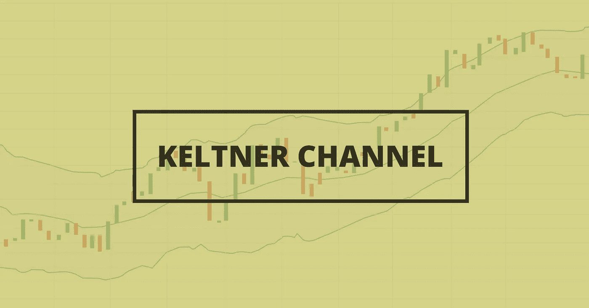
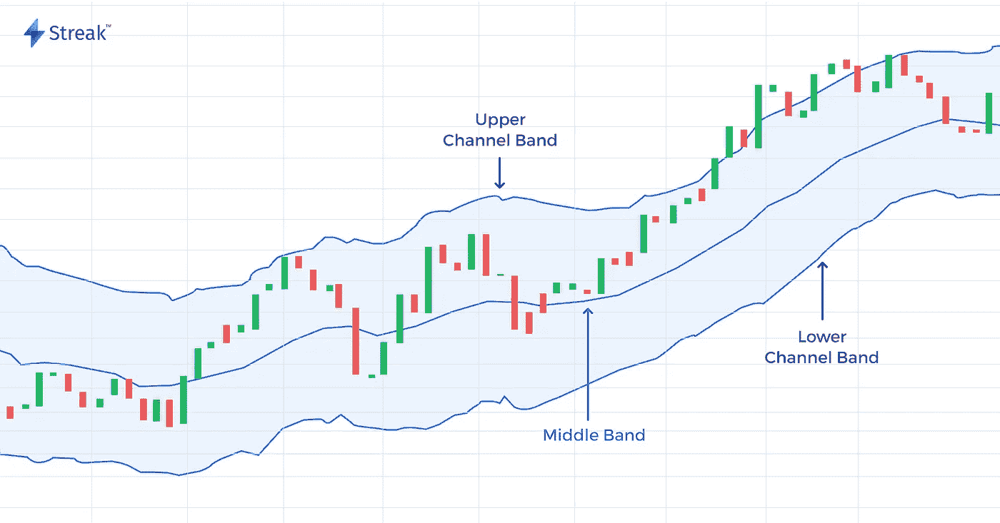

# 凯尔特纳海峡

> 原文：<https://medium.datadriveninvestor.com/keltner-channel-c7675a612dda?source=collection_archive---------1----------------------->

Keltner 渠道的完整指南，提高您的胜率。

Illustration 1: Keltner channel

# 凯尔特纳频道告诉你什么？

凯尔特纳频道是由切斯特·凯尔特纳于 20 世纪 60 年代首次推出的。最初的公式使用简单移动平均线(SMA)作为中线，使用价格范围的高点-低点分别计算上限和下限。20 世纪 80 年代，**琳达·布拉德福德·拉施克**重新推出了改良版的配方。像布林线一样，这个新版本使用基于波动的指标，平均真实范围(ATR)，来设置通道宽度。Keltner channel 使用股票的波动性和平均价格来确定价格变动的范围。它有助于识别趋势、突破、超买/超卖区和潜在反转

# 计算

根据 *Linda Rasche* 的修改版本，Keltner 信道的默认计算如下。

通道有 3 条线高波段= 20 日均线+ ( 2 *平均真实范围(ATR))
中波段= 20 日均线(指数移动平均线)
低波段= 20 日均线-(2 *平均真实范围(ATR))

中间的波段也可以认为是均值，而上下波段，就像布林线反映的是对均值的偏离，凯尔特纳通道使用平均真实范围(ATR)设置通道。

 [## 银行和金融科技初创公司的未来|数据驱动的投资者

### 银行的概念没有太大变化，但随着技术的发展，旧的概念也在更新。不相信我？拿一个…

www.datadriveninvestor.com](https://www.datadriveninvestor.com/2019/10/22/the-future-of-banks-and-fintech-startups/) 

# 如何与 Keltner 渠道交易？

凯尔特纳通道是均线包络线，理论上是用来帮助确定超买和超卖区域的。这种交易策略强调特定股票的一般价格范围，任何超出该价格范围的都被认为是极端的。当价格在上下波段之间波动时，这些波段也可以分别被认为是阻力和支撑。

Illustration 2: The channel with the upper, middle, and lower band.

让我们看一下如何在这个指标的帮助下进行交易，在这个功能的最后，我们还将讨论不同的变化，这些变化可以与这个策略相结合，以提高您的胜率

如上图所示，价格在通道范围内波动，向上、向下或横向，作为交易者，我们必须保持警惕，注意任何突破。一旦我们在下方通道下方看到价格突破，并注意到价格在通道内再次向上反弹，这就意味着可能买入或上涨。当价格突破上限时，我们可以使用类似的策略，当价格再次进入通道确认下降趋势时，我们标记一个回调。

# 普通策略的变体

有许多方法，有时是相互矛盾的，来解释凯尔特人频道。其中还可以融合可以提高策略性能的微小变化

1.  凯尔特纳通道和 200 日均线一起使用:凯尔特纳通道和 200 日均线一起使用，增加了趋势的确认。如果通道高于 200 日均线，股票处于上升趋势，如果通道低于 200 日均线，股票处于下降趋势。类似地，如果通道沿着 200 日均线交易，那么它经历了一个明显的横盘趋势。
2.  带 RSI 指标的凯尔特纳通道
    带 RSI 指标的凯尔特纳通道是另一种帮助识别趋势的组合。这个策略的买入规则是，价格突破凯特纳通道，相对强弱指标在 50 以上，类似的策略也适用于卖方，价格突破凯特纳通道，相对强弱指标在 50 以下。
3.  通道角度
    通道的角度也有助于识别趋势，如果通道向上移动，价格也在上涨。如果通道向下移动，价格就会降低。

# 外卖食品

因此，让我们快速回顾一下这篇文章所揭示的内容

1.  凯尔特纳通道，类似于布林线，是一个封闭的指标，帮助你确定价格趋势。
2.  你可以使用凯尔特纳通道在强势趋势时进场——买入突破或交易回调
3.  如果价格在外通道线之外收盘，避免同方向交易，因为容易回调(或反转)

Keltner 频道的有用性很大程度上取决于所使用的设置。交易者首先需要决定如何使用指标，然后设置它来帮助完成这个目的。如果波段太窄或相隔太远，上面提到的 Keltner 通道的一些用途将不起作用。

**访问专家视图—** [**订阅 DDI 英特尔**](https://datadriveninvestor.com/ddi-intel)