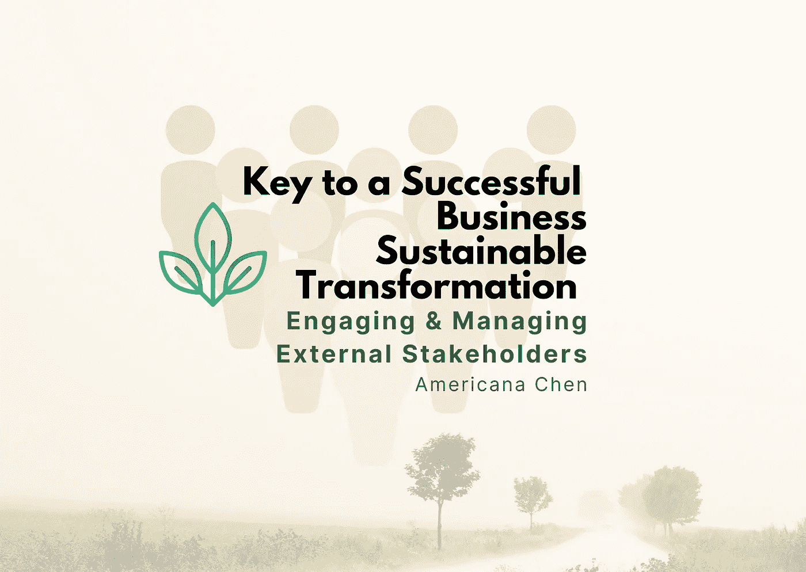
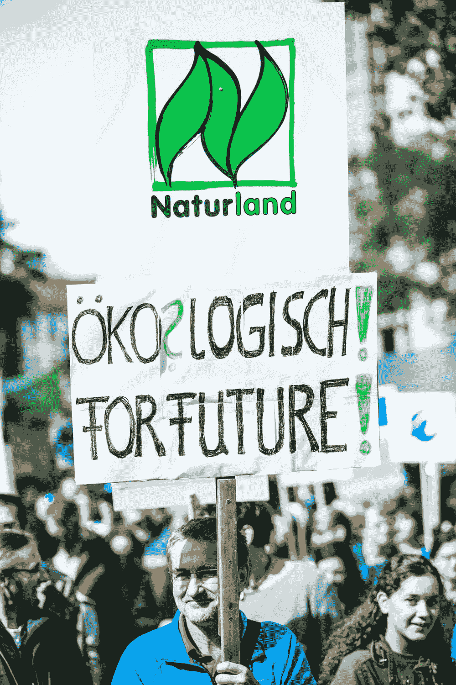
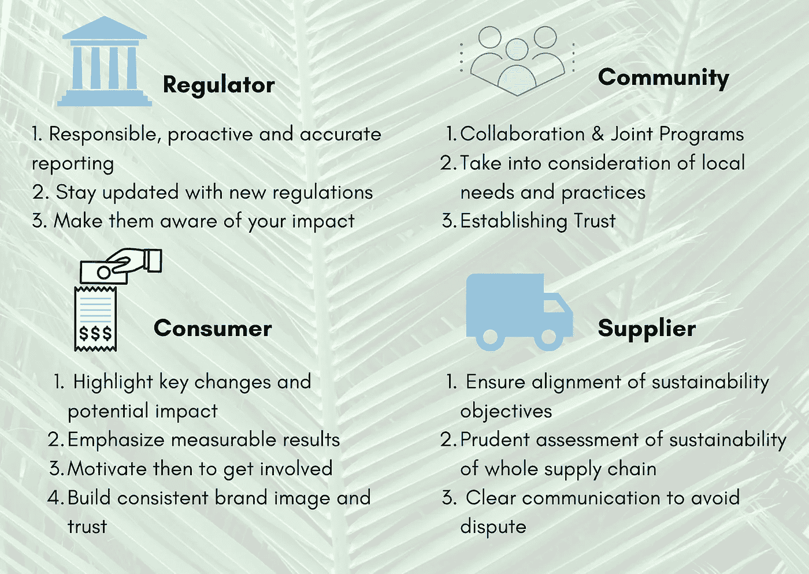

# 成功实现业务可持续转型的关键—吸引外部利益相关方

> 原文：<https://medium.datadriveninvestor.com/key-in-successful-business-sustainable-transformation-engaging-external-stakeholders-5017a8bcf669?source=collection_archive---------17----------------------->

Image made by Americana using Canva

# 可持续转型:企业应优先考虑的紧迫转型

可持续转变并不是一个新话题，自从 19 世纪我们首次发现自然温室效应的影响以来，我们就开始认识到气候变化的问题。然而，直到最近几年，我们才看到企业在引领可持续转型方面面临前所未有的**压力。**投资者越来越关注 **ESG 指标和影响力投资；**消费者正在采用更加可持续的生活方式，并改变他们的消费模式；政府和国际组织一直在不断审查并对企业的环境影响施加更严格的监管约束。

Image Source: Unsplash by
Markus Spiske

世界可持续发展商业理事会已经制定了各种目标，包括到 2050 年实现净零排放。其 200 多名成员致力于这一雄心勃勃的目标，包括著名的公司，如烟草公司菲利普莫里斯国际公司，谷歌，宜家。企业需要意识到，可持续转型的**浪潮正在全球范围内兴起**，不仅仅是大公司需要转型。根据 BSR 2019 年的报告，52%的公司将气候变化作为企业可持续发展的首要任务，竞争压力正在将企业推向可持续转型的边缘。

# 让各种利益相关者参与进来的重要性

那么企业如何加快可持续转型并取得具体成果？促成成功业务转型的最重要因素之一是让所有利益相关者参与进来。在业务转型过程中，**企业需要意识到管理、运营和战略的变化会如何影响外部和内部的利益相关者**。沟通至关重要，企业在管理与各种利益相关者的关系时需要采取不同的方法。

一方面，让利益相关者充分了解信息可以确保他们为即将到来的变化做好准备，并意识到这些变化对自己的潜在影响。这有助于防止纠纷，树立积极的、对社会负责的企业形象。另一方面，**与利益相关者进行有效的双向沟通可以让企业更好地了解利益相关者的期望和需求，从他们那里获得反馈有助于企业评估当前的转型战略，并不断做出相应调整。**

Image Source: Unsplash by [Adeolu Eletu](https://unsplash.com/@adeolueletu)

*在这篇文章中，我将关注外部利益相关者，并提出一些企业可以采用的策略，以更好地实现 ESG 目标，走在监管变化的前面，并建立对不可持续竞争对手的竞争优势。*

# 外部利益相关者—推动转型

***根据麻省理工学院运输物流中心&的调查，1128 名受访者中有 46%表示他们感受到了来自外部利益相关方的压力，要求他们采取可持续发展措施。外部利益相关者是企业转型的主要压力来源，企业可能很难管理和平衡他们的利益。***

外部利益相关者可能包括**监管者、消费者、供应商和社区。**除了始终确保可持续商业实践的透明度和可持续发展相关数据的报告之外，企业还需要考虑不同外部利益相关方的兴趣和关注点之间的差异，并以不同的方式对待他们。下图总结了我的主要建议，我将逐一阐述。

Image made by Americana using Canva

# **1。政府和监管机构:**

确保负责、主动和准确地报告可持续发展指标是企业在与监管机构互动时需要了解的最重要的事情之一。这听起来非常明显和容易，但在实践中，它可能非常困难。

最大的挑战之一是**确保 ESG 数据的质量**，企业如何获得能够反映其 ESG 进展的准确数据？企业还需要问自己，他们报告的数据是否确实是监管机构要求的，企业报告无关数据是非常常见的。未能选择相关的可持续发展指标向监管机构传达了企业缺乏对 ESG 报告的基本理解，并表明缺乏 ESG 能力，阻碍了可持续转型的进展。因此，**在选择可持续发展指标时，企业需要有选择性，并从基于上下文的方法中仔细评估其数据的相关性。所使用的指标应基于业务的具体可衡量目标，并考虑更广泛的行业、地方、国家、全球阈值和背景。**

> “可持续性要求在阈值范围内的背景化；这就是可持续发展的意义所在。”
> 
> — Allen White，全球报告倡议联合创始人

一种**的主动报告方式**也可以提高企业的声誉，以及帮助企业在监管环境的变化中保持领先，避免在应对突然的监管变化时调整生产流程的潜在损失。例如，在印度，公司正在采用自愿原则和行为准则，以主动遵守环境、健康和安全(EHS)政策和供应商行为准则。《联合国全球契约(UNGC)原则》还鼓励 9000 多家全球企业自愿报告和披露其在可持续发展原则方面的表现。

Image Source: Unsplash by [Johannes Plenio](https://unsplash.com/@jplenio)

# **2。社区:**

积极鼓励社区参与也可能是成功的关键，企业应通过透明的报告和遵守其报告的做法来建立信任。有效的双向信息流至关重要，**通过调查、采访、社交媒体帖子不断向社区寻求反馈**让企业更好地了解社区的期望，并相应地调整策略。企业也应该**考虑建立合作项目，让社区参与进来。**例如，发起以环境可持续发展为主题的项目和活动，向公众开放参与。一个想法可能是开展一项活动，要求当地社区加入这项业务，关闭家中的电子设备一小时以节约用电。这类活动是**告知当地社区企业正在经历可持续转型的好方法，这种转型让企业和社区融入一种共同的文化，建立社区纽带。**这些努力也有可能将企业展示给当地社区的新消费者群体。

Image source: Unsplash by [Roman Synkevych](https://unsplash.com/@synkevych)

# **3。客户:**

在与客户沟通时，企业应该采取不同的思维方式，站在客户的角度考虑问题。还需要披露数据和报告，但是，**企业需要强调关键变化和对消费者的潜在影响，而不仅仅是发布数千页的报告。**消费者不太可能浏览整个报告，他们更可能关心**可衡量的、具体的结果**。例如，如果企业只报告供应商转换到与可持续目标一致的新供应商，但没有提出对客户的潜在影响，其客户可能如何解释这种变化是不明确的。因此，不确定的是，消费者的行为会如何做出反应。相反，企业可以强调这将减少特定数量的碳足迹，告知客户尽管他们可能需要在短期内提高产品价格，但从长期来看，在采用更有效的生产流程后，价格最终会回落。这些陈述可以**帮助消除消费者行为变化的不确定性，** **告知消费者可能的影响，同时强调企业对可持续发展的贡献。**

此外，为了加快企业建立**一致和积极的品牌形象**的速度，它可以尝试**鼓励其客户参与采用可持续的生活方式**，将自己与可持续影响更紧密地联系在一起。

image source: Unsplash by [Andrey Sharpilo](https://unsplash.com/@sharpiloa)

# **4。供应商:**

根据麦肯锡的数据，一个典型的消费公司的**供应链占温室气体排放的 80%以上**和**对空气、土地、水、生物多样性和地质资源的影响的 90%以上**占企业生产过程整体环境影响的百分比。供应链中的可持续性问题通常是企业没有意识到的一个领域。根据 CDP 的一份报告，**只有 25%的公司让他们的供应商参与减排**。

为了让企业有效地采用可持续发展的商业模式，它需要确保供应链上的所有供应商都与其可持续发展目标保持一致。在大多数情况下，**供应链上的所有各方就可持续转型中的潜在合作进行协商是有益的**，因为我们已经看到了许多由于不可持续的流程而导致灾难性供应链崩溃的案例。企业在试图影响他们的供应商时可能会面临挑战，因此他们总是需要**确保清楚地传达业务生产流程的变化**和**与供应商协商调整合同条款的意图，消除中断而不是以突然的方式处理它。**麦肯锡分析了有关企业如何与供应商就可持续转型进行谈判的更多指导，可在以下链接中找到:

 [## 从源头开始:供应链中的可持续性

### 未来 10 到 15 年将是消费品公司的重大机遇。预计将有大约 18 亿人…

www.mckinsey.com](https://www.mckinsey.com/business-functions/sustainability/our-insights/starting-at-the-source-sustainability-in-supply-chains) 

# 敬请关注…

除了与外部利益相关者合作，**与内部利益相关者的沟通同样重要，甚至在某些方面更加重要**。组织内的利益相关者在决定适应商业实践变化的效率和速度方面至关重要。员工、管理团队、股东等各种内部利益相关者的参与程度，以及企业各层级可持续发展目标的一致性，是决定企业能否实现可持续发展目标的关键。在本系列的下一篇文章中，我将探讨**企业为什么以及如何让内部利益相关者参与进来，以实现可衡量的、成功的业务可持续转型。**

# **进入专家视角—** [**订阅 DDI 英特尔**](https://datadriveninvestor.com/ddi-intel)

# 关注我/连接到:

领英:[美国陈](https://www.linkedin.com/in/americana-chen-94432219a/)

insta gram:[@ africccana](https://www.instagram.com/africcccana/)

美国陈