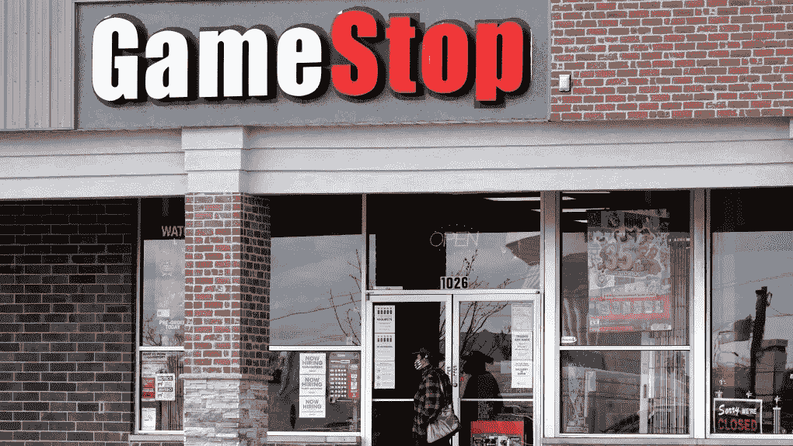
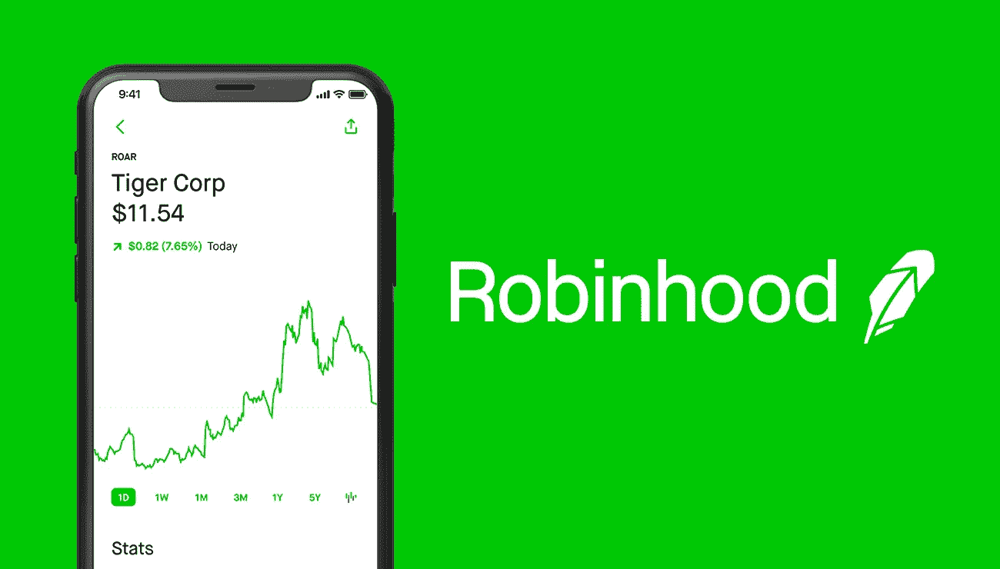

# GameStop 疯狂购股的主要收获

> 原文：<https://medium.datadriveninvestor.com/key-takeaways-from-the-gamestop-frenzied-stock-buy-ff1e07c938e7?source=collection_archive---------28----------------------->

当我昨天浏览 Twitter 时，一个热门话题引起了我的注意:#stonks。这个受人喜爱的迷因，在一个普通的图形背景前有一个穿着西装的人体模型，已经被用来吸引那些做出明显糟糕的财务决策的人。我点击了这个标签，立即看到了“说迷因”,以及一个令人担忧的故事:Reddit 用户在几家濒临破产的公司投入了大量资金，在几天内将股价从个位数提高到了 3。

社交媒体应用 Reddit 是一个拥有 200 万会员的日内交易者社区 subred dit r/wall street bets T1 的所在地。subreddit 也是历史上最大的挤压之一的指挥者。在过去的两周里，大批日间交易员买入了大量股票，其中大部分来自 GameStop。这些交易大幅推高了股价，创造了人为需求。

为什么这是一件坏事呢？嗯，简而言之，Redditors 在**投资的公司不是成功的公司。** GameStop 是一家销售视频游戏技术和软件的传统实体店，由于新冠肺炎的限制，它长期以来业绩不佳，面临进一步的困境。GameStop 最近估计，它要到 2033 年才能实现盈利。即使那些不太了解股市的人也可以自信地说，投资 GameStop 股票不是一个明智的决定。他们是对的。那些在股票市场上更有经验的人甚至会建议，*做空*股票是明智的。

简而言之，做空一只股票意味着做空它。我不会进入技术细节，但是如果你感兴趣，看看这篇文章。试试这个:假设你是华尔街角落办公室里的一个大投资者。你有很多钱，所以你有能力进行长期投资。所以，你发现一家公司的价值看起来正在迅速下降，并通过买卖股票打赌，它的价值，从而其股价，将继续下跌。如果你是对的(如果你的选择是有根据的，你很可能是对的)，你将从赌注中获利。这正是 GameStop 发生的事情。对冲基金卖空了 GameStop 的股票，预期其价值会稳步下降，这并不是一个不切实际的预期。

做空既复杂又有风险，股票市场也是如此。多年来，投资股市被视为富人和受过高等教育的人增加财富的一种手段。不过，最近几个月，股市投资在日常生活中出现了大幅增长，像罗宾汉这样的应用程序使复杂的投资策略变得简单易行。空闲时间的增加也没有坏处。在 2020 年的最初几个月，罗宾汉获得了 300 万渴望投资的用户。市场肯定已经感受到了那些相对缺乏经验、偶尔过度兴奋的交易者的影响，最近的一次是 Reddit 大规模投资事件。

这些新投资者中的许多人，尤其是那些从事大规模投资的 Redditors，对处于食物链顶端的百万富翁投资者怀有一种蔑视。subreddit 上的一名版主谈到了他们的社区“无序而鲁莽”的观点，他写道，“我认为正在发生的事情是，你们这些人正在产生如此大的影响，以至于这些肥猫担心他们不得不起床工作来谋生”。从这种蔑视中，一个计划诞生了:一群日间交易员将抬高 GameStop 和其他被大联盟投资者做空的股票的价格。看，如果做空的赌注没有成功，投资者就会遭受财务损失。整件事是一个虚无主义者给华尔街大佬的信息:现在我们也可以投资了。

Redditors 的努力获得了广泛的成功。周二晚上，GameStop 的股价几乎翻了一番，自 2021 年初以来上涨了 1，700%(截至撰写本文时)。市场估值在几天内从 20 亿英镑涨到了 240 亿英镑。对于一个不成功的公司来说，这是相当疯狂的数字，对吧？没错。这给我们带来了从这一事件中显而易见的主要潜在问题之一。

股票市场不应该是一场游戏；这是一个公司和个人积累资本和财富的地方，希望这些资本和财富能够投入到有意义的事情中。它应该是资本投入到最有成效的事业中的一种媒介。正如一位主持人对《连线》杂志谈到 GameStop 的股票时所说，“这是一只真正爆炸的迷因股票”。交易不是笑话或迷因——股票市场对美国及其他国家的每个人的生活都有着不可思议的巨大影响。投资也不应该是赌博；投资意味着在了解股票的情况下进行，并有在某个地方创造利润的动机。尽管这些 Redditors 可能对普通大众没有任何伤害，但他们正在为一个投机、危险投资的新时代铺平道路，这将对整个股票市场产生严重后果。他们正在破坏人们对股票市场定价能力的信心，这种能力非常接近股票的真实价值，如果继续下去，将会产生灾难性的影响。

第二，作为一个社会，我们需要解决下一代缺乏金融知识的问题。这绝不是性别歧视者自身的反映，而是学校系统没有为未来的专业人士做好足够的准备。金融和投资领域知识的不足已经产生了令人不安的影响。20 岁的亚历山大·卡恩斯(Alexander Kearns)在发现自己的罗宾汉账户上有超过 70 万美元的负结余后结束了自己的生命。他实际上没有欠任何东西——这只是一个暂时的展示，直到他的期权被计算到他的账户中。科恩的实际余额是 16000 美元。他给父母的信中写道，他“不知道自己在做什么”。这个悲惨的故事应该被记住，并作为对那些想在股市上赚快钱或恶作剧的年轻人的警示:研究和规划是必要的。还是那句话，股市不是游戏。当 GameStock 的股票崩盘时——这是必然的——许多优秀的人将损失惨重。

因此，给我这一代人——Z 世代——的一个信息是，当我们进入一个几块钱和一部手机就能让我们投资的世界时，让我们记住，在我们屏幕上的这些数字背后是雇用真实人员的真实公司，并考虑投资的风险。

如果你想看看我的另一篇文章，它详细介绍了我的想法，即在 Z 世代打击高风险的零售交易，同时促进受过教育的投资，你可以在我题为“青少年如何看待投资和经济:金融知识的麻烦”的个人资料中找到它。

更新:罗宾汉和其他互动投资应用程序阻止用户购买 GameStop、AMC 和其他股票，引起了互联网上的愤怒。明确的说，我不同意这些新的限制。自由市场的存在是有原因的。