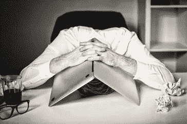
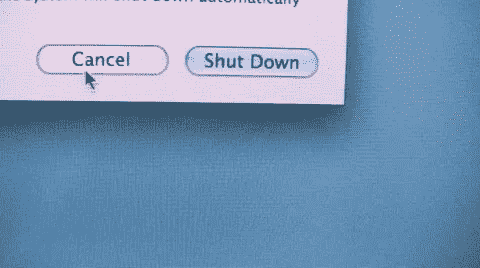

# 扼杀永远在线的心态，它扼杀创造力

> 原文：<https://medium.datadriveninvestor.com/kill-the-always-on-mindset-it-slaughters-creativity-b1df5c55d00f?source=collection_archive---------18----------------------->

## 我们无时无刻不在、持续工作的绝望是如何成为一个无声杀手的？

我们生活在 21 世纪，我们生活在一个永远在线的世界。很难对科技之类的东西视而不见。从我们醒来的那一刻起，我们看着我们的设备，看看一夜之间发生了什么。谁决定给我们发信息的？有哪些应用程序需要我们的关注？我们明天有什么任务？我们有什么会议？有哪些我最喜欢的 meme 页面发布的搞笑猫视频？总是这些“发生了什么事”式的问题。

Credit: Shuttershock

总是问问题，总是忙个不停。我们的思想一直在高速前进，我们似乎永远也不能停下来思考正在发生的事情，就好像我们不再被安排给自己一点时间来呼吸和放松。我们必须继续前进。我们害怕懒惰和失败，以至于让自己精疲力尽。

没有哪个行业比创意行业更难关掉。你的想法总是充满想法，你有许多必须处理的截止日期，你必须尝试和解决的问题。这是精神混乱。但是总是开着会导致几件事情发生，这些事情最终会一起扼杀创造力。

疲倦、倦怠、怨恨等等结合在一起，形成了一种致命的混合物，这种致命的混合物完全剥夺了你的任何创造力。我们将讨论这种“永远在线”态度的五个原因，以及如何轻松缓解这种情况。

**1。“一直开着”会造成慢性疲劳。**

太忙是我们现代 21 世纪社会中根深蒂固的一个问题。

它就在那里，如果没有一个地震般的态度改变，就不可能把它取出来。

孩子们看到他们的父母很忙，并把这视为成功的衡量标准，这传递给了他们的孩子。

大多数人都不知道，这种“永远在线”的态度会造成慢性压力反应，身体不再能以正常方式对压力做出反应。

和压力，时间一长，最终会变成疲劳。所以，你有了这种奇怪的疲倦和无法入睡的混合物，这有助于假装焦虑、抑郁等等。

你会发现你的身体开始在身体和精神上放弃，你就这么完了。

这就是“永远在线”的态度对你的影响，它对你自己和你周围的人没有任何好处，他们必须和你一起经历这种情况。

更糟糕的是，长期疲惫并不能转化为创造力。

你想做的就是睡觉，或者躲在角落里，而不是想出伟大的、创新的想法。这样做变得不可能，因为你所做的一切都是为了生存。

但当你试图残酷地强迫自己产生想法时，情况会变得更糟。

医生建议睡前读一本书，睡上七八个小时，这是有原因的，这意味着你获得了高质量的睡眠，你可以摆脱总是在线的态度。

关掉一段时间后，你可以让这一天成为你的婊子。

**2。“始终开启”会导致烧毁**

创意产业是一个令人敬畏的、奇妙的职业道路，但有不断的需求和期限要满足。

一般来说，一个清醒的人可以满足这些持续的需求。但是当你因为总是开机而感到疲惫和压力时，你就开始感觉到一种叫做倦怠的现象。

倦怠是指你感到身体、精神和情感上的疲惫。通常由持续疲劳和面临过度长时间的压力引起，你只是感到疲惫和疲倦。

Credit: Shuttershock

你真的感觉自己崩溃了。

你就像比萨斜塔，你越来越倾向于倒塌，最终你只是崩溃。

而在精疲力尽后重建自己可能需要几周、几个月甚至几年的时间。

当你身心崩溃时，就不可能想出惊人的新点子。

再说一次，你只是专注于生存。

这种无处不在的倦怠、压力、睡眠不足和生存需要的阴云笼罩着其他一切。

你只是一个喜怒无常，悲惨，没有创造力的你。

与其不停地工作，不如再次关掉。

和朋友出去玩，玩一些电子游戏，画画。看在上帝的份上，远离工作吧。

工作最终会完成，不值得为此牺牲你的精神健康。

**3。“永远在线”让你怨恨你的职业**

有没有登上一辆公共汽车，注意到公共汽车司机是一个充满怨恨，可恨的猪油块？这不是他或她的错。

公共汽车驾驶是一个很难停止的职业的完美例子。

一些巴士司机早上 4 点就开始工作，需要确保他们的巴士是安全的，然后必须应对紧张的乘客和繁忙的日程安排。

现在开公交车并不是一个有创造性的职业，除非公交车司机是伪装的毕加索，但我们怀疑他会开 57 路公交车去市中心。

在工作了 12 个多小时后，大多数人在晚上 9-10 点下班。他们淋浴，吃饭，然后睡觉。没有时间放松，只有时间为第二天做准备。

他们的生活是驾驶公共汽车和试图提供客户服务，后者是可选的。当你怨恨你的职业时，你做你需要做的，然后离开。

当你在一个创造性的行业，你憎恨你的工作，你容忍你的客户，创造一个平庸的设计，给他们，然后继续前进。

你变成了这个不合标准的饼干模具。

你总是在工作；你想远离这份充满怨恨的职业。公共汽车司机想离开他们令人讨厌的驾驶工作。

不管你得到多少报酬，你都不快乐。

你进去，完成任务，然后离开。

> 用斯奎沃德的话说，“我们这样做了四十年，然后就死了。”

不，你不想那样生活。

遵循我们的建议，避免从事你讨厌的职业，如果你真的讨厌你的职业，这有很多原因；糟糕的管理，粗鲁的同事，不公平的工作量，告诉你的老板在哪里坚持他们的工作。

**4。“一直开着”让你不舒服**

众所周知，压力会让你生病，这种情况一直存在，也将永远存在。

我们的身体被设计来处理一点点压力，然后恢复平静。

但是，“永远在线”阻止了我们这样做。我们总是忙忙碌碌，这对我们的身体不公平。

医学影响包括免疫抑制，这意味着你的身体不能有效地对抗病毒和疾病。

这可能导致严重的慢性疾病，包括癌症和心脏病。

在这个“永远在线”的社会，约 60%的就医是由压力引发的疾病造成的。

正如我们所讨论的，在创意行业意味着你容易有压力，这意味着你不太可能变得不舒服。

身体不适意味着无法正确有效地完成工作，因为你感觉很糟糕。

而且很容易变得更糟。开始可能是感冒的症状可能会发展成流感，进而变成慢性肺病。

在你意识到之前，在多年紧张的“永远在线”的生活方式之后，你正在接受药物治疗，并不断试图获得折磨你的慢性疾病的治疗。

这种生活方式简直要了你的命。

它是一个无声的杀手。

它不会跳到你身上，在你的心脏插一刀，但它肯定会导致你过早死亡。

**5。“永远在线”不起作用。**

如果我们在这一点上没有说服你，让我们直言不讳。

它不起作用。

不是这样的！“永远在线”意味着不断地出现在人们和工作中，这变得令人紧张和疲惫。你需要身体和精神上的休息，这没关系。

我们有必要偶尔从繁忙的生活中休息一下。打开“请勿打扰”,关闭 Gmail，看看网飞，烤个蛋糕，做点瑜伽，让自己远离现实世界的压力。

Credit: Shuttershock

持续忙碌的想法可能听起来很好，很有效率，但是它正在慢慢地杀死你和你的效率。

你无法完成高质量的工作，你甚至无法在这样的条件下工作。

休息一下吧，你是最重要的。