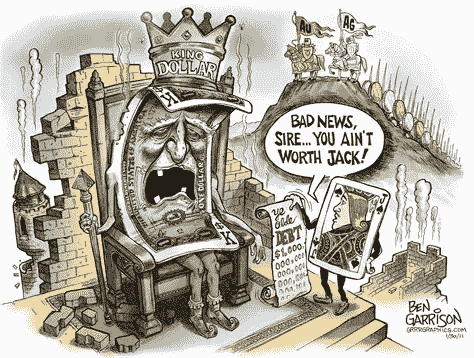
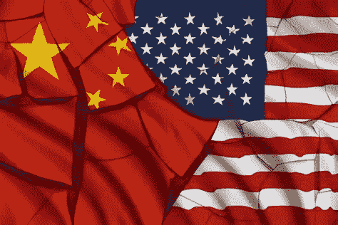

# 美元之王将成为密码菲亚特之王

> 原文：<https://medium.datadriveninvestor.com/king-dollar-will-be-king-of-crypto-fiat-3270f2fce7fb?source=collection_archive---------11----------------------->

King dollar

虽然比特币社区似乎完全被比特币的日常涨跌所吸引，但似乎大多数人都错过了**，这对加密行业来说很可能是 2021 年最大、最有影响力的消息**。

昨天的大新闻是[美国银行监管机构 OCC 发布了一份意见函](https://www.occ.treas.gov/news-issuances/news-releases/2021/nr-occ-2021-2.html)，允许美国银行使用区块链的基础设施和稳定的资本。

[我昨天发布了这个](https://www.linkedin.com/posts/andrea-bianconi-blockchain-law_federally-chartered-banks-and-thrifts-may-activity-6752224497425813504-5NOU)但是它表明——除了少数例外——加密社区并没有完全记录这样一个事件的重要性。这不仅仅是简单的重要，而是巨大的。这就像银行说“好吧，我们批评比特币和加密行业已经有 10 年了，直到昨天……但很抱歉我们错了，现在我们喜欢它，我们将开始使用你们的基础设施，甚至像比特币和 USDT USDC 这样的加密资产来进行支付”。答对了。

现在，我想补充一些关于这个话题的想法。

这是美国监管机构采取的一个非常聪明的捷径，使加密美元的使用合法化，并对抗中国的 DCEP。基本上，当 DCEP 启动并运行，其他人仍在考虑如何发行 CBDCs 时，美国表示“稳定货币形式的数字美元已经存在，美国银行可以使用它们”。在世界经济逐渐接受美元霸权及其出于地缘政治原因的武器化所造成的问题的时候，这一举动将再次加强美元对世界经济的霸权，但以更积极的方式。**我的意思是，从地缘政治的角度来看，我认为美国的举动使 SWIFT 实际上过时了，并且在预测加密美元作为数字世界中的一种全球工具的同时，它也降低了美国将其作为其地缘政治议程的一种武器的能力。这对世界无疑是积极的。让我们看看这在未来的美国体制中会如何发展。**

但是，在今后几周和几个月里，我们还必须考虑其他一些重要方面，以充分理解这一非常重要的决定的含义:

(一)这对金融科技项目有何影响？

(ii)这允许美国银行向其客户提供额外服务，如购买和托管比特币和其他加密资产，以及在使用加密作为抵押品的情况下发放贷款。它突然打开了即时加密大规模采用和传统银行业及其客户加入的大门。

(iii)美国银行现在可以运行密码节点，甚至挖掘密码。

(iv)美国银行现在可以发行稳定的债券。因此，期待很快看到高盛或 JPM 的加密美元，美元的 GS 或美元的 JPM。

(v)这可能会对流动性产生积极影响，并缓解欧洲美元银行间市场的长期美元短缺

(六)那么一美元 CBDC 就变得多余了？

(vii)通过使用支持现有 stablecoins 的比特币和以太坊协议，银行的采用可以大规模扩大，而无需建立任何新的基础设施或特定的钱包。所有的工作都已完成，银行只需接通电源。银行自己的稳定账户也是如此，可以在几个月内建立并运行。银行也将受益于使用这种协议进行交易的安全性、安全性、弹性、速度和低成本。非常方便，简单，非常，非常聪明。

(viii)直到昨天，比特币还是一个平行的金融系统。明天，它将是主要的，新的金融数字系统的支柱，一切都可以建立在这个基础上。雷伊·达里奥早就应该听进去了。

(九)最后但并非最不重要的一点是，通过这一举措，商业银行在有关 CBDC 的决策上领先美联储一步。基本上，在新的数字加密世界中，银行巩固了它们作为服务提供商和中介的角色。这意味着，如果美国在未来推出自己的 CBDC，并决定直接向其公民提供直升机撒钱刺激，这将由商业银行向公民钱包注资来完成，而不是直接由美联储来完成。

# 结论

如果美元想要赢得数字竞赛，并在未来保持储备货币的地位，唯一的办法就是击败它的竞争对手，中国的 DCEP 和欧元。

**欧洲正悲剧性地滑向一个反乌托邦的现实——由极权主义控制、宪法自由的限制、无处不在的监控、破坏性的封锁以及不久将通过不可持续的税收水平征收私有财产构成。 由一群无能和腐败的官僚/政客组成的邪恶团伙实施，他们为亿万富翁垄断者/食利者和** [**狂妄自大的“重置者”**](https://www.youtube.com/watch?v=4zUjsEaKbkM) **组成的寡头精英服务——美元可以通过向全世界的自由人民提供一种加密美元来轻松巩固其首要地位，而无需中国人在 DCEP 中内置的监控工具，或者欧盟精英对欧元的期望。**

这将确保美元仍然是法定加密之王，比特币也是加密之王。这第一步是朝着正确方向迈出的重要一步。

*****************************************************************

**通过向**捐款来支持我独立自由的写作

[T3【www.bianconiandrea.com/】T5](https://www.bianconiandrea.com/)

如果你喜欢这篇文章，请在左下角“鼓掌”x 次，这样它会被更多的人分享。多谢

******************************************************************

**法律免责声明**:本网站及其中包含的信息仅供一般指导，并不构成法律意见。因此，它不应被用来替代就具体问题与律师的磋商。本文中的所有信息均按“原样”提供，不保证完整性、准确性、及时性或任何形式的明示或暗示的担保。

**投资免责声明**:本网站及其中包含的信息无意成为与所提交材料相关的建议或信用分析的来源，本网站中包含的信息和/或文件不构成投资建议。

www.bianconiandrea.com—2021 年

**访问专家视图—** [**订阅 DDI 英特尔**](https://datadriveninvestor.com/ddi-intel)

*原载于 2021 年 1 月 7 日*[*https://andreabianconi.medium.com*](https://andreabianconi.medium.com/king-dollar-will-be-king-of-crypto-fiat-66588ee64d01)*。*