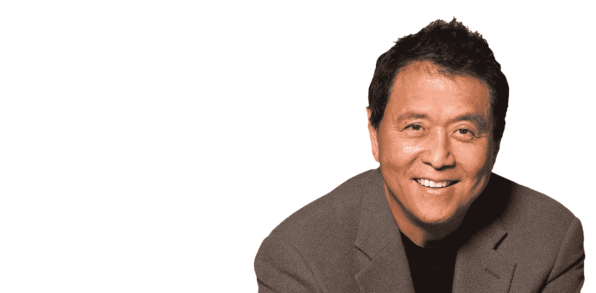

# 清崎财务自由的 5 个关键

> 原文：<https://medium.datadriveninvestor.com/kiyosakis-5-keys-for-financial-freedom-bca4b20d8379?source=collection_archive---------4----------------------->

金钱不能给你带来幸福，但它可以让你过上更好的生活。

在此之前，我一直是穷光蛋。太可怕了。最糟糕的是你没有代理，因此从每周一次的商店到在线再培训都变得更加困难。金钱可以给你一件它用来实现的东西:时间。最终，金钱给你选择，有了选择，你就可以开始过上更好的生活。无论是加入当地的健身房，进行冥想静修还是购买更健康的食品，如果你没有可支配收入，这些选择都不会存在。

不需要天才就能明白财务自由的好处以及它能给你带来什么。实现财务独立是许多人的目标。财务自由等同于手头有足够的储蓄、投资和现金来负担我们自己和家人想要的生活方式。

罗伯特清崎，一个八年级辍学的企业家和投资者，是美国作家和商人。他的书《富爸爸穷爸爸》面向那些寻求财务自由的人，被认为是有史以来最好的财务书籍之一。

# 以下是罗伯特清崎的财务自由的 5 个关键:

# 1.控制你的开支

鉴于目前的情况，现在是摆脱那些不必要订阅的最好时机。你的消费习惯是你无法轻松获得未来财务保障的主要原因之一。

 [## 更好的预算，打造更大的|数据驱动型投资者

### 即使是专家也承认它们并不完美。从 1 到 10 的范围内，安东尼·科普曼和德尔…

www.datadriveninvestor.com](https://www.datadriveninvestor.com/2018/11/08/budget-better-to-build-bigger/) 

制定一个预算，并在它的约束下生活，这对于在你的生活中获得财务自由至关重要。预算给了你管理收入和控制支出所需的信息。从根本上说，预算给你一种责任感。如果你想确保你的财务安全，那么预算将为你提供实现这一目标的工具。

# 2.首先支付你自己

我怎么强调都不为过:确保你给自己发工资。多年来，我父亲一直是个体户，他把不必要的利润用于为自己的企业购买更多股票，其中大部分从未卖出。相反，他本可以获得更高的利润，并将这笔钱用于退休后的投资。他在一份艰难的工作中长时间工作，现在却没有多少成绩。

确保你存了一些薪水。如果你不能至少存一些钱以备不时之需，那么工作还有什么意义呢？来支付账单吗？投资一部分钱是很好的，但是在你做任何事情之前，确保你至少存下每月工资的 20%。

实现财务自由的一个重要的基本实践是为自己工作，而不是为银行或信用卡公司工作。先学会支付自己，再支付别人。通过这样做，你让自己变得更富有。

只有今天存钱，明天才能投资，在这个过程中确保你的财务自由。

# 3.不要在贬值的物品上花很多钱

不要把大量的钱投资在快速贬值的东西上。

即:汽车。你知道有多少开着豪华车的人没有多少财富？如果你投资 100，000 美元在房地产上，你购买的房子很可能会跌破这个数字。尽量减少你在贬值物品上的花费。

许多人为了获得这些高价值的物品而负债。债务是许多人生活中财务不安全的主要原因之一。它开始从内部吞噬你，阻止你追求你的梦想、希望和人生目标。

# 4.建立应急基金

应急基金是一种现金缓冲，可以支持你至少三个月的生活开支。鉴于我们所处的环境，这是一个非常有益的概念:市场正以前所未有的速度变化。随着他们的改变，技能短缺发生，而其他职业变得无用。10 年前，零售银行是一个高尚的职业，现在看来，这份工作在未来 10 年内甚至不会存在。

人们需要灵活运用他们的技能和资格，但这本身就需要一定程度的安全。有一个应急基金是必要的，以确保当这种情况出现时，你不会求助于债务。

拥有现金缓冲的最好方法之一是设立一个备用银行账户，开始为你的应急基金存钱。

# 5.简化你的生活

生活几乎每天都变得越来越复杂。追逐金钱和你的财务目标会分散你对生活中非常重要的事情的注意力。结果，你会开始失去动力，陷入黑暗。因此，如果你能从所有的杂乱中解放出来，从而简化你的生活，那将会有所帮助。

财务自由的关键很简单:将你的传统收入转化为被动收入或投资组合收入。记住这一点，在不放弃你真正珍视的东西的情况下，实现你渴望的目标是很简单的。