# 如何使用 Python 逐步构建 KMeans 来对可穿戴设备数据集上的身体活动进行聚类

> 原文：<https://medium.datadriveninvestor.com/kmeans-clustering-on-wearable-device-dataset-are-you-lying-sitting-or-running-ffe0637e7844?source=collection_archive---------2----------------------->

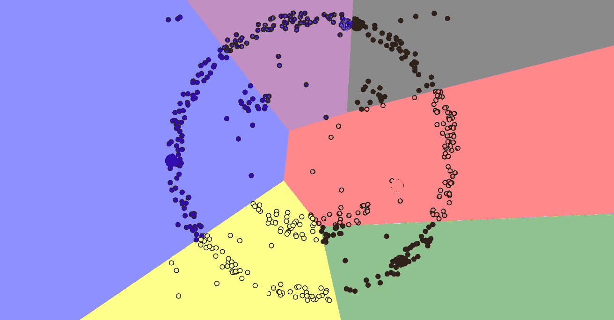

## 基于 Python 的物联网数据无监督学习

你或你的朋友戴 Fitbit、Apple Watch 或 Garmin 吗？从监测穿戴者身体活动的可穿戴设备收集的数据正被纳入大量商业用途，包括医疗保健、健身训练、导航系统等。

本文介绍了一种端到端的无监督学习解决方案 **KMeans 聚类**来区分穿戴者的身体活动:躺着、坐着或跑步，而不使用任何标签，由此您可以对使用 KMeans 聚类的端到端过程产生直觉。此外，有了用 KMeans 构建的技能和经验，您可以在购物、营销、电影、书籍、新闻、音乐等社交媒体中创建推荐系统。

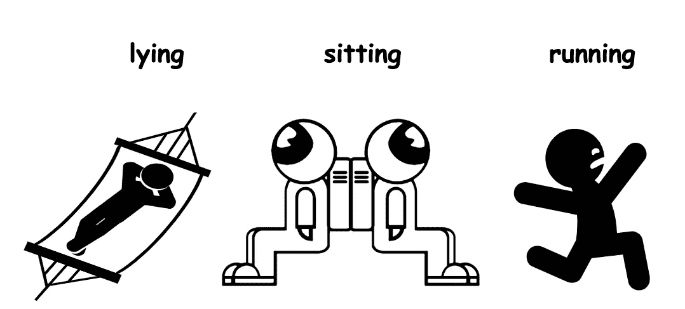

icons credit to Karina M. and A M from the Noun Project

# 概述

*   数据的整体视图
*   传感器数据的统计分布
*   通过标准化和活动的一键编码实现功能扩展
*   python 中 KMeans 集群的基本版本
*   高级版本的 KMeans 聚类与聚类数实验:惯性，轮廓和整体准确性
*   结论和未来工作

# 数据的整体视图

本文中使用的数据可以从这个[链接](https://drive.google.com/open?id=1sqbJBOB_eL1Zy-PO2OoMhWsZ18Epevam)下载，这个链接是从 UCI 机器学习库中的公共[数据集](https://archive.ics.uci.edu/ml/datasets/PAMAP2+Physical+Activity+Monitoring)调整而来的子集。

## 导入库

```
import os
import numpy as np
import pandas as pd
from datetime import datetime as dt
from sklearn import preprocessing as pp
from sklearn.model_selection import train_test_split 
from sklearn.decomposition import PCA
from sklearn.preprocessing import label_binarize
from sklearn.cluster import KMeans, MiniBatchKMeans
from sklearn.metrics import silhouette_samples, silhouette_scoreimport matplotlib.pyplot as plt
import seaborn as sns
sns.set(style='whitegrid', palette='muted', font_scale=1.5)pd.set_option('display.max_colwidth', -1)
pd.set_option('display.max_columns', 5000)
pd.set_option('display.max_rows' , 10000)
pd.set_option('display.width', 10000)
pd.set_option('display.precision', 6)
plt.rcParams['figure.figsize'] = [12, 6]
```

## 加载数据

```
df = pd.read_csv(‘physical activity monitoring_UCI.csv’)if 'Unnamed: 0' in df.columns.tolist():
    df = df.drop(['Unnamed: 0'], axis=1)
if 'timestamp' in df.columns.tolist():
    df = df.drop(['timestamp'], axis=1)

df.head()
```

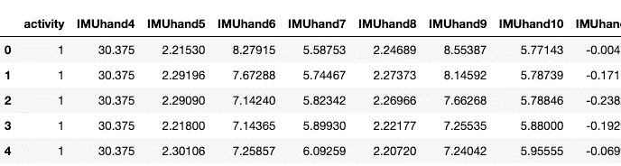

```
df.info()
```

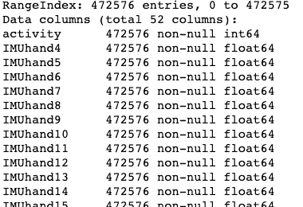

如上所示，52 列有 472576 个条目。这 52 个功能组织如下:

*   **【活动】**

```
'''
3 types of activities
– 1 lying
– 2 sitting     
– 5 running
'''df['activity'].value_counts()
```

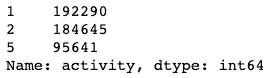

数据集中有 3 种类型的活动。“1”对应“躺”，“2”对应“坐”，“5”对应“跑”。简单来说，我们用“3”代表“跑步”来更新数据集。**此标签仅用于评估我们的 KMeans 模型，而非训练模型。**

```
#  use 3 for runningconditions = [df['activity']==1,df['activity']==2,df['activity']==5]
choices = [1,2,3]
df['activity']  = np.select(conditions, choices, default='null')df['activity'].value_counts()
```

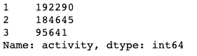

1 for lying, 2 for sitting, 3 for running

```
# Pie chart, where the slices will be ordered and plotted counter-clockwise:
labels = 'lying', 'sitting', 'running'
sizes = [192290, 184645, 95641]# only "explode" the 3nd slice (i.e. 'running')
explode = (0, 0, 0.1)fig1, ax1 = plt.subplots()
ax1.pie(sizes, explode=explode, labels=labels, autopct='%1.1f%%',
        shadow=True, startangle=90)
ax1.axis('equal')  # Equal aspect ratio ensures that pie is drawn as a circle.plt.show()
```

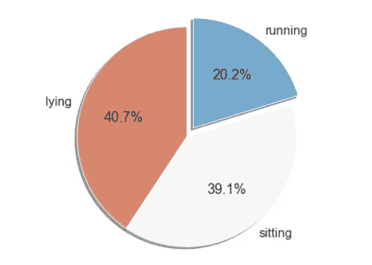

20.2% of the activities are “running”

*   **“IMU *”数据来自 3 个传感器**

使用了 3 个 Colibri 无线 IMU(惯性测量单元)。传感器的位置和收集的数据:

1.  主臂**手腕上的 1 个 IMU**——采集的数据存储在“IMU hand 4”～“IMU hand 20”中
2.  **胸部**上的 1 个 IMU 采集的数据存储在“imuchest 21”~“imuchest 37”中
3.  1 优势侧**脚踝**的 IMU 采集的数据存储在“IMU ankle 38”～“IMU ankle 54”中


photo edited from a post at [ebuyer](https://www.ebuyer.com/blog/2013/11/the-impact-of-technology-in-sport/)

# 传感器数据的统计分布

可视化和比较从三个位置收集的传感器数据的分布:手、脚踝和胸部。

```
fig, axes = plt.subplots(1, 2, figsize=(16, 6))axes[0].hist(df[df['activity']!=3]['IMUhand20'], bins=100, alpha=0.7, color='LightCoral');
axes[0].hist(df[df['activity']==3]['IMUhand20'], bins=100, alpha=0.7, color='LightSkyBlue');
axes[0].vlines(x=df['IMUhand20'].mean(),ymin=0, ymax=10**3, linestyles='dashed')
axes[0].set_yscale('log')
axes[0].set_title('IMUhand20')axes[1].hist(df[df['activity']!=3]['IMUankle51'], bins=100, alpha=0.7, color='LightCoral');
axes[1].hist(df[df['activity']==3]['IMUankle51'], bins=100, alpha=0.7, color='LightSkyBlue');
axes[1].vlines(x=df['IMUankle51'].mean(),ymin=0, ymax=10**2, linestyles='dashed')
axes[1].set_yscale('log')
axes[1].set_title('IMUankle51');
```

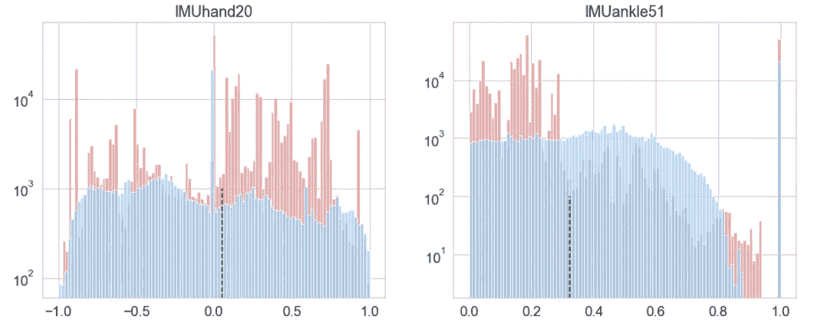

hand and ankle

```
fig, axes = plt.subplots(1, 2, figsize=(16, 6))axes[0].hist(df[df['activity']!=3]['IMUchest24'], bins=100, alpha=0.7, color='LightCoral');
axes[0].hist(df[df['activity']==3]['IMUchest24'], bins=100, alpha=0.7, color='LightSkyBlue');
axes[0].vlines(x=df['IMUchest24'].mean(),ymin=0, ymax=10**3, linestyles='dashed')
axes[0].set_yscale('log')
axes[0].set_title('IMUchest24')axes[1].hist(df[df['activity']!=3]['IMUchest33'], bins=100, alpha=0.7, color='LightCoral');
axes[1].hist(df[df['activity']==3]['IMUchest33'], bins=100, alpha=0.7, color='LightSkyBlue');
axes[1].vlines(x=df['IMUchest33'].mean(),ymin=0, ymax=10**2, linestyles='dashed')
axes[1].set_yscale('log')
axes[1].set_title('IMUchest33');
```

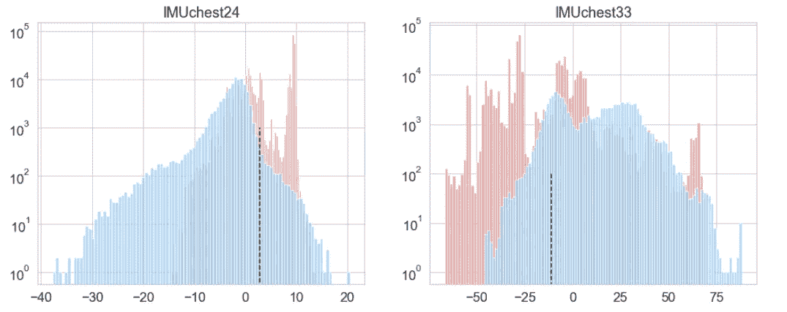

chest

红色条代表佩戴者处于“跑步”状态，而蓝色条代表“躺着”或“坐着”。我们随机选取了列:“IMUhand20”、“IMUankle51”、“IMUchest24”和“IMUchest33”，它们分别是从手、脚踝和胸部收集的数据。

如上图所示，与手和脚踝数据相比，从跑步到非跑步状态，胸部数据的分布变化更大。跑步时心率会升高是有道理的，这是一个强烈的信号。

# 标准化的功能扩展

应用来自 sklearn 的标准定标器来标准化除“活动”之外的特征，以便这些特征以 0 为中心，标准偏差为 1。正如我在以前的帖子中多次强调的那样，标准化数据以确保特征在相同的相对范围内是一个必不可少的步骤，也是许多机器学习算法的一般要求。

```
# standardization
data_std = data.copy().drop(['activity'], axis=1)
Class = data['activity'].copy()
featuresToScale = data_std.columns
scaler = pp.StandardScaler(copy=True, with_mean=True, with_std=True)
data_std.loc[:, featuresToScale] = scaler.fit_transform(data_std[featuresToScale])data_std.describe()
```

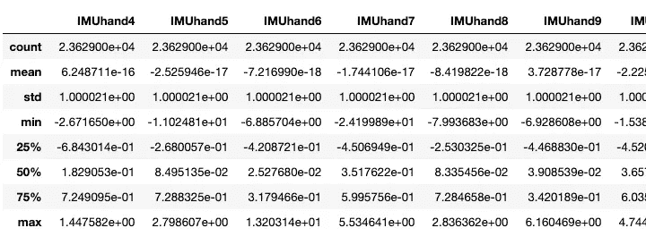

```
# One-hot encodingfrom sklearn.preprocessing import label_binarize'''
3 activities
– 1 lying
– 2 sitting     
– 3 running
'''# one-hot encoding
n_classes = 3
lb = pp.LabelBinarizer()
y_label = lb.fit_transform(Class)
```

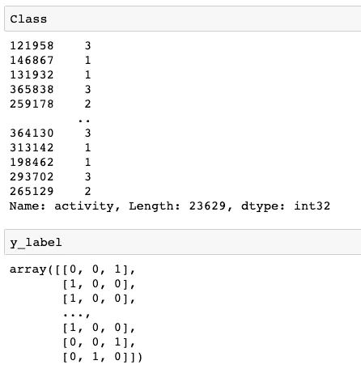

one-hot encoding for Class which is the type of activities

# python 中 KMeans 集群的基本版本

聚类是无监督学习家族中的重要成员，该家族试图在不使用任何标签的情况下基于相似性将对象分组在一起。正如本文开头所提到的，在零售、在线购物、市场营销、新闻、电影、书籍、音乐等社交媒体中，聚类通常用于构建推荐系统的基础。


Before clustering; 3 centroids added

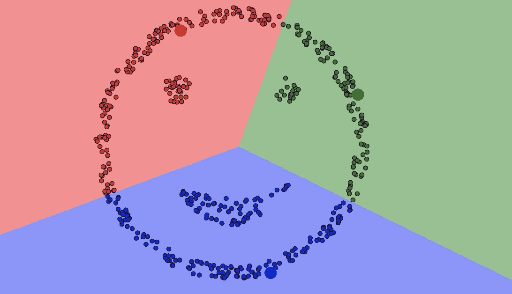

After clustered with 3 centroids; Image created using [an online tool](https://www.naftaliharris.com/blog/visualizing-k-means-clustering/)

在 KMeans 聚类中，需要在训练模型之前指定所需的聚类数。KMeans 的不同运行的结果会略有不同，因为该算法随机将每个观察值分配给一个聚类以开始聚类，然后通过最小化聚类内变化的总和(也称为所有聚类的[惯性](https://scikit-learn.org/stable/modules/generated/sklearn.cluster.KMeans.html))来优化分段。通常，KMeans 会运行几次，并选择所有集群中惯性总和最低的运行。

1.将数据分成训练和测试数据集。

```
X_train , X_test , y_train , y_test = \
            train_test_split(data_std, y_label, test_size=0.2, random_state=42, stratify=y_label)
```

2.加载库并设置参数。

*   **n_init** 是 KMeans 将与不同数量的集群一起运行的初始化次数。最终结果将是 n_init 连续运行在惯性方面的最佳输出(组内变化)。
*   **max_iter** 是算法单次运行的最大迭代次数。在我们的例子中，总迭代次数是(225 次迭代/每次运行)* 12 次运行。
*   n_jobs = -1 意味着我们正在使用所有的处理器。KMeans 真的很慢(没有抱怨:)。

3.建立和训练模型；得到惯性值；计算平均轮廓分数。

Basic version of KMeans clustering python code

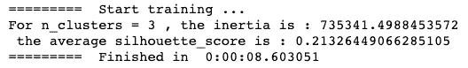

当类的数量为 3 时，KMeans 将所有观察结果分组为 3 个类，平均轮廓得分为 0.21，惯性为 735341.49。

```
# plot the distribution of the 3 clusters plt.scatter(X_train.iloc[:, 0], X_train.iloc[:, 1], c=cluster_labels, label=cluster_labels)
# Labeling the clusters
centers = clusterer.cluster_centers_
# Draw white circles at cluster centers
plt.scatter(centers[:, 0], centers[:, 1], marker='o',
            c="white", alpha=1, s=200, edgecolor='k')for i, c in enumerate(centers):
    plt.scatter(c[0], c[1], marker='$%d$' % i, alpha=1,
                s=50, edgecolor='k')plt.title("Distributed based on clusters");
```

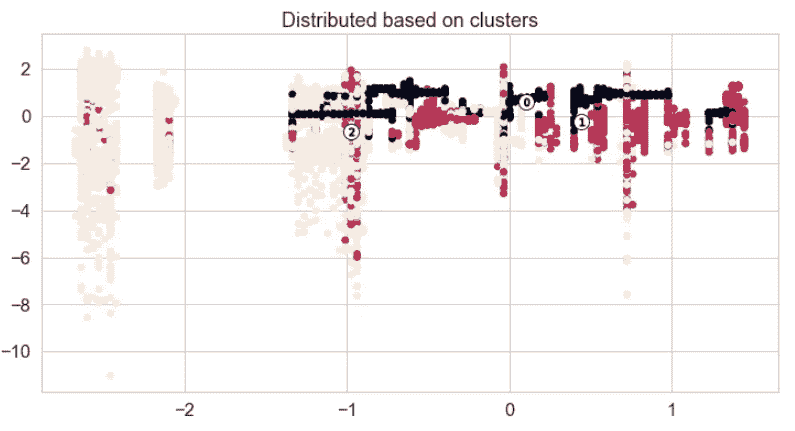

如果您对信息感到有点不知所措，尤其是如果您是第一次构建聚类模型，您可以在这里暂停一下，过几天再回来。太多的投入可能会太大，一口吃不完。如果你对如何通过计算惯性、剪影得分*和整体准确度来实验和选择理想的聚类数超级好奇，让我们继续。*

# 高级版本的 KMeans 聚类与聚类数实验:惯性，轮廓和整体准确性

有三个指标被广泛用于评估 KMeans 算法:

*   惯性
*   剪影分数
*   总准确度

[k means 高级版](https://gist.github.com/alinazhanguwo/d8d3cf8e6621f5886f3a4a4f1b3956d8)的 python 代码由基本版升级而来，有以下变化:

[The python code of KMeans advanced version](https://gist.github.com/alinazhanguwo/d8d3cf8e6621f5886f3a4a4f1b3956d8)

*   在 2 到 20 个不同数量的集群上运行 KMeans
*   记录惯性
*   记录剪影分数
*   添加一个自定义函数来计算整体精度，我们将在下面详细讨论

## **惯性**

惯性是观测值到最近的聚类中心的平方距离的总和，也称为类内变化。下图显示了当集群数量从 2 到 20 时的惯性值。

惯性随着簇数量的增加而减小。这确实有意义，因为我们拥有的集群越多，每个集群内的观测值的同质性就越大。

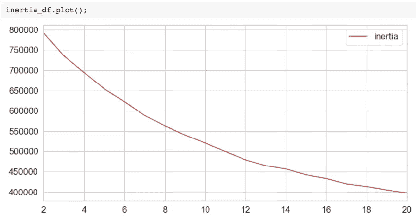

## 剪影分数

轮廓分数可用于研究形成的聚类之间的密度和间隔，其范围为[-1，1]。

以下带有 *n_clusters=4* 的剪影图显示了一个簇中的每个点与相邻簇中的点的接近程度:

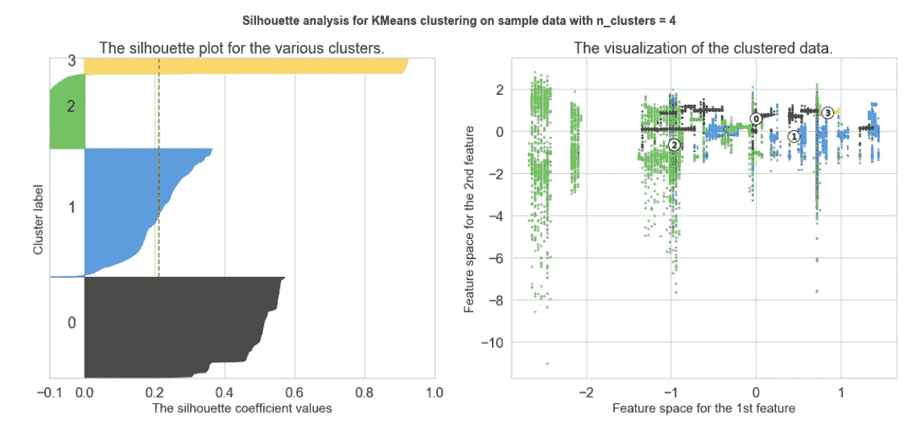

n_cluster = 4

## 集群之间的分离

*   **0 <剪影得分≤1** :剪影得分接近+1 表示该点远离相邻聚类，算法对此决定有信心
*   **剪影得分≈0** :剪影得分几乎等于 0，表示该点位于或非常接近两个相邻聚类之间的判定边界
*   **-1≤剪影分数< 0** :剪影分数为负值表示这些点可能被分配到错误的簇

## 厚度—簇的大小

轮廓图的厚度代表簇的大小。例如，黑色的 ***簇 0*** 和蓝色的 ***簇 1*** 具有相似的厚度，因此具有相似的大小，这也可以从右侧的标记散点图中得到验证(黑点与蓝点)。

***集群 3*** 黄色中最细意味着它是最小的集群。从标记的散点图中，我们可以看到很少有黄色点。

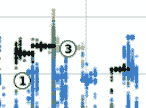

尝试使用我们刚刚经历的方法分析下面的 *n_clusters=7* 的轮廓图。

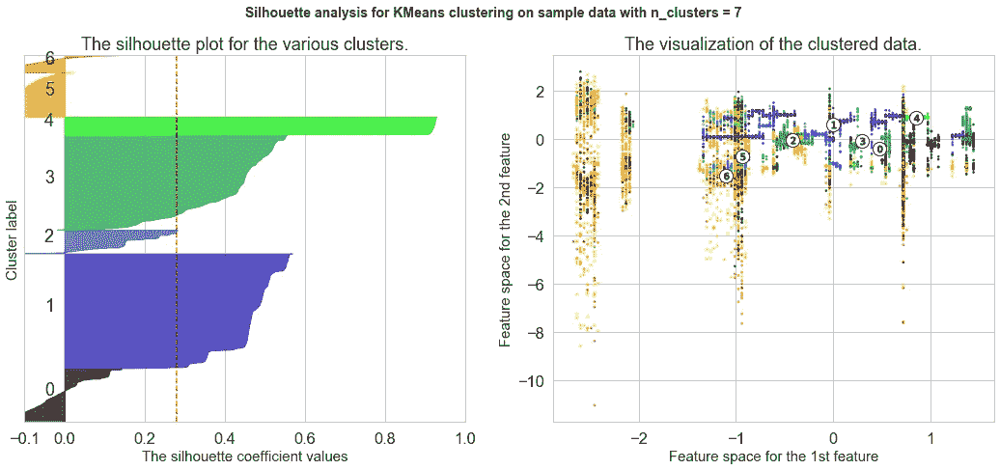

*n_clusters=7*

该线图说明了当 n_clusters 从 2 增长到 20 时轮廓分数如何变化。我们可以看到 *n_clusters=17* 可能是一个很好的候选者，因为它是所有观测中最高的平均轮廓分数。

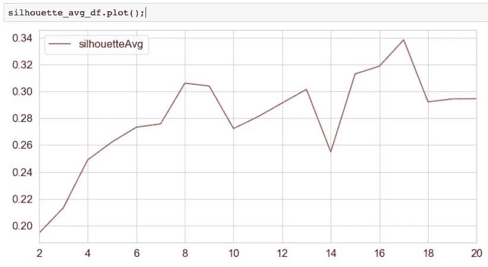

## 总准确度

下面的代码定义了一个函数 *overallAccuracy(clusterDF，labelsDF)* 来分析每个聚类的精度和整体精度。

让我们进入一些细节。

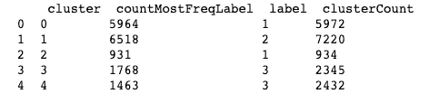

上面的截图是 print by 函数*整体准确性的一部分。*

总共有 5 个聚类，我们将计算每个聚类中最频繁的标签，并将其用作聚类标签。例如，在 ***簇 0*** 中，总共有 5972 个观察值。其中 5964 个具有标签 1，在我们的例子中它代表*，因此我们将把 ***簇 0*** 标记为*。**

**其他集群也是如此。7220 个观测值被分组为 ***簇 1*** ，其中 6518 个具有标签 2 ( ***坐*** )。 ***集群 1*** 会被标注为 ***坐*** 这是它最频繁的标注。**

**不同的分类可以有相同的标签。如上图， ***簇 3*** 和 ***簇 4*** 中出现频率最高的标签都是 3 ( ***运行*** )。这两个集群中的观测值将被标记为 ***运行*** 。**

**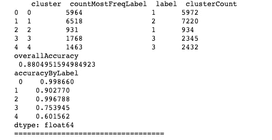**

## **计算准确度和总准确度的公式**

**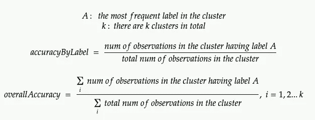**

****如何计算每个集群的 accuracyByLabel:****

**对于 ***簇 0*** ，精度为 5964/5972=0.998660。**

**对于 ***簇 4*** ，精度为 1463/2432=0.601562。**

****如何计算所有聚类的总体准确率:****

**为了计算总体精确度，它是**

**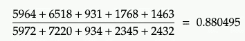**

**下面的线形图显示了 n_clusters 在范围[2，20]内时的总体精确度。**

**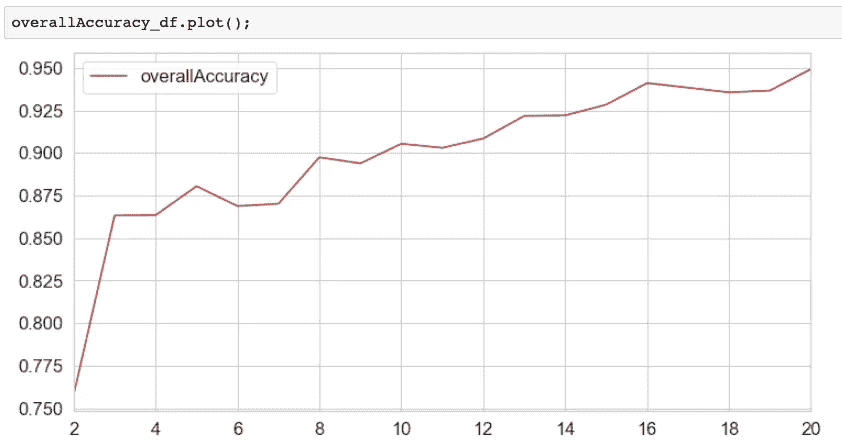**

## **创建分数表**

**创建一个分数表来保存上面为不同数量的簇计算的惯性、轮廓平均值和总精确度。**

```
**evaluation_df = inertia_df.copy()
evaluation_df['inertia'] = inertia_df['inertia']
evaluation_df['silhouetteAvg'] = silhouette_avg_df['silhouetteAvg']
evaluation_df['overallAccuracy'] = overallAccuracy_df['overallAccuracy']
evaluation_df['numOfClusters'] = inertia_df.indexcols = ['numOfClusters','inertia','silhouetteAvg','overallAccuracy']
evaluation_df = evaluation_df[cols]
evaluation_df**
```

**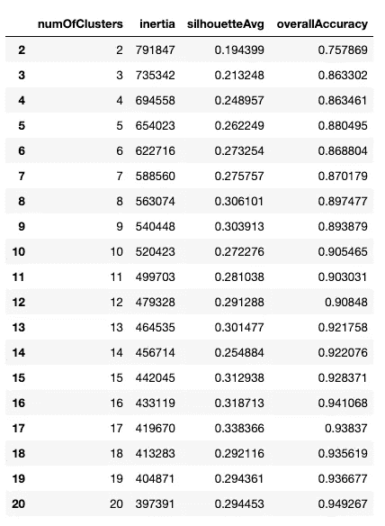**

**experiment results**

**基于实验结果， **17** 可能是该数据集上聚类数的最佳选择。在实践中，我们可以使用 *n_clusters=17* 在这个数据集上训练 KMeans，并使用训练好的模型对看不见的数据进行聚类。**

# **结论和未来工作**

**在本文中，首先，我们分析了一个传感器数据集，该数据集是从穿着者在三种身体活动中收集的:躺、坐或跑。然后，我们介绍了 KMeans 实现的两个版本，其中引入了惯性、轮廓和整体准确性。**

****对于未来的**，我们能做些什么来推动这个项目更上一层楼？至少，如果你是在做一个真实世界的项目而不是自学，有两件重要的事情值得考虑:**

*   **聚类前 PCA 支持的维数约减**
*   **迷你批处理意味着**

## **聚类前 PCA 支持的维数约减**

**在我们的示例中，有 51 列传感器数据被送入 KMeans 模型。如果我们在运行聚类算法之前使用普通 PCA 实现降维会怎么样？**

**在我的实验中，当主成分的数量等于 5 时，捕获了原始数据集的 55%的方差，KMeans 模型可以达到稍好的整体准确性。**

**印象深刻吧？您可以仅使用**10%**(从 51 到 5)的功能来获得更好的性能！原因是降维可以在去除冗余信息的同时密集地捕获原始数据集中的显著信息，而最典型的线性降维方法之一就是正态 PCA。**

**我强烈建议在聚类之前将普通 PCA 作为机器学习管道的一部分，因为它会有所帮助**

*   **解决大规模、计算量大的问题**
*   **更有效地识别数据中有趣的潜在模式因为大量的噪音(冗余信息)已经被减少**

## **迷你批处理意味着**

**KMeans 超级超级超级慢。如果你在笔记本电脑上运行，可能要花很长时间。对于具有超过 10k 个观察值的大规模数据集，您可以训练自己更有耐心，或者使用 MiniBatchKMeans，这是一种更快的实现方式，因为它使用小批量进行增量更新。**

**哇！！！这确实是一大块，如果你到了这里，你会做得很好。你已经走了很长的路。现在，你能通过聚集我正在做的事情来庆祝吗:**

****

# **报名参加🦞:的 Udemy 课程**

# **[具有机器学习和统计的推荐系统](https://www.udemy.com/course/recommender-system-with-machine-learning-and-statistics/?referralCode=178D030EF728F966D62D)**

****

**[https://www.udemy.com/course/recommender-system-with-machine-learning-and-statistics/?referralCode=178D030EF728F966D62D](https://www.udemy.com/course/recommender-system-with-machine-learning-and-statistics/?referralCode=178D030EF728F966D62D)**