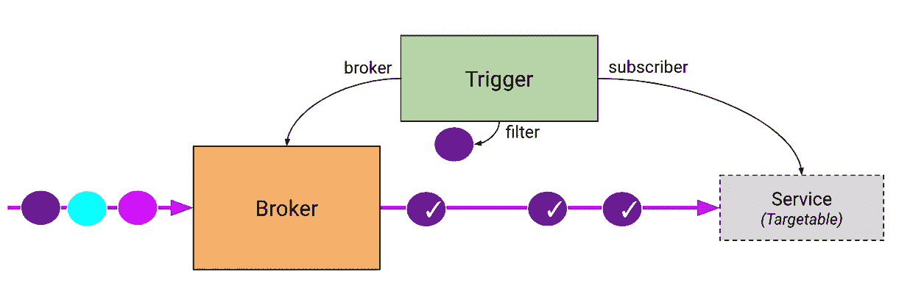
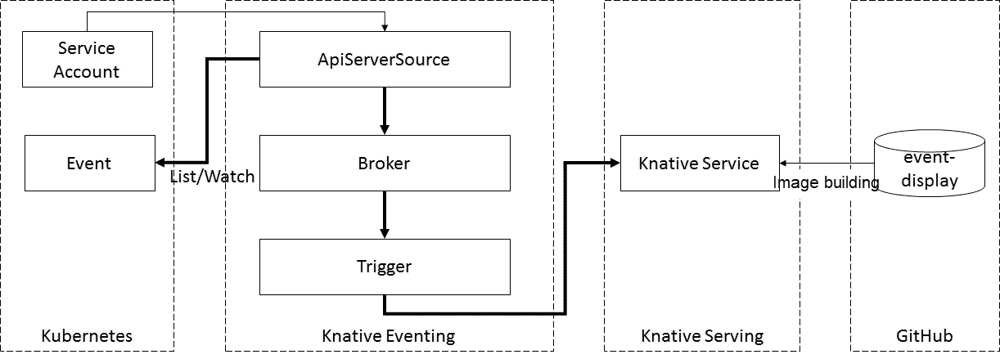

# Knative Eventing Hello World:Knative 简介

> 原文：<https://medium.datadriveninvestor.com/knative-eventing-hello-world-an-introduction-to-knative-925ee8e92d1e?source=collection_archive---------10----------------------->

*阿里云高级开发工程师袁遗*

基于事件驱动是[无服务器计算](https://www.alibabacloud.com/products/function-compute?spm=a2c41.13977152.0.0)的核心功能之一。事件驱动的服务非常适合满足用户的现收现付需求。本系列的前一篇文章介绍了 Knative Eventing 的三个基本部分——事件源、事件处理模型和事件消费。

[](https://www.datadriveninvestor.com/2018/09/22/infographic-journey-to-the-clouds/) [## 信息图:云之旅|数据驱动的投资者

### 聪明的企业领导者了解利用云的价值。随着数据存储需求的增长，他们已经…

www.datadriveninvestor.com](https://www.datadriveninvestor.com/2018/09/22/infographic-journey-to-the-clouds/) 

接下来，必须理解事件是如何通过这三个组件生成、处理和消费的。使用 [Kubernetes](https://www.alibabacloud.com/products/kubernetes?spm=a2c41.13977152.0.0) 事件源示例，本文演示了如何在 Knative Eventing 中获取事件，并将它们传递给 Knative Serving 以供使用。它采用代理/触发器模型进行事件处理。

# 背景

首先，让我们看看代理/触发器事件处理模型。从 v0.5 开始，Knative Eventing 定义了 Broker 和 Trigger 对象来简化事件过滤。

*   代理提供了一个通过属性选择的事件集。它负责接收事件并将它们转发给由一个或多个匹配触发器定义的订户。
*   触发器根据事件属性描述过滤器。并且，根据需求创建多个触发器。

代理/触发器模型的流程如下图所示。



# 准备

以下是实施该模型的要求列表:

*   已知版本> = 0.5
*   安装了 Knative Serving
*   安装了 Knative Eventing

# 程序

首先，让我们看看 Kubernetes 事件源示例的流程，如下图所示。



接下来，我们来看看各个阶段的流程操作。

# 创建服务帐户

为`ApiServerSource`创建一个服务帐户。此帐户授权 ApiServerSource 获取 Kubernetes 事件。

`serviceaccount.yaml`如下。

```
apiVersion: v1
kind: ServiceAccount
metadata:
  name: events-sa
  namespace: default---apiVersion: rbac.authorization.k8s.io/v1
kind: ClusterRole
metadata:
  name: event-watcher
rules:
- apiGroups:
  - ""
  resources:
  - events
  verbs:
  - get
  - list
  - watch---apiVersion: rbac.authorization.k8s.io/v1
kind: ClusterRoleBinding
metadata:
  name: k8s-ra-event-watcher
roleRef:
  apiGroup: rbac.authorization.k8s.io
  kind: ClusterRole
  name: event-watcher
subjects:
- kind: ServiceAccount
  name: events-sa
  namespace: default
```

执行以下操作。

```
kubectl apply --filename serviceaccount.yaml
```

# 创建事件源

在 Knative Eventing 中，通过将事件源连接到第三方系统来生成统一的事件类型。目前支持多种数据源，如 ApiServerSource 和 GitHub。这里，让我们创建一个 ApiServerSource 事件源来接收和转发 Kubernetes 事件。`k8s-events.yaml`如下。

```
apiVersion: sources.eventing.knative.dev/v1alpha1
kind: ApiServerSource
metadata:
  name: testevents
  namespace: default
spec:
  serviceAccountName: events-sa
  mode: Resource
  resources:
  - apiVersion: v1
    kind: Event
  sink:
    apiVersion: eventing.knative.dev/v1alpha1
    kind: Broker
    name: default
```

这里使用“接收器”参数来指定事件接收器。支持代理和 K8S 服务。

运行以下命令。

```
kubectl apply --filename k8s-events.yaml
```

# 创造一个有价值的服务

首先，创建一个事件处理服务。

这里，服务只打印接收到的事件。下面的代码片段显示了处理逻辑。

```
package main
import (
    "context"
    "fmt"
    "log"
    cloudevents "github.com/cloudevents/sdk-go"
    "github.com/knative-sample/event-display/pkg/kncloudevents"
)
/*
Example Output: cloudevents.Event:
Validation: valid
Context Attributes,
  SpecVersion: 0.2
  Type: dev.knative.eventing.samples.heartbeat
  Source: https://github.com/knative/eventing-sources/cmd/heartbeats/#local/demo
  ID: 3d2b5a1f-10ca-437b-a374-9c49e43c02fb
  Time: 2019-03-14T21:21:29.366002Z
  ContentType: application/json
  Extensions:
    the: 42
    beats: true
    heart: yes
Transport Context,
  URI: /
  Host: localhost:8080
  Method: POST
Data
  {
    "id":162,
    "label":""
  }
*/func display(event cloudevents.Event) {
    fmt.Printf("Hello World: \n")
    fmt.Printf("cloudevents.Event\n%s", event.String())
}func main() {
    c, err := kncloudevents.NewDefaultClient()
    if err != nil {
        log.Fatal("Failed to create client, ", err)
    }
    log.Fatal(c.StartReceiver(context.Background(), display))
}
```

用上面的代码，轻松建立自己的形象。在构建映像之后，创建一个简单的 Knative 服务来使用由 ApiServerSource 生成的事件。

`service.yaml`示例如下所示。

```
apiVersion: serving.knative.dev/v1alpha1
kind: Service
metadata:
  name: event-display
  namespace: default
spec:
  template:
    spec:
      containers:
      -  image: {yourrepo}/{yournamespace}/event-display:latest
```

运行以下命令。

```
kubectl apply --filename service.yaml
```

# 创建经纪人

在选定的名称空间下，创建`default`代理。如果您选择了`default`名称空间，请执行以下操作。

```
kubectl label namespace default knative-eventing-injection=enabled
```

这里，事件控制器根据设置了`knative-eventing-injection=enabled`标记的名称空间自动创建一个代理。此外，使用 Web 挂钩中默认配置的默认 ClusterChannelProvisioner(内存中)。

# 创建触发器

触发器充当代理和服务之间的过滤器。为事件设置一些过滤规则。

现在，让我们为默认代理创建一个简单的触发器，并将服务用于订阅。下面给出了`trigger.yaml`的例子。

```
apiVersion: eventing.knative.dev/v1alpha1
kind: Trigger
metadata:
  name: testevents-trigger
  namespace: default
spec:
  subscriber:
    ref:
      apiVersion: serving.knative.dev/v1alpha1
      kind: Service
      name: event-display
```

运行以下命令。

```
kubectl apply --filename trigger.yaml
```

注意:如果没有使用默认代理，通过`spec.broker`在触发器中指定代理名称。

# 核实

运行以下命令来生成 K8S 事件。

```
kubectl run busybox --image=busybox --restart=Never -- ls
kubectl delete pod busybox
```

现在，执行下面的命令来检查 Knative 服务是否收到了事件。

```
kubectl get pods
kubectl logs -l serving.knative.dev/service=event-display -c user-container
```

日志输出类似于下面的内容，表明事件已被成功接收。

```
Hello World:  
️  CloudEvent: valid 
Context Attributes,
  SpecVersion: 0.2
  Type: dev.knative.apiserver.resource.add
  Source: https://10.39.240.1:443
  ID: 716d4536-3b92-4fbb-98d9-14bfcf94683f
  Time: 2019-05-10T23:27:06.695575294Z
  ContentType: application/json
  Extensions:
    knativehistory: default-broker-b7k2p-channel-z7mqq.default.svc.cluster.local
    subject: /apis/v1/namespaces/default/events/busybox.159d7608e3a3572c
Transport Context,
  URI: /
  Host: auto-event-display.default.svc.cluster.local
  Method: POST
Data,
  {
    "apiVersion": "v1",
    "count": 1,
    "eventTime": null,
    "firstTimestamp": "2019-05-10T23:27:06Z",
    "involvedObject": {
      "apiVersion": "v1",
      "fieldPath": "spec.containers{busybox}",
      "kind": "Pod",
      "name": "busybox",
      "namespace": "default",
      "resourceVersion": "28987493",
      "uid": "1efb342a-737b-11e9-a6c5-42010a8a00ed"
    },
    "kind": "Event",
    "lastTimestamp": "2019-05-10T23:27:06Z",
    "message": "Started container",
    "metadata": {
      "creationTimestamp": "2019-05-10T23:27:06Z",
      "name": "busybox.159d7608e3a3572c",
      "namespace": "default",
      "resourceVersion": "506088",
      "selfLink": "/api/v1/namespaces/default/events/busybox.159d7608e3a3572c",
      "uid": "2005af47-737b-11e9-a6c5-42010a8a00ed"
    },
    "reason": "Started",
    "reportingComponent": "",
    "reportingInstance": "",
    "source": {
      "component": "kubelet",
      "host": "gke-knative-auto-cluster-default-pool-23c23c4f-xdj0"
    },
    "type": "Normal"
  }
```

# 摘要

上面的例子展示了 Knative Eventing 如何生成、处理和使用事件。这些插图还提供了对事件处理中的事件处理模型的初步理解。本文将作为定义用于处理事件的事件消费者服务的参考。

如果你对 Knative Eventing 感兴趣并想了解更多，请继续关注[阿里云的博客频道](https://www.alibabacloud.com/blog?spm=a2c41.13977152.0.0)，我们将继续对 Knative Eventing 进行深入分析。即将发布的文章包括:

*   如何自定义数据源事件源？
*   如何使用第三方消息服务？
*   系统报警时，如何通过 mail 或 DingTalk 发送消息？

敬请关注，探索 Knative Eventing。

# 原始来源:

[](https://www.alibabacloud.com/blog/knative-eventing-hello-world-an-introduction-to-knative_595789?spm=a2c41.13977152.0.0) [## Knative Eventing Hello World:Knative 简介

### 阿里巴巴开发者 2020 年 2 月 3 日 170 由阿里云高级开发工程师袁遗基于事件的驱动是…

www.alibabacloud.com](https://www.alibabacloud.com/blog/knative-eventing-hello-world-an-introduction-to-knative_595789?spm=a2c41.13977152.0.0)