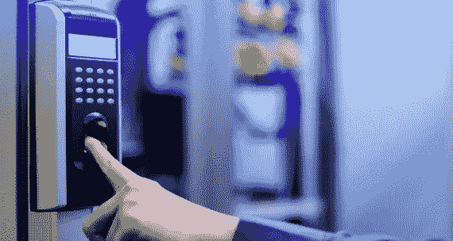
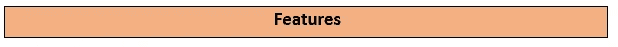
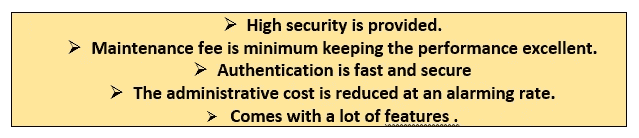
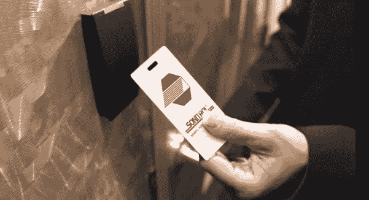

# 知道门禁系统如何拯救数十亿美元的公司吗？

> 原文：<https://medium.datadriveninvestor.com/know-how-access-control-systems-save-multi-billion-dollar-companies-4aa6ad12094e?source=collection_archive---------30----------------------->

访问控制意味着限制访问。从名称来看，很明显这是一个提供有限访问或不提供访问的系统。 [**访问控制系统**](https://www.getkisi.com/best-access-control-systems) 在组织中使用，他们希望自己的机密信息安全无虞。它还被希望每天跟踪其运营活动的组织所使用。

**例句**

假设公关公司使用一个 [**生物指纹扫描仪**](https://www.getkisi.com/best-access-control-systems) 来检查员工的每日登录和退出时间。类似地，一家 IT 公司使用房卡进入装有系统计算机和公司大部分机密文件的房间。

**最常用的门禁系统是什么？**

最常用的 [**门禁系统**](https://www.isonas.com/) 被称为门禁系统。门禁系统在组织中被广泛使用，因为其预算友好且维护成本低。此外，这个门禁系统还有一些很棒的功能

**这有什么替代方案？**

根据门禁专家的说法，门门禁的另一种选择可以称为 [**钥匙卡系统**](https://www.johnsoncontrols.com/) 。这个门禁系统是基于塑料和电子锁的结合。查看下图:

**Image showing key card**

**家庭安防的门禁系统有哪些？**

一些最好的家庭安全访问控制系统是闭路电视系统，报警系统，消防和一氧化碳系统。制造可靠的门禁系统的最好的公司之一是 KISI 的****。除此之外，你可以看看其他的选择，因为它们很受观众的喜爱。这些是****

**[1。Simplisafe](https://simplisafe.com/)**

**2. [Isonas](https://www.isonas.com/)**

**3.[琼森控制](https://www.johnsoncontrols.com/)**