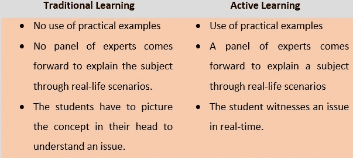

# 诀窍主动学习有益于数据科学专业的学生

> 原文：<https://medium.datadriveninvestor.com/know-how-active-learning-benefits-data-science-students-819ba57a660f?source=collection_archive---------8----------------------->

Photo by [Markus Spiske](https://unsplash.com/@markusspiske?utm_source=medium&utm_medium=referral) on [Unsplash](https://unsplash.com?utm_source=medium&utm_medium=referral)

继销售人员之后，2020 年最有前途的职业之一是数据科学家。大多数知名机构更喜欢主动学习而不是传统学习。这是因为主动学习的好处超过了传统学习的好处。在本文中，我们将讨论:

1.什么是传统学习

2.什么是主动学习

3.主动学习和传统学习的区别

4.主动学习的好处

5.主动学习如何提高思维能力

6.为什么数据科学专家推荐主动学习

7.主动学习的资源

# 传统学习

涉及假设性解释的学习可以称为传统学习。假设老师正在教授数据科学中的欺诈检测分析。

教师将通过教师可用的书中的图表和参考资料来解释 [**欺诈检测**](https://medium.com/datadriveninvestor/learn-what-is-fraud-detection-analysis-in-data-science-99b762660122) 。个人将不包括任何实际的实验来显示它是如何发生的。相反，老师会利用不涉及任何实际技能的资源。

 [## 一瞬间学会数据科学！？数据驱动的投资者

### 在我之前的职业生涯中，我是一名训练有素的古典钢琴家。还记得那些声称你可以…

www.datadriveninvestor.com](https://www.datadriveninvestor.com/2020/07/23/learn-data-science-in-a-flash/) 

# 主动学习

学习，包括一个实用的解释，被称为主动学习。在这里，教师将通过现场表演让学生了解数据科学中的 [**欺诈检测**](https://medium.com/datadriveninvestor/learn-what-is-fraud-detection-analysis-in-data-science-99b762660122) 分析。一个专家小组将解释欺诈检测在现实生活中是如何发生的。

# 主动学习和传统学习的区别

By Author

# 主动学习的好处

By Author

主动学习有几个好处。最重要的一条会详细列出，让你有一个清晰的认识。这会让你选择鼓励主动学习而不是传统学习的教育机构。

# 变体的使用

在传统的学习中，老师会借助黑板、PowerPoint 演示或通过阅读来解释一个概念。你没有设备或工具来实时理解这个概念。这表明你需要有创造性的思维来想象课堂上教授的情景。

主动学习的教学结构很不一样。在主动学习中，老师会利用三种变化。一种被称为灵活形式，另一种被称为互动形式，最后一种被称为小组学习。

**1。通过灵活的形式主动学习**:人们无法长时间集中注意力是众所周知的事实。这就是为什么通过灵活的形式进行主动学习可以提供频繁的休息时间。

通过频繁的休息，学生有时间放松自己的大脑，然后为下一堂数据科学课做准备。在传统的学习中，从来不是这样。老师长时间地教学生，因此他们的大脑变得疲惫不堪。

你在主动学习中得到的休息是锻炼的休息。在主动学习中，你被要求做一些练习来消除你头脑中的压力。

**2。通过互动形式进行主动学习**:要完全理解一个概念，需要进行实验。教师通过安排这些实验进行互动，帮助学生理解数据科学。

**3。通过小组主动学习**:记住一个头脑，能想到有限的可能性。另一方面，一个群体可以想出无限个。与参加个人活动的学生相比，参加小组学习的学生表现出更高的思维能力。此外，在小组学习中，创新是在一个小组中进行的，因为不同的想法是由不同的头脑讨论的。

# 主动学习如何提高思维能力

By Author

德国的一个数据科学机构用二十个人做了一个实验。其中 10 人通过传统学习学习 [**欺诈检测**](https://medium.com/datadriveninvestor/learn-what-is-fraud-detection-analysis-in-data-science-99b762660122) ，另外 10 人通过主动学习学习。现在进行了一项测试。

测试:一家银行的一个账户不断亏损。由于该银行在本地和全球都有账户，因此不可能知道是哪个网络罪犯实施了这种欺诈。通过传统技术学习数据科学的人被告知要找到一个欺诈账户。他们只能思考假设，而不能得出任何结论。

另一方面，通过主动学习学习数据科学的人在一天内就发现了欺诈帐户。这个实验证明，主动学习的好处远远优于传统学习。

# 为什么数据科学专家推荐精确学习

By Author

准确地说，这是因为数据科学通过主动学习提高了学生的思维能力。由于它是通过进行实时实验来教授的，所以学生更加专注。一旦学生发展了实用技能，这将有助于学生成为一名认证数据科学家，并在以后获得一份好的带薪工作。

作为一名 [**数据科学家** t](https://medium.com/datadriveninvestor/3-must-have-communication-tips-for-a-data-scientist-4a01626b8217) ，你将能够执行 [**风险管理**](https://medium.com/datadriveninvestor/enterprise-risk-management-what-is-it-and-why-you-need-it-fe98f53fd007) 、灾难恢复，并做出以数据为中心的决策，这将提高公司的生产力，并避免公司在未来遭受损失。

# 主动学习的资源

如果你有兴趣通过主动学习来了解数据科学，我个人推荐你去看看[**【IBM】**](https://www.ibm.com/in-en?lnk=m)**[**Upgrad**](https://www.upgrad.com/)[**edu reka**](https://www.edureka.co/)。这些是一些最好的培训机构，由熟练的数据科学专业人员组成，他们会进行实时实验来解释一个概念。**

**从以上信息中，您现在已经非常了解数据科学中主动学习的好处。仔细阅读以上信息，让你知道为什么要把资金投入到主动学习中，而不是传统学习中。数据科学确实是 2020 年的热门职业。你唯一必须知道的是学习数据科学中学习方法的不同，这一点在本文中有所阐述。**

# **最后的想法**

**希望你喜欢阅读这条信息。此类资讯更新，关于技术，请在 [**中**](https://medium.com/@hellogouravdas) 关注我，并通过 [**LinkedIn**](https://www.linkedin.com/in/gourav-deep-das-b50a67182/) 联系我进行商务合作。**

****访问专家视图—** [**订阅 DDI 英特尔**](https://datadriveninvestor.com/ddi-intel)**