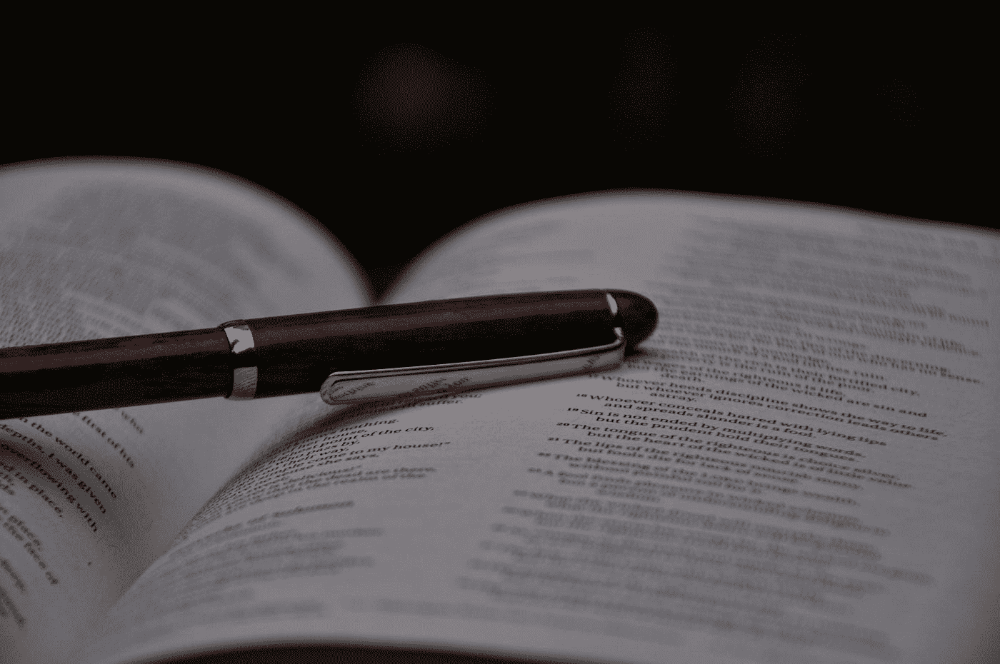
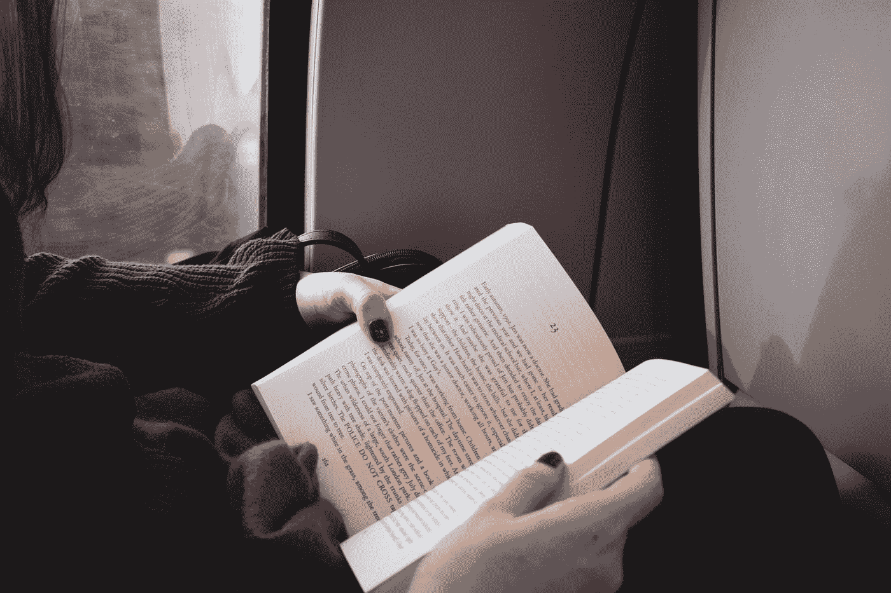

# 快速阅读可以提高你的记忆力

> 原文：<https://medium.datadriveninvestor.com/know-how-speed-reading-can-improve-your-memory-758bb282815d?source=collection_archive---------13----------------------->

Photo by [Chris Benson](https://unsplash.com/@lordmaui?utm_source=medium&utm_medium=referral) on [Unsplash](https://unsplash.com?utm_source=medium&utm_medium=referral)

我在一家公司担任业务发展经理时，接触到了快速阅读技巧。我的老板需要在 3 小时内做一个报告。我紧张、困惑，不知道该怎么办。

我的一个同事被分配了同样的任务，他很好地完成了任务。他以极快的速度阅读信息，并通过记住信息来准备一个信息丰富的演示。看到这个我很惊讶。我问他是怎么做的。然后，他向我介绍了快速阅读的技巧。

因此，在这篇文章中，我将提供一个快速阅读技巧的完整指南。一直读到最后，见证速读技术如何永远改变你的生活。在本文中，我们将讨论:

1.理解快速阅读

2.快速阅读的步骤

3.什么时候快速阅读

# 理解快速阅读技巧

Photo by [Seven Shooter](https://unsplash.com/@sevenshooterimage?utm_source=medium&utm_medium=referral) on [Unsplash](https://unsplash.com?utm_source=medium&utm_medium=referral)

以更快的速度捕捉句子和短语的过程可以称为快速阅读。现在意识到，一个正常人每分钟阅读 250 个单词。所以，快速阅读的方法会给阅读带来额外的帮助。

我的书架上有上百本我带来的书，但是从来没有时间去读。即使我有时间，十页之后我就筋疲力尽了。之后我学习了速读，然后我在 7 天内完成了 20 本书的阅读。

注:我没有全部的时间，我整天都在办公室里，只是在睡觉前才设法看这本书。

# 快速阅读的步骤

Photo by [Tamarcus Brown](https://unsplash.com/@tamarcusbrown?utm_source=medium&utm_medium=referral) on [Unsplash](https://unsplash.com?utm_source=medium&utm_medium=referral)

## 第一步:在开始阅读一本书之前阅读摘要和评论

拿一本你打算阅读的书。现在，阅读这本书的目录、章节摘要和评论。这样，你就在通知你的大脑，你已经读完了这本书的一半。

因此，你将在五分钟内读完三章，而以前需要十分钟。通过这种技巧，你的大脑将会意识到在特定的章节中寻找什么信息。

## 第二步:停止默念

大多数时候，人们觉得读一章太难了，因为他们是在自言自语。这就是所谓的默读。即使你在轻声默念，对自己说单词的过程也会减慢阅读速度。

所以，要不惜一切代价避免这种情况。有一些人甚至嚼口香糖来阻止他们自己默念。表明他们无法阻止自己做这项活动。

## 第三步:听古典音乐

Photo by [Blaz Erzetic](https://unsplash.com/@www_erzetich_com?utm_source=medium&utm_medium=referral) on [Unsplash](https://unsplash.com?utm_source=medium&utm_medium=referral)

相信我，听古典音乐能以惊人的速度让大脑平静下来。事实证明，听音乐可以提高你的阅读速度。因此，听古典音乐会使阅读速度提高 3 倍。

## 第四步:用手指或笔划过句子

Photo by [Josh Vuong](https://unsplash.com/@joshvuong?utm_source=medium&utm_medium=referral) on [Unsplash](https://unsplash.com?utm_source=medium&utm_medium=referral)

我们大多数人都是视觉退化的受害者。我来解释一下这个概念。让我们来考虑一个句子——“艾玛去超市买了些杂货。”我们大多数人会读到这样的句子:

1.艾玛去了

2.艾玛去了

3.艾玛去了

4.艾玛去了超市

5.艾玛去了超市，然后

6.艾玛去超市买了

7.艾玛去了超市，买了些杂货

你的大脑执行视觉回归的速度如此之快，以至于你自己都无法理解。为了减轻这个问题，移动你的手或笔越过一个句子来加快你的阅读速度。

当你在页面上移动手指或笔时，你的眼睛会不由自主地跟着手指移动。仅此一项就能让你的阅读速度飞速提升

## 第五步:学会看一组词

Photo by [Kevin Grieve](https://unsplash.com/@grievek1610begur?utm_source=medium&utm_medium=referral) on [Unsplash](https://unsplash.com?utm_source=medium&utm_medium=referral)

当你看到一组单词在一起时，它会提升你的阅读速度。例如，假设你遇到了一个名为“中国长城”的单词集合现在通常情况下，你读的是(停顿)，伟大的(停顿)，墙(停顿)，的(停顿)，和中国。当你在看这个词的时候，它被称为“中国的长城”。你在训练你的思维去阅读一组单词，最终提高了你的阅读速度。

## 第六步:阅读段落的第一句和最后一句

Photo by [Will Tarpey](https://unsplash.com/@tarpey?utm_source=medium&utm_medium=referral) on [Unsplash](https://unsplash.com?utm_source=medium&utm_medium=referral)

取一段，注意读第一句和最后一句。放大，在中间。相信我；这有助于提高阅读速度。因为第一段告诉你在这一章你会发现什么，最后一句总结了这一章。所以很可能，你知道这一章是关于什么的。

## 第七步:尽可能快地走

Photo by [Jilbert Ebrahimi](https://unsplash.com/@jilburr?utm_source=medium&utm_medium=referral) on [Unsplash](https://unsplash.com?utm_source=medium&utm_medium=referral)

当你读一章时，用手指和记号笔尽可能快地读下去。当你读完这一章时，你会惊奇地发现你能记住多少信息。例如，现在你每分钟读 200 个单词，以更快的速度移动手指或记号笔，你将每分钟读 350 个单词。你会对自己感到惊讶。

# 什么时候快速阅读

如果你像我一样是一个内容作家，那么你必须快速阅读。有时候，我必须在 3 个小时内向客户提交一份 3000 字的文件。我用快速阅读的技巧来做这件事。当你需要在紧迫的期限内提交作品时，快速阅读很有帮助。

当你想在一周内阅读多本书时，这也很有帮助。当你必须阅读与法律、公司政策和其他法律程序相关的重要文件时，快速阅读绝对不是答案。

# 最后的想法

我希望以上信息对你了解快速阅读及其技巧有所帮助。浏览这些技巧将教会你如何在紧迫的期限内完成工作。如果你没有按时完成工作，你的老板会生气的。如果你喜欢这些数字信息，请在最后给出你的回答。