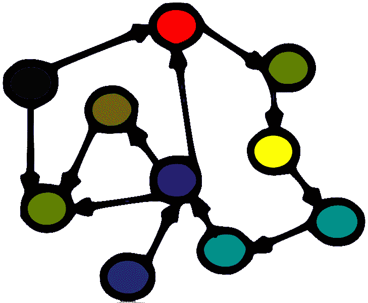
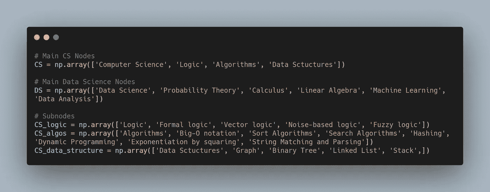
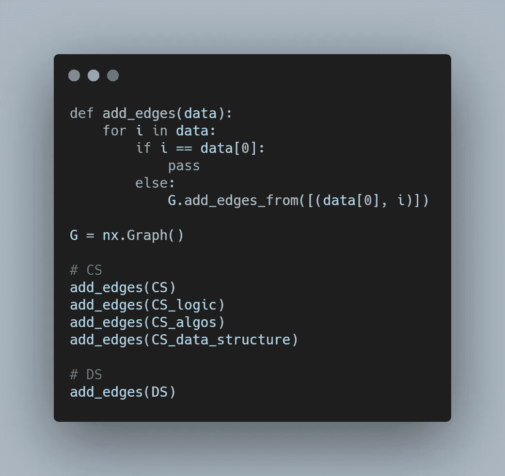
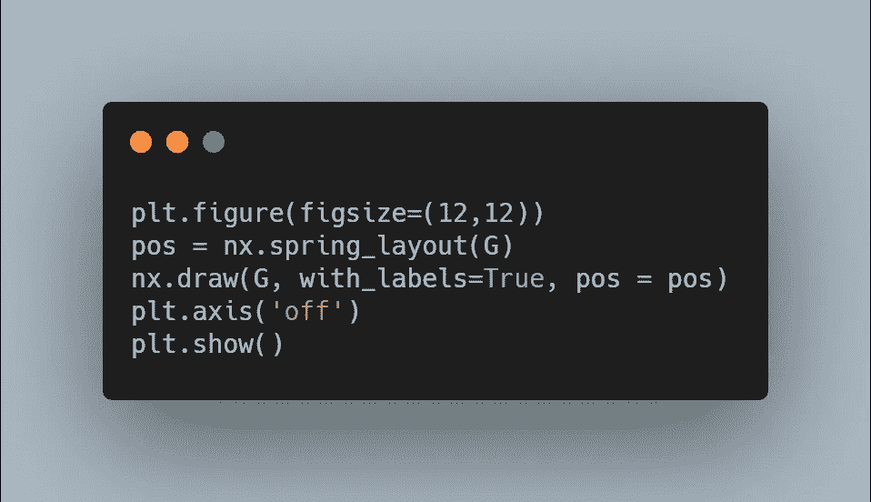
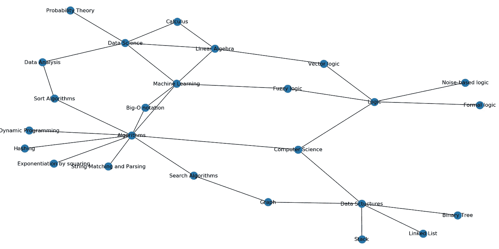

# 知识图表:麻省理工学院作业

> 原文：<https://medium.datadriveninvestor.com/knowledge-graphs-mit-homework-da7fe21d747d?source=collection_archive---------20----------------------->

正如你可能知道的，现在我是麻省理工学院的反应学习者。本周我们开始了计算机科学课程，第一项任务是提出使用图形数据结构的想法。我想我会用一个图形数据结构的真实世界的知识例子。此外，我认为我应该创造一个能代表我们将从这个项目中学到的东西，在课堂上展示的机会是无价的。

Illustration on [wikimedia](https://commons.wikimedia.org/wiki/File:KnowledgeGraph.png) by [Florian Thiery](https://commons.wikimedia.org/wiki/User:Fthierygeo)

**知识图谱**

之前我已经[写过](https://medium.com/better-programming/data-structures-with-javascript-graphs-42084ec4db22)关于图的数据结构，所以我不打算**重复我自己**并且直接用我们在麻省理工学院项目中学到的知识去描述图的细节。

我们将创建一个图表，展示我们可能通过 ReACT 程序学习到的计算机和数据科学的主题。我将使用未检测到的图表，因为我们只需要显示不同主题之间的联系，但它们如何相互关联将需要更复杂的工作，我只有到本周末的时间。

**实施**

为了简化图形的实现，我将使用库 [**NetworkX**](https://networkx.org) 。让我们安装它，并建立一些图表。

首先，我将在计算机科学和数据科学中创建一系列主要主题，并将它们链接到计算机和数据科学节点。然后，我将创建子域节点列表，并将它们链接到主子域节点。正如你所看到的，我们的数组看起来像一个链表，其中数组的 1 个元素指向子域的其余部分。

现在 **NetworkX** 库开始发挥作用。我们就叫 **nx。Graph()** 类来初始化 Graph 对象。然后我们将使用 **add_edges()** 函数从我们的数据中创建所有节点。

现在我们有了一个看起来更像树的图。让我们将一些子域节点相互连接起来。我并不试图创建计算机和数据科学领域的完整地图，所以我只是使用常见的场景和我最近的理解来连接节点。例如，很明显，线性代数与机器学习有关，而[搜索算法与图形数据结构](https://medium.com/dev-genius/graphs-data-structure-breadth-first-search-ec662dc73079)有关。

为了可视化我们的图形，除了使用 **NetworkX** 库之外，我们还将使用 **matplotlib** 。

这是我们的图表:

**全码**:

**结论**

在图形数据结构的帮助下，我们不仅可以在课堂上展示，还可以绘制你正在处理的现实，并在你的本体中的元素之间建立复杂的联系。课堂上见！

不断学习，不断成长！